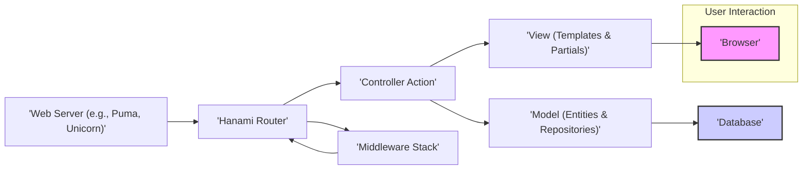
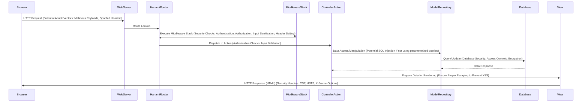

# Project Design Document: Hanami Web Framework

**Version:** 1.1
**Date:** October 26, 2023
**Author:** Gemini (AI Language Model)

## 1. Introduction

This document provides an enhanced architectural design of the Hanami web framework, an open-source Ruby framework available at [https://github.com/hanami/hanami](https://github.com/hanami/hanami). Building upon the previous version, this document offers a more detailed understanding of the framework's structure, components, and interactions, with a stronger emphasis on aspects relevant to threat modeling.

## 2. Goals and Objectives

The primary goal of this document is to provide a refined and more detailed articulation of the architecture of the Hanami framework, specifically tailored for threat modeling. Specific objectives include:

*   Providing in-depth descriptions of key components and their responsibilities, including potential security implications.
*   Illustrating the data flow within the framework with a focus on security-relevant transformations and interactions.
*   Describing the interactions between different components, highlighting trust boundaries and potential attack vectors.
*   Explicitly outlining potential areas of security concern from an architectural perspective, providing concrete examples.
*   Offering a structured and comprehensive overview specifically designed to facilitate thorough threat modeling exercises.

## 3. System Architecture Overview

Hanami is architected with a strong emphasis on maintainability, modularity, and a clear separation of concerns. Its design promotes explicit dependencies and the concept of independent "applications" within a larger project, each with its own dedicated set of models, views, and controllers.

**Key Architectural Layers:**

*   **User Interface:** The presentation layer, typically rendered in a web browser, representing the primary interaction point for users.
*   **Web Server:**  Handles incoming HTTP requests from the internet or internal networks and acts as the entry point to the Hanami application. It's responsible for basic request handling before passing control to the framework.
*   **Hanami Router:** The central dispatcher within the framework, responsible for interpreting incoming requests and mapping them to the appropriate controller actions based on predefined routes. This component is crucial for defining the application's API and request handling logic.
*   **Middleware Stack:** An ordered sequence of components that intercept and process both incoming HTTP requests before they reach the router and outgoing HTTP responses before they are sent back to the client. This layer is essential for implementing cross-cutting concerns like authentication, authorization, logging, and security headers.
*   **Controller Actions:**  Specific methods within controller classes that handle individual user requests. They orchestrate the application's logic, interact with the model layer to retrieve or manipulate data, and prepare data for rendering by the view layer.
*   **Model Layer:** Encapsulates the application's business logic and data persistence mechanisms. It is further divided into:
    *   **Entities:** Plain Ruby objects representing domain concepts and their associated data. They are persistence-ignorant.
    *   **Repositories:** Provide an abstraction layer over the underlying database, offering methods for querying, creating, updating, and deleting entities. They isolate the application logic from the specifics of the database.
*   **View Layer:** Responsible for rendering the user interface presented to the user. It consists of:
    *   **Templates:** Files containing markup (e.g., HTML) with embedded Ruby code for dynamic content generation.
    *   **Partials:** Reusable snippets of template code that can be included in other templates, promoting code reuse and maintainability.
*   **Database:** The persistent storage system where the application's data is stored and retrieved. Hanami supports various database systems through adapters.

## 4. Component Breakdown

This section provides a more detailed breakdown of the key components within the Hanami framework, with a focus on their functionality and potential security implications.

### 4.1. Router

*   **Responsibility:**  Receives incoming HTTP requests and maps them to specific controller actions. Acts as the first point of contact for requests within the Hanami application.
*   **Functionality:**
    *   **Route Definition:** Uses a Domain-Specific Language (DSL) to define the application's routes, mapping URL patterns and HTTP methods to specific controller actions.
    *   **Request Matching:**  Compares incoming request URLs and methods against the defined routes to find a match.
    *   **Parameter Extraction:** Extracts parameters from the request URL (e.g., path segments, query parameters) and makes them available to the controller action.
    *   **Dispatching:**  Invokes the corresponding controller action once a matching route is found.
*   **Security Considerations:**
    *   **Route Hijacking:**  Misconfigured or overly broad routes can potentially expose unintended functionality or allow access to sensitive actions.
    *   **Parameter Tampering:**  Improperly validated route parameters can be manipulated by attackers to bypass security checks or inject malicious data. Ensure proper input validation in subsequent layers.
    *   **Denial of Service (DoS):**  Regular expression denial-of-service (ReDoS) vulnerabilities can arise from poorly crafted route patterns that consume excessive resources during matching.

### 4.2. Middleware Stack

*   **Responsibility:**  Provides a powerful mechanism to intercept and process requests and responses, enabling the implementation of cross-cutting concerns.
*   **Functionality:**
    *   **Request Preprocessing:**  Modifies or inspects incoming requests before they reach the router (e.g., authentication, authorization checks, request logging, setting security headers).
    *   **Response Postprocessing:**  Modifies or inspects outgoing responses before they are sent to the client (e.g., setting response headers, compression, logging).
    *   **Error Handling:**  Provides a centralized place to handle exceptions and errors that occur during request processing.
*   **Security Considerations:**
    *   **Middleware Vulnerabilities:**  Security flaws in individual middleware components can expose the entire application to vulnerabilities. Regularly audit and update middleware dependencies.
    *   **Bypassing Security Measures:**  Incorrectly ordered or configured middleware can lead to security checks being bypassed. Ensure middleware is ordered logically and configured securely. For example, authentication middleware should generally precede authorization middleware.
    *   **Information Disclosure:**  Middleware that logs sensitive information without proper redaction can lead to information leaks.

### 4.3. Controllers and Actions

*   **Responsibility:**  Handle specific user requests, orchestrate interactions with the model layer, and prepare data for the view. Act as the primary interface between the application logic and the outside world.
*   **Functionality:**
    *   **Receiving Request Parameters:**  Accesses and processes parameters from the incoming request (e.g., form data, query parameters).
    *   **Business Logic Execution:**  Invokes methods on model objects (entities and repositories) to perform the core application logic.
    *   **Data Preparation:**  Prepares data retrieved from the model layer for rendering in the view. This might involve formatting, filtering, or transforming the data.
    *   **Response Generation:**  Determines the appropriate response to send back to the client, which could be an HTML page, JSON data, or a redirect.
*   **Security Considerations:**
    *   **Mass Assignment Vulnerabilities:**  Carelessly accepting and assigning request parameters to model attributes without proper filtering can lead to unauthorized data modification. Use strong parameter filtering techniques.
    *   **Insufficient Input Validation:**  Failing to validate user input in controllers can lead to various injection attacks (SQL injection, command injection, etc.). Implement robust validation rules.
    *   **Authorization Flaws:**  Improperly implemented authorization checks in controllers can allow users to access resources or perform actions they are not permitted to.
    *   **Logic Errors:**  Flaws in the controller logic can lead to unintended behavior and security vulnerabilities.

### 4.4. Model Layer (Entities and Repositories)

*   **Responsibility:**  Encapsulates the application's business logic and provides an abstraction layer for data persistence.
*   **Functionality:**
    *   **Entities:** Represent domain objects with their attributes and associated business logic. They are independent of any specific persistence mechanism.
    *   **Repositories:** Provide a clean interface for interacting with the database, abstracting away the underlying database technology. They offer methods for common data access operations (e.g., finding, creating, updating, deleting).
*   **Security Considerations:**
    *   **SQL Injection Vulnerabilities:**  If repositories directly construct SQL queries from user input without proper sanitization or parameterized queries, they are susceptible to SQL injection attacks. Always use parameterized queries or ORM features that handle escaping.
    *   **Data Integrity Issues:**  Lack of validation or business logic enforcement within the model layer can lead to inconsistent or invalid data being stored in the database.
    *   **Exposure of Sensitive Data:**  Entities should be designed to avoid exposing sensitive data unnecessarily. Repositories should implement appropriate access controls to prevent unauthorized data retrieval.

### 4.5. View Layer (Templates and Partials)

*   **Responsibility:**  Renders the user interface presented to the user based on data provided by the controller.
*   **Functionality:**
    *   **Template Rendering:**  Processes template files (e.g., ERB, Slim) containing markup and embedded Ruby code to generate dynamic HTML content.
    *   **Layout Management:**  Provides a structure for consistent page layouts across the application.
    *   **Partial Rendering:**  Allows for the reuse of template snippets, promoting modularity and maintainability.
*   **Security Considerations:**
    *   **Cross-Site Scripting (XSS) Vulnerabilities:**  Failing to properly escape user-provided data when rendering templates can allow attackers to inject malicious scripts into the rendered HTML, potentially compromising other users. Always escape user input before displaying it.
    *   **Information Disclosure:**  Accidentally including sensitive data in templates that should not be visible to the user can lead to information leaks.
    *   **Template Injection:**  In rare cases, vulnerabilities in the templating engine itself or improper handling of template code can lead to template injection attacks, allowing attackers to execute arbitrary code on the server.

### 4.6. Assets

*   **Responsibility:**  Manages static assets like CSS, JavaScript, images, and fonts.
*   **Functionality:**
    *   **Serving Static Files:**  Provides a mechanism to serve static assets to the browser.
    *   **Asset Compilation and Minification:**  May include features for compiling and optimizing assets for better performance.
*   **Security Considerations:**
    *   **Path Traversal Vulnerabilities:**  Improperly configured asset serving mechanisms can potentially allow attackers to access files outside the intended asset directories.
    *   **Supply Chain Attacks:**  Vulnerabilities in third-party JavaScript libraries or other assets can introduce security risks. Regularly update and audit asset dependencies.
    *   **Content Security Policy (CSP) Misconfiguration:**  Incorrectly configured CSP headers can weaken the application's defenses against XSS attacks.

### 4.7. Mailers

*   **Responsibility:**  Handles the sending of emails from the application.
*   **Functionality:**
    *   **Email Template Definition:**  Allows for the creation of email templates with dynamic content.
    *   **Email Sending:**  Provides methods for sending emails using configured delivery methods (e.g., SMTP).
*   **Security Considerations:**
    *   **Email Injection Vulnerabilities:**  Failing to properly sanitize email headers or body content can allow attackers to inject malicious content or send emails to unintended recipients.
    *   **Exposure of Sensitive Information:**  Carelessly including sensitive information in emails can lead to data breaches.
    *   **Spoofing:**  Ensure proper configuration to prevent attackers from spoofing email addresses and sending emails that appear to originate from the application.

## 5. Data Flow with Security Considerations

The typical data flow for a web request in a Hanami application, with a focus on security considerations at each stage, is as follows:

**Detailed Data Flow Steps with Security Focus:**

1. The user interacts with the application through their **Browser**, initiating an HTTP request. **Security Consideration:** This is the initial entry point for potential attacks, including malicious payloads in the request body or headers.
2. The **WebServer** receives the request. **Security Consideration:** The web server itself needs to be securely configured to prevent vulnerabilities and protect against attacks.
3. The **HanamiRouter** receives the request and performs route lookup. **Security Consideration:**  Misconfigured routes can expose unintended functionality.
4. The request passes through the **MiddlewareStack**. **Security Consideration:** This is where crucial security checks are performed, including authentication, authorization, input sanitization, and setting security headers. Vulnerabilities in middleware can have significant impact.
5. The **ControllerAction** receives the request. **Security Consideration:**  Further authorization checks and input validation should be performed at this level to ensure only authorized users can perform the action and that the input is safe.
6. The **ControllerAction** interacts with the **ModelRepository** to access or manipulate data. **Security Consideration:**  If repositories directly construct SQL queries from user input, this is a prime location for SQL injection vulnerabilities.
7. The **ModelRepository** interacts with the **Database**. **Security Consideration:** The database itself needs to be secured with proper access controls and potentially encryption.
8. The **Database** returns the requested data to the **ModelRepository**.
9. The **ModelRepository** passes the data back to the **ControllerAction**.
10. The **ControllerAction** prepares the data and passes it to the **View**. **Security Consideration:** Ensure data is properly escaped before being passed to the view to prevent XSS vulnerabilities.
11. The **View** renders the HTML (or other format).
12. The rendered response is sent back to the **Browser** via the **WebServer**. **Security Consideration:**  Ensure security headers (e.g., CSP, HSTS, X-Frame-Options) are set in the response to protect against various attacks.

## 6. Security Considerations (Detailed)

This section expands on the preliminary security considerations, providing more specific examples and context.

*   **Input Validation:**  Crucial at every layer that processes user input (Router, Middleware, Controller, Model). Examples include:
    *   **Router:** Validating route parameters to prevent unexpected values.
    *   **Controller:**  Using strong parameter filtering and validation libraries to sanitize and validate request data before using it in the application logic.
    *   **Model:**  Implementing validation rules on entities to ensure data integrity.
*   **Authentication and Authorization:**
    *   **Authentication:** Verifying the identity of the user. Implement robust authentication mechanisms (e.g., password-based, multi-factor authentication).
    *   **Authorization:**  Determining what resources an authenticated user is allowed to access. Implement fine-grained authorization checks at the controller level.
*   **Cross-Site Scripting (XSS):**  Prevent by:
    *   **Output Encoding:**  Always escape user-provided data before rendering it in templates. Use appropriate escaping functions for the templating engine.
    *   **Content Security Policy (CSP):**  Configure CSP headers to restrict the sources from which the browser is allowed to load resources.
*   **Cross-Site Request Forgery (CSRF):**  Implement CSRF protection by:
    *   **CSRF Tokens:**  Include unique, unpredictable tokens in forms and verify them on the server.
    *   **SameSite Cookie Attribute:**  Use the `SameSite` attribute for cookies to prevent cross-site request forgery.
*   **SQL Injection:**  Prevent by:
    *   **Parameterized Queries:**  Always use parameterized queries or prepared statements when interacting with the database.
    *   **ORM Features:**  Utilize ORM features that handle query construction and escaping.
*   **Dependency Management:**
    *   **Regular Updates:**  Keep all dependencies (gems, libraries) up-to-date to patch known security vulnerabilities.
    *   **Vulnerability Scanning:**  Use tools to scan dependencies for known vulnerabilities.
*   **Secure Configuration:**
    *   **Web Server:**  Configure the web server securely (e.g., disable unnecessary features, set appropriate timeouts).
    *   **Database:**  Secure the database with strong passwords, access controls, and encryption.
    *   **Application Secrets:**  Store sensitive application secrets (API keys, database credentials) securely using environment variables or dedicated secret management tools.
*   **Session Management:**
    *   **Secure Cookies:**  Use the `Secure` and `HttpOnly` flags for session cookies.
    *   **Session Expiration:**  Set appropriate session expiration times.
    *   **Regenerate Session IDs:**  Regenerate session IDs after successful login to prevent session fixation attacks.
*   **Error Handling and Logging:**
    *   **Secure Error Handling:**  Avoid displaying sensitive information in error messages.
    *   **Comprehensive Logging:**  Log important events (authentication attempts, authorization failures, errors) for auditing and incident response.
*   **Protection of Sensitive Data:**
    *   **Encryption at Rest:**  Encrypt sensitive data stored in the database.
    *   **Encryption in Transit:**  Use HTTPS to encrypt communication between the browser and the server.

## 7. Deployment Considerations

Security considerations during deployment are crucial:

*   **HTTPS:**  Enforce HTTPS to encrypt all communication. Obtain and configure SSL/TLS certificates.
*   **Firewall:**  Use a firewall to restrict access to the application and database.
*   **Security Audits:**  Regularly perform security audits and penetration testing of the deployed application.
*   **Infrastructure Security:**  Ensure the underlying infrastructure (servers, containers) is securely configured and patched.

## 8. Technologies Used

*   **Programming Language:** Ruby
*   **Web Server Interface:** Rack
*   **Templating Engines:** ERB (default), Slim, Haml
*   **Database Adapters:**  Support for various databases through adapters (e.g., PostgreSQL, MySQL, SQLite).
*   **Testing Framework:** RSpec
*   **Security Libraries:**  Consider using libraries like `rack-attack` for rate limiting and protection against brute-force attacks, and `secure_headers` for setting security-related HTTP headers.

## 9. Future Considerations

*   **Security Audits of Core Framework:**  Encourage and participate in security audits of the Hanami framework itself.
*   **Improved Security Defaults:**  Explore opportunities to enhance the framework's default security settings.
*   **Integration with Security Tools:**  Consider better integration with security scanning and analysis tools.

This enhanced document provides a more detailed and security-focused architectural overview of the Hanami framework, making it a more effective resource for threat modeling activities.