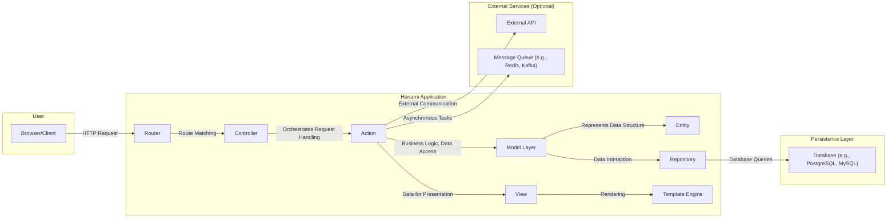

# Project Design Document: Hanami Framework - Enhanced for Threat Modeling

**Version:** 1.1
**Date:** October 26, 2023
**Author:** AI Software Architect

## 1. Introduction

This document provides an enhanced and more detailed architectural overview of the Hanami framework, specifically tailored for threat modeling activities. Building upon the previous version, this document provides greater granularity in describing the components, their interactions, and potential security implications. The aim is to equip security professionals with the necessary information to effectively identify and analyze potential threats.

## 2. Project Overview

Hanami is a full-stack Ruby framework designed for building robust and maintainable web applications. Its core principles of modularity and explicit architecture facilitate a clear understanding of the system's boundaries and interactions, crucial for effective threat modeling. The framework's emphasis on conventions and well-defined components aids in identifying potential attack surfaces and vulnerabilities.

## 3. Architectural Diagram

## 4. Component Breakdown (Enhanced)

This section provides a more detailed breakdown of the key components, highlighting their specific responsibilities and potential security considerations.

*   **Browser/Client:** The entry point for user interaction. Potential threats include:
    *   Malicious scripts injected via XSS vulnerabilities.
    *   Manipulation of client-side data leading to unexpected behavior.
    *   Exposure of sensitive information through browser vulnerabilities.
*   **Router:** Responsible for directing incoming requests. Security considerations include:
    *   Exposure of internal application structure through predictable routing patterns.
    *   Denial-of-service attacks targeting specific, resource-intensive routes.
    *   Improper handling of URL encoding or special characters leading to bypasses.
*   **Controller:**  Receives requests from the router and delegates to actions. Security considerations include:
    *   Lack of input validation at the controller level.
    *   Improper handling of exceptions potentially revealing sensitive information.
    *   Authorization checks not consistently applied across all controller actions.
*   **Action:** Encapsulates the business logic for a specific request. This is a critical point for security:
    *   Vulnerabilities in business logic leading to unauthorized data access or manipulation.
    *   Improper handling of user input, leading to injection attacks (SQL, command injection, etc.).
    *   Exposure of sensitive data through logging or error messages.
    *   Lack of proper authorization checks before performing actions.
*   **Model Layer:**  Manages the application's domain logic and data interactions. Composed of Entities and Repositories.
    *   **Entity:** Represents data structures. Security considerations are less direct but relate to:
        *   Exposure of sensitive data if entities are serialized or logged without proper sanitization.
        *   Inconsistent data types or validation leading to unexpected behavior.
    *   **Repository:** Handles interactions with the persistence layer. Key security considerations:
        *   SQL injection vulnerabilities if queries are not properly parameterized.
        *   Exposure of database credentials.
        *   Insufficient access control at the database level.
*   **View:** Prepares data for rendering. Security considerations:
    *   Lack of output encoding leading to XSS vulnerabilities.
    *   Exposure of sensitive data if not properly filtered before rendering.
    *   Inclusion of unnecessary or debugging information in the rendered output.
*   **Template Engine:** Renders the final output (e.g., HTML). Security considerations:
    *   Server-Side Template Injection (SSTI) vulnerabilities if user input is directly used in templates.
    *   Exposure of sensitive data through template errors or debugging features.
*   **Database:** Stores persistent data. Critical security considerations:
    *   Unauthorized access due to weak credentials or misconfigurations.
    *   Data breaches resulting from SQL injection vulnerabilities.
    *   Lack of encryption for sensitive data at rest.
    *   Insufficient auditing of database access.
*   **External API:**  Interactions with external services introduce new attack vectors:
    *   Man-in-the-middle attacks if communication is not encrypted (HTTPS).
    *   Exposure of API keys or secrets.
    *   Vulnerabilities in the external API itself.
    *   Data breaches if data exchanged with the external API is not handled securely.
*   **Message Queue:** Used for asynchronous tasks. Security considerations include:
    *   Unauthorized access to the message queue.
    *   Tampering with messages in the queue.
    *   Exposure of sensitive data within messages.
    *   Denial-of-service attacks by flooding the queue.

## 5. Data Flow (Granular)

This section provides a more detailed breakdown of the data flow, highlighting potential points of vulnerability at each stage.

1. **User Interaction & Request Origination:** The user interacts with the browser, initiating an HTTP request. Potential vulnerabilities: Client-side vulnerabilities, malicious browser extensions.
2. **Network Transmission:** The request travels over the network. Potential vulnerabilities: Man-in-the-middle attacks if not using HTTPS.
3. **Router Processing:** The Router receives the request and matches it to a defined route. Potential vulnerabilities: Route hijacking, denial-of-service targeting specific routes.
4. **Controller Invocation & Input Handling:** The Router invokes the appropriate Controller. The Controller receives and potentially processes raw input. Potential vulnerabilities: Lack of input validation, exposure of sensitive data in request parameters.
5. **Action Execution & Business Logic:** The Controller calls a specific Action, where business logic is executed. Potential vulnerabilities: Business logic flaws, insecure handling of user input leading to injection attacks, insufficient authorization checks.
6. **Model Layer Interaction:** The Action interacts with the Model layer (Entities and Repositories) to access or manipulate data. Potential vulnerabilities: SQL injection in Repositories, mass assignment vulnerabilities if not carefully controlled.
7. **Database Interaction:** Repositories execute queries against the Database. Potential vulnerabilities: SQL injection, exposure of database credentials.
8. **Data Retrieval & Processing:** Data is retrieved from the database and processed by the Model layer. Potential vulnerabilities: Exposure of sensitive data if not properly sanitized or encrypted.
9. **View Preparation:** The Action prepares data for presentation and passes it to the View. Potential vulnerabilities: Exposure of sensitive data if not properly filtered.
10. **Template Rendering:** The View uses the Template Engine to render the final output. Potential vulnerabilities: Cross-site scripting (XSS) if output is not properly encoded, Server-Side Template Injection (SSTI).
11. **Response Transmission:** The rendered response is sent back to the user's browser. Potential vulnerabilities: Exposure of sensitive data in the response if not properly secured (e.g., using HTTPS, appropriate headers).
12. **External Service Communication (Optional):** The Action may communicate with external APIs. Potential vulnerabilities: Insecure communication protocols, exposure of API keys, vulnerabilities in the external API.
13. **Message Queue Interaction (Optional):** The Action may enqueue or dequeue messages. Potential vulnerabilities: Unauthorized access to the queue, tampering with messages.

## 6. Technology Stack (Detailed)

This section outlines the core technologies, including specific considerations relevant for security.

*   **Programming Language:** Ruby (version specific considerations for known vulnerabilities).
*   **Web Server:** Rack-compatible web server (e.g., Puma, Unicorn) - Configuration is crucial for security (e.g., timeouts, request limits).
*   **Templating Engine:** Tilt (supports various templating languages like ERB, Haml, Slim) - Ensure proper escaping mechanisms are used for the chosen engine.
*   **Persistence Layer:** Hanami::Model (provides an abstraction layer over databases) - Understand the underlying ORM's security features and best practices.
*   **Database Adapters:** Adapters for specific databases (e.g., `hanami-model-adapter-sql` with specific database versions) - Stay updated on database-specific security advisories.
*   **Testing Framework:** RSpec (commonly used) - Security testing should be integrated into the testing process.
*   **Dependency Management:** Bundler - Regularly audit dependencies for known vulnerabilities using tools like `bundle audit`.

## 7. Deployment Model (Security Implications)

Different deployment models introduce varying security considerations:

*   **Traditional Server Deployment:** Requires careful configuration of the operating system, web server, and application server. Security responsibilities are primarily on the application owner.
    *   Need to manage firewalls, intrusion detection systems, and regular security patching.
*   **Containerization (Docker):** Provides isolation but requires secure container image creation and management.
    *   Vulnerabilities in base images can be inherited.
    *   Proper configuration of container orchestration platforms (e.g., Kubernetes) is crucial.
*   **Platform as a Service (PaaS):** Offloads some infrastructure security responsibilities to the PaaS provider, but application-level security remains the responsibility of the developer.
    *   Understand the PaaS provider's security model and shared responsibility.
    *   Ensure proper configuration of PaaS-specific security features.
*   **Serverless Deployment (Less Common):** Security considerations shift towards function-level security and access control.
    *   Securely manage function permissions and API Gateway configurations.
    *   Be mindful of cold starts and potential timing attacks.

## 8. Security Considerations (Detailed)

This section expands on the initial security considerations, providing more specific examples and recommendations.

*   **Input Validation:** Implement robust input validation at multiple layers (client-side and server-side) to prevent injection attacks and ensure data integrity. Use allow-lists rather than deny-lists where possible.
*   **Authentication and Authorization:** Utilize established authentication mechanisms (e.g., OAuth 2.0, OpenID Connect) and implement fine-grained authorization controls based on the principle of least privilege.
*   **Cross-Site Scripting (XSS):**  Employ context-aware output encoding to prevent the injection of malicious scripts. Utilize Content Security Policy (CSP) headers to restrict the sources of allowed content.
*   **Cross-Site Request Forgery (CSRF):** Implement CSRF protection tokens for all state-changing requests.
*   **SQL Injection:**  Always use parameterized queries or ORM features that automatically handle proper escaping to prevent SQL injection vulnerabilities. Avoid constructing SQL queries from raw user input.
*   **Mass Assignment:**  Explicitly define which attributes can be mass-assigned to prevent unintended modification of sensitive data. Use strong parameter filtering.
*   **Dependency Management:**  Regularly audit and update dependencies to patch known security vulnerabilities. Use tools like `bundle audit` and consider implementing automated dependency updates.
*   **Secure Configuration:**  Follow security best practices for configuring the web server, application server, and database. Disable unnecessary features and use strong, unique passwords.
*   **Session Management:**  Use secure session cookies with appropriate flags (e.g., `HttpOnly`, `Secure`, `SameSite`). Implement session timeouts and consider using server-side session storage.
*   **Error Handling and Logging:**  Implement secure error handling that avoids exposing sensitive information in error messages. Log security-related events for auditing and intrusion detection purposes.
*   **Data Encryption:**  Encrypt sensitive data at rest (e.g., using database encryption features) and in transit (using HTTPS).
*   **Rate Limiting:**  Implement rate limiting to protect against brute-force attacks, denial-of-service attacks, and API abuse.
*   **Security Headers:**  Utilize security headers like `Strict-Transport-Security` (HSTS), `X-Content-Type-Options`, `X-Frame-Options`, and `Referrer-Policy` to enhance browser security.

This enhanced design document provides a more detailed and security-focused overview of the Hanami framework, enabling more effective threat modeling and security analysis. The added granularity in component descriptions, data flow analysis, and security considerations aims to provide a comprehensive understanding of potential attack surfaces and vulnerabilities.