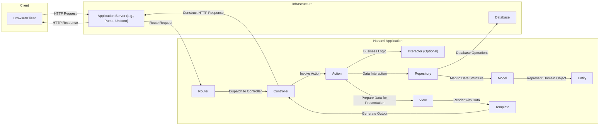
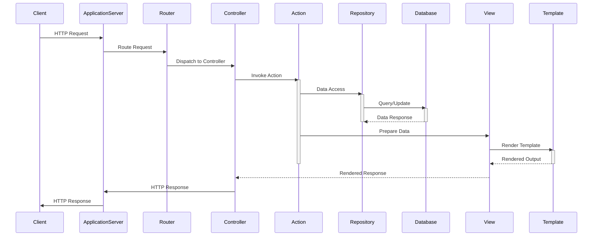

# Project Design Document: Hanami Web Framework

**Version:** 1.1
**Date:** October 26, 2023
**Author:** AI Software Architect

## 1. Introduction

This document provides an enhanced architectural design of the Hanami web framework, building upon the previous version. It aims to offer a more comprehensive understanding of the framework's components, their interactions, data flow, and deployment considerations, specifically for threat modeling purposes.

## 2. Project Goals

* Provide a refined and more detailed architectural overview of the Hanami web framework.
* Clearly define the responsibilities and interactions of major components with greater specificity.
* Illustrate the typical request lifecycle within a Hanami application with enhanced clarity.
* Identify key technologies and dependencies, including specific examples where relevant.
* Outline common deployment scenarios, elaborating on potential infrastructure components.
* Highlight initial security considerations with more concrete examples and categorization for effective threat analysis.

## 3. Scope

This document focuses on the core architectural elements of the Hanami framework itself, providing a deeper dive into its internal workings. It continues to exclude specific application implementations built using Hanami but offers more context relevant to understanding the framework's inherent security characteristics. The emphasis remains on the fundamental building blocks crucial for assessing the framework's security posture.

## 4. Architectural Overview

Hanami is a full-stack Ruby web framework designed with modularity, explicit structure, and maintainability as core principles. Its service-oriented architecture promotes a clear separation of concerns, leading to well-defined layers within an application.

### 4.1. High-Level Components

* **Model:**  Represents the data layer, encapsulating data structures and business logic related to specific domain concepts. It interacts with the persistence mechanism through Repositories.
* **View:** Responsible for preparing and formatting data for presentation to the user. It orchestrates the rendering process using Templates.
* **Controller:** Handles incoming HTTP requests, acting as the primary interface between the Router and the application's business logic. It invokes Actions to process requests and prepares data for Views.
* **Action:** A specific unit of work within a Controller, dedicated to handling a particular user interaction or request. It often interacts with Interactors or Repositories.
* **Interactor (Optional):** Encapsulates complex business logic that may span multiple Models or involve external services. It promotes reusability and testability of intricate operations.
* **Router:** Maps incoming HTTP requests to specific Controller Actions based on defined routes and HTTP methods.
* **Application:** The central unit that orchestrates the interaction between different components, manages the application's lifecycle, and provides configuration.
* **Entity:** A simple, lightweight representation of a domain object with a unique identity. It focuses on the core attributes of a domain concept, independent of persistence details.
* **Repository:** Provides an abstraction layer for data access and manipulation, shielding the application from the specifics of the underlying persistence mechanism.

### 4.2. Architectural Diagram

## 5. Component Details

### 5.1. Router

* **Responsibility:**  Receives incoming HTTP requests from the Application Server and determines the appropriate Controller Action to handle the request based on pre-defined routes.
* **Key Features:**
    * Declarative route definition syntax (e.g., `get '/users', to: 'users#index'`).
    * Support for standard HTTP methods (GET, POST, PUT, PATCH, DELETE, etc.).
    * URL parameter extraction and mapping to Action parameters.
    * Generation of URLs based on named routes, facilitating maintainability.
* **Security Considerations:**
    * Susceptible to Denial-of-Service (DoS) attacks if not configured to handle excessive or malformed requests. Rate limiting might be necessary at the infrastructure level.
    * Overly permissive or predictable route patterns can expose internal application structure, aiding attackers in reconnaissance.
    * Improper handling of URL encoding can lead to bypasses in security checks.

### 5.2. Controller

* **Responsibility:** Acts as the orchestrator for handling specific requests. It receives control from the Router, invokes the appropriate Action, and prepares the necessary data for rendering a response.
* **Key Features:**
    * Organized into Actions, each responsible for a specific user interaction or resource manipulation.
    * Provides access to request parameters (query string, form data, JSON payload), headers, and session data.
    * Offers methods for rendering Views, redirecting to other routes, or returning various response formats (e.g., JSON, XML).
    * Can interact with Models or Interactors to execute business logic and retrieve or manipulate data.
* **Security Considerations:**
    * Primary point of entry for user input, making it a critical area for input validation and sanitization to prevent injection attacks (SQL injection, command injection, etc.).
    * Authorization checks (verifying if the current user has permission to perform the requested action) must be implemented within Controllers or Actions.
    * Vulnerable to mass assignment issues if not carefully configured to control which request parameters can be used to update Model attributes.

### 5.3. Action

* **Responsibility:**  A focused unit of work within a Controller, encapsulating the specific logic required to handle a single type of request. It aims to be concise and focused on a single task.
* **Key Features:**
    * Receives parameters from the Controller (extracted from the route or request body).
    * Often interacts with Repositories to fetch or persist data, or with Interactors for more complex business operations.
    * Prepares data for the View to render the response.
    * Can perform authorization checks specific to the action.
* **Security Considerations:**
    * Similar to Controllers, Actions must validate and sanitize input to prevent vulnerabilities.
    * Authorization logic should be carefully implemented to ensure only authorized users can execute specific actions.
    * Potential for logic flaws if the action's logic is not carefully designed and tested.

### 5.4. Interactor (Optional)

* **Responsibility:**  Encapsulates complex, multi-step business logic that might involve interactions with multiple Models, Repositories, or external services. Promotes a clear separation of concerns and improves the testability of intricate business processes.
* **Key Features:**
    * Receives input from Actions.
    * Orchestrates interactions between different parts of the application to fulfill a specific business requirement.
    * Often returns a result object indicating the success or failure of the operation, along with any relevant data or error messages.
* **Security Considerations:**
    * Should enforce business rules and data integrity constraints to prevent invalid or malicious data manipulation.
    * Potential for vulnerabilities if not designed with security in mind, especially when dealing with sensitive data or external integrations.
    * Input validation should still occur at the Action level before passing data to the Interactor.

### 5.5. Model

* **Responsibility:**  Represents the data structure and associated business logic for a specific domain concept. It provides a high-level interface for interacting with data.
* **Key Features:**
    * Defines attributes and relationships between different domain concepts.
    * Can contain business logic directly related to the data it represents (e.g., validation rules, calculations).
    * Interacts with Repositories to persist and retrieve data from the underlying data store.
* **Security Considerations:**
    * Should not directly handle user input or presentation logic. Its primary focus is data integrity and business rules.
    * Data validation rules defined in the Model help ensure data consistency and can prevent some types of invalid data from being persisted.

### 5.6. Repository

* **Responsibility:**  Provides an abstraction layer for data access, decoupling the application's business logic from the specifics of the database or other persistence mechanism.
* **Key Features:**
    * Offers methods for common data access operations (e.g., `find`, `create`, `update`, `delete`).
    * Encapsulates query logic, allowing for more readable and maintainable data access code.
    * Can implement custom query methods tailored to specific application needs.
* **Security Considerations:**
    * Crucial for preventing SQL injection vulnerabilities by using parameterized queries or ORM features that handle escaping.
    * Should enforce data access controls, ensuring that only authorized parts of the application can access or modify specific data.

### 5.7. Entity

* **Responsibility:**  A simple, lightweight representation of a domain object with a unique identity. It focuses on the essential attributes of a domain concept without being tied to any specific persistence mechanism.
* **Key Features:**
    * Plain Ruby objects with attributes.
    * Independent of database schemas or ORM implementations.
    * Primarily used to represent data retrieved from or to be persisted to the data store.
* **Security Considerations:**
    * Primarily concerned with data integrity and consistency. While not directly involved in security enforcement, ensuring the integrity of Entities is crucial for overall application security.

### 5.8. View

* **Responsibility:**  Prepares data received from the Controller or Action for presentation to the user. It acts as an intermediary between the application logic and the presentation layer.
* **Key Features:**
    * Receives data from Controllers or Actions.
    * Delegates the actual rendering to Templates.
    * Can contain presentation logic, such as formatting data or determining which template to use.
* **Security Considerations:**
    * Vulnerable to Cross-Site Scripting (XSS) attacks if data is not properly escaped before being passed to the Template for rendering.

### 5.9. Template

* **Responsibility:**  Defines the structure and layout of the user interface, typically generating HTML.
* **Key Features:**
    * Uses a templating language (e.g., ERB, Haml, Slim) to embed dynamic content.
    * Receives data from the View to be displayed.
* **Security Considerations:**
    * Must properly escape any user-provided data or data that could contain malicious scripts to prevent XSS vulnerabilities. Using template engines with auto-escaping features is highly recommended.

## 6. Data Flow

The typical request lifecycle in a Hanami application involves the following steps:

1. **Client Request:** A user initiates an action in their browser or client application, sending an HTTP request to the application server.
2. **Application Server Reception:** The Application Server (e.g., Puma, Unicorn) receives the incoming HTTP request.
3. **Routing:** The Application Server forwards the request to the Hanami Router. The Router analyzes the request URL and HTTP method to determine the matching route.
4. **Controller Invocation:** Based on the matched route, the Router instantiates the corresponding Controller and invokes the appropriate Action.
5. **Action Execution:** The Action receives parameters from the request and executes the necessary business logic. This may involve:
    * Interacting with Interactors for complex operations.
    * Interacting with Repositories to retrieve or persist data.
6. **Data Retrieval/Manipulation:** Repositories execute queries or commands against the Database to fetch or modify data.
7. **Database Response:** The Database returns the requested data or confirmation of data modification to the Repository.
8. **View Preparation:** The Action prepares the necessary data and passes it to the designated View.
9. **Template Rendering:** The View selects the appropriate Template and renders it using the provided data. This involves embedding dynamic content into the HTML structure.
10. **Response Generation:** The rendered output from the Template is passed back to the Controller. The Controller constructs an HTTP response, including headers and the rendered body.
11. **Response Delivery:** The Controller sends the HTTP response back to the Application Server, which then delivers it to the Client.

## 7. Technology Stack

* **Core Language:** Ruby
* **Web Server Interface:** Rack (provides a minimal interface between web servers and Ruby frameworks)
* **Templating Engines:**
    * ERB (Embedded Ruby) - default
    * Haml (HTML Abstraction Markup Language)
    * Slim (Lightweight Templating Engine)
* **Persistence Layer:** Adaptable to various databases through adapters and ORMs (Object-Relational Mappers):
    * **SQL Databases:** PostgreSQL, MySQL, SQLite (using libraries like `sequel` or `rom-rb` which Hanami integrates with)
    * **NoSQL Databases:**  Can be integrated through appropriate libraries.
* **Testing Framework:** Typically RSpec, but other Ruby testing frameworks can be used.

## 8. Deployment Considerations

Hanami applications offer flexibility in deployment:

* **Standalone Application Server:** Deployed directly on application servers like Puma, Unicorn, or Thin. Configuration involves setting up the server and deploying the application code.
* **Behind a Reverse Proxy:**  A common setup where a reverse proxy like Nginx or Apache sits in front of the application server. This provides benefits like:
    * **Load Balancing:** Distributing traffic across multiple application instances.
    * **SSL Termination:** Handling HTTPS encryption and decryption.
    * **Static Asset Serving:** Efficiently serving static files.
    * **Security:** Adding an extra layer of defense.
* **Containerized Environments:** Deployment using containerization technologies like Docker allows for packaging the application and its dependencies into a portable container. Orchestration platforms like Kubernetes can manage and scale containerized Hanami applications.
* **Platform as a Service (PaaS):** Platforms like Heroku or Render provide managed environments for deploying and scaling Hanami applications, abstracting away infrastructure management.
* **Serverless Environments:** While less common, Hanami applications could potentially be adapted for serverless environments using technologies like AWS Lambda or Google Cloud Functions, though this might require significant architectural adjustments.

## 9. Security Considerations (Detailed)

This section provides a more detailed breakdown of security considerations, categorized for clarity:

* **Input Security:**
    * **Validation:** Implement robust input validation at the Controller and Action levels to ensure that user-provided data conforms to expected formats and constraints. Use whitelisting (allowing only known good input) rather than blacklisting (blocking known bad input).
    * **Sanitization/Escaping:** Sanitize or escape user input before using it in database queries, rendering it in templates, or passing it to external systems to prevent injection attacks (SQL injection, XSS, command injection). Use context-aware escaping (e.g., HTML escaping for web pages, SQL escaping for database queries).
* **Output Security:**
    * **Encoding:** Properly encode output rendered in Templates to prevent XSS vulnerabilities. Utilize the auto-escaping features provided by template engines. Be mindful of the context (HTML, JavaScript, CSS).
* **Authentication and Authorization:**
    * **Authentication:** Implement secure authentication mechanisms to verify user identities. Consider using established libraries like Devise or Warden for handling authentication.
    * **Authorization:** Implement fine-grained authorization controls to restrict access to resources and actions based on user roles and permissions. Use authorization libraries like Pundit or CanCanCan. Enforce authorization at the Controller or Action level.
* **Session Management:**
    * **Secure Cookies:** Use secure, HTTP-only cookies for session management to prevent client-side JavaScript access and transmission over insecure connections.
    * **Session Invalidation:** Implement proper session invalidation on logout and after periods of inactivity.
    * **Protection against Session Fixation and Hijacking:** Employ techniques like regenerating session IDs after login and using strong session ID generation.
* **Cross-Site Request Forgery (CSRF) Protection:**
    * **CSRF Tokens:** Utilize CSRF tokens in forms and AJAX requests to prevent malicious requests originating from other websites. Hanami provides built-in CSRF protection.
* **Security Headers:**
    * **Content Security Policy (CSP):** Configure CSP headers to control the sources from which the browser is allowed to load resources, mitigating XSS attacks.
    * **HTTP Strict Transport Security (HSTS):** Enforce HTTPS connections by instructing browsers to only access the site over HTTPS.
    * **X-Frame-Options:** Protect against clickjacking attacks by controlling whether the application can be embedded in `<frame>`, `<iframe>`, or `<object>` elements.
    * **X-Content-Type-Options:** Prevent browsers from trying to MIME-sniff the content type, reducing the risk of certain types of attacks.
* **Dependency Management:**
    * **Regular Updates:** Keep all dependencies (gems) up-to-date to patch known security vulnerabilities. Use tools like `bundle audit` to identify vulnerabilities in dependencies.
* **Error Handling and Logging:**
    * **Secure Error Handling:** Avoid displaying sensitive information in error messages. Log errors securely for debugging and monitoring.
    * **Secure Logging:** Implement secure logging practices to prevent log injection attacks and protect sensitive data in logs.
* **Database Security:**
    * **Principle of Least Privilege:** Grant database users only the necessary permissions.
    * **Secure Connection Strings:** Protect database credentials and connection strings. Avoid storing them directly in code. Use environment variables or secure configuration management.
* **Secrets Management:**
    * **Secure Storage:** Securely store sensitive information like API keys, encryption keys, and database credentials using environment variables, dedicated secrets management tools (e.g., HashiCorp Vault), or encrypted configuration files. Avoid hardcoding secrets.

## 10. Future Considerations

* Conduct thorough threat modeling exercises based on this design document to identify potential vulnerabilities and attack vectors.
* Perform security testing, including penetration testing and static analysis, to validate the security of Hanami applications.
* Develop comprehensive security guidelines and best practices for developers building applications with Hanami.
* Explore and document specific security features and configurations available within the Hanami ecosystem.
* Investigate integration with security scanning tools and services.