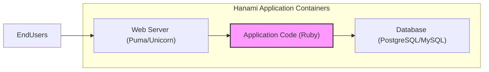
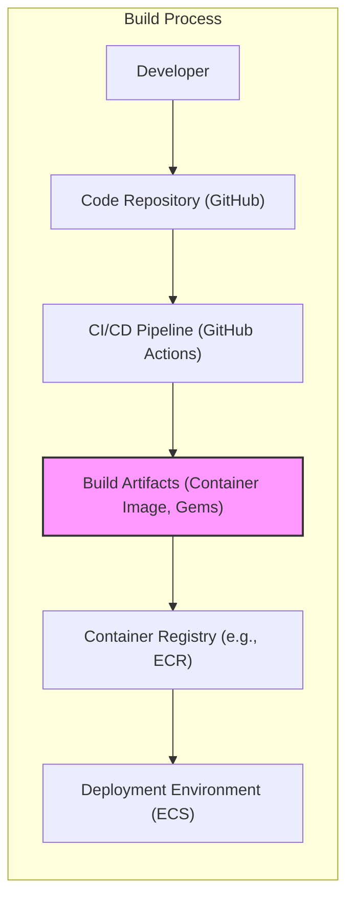

# BUSINESS POSTURE

- Business Priorities and Goals:
  - Provide a robust and performant web application framework for Ruby developers.
  - Enable developers to build maintainable and scalable web applications efficiently.
  - Foster a strong and active community around the framework.
  - Ensure the framework is secure and provides tools and guidance for building secure applications.
- Business Risks:
  - Security vulnerabilities in the framework could lead to widespread security issues in applications built with it.
  - Poor performance or lack of scalability could lead to developer dissatisfaction and framework abandonment.
  - Lack of community support could hinder adoption and development of the framework.
  - Inadequate documentation or complex API could increase the learning curve and reduce developer productivity.

# SECURITY POSTURE

- Existing Security Controls:
  - security control: Code review process for contributions (location: GitHub pull requests).
  - security control: Dependency management using Bundler (location: Gemfile, Gemfile.lock).
  - security control: Public vulnerability reporting process (location: GitHub repository issues).
  - security control: Documentation on security best practices for applications built with Hanami (location: Hanami documentation website).
- Accepted Risks:
  - accepted risk: Reliance on community contributions for security fixes and vulnerability discovery.
  - accepted risk: Potential for vulnerabilities to exist in dependencies.
  - accepted risk: Security of applications built with Hanami is ultimately the responsibility of the application developers.
- Recommended Security Controls:
  - security control: Implement automated security scanning (SAST/DAST) in the CI/CD pipeline for the framework itself.
  - security control: Conduct regular penetration testing or security audits of the framework.
  - security control: Provide security-focused templates or generators for common application components.
  - security control: Offer security training or workshops for Hanami developers.
- Security Requirements:
  - Authentication:
    - Requirement: Provide mechanisms and guidance for developers to implement secure authentication in their applications.
    - Requirement: Framework itself should not require authentication for core functionalities, but should offer secure authentication options for administrative or privileged features if any.
  - Authorization:
    - Requirement: Provide mechanisms and guidance for developers to implement secure authorization in their applications.
    - Requirement: Framework should offer tools to define and enforce access control policies within applications.
  - Input Validation:
    - Requirement: Framework should encourage and facilitate input validation at all application layers.
    - Requirement: Provide built-in mechanisms or libraries for common input validation tasks.
    - Requirement: Protect against common input-based vulnerabilities like SQL injection, cross-site scripting (XSS), and command injection.
  - Cryptography:
    - Requirement: Provide secure and easy-to-use cryptographic libraries or integrations for developers.
    - Requirement: Offer guidance on secure storage and handling of sensitive data, including encryption best practices.
    - Requirement: Ensure framework itself uses cryptography securely where necessary (e.g., session management, CSRF protection).

# DESIGN

## C4 CONTEXT

```mermaid
flowchart LR
    subgraph "Hanami Project Context"
    center "Hanami Framework"
    end

    Developers --> center
    EndUsers --> Applications
    center --> RubyRuntime
    center --> WebServers
    center --> Databases
    center --> OperatingSystems
    center --> PackageManagers
    center --> CloudProviders

    Applications -- Uses --> HanamiFramework
    Applications -- Stores Data --> Databases
    Applications -- Serves Requests --> WebServers

    style center fill:#f9f,stroke:#333,stroke-width:2px
```

- Context Diagram Elements:
  - Element:
    - Name: Developers
    - Type: Person
    - Description: Software developers who use the Hanami framework to build web applications.
    - Responsibilities: Develop, maintain, and deploy web applications using Hanami.
    - Security controls: Code review, secure coding practices, developer training.
  - Element:
    - Name: End Users
    - Type: Person
    - Description: Users who interact with web applications built using the Hanami framework.
    - Responsibilities: Use web applications to access information or services.
    - Security controls: Authentication, authorization, input validation within applications.
  - Element:
    - Name: Hanami Framework
    - Type: Software System
    - Description: The Hanami web application framework itself, providing the core functionalities for building web applications.
    - Responsibilities: Provide a robust, performant, and secure foundation for web application development. Manage routing, controllers, views, models, and other web application components.
    - Security controls: Secure coding practices, vulnerability scanning, security audits, secure release process.
  - Element:
    - Name: Ruby Runtime
    - Type: Software System
    - Description: The Ruby programming language runtime environment required to execute Hanami applications.
    - Responsibilities: Execute Ruby code, manage memory, and provide core language features.
    - Security controls: Security updates for Ruby runtime, operating system level security controls.
  - Element:
    - Name: Web Servers
    - Type: Software System
    - Description: Web servers (e.g., Puma, Unicorn) that handle HTTP requests and serve Hanami applications.
    - Responsibilities: Accept incoming HTTP requests, route requests to the Hanami application, and serve responses.
    - Security controls: Web server configuration (TLS, security headers), access controls, security updates.
  - Element:
    - Name: Databases
    - Type: Software System
    - Description: Databases (e.g., PostgreSQL, MySQL) used by Hanami applications to store and retrieve data.
    - Responsibilities: Persist application data, provide data access and manipulation capabilities.
    - Security controls: Database access controls, encryption at rest and in transit, regular backups, vulnerability scanning.
  - Element:
    - Name: Operating Systems
    - Type: Software System
    - Description: Operating systems (e.g., Linux, macOS) on which Hanami applications and related infrastructure are deployed.
    - Responsibilities: Provide the underlying platform for running software, manage system resources, and provide security features.
    - Security controls: Operating system hardening, security updates, access controls, firewalls.
  - Element:
    - Name: Package Managers
    - Type: Software System
    - Description: Package managers (e.g., Bundler, RubyGems) used to manage Ruby dependencies for Hanami and applications.
    - Responsibilities: Resolve and install Ruby libraries and dependencies.
    - Security controls: Dependency vulnerability scanning, using trusted package repositories, verifying package integrity.
  - Element:
    - Name: Cloud Providers
    - Type: Software System
    - Description: Cloud infrastructure providers (e.g., AWS, Azure, GCP) that may host Hanami applications and related services.
    - Responsibilities: Provide infrastructure as a service (IaaS), platform as a service (PaaS), and other cloud services.
    - Security controls: Cloud provider security controls (IAM, network security groups, encryption), compliance certifications.
  - Element:
    - Name: Applications
    - Type: Software System
    - Description: Web applications built by developers using the Hanami framework.
    - Responsibilities: Provide specific functionalities and services to end users, built upon the Hanami framework.
    - Security controls: Application-level security controls (authentication, authorization, input validation, secure coding practices), leveraging Hanami framework security features.

## C4 CONTAINER



- Container Diagram Elements:
  - Element:
    - Name: Application Code
    - Type: Container
    - Description: Ruby code implementing the web application logic, built using the Hanami framework. This includes controllers, models, views, routes, and other application-specific components.
    - Responsibilities: Handle application logic, process user requests, interact with the database, and generate responses.
    - Security controls: Input validation, output encoding, authorization checks, secure coding practices, vulnerability scanning.
  - Element:
    - Name: Web Server
    - Type: Container
    - Description: Web server responsible for handling HTTP requests and serving the Hanami application. Examples include Puma or Unicorn.
    - Responsibilities: Accept incoming HTTP requests, route requests to the application code, serve static assets, and manage connections.
    - Security controls: TLS configuration, security headers, request filtering, rate limiting, access logging, security updates.
  - Element:
    - Name: Database
    - Type: Container
    - Description: Database system used to persist application data. Examples include PostgreSQL or MySQL.
    - Responsibilities: Store and retrieve application data, manage data integrity and consistency, provide data access control.
    - Security controls: Database access controls, encryption at rest and in transit, regular backups, vulnerability scanning, database hardening.

## DEPLOYMENT

```mermaid
flowchart LR
    subgraph "Cloud Deployment (AWS ECS)"
    subgraph "AWS Region"
        subgraph "Availability Zone A"
            ECSTaskA["ECS Task (Containerized Application)"]
            EC2InstanceA["EC2 Instance"]
        end
        subgraph "Availability Zone B"
            ECSTaskB["ECS Task (Containerized Application)"]
            EC2InstanceB["EC2 Instance"]
        end
        LoadBalancer["Elastic Load Balancer"]
    end
    DatabaseService["RDS (PostgreSQL/MySQL)"]
    Internet["Internet"]

    Internet --> LoadBalancer
    LoadBalancer --> ECSTaskA
    LoadBalancer --> ECSTaskB
    ECSTaskA --> EC2InstanceA
    ECSTaskB --> EC2InstanceB
    ECSTaskA --> DatabaseService
    ECSTaskB --> DatabaseService

    style ECSTaskA fill:#f9f,stroke:#333,stroke-width:2px
    style ECSTaskB fill:#f9f,stroke:#333,stroke-width:2px
    style LoadBalancer fill:#ccf,stroke:#333,stroke-width:2px
    style DatabaseService fill:#ccf,stroke:#333,stroke-width:2px
    style EC2InstanceA fill:#eee,stroke:#333,stroke-width:2px
    style EC2InstanceB fill:#eee,stroke:#333,stroke-width:2px
```

- Deployment Diagram Elements:
  - Element:
    - Name: Internet
    - Type: Environment
    - Description: Public internet, representing external users accessing the application.
    - Responsibilities: Provide network connectivity for users to access the application.
    - Security controls: General internet security considerations, DDoS protection at the cloud provider level.
  - Element:
    - Name: Elastic Load Balancer (ELB)
    - Type: Infrastructure
    - Description: AWS Elastic Load Balancer distributing traffic across ECS tasks.
    - Responsibilities: Load balancing, TLS termination, health checks, traffic routing.
    - Security controls: TLS configuration, security groups, access logs, DDoS protection, WAF integration.
  - Element:
    - Name: ECS Task (Containerized Application)
    - Type: Container Instance
    - Description: Containerized Hanami application running as an ECS task within an ECS cluster.
    - Responsibilities: Run the application code, handle requests, and interact with the database.
    - Security controls: Container image scanning, least privilege container execution, resource limits, application-level security controls.
  - Element:
    - Name: EC2 Instance
    - Type: Infrastructure
    - Description: AWS EC2 instances hosting the ECS tasks.
    - Responsibilities: Provide compute resources for running containers.
    - Security controls: EC2 instance hardening, security groups, IAM roles, security updates, monitoring.
  - Element:
    - Name: RDS (PostgreSQL/MySQL)
    - Type: Infrastructure Service
    - Description: AWS RDS service providing managed database instances.
    - Responsibilities: Managed database service, data persistence, backups, and database administration.
    - Security controls: RDS security groups, encryption at rest and in transit, database access controls, regular backups, patching.
  - Element:
    - Name: Availability Zone A/B
    - Type: Environment
    - Description: AWS Availability Zones providing redundancy and fault tolerance.
    - Responsibilities: Isolate infrastructure components to improve availability and resilience.
    - Security controls: Physical security of AWS data centers, network isolation between availability zones.
  - Element:
    - Name: AWS Region
    - Type: Environment
    - Description: AWS Region hosting all the infrastructure components.
    - Responsibilities: Geographic region for deploying and managing cloud resources.
    - Security controls: Regional compliance and security certifications, data residency controls.

## BUILD



- Build Diagram Elements:
  - Element:
    - Name: Developer
    - Type: Person
    - Description: Software developer writing and committing code changes.
    - Responsibilities: Write code, commit changes, and initiate the build process.
    - Security controls: Secure development environment, code review, access control to code repository.
  - Element:
    - Name: Code Repository (GitHub)
    - Type: Software System
    - Description: Git repository hosted on GitHub, storing the Hanami framework source code and application code.
    - Responsibilities: Version control, code storage, collaboration, and triggering CI/CD pipelines.
    - Security controls: Access controls, branch protection, audit logs, vulnerability scanning of repository.
  - Element:
    - Name: CI/CD Pipeline (GitHub Actions)
    - Type: Software System
    - Description: Automated CI/CD pipeline using GitHub Actions to build, test, and publish artifacts.
    - Responsibilities: Automated build, testing, security scanning, and deployment of code changes.
    - Security controls: Secure pipeline configuration, secret management, build environment security, SAST/DAST integration, dependency scanning.
  - Element:
    - Name: Build Artifacts (Container Image, Gems)
    - Type: Artifact
    - Description: Output of the build process, including container images for deployment and Ruby gems.
    - Responsibilities: Package application code and dependencies into deployable artifacts.
    - Security controls: Artifact signing, vulnerability scanning of artifacts, secure storage of artifacts.
  - Element:
    - Name: Container Registry (e.g., ECR)
    - Type: Software System
    - Description: Container registry to store and manage container images.
    - Responsibilities: Store and distribute container images.
    - Security controls: Access controls, image scanning, vulnerability management, encryption at rest.
  - Element:
    - Name: Deployment Environment (ECS)
    - Type: Environment
    - Description: Target environment where the application is deployed, in this case, AWS ECS.
    - Responsibilities: Run and manage the deployed application.
    - Security controls: Deployment environment security controls as described in the Deployment section.

# RISK ASSESSMENT

- Critical Business Processes:
  - Availability and reliability of web applications built with Hanami.
  - Integrity and confidentiality of data processed by Hanami applications.
  - Developer trust and adoption of the Hanami framework.
- Data Sensitivity:
  - Data handled by Hanami applications varies depending on the application itself.
  - Potential data sensitivity includes:
    - User credentials (passwords, API keys).
    - Personal Identifiable Information (PII) of application users.
    - Business-critical data stored in databases.
    - Application configuration and secrets.
  - Sensitivity level is application-dependent, but the framework must provide tools and guidance to protect sensitive data.

# QUESTIONS & ASSUMPTIONS

- Questions:
  - What is the target audience for applications built with Hanami (e.g., small startups, large enterprises)?
  - What are the typical deployment environments for Hanami applications (cloud, on-premise, hybrid)?
  - Are there specific compliance requirements that Hanami applications need to adhere to (e.g., GDPR, PCI DSS, HIPAA)?
  - What are the most common use cases for Hanami framework?
  - Are there any specific security features or integrations planned for future versions of Hanami?
- Assumptions:
  - Hanami is intended to be used for building production-ready web applications.
  - Security is a significant concern for developers using Hanami.
  - Developers using Hanami will have varying levels of security expertise.
  - Hanami applications will often handle sensitive data.
  - Cloud deployments are a common deployment scenario for Hanami applications.