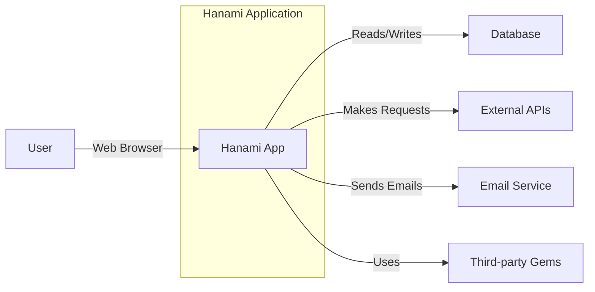

Okay, let's create a design document for the Hanami web framework, focusing on aspects relevant for threat modeling.

# BUSINESS POSTURE

Hanami is a Ruby web framework.  It aims to provide a simpler, more maintainable, and secure alternative to larger, more monolithic frameworks like Ruby on Rails.  The business priorities and goals can be inferred as follows:

*   _Developer Productivity:_ Enable rapid development of web applications.  This is a core value proposition of web frameworks.
*   _Maintainability:_  Promote a clean, modular architecture that is easier to understand, test, and maintain over time. This reduces long-term costs and improves agility.
*   _Security:_  Provide built-in security features and encourage secure coding practices to minimize vulnerabilities. This protects users and the reputation of applications built with Hanami.
*   _Performance:_ Offer good performance to ensure a responsive user experience.
*   _Community Growth:_ Attract and retain a community of developers to contribute to the framework and support its ecosystem.
*   _Adoption:_ Increase adoption of the framework by businesses and individual developers.

_Most Important Business Risks:_

*   _Security Vulnerabilities:_  Vulnerabilities in the framework itself could be exploited in applications built using Hanami, leading to data breaches, service disruptions, and reputational damage. This is the most critical risk.
*   _Lack of Adoption:_ If the framework fails to gain sufficient traction, it may become unsustainable, leaving users without support and updates.
*   _Competition:_  The framework competes with established frameworks like Rails.  Failure to keep up with features and security best practices could lead to a loss of users.
*   _Maintainability Issues:_ If the framework's codebase becomes difficult to maintain, it could slow down development, introduce bugs, and hinder security updates.
*   _Performance Bottlenecks:_  Poor performance could lead to a negative user experience and drive users to alternative frameworks.

# SECURITY POSTURE

Hanami, by design, incorporates several security-conscious features.  However, the security posture of any *application* built with Hanami depends heavily on how the developer utilizes the framework and implements additional security controls.

*   _security control:_ Secure by default configurations. Hanami emphasizes secure defaults to reduce the likelihood of common vulnerabilities. (Described in Hanami documentation and guides).
*   _security control:_ Modular design. The architecture promotes separation of concerns, making it easier to isolate and secure different parts of an application. (Described in Hanami architecture documentation).
*   _security control:_ Built-in CSRF protection. Hanami provides mechanisms to mitigate Cross-Site Request Forgery attacks. (Described in Hanami security guides).
*   _security control:_ Built-in XSS protection. It provides escaping mechanisms to prevent Cross-Site Scripting. (Described in Hanami security guides).
*   _security control:_ Encourages use of secure coding practices. The framework's design and documentation guide developers towards secure development patterns. (Described in Hanami guides and best practices).
*   _accepted risk:_  Reliance on third-party gems. Like all Ruby frameworks, Hanami applications rely on external gems, which may introduce vulnerabilities.  This is a common risk in the Ruby ecosystem.
*   _accepted risk:_  Developer error.  Even with secure defaults, developers can still introduce vulnerabilities through insecure coding practices or misconfiguration.
*   _accepted risk:_  Zero-day vulnerabilities.  The framework itself, or its dependencies, may contain undiscovered vulnerabilities.

_Recommended Security Controls (High Priority):_

*   _security control:_ Implement a robust Content Security Policy (CSP). This is not explicitly built-in but highly recommended for any web application.
*   _security control:_ Regularly update dependencies.  This includes Hanami itself and all associated gems.  Automated dependency management and vulnerability scanning are crucial.
*   _security control:_ Implement robust logging and monitoring.  This is essential for detecting and responding to security incidents.
*   _security control:_ Conduct regular security audits and penetration testing. This helps identify vulnerabilities that may be missed during development.
*   _security control:_ Implement input validation and sanitization beyond what's provided by default, tailored to the specific application's needs.

_Security Requirements:_

*   _Authentication:_
    *   Hanami does not provide built-in authentication. Developers must implement their own or use a third-party authentication gem (e.g., Devise, Rodauth).
    *   The chosen authentication mechanism MUST support strong password hashing (e.g., bcrypt, Argon2).
    *   The authentication system MUST implement secure session management, including protection against session fixation and hijacking.
    *   Multi-factor authentication (MFA) SHOULD be considered for sensitive applications.

*   _Authorization:_
    *   Hanami provides basic mechanisms for authorization (e.g., defining access control rules).
    *   The authorization system MUST enforce the principle of least privilege.
    *   Role-Based Access Control (RBAC) or Attribute-Based Access Control (ABAC) SHOULD be implemented as needed.

*   _Input Validation:_
    *   Hanami provides some input validation helpers.
    *   ALL user-supplied input MUST be validated on the server-side, using a whitelist approach whenever possible.
    *   Input validation rules MUST be tailored to the expected data type and format.
    *   Input validation MUST be performed before any data processing or storage.

*   _Cryptography:_
    *   Hanami does not provide extensive cryptographic functionality directly. Developers are expected to use appropriate Ruby libraries.
    *   Sensitive data (e.g., passwords, API keys) MUST be stored securely using strong, industry-standard cryptographic algorithms.
    *   Cryptographic keys MUST be managed securely, following best practices for key generation, storage, and rotation.
    *   HTTPS MUST be used for all communication, and HSTS (HTTP Strict Transport Security) SHOULD be enabled.

# DESIGN

## C4 CONTEXT



_C4 Context Element Descriptions:_

*   Element:
    *   Name: User
    *   Type: Person
    *   Description: A user interacting with the Hanami application through a web browser.
    *   Responsibilities: Accessing the application, providing input, viewing output.
    *   Security controls: Browser-based security controls (e.g., same-origin policy, cookie security).

*   Element:
    *   Name: Hanami App
    *   Type: Software System
    *   Description: The web application built using the Hanami framework.
    *   Responsibilities: Handling user requests, processing data, interacting with other systems, rendering responses.
    *   Security controls: CSRF protection, XSS protection, secure coding practices, input validation, output encoding.

*   Element:
    *   Name: Database
    *   Type: Software System
    *   Description: The database used by the Hanami application to store persistent data.
    *   Responsibilities: Storing and retrieving data.
    *   Security controls: Database access controls, encryption at rest, regular backups.

*   Element:
    *   Name: External APIs
    *   Type: Software System
    *   Description: Any external APIs that the Hanami application interacts with (e.g., payment gateways, social media APIs).
    *   Responsibilities: Providing specific services to the Hanami application.
    *   Security controls: API authentication, authorization, rate limiting, input validation.

*   Element:
    *   Name: Email Service
    *   Type: Software System
    *   Description: A service used by the Hanami application to send emails (e.g., transactional emails, notifications).
    *   Responsibilities: Sending emails on behalf of the application.
    *   Security controls: API authentication, secure email protocols (e.g., TLS).

*   Element:
    *   Name: Third-party Gems
    *   Type: Software System
    *   Description: External Ruby libraries used by the Hanami application.
    *   Responsibilities: Providing specific functionalities to the application.
    *   Security controls: Regular updates, vulnerability scanning.

## C4 CONTAINER

```mermaid
graph LR
    subgraph Hanami Application
        A[Web Server (e.g., Puma, Unicorn)]
        B[Hanami App Container]
        C[Database Adapter]
    end
    subgraph External Systems
        D[Database]
        E[External APIs]
        F[Email Service]
    end

    A -- HTTP Requests --> B
    B -- Database Queries --> C
    C -- Database Connection --> D
    B -- API Requests --> E
    B -- Email Sending --> F
```

_C4 Container Element Descriptions:_

*   Element:
    *   Name: Web Server (e.g., Puma, Unicorn)
    *   Type: Container
    *   Description: The web server that receives incoming HTTP requests and forwards them to the Hanami application.
    *   Responsibilities: Handling HTTP requests, managing connections, serving static assets.
    *   Security controls: Web server configuration hardening, TLS encryption, request filtering.

*   Element:
    *   Name: Hanami App Container
    *   Type: Container
    *   Description: The core of the Hanami application, containing the application logic, controllers, views, and models.
    *   Responsibilities: Processing requests, interacting with the database and external services, rendering responses.
    *   Security controls: CSRF protection, XSS protection, input validation, output encoding, secure coding practices.

*   Element:
    *   Name: Database Adapter
    *   Type: Container
    *   Description: The component responsible for interacting with the database.
    *   Responsibilities: Translating application requests into database queries, handling database connections.
    *   Security controls: Prepared statements, parameterized queries, connection security.

*   Element:
    *   Name: Database
    *   Type: Container
    *   Description: The database used by the Hanami application.
    *   Responsibilities: Storing and retrieving data.
    *   Security controls: Database access controls, encryption at rest, regular backups.

*   Element:
    *   Name: External APIs
    *   Type: Container
    *   Description: External APIs used by the Hanami application.
    *   Responsibilities: Providing specific services.
    *   Security controls: API authentication, authorization, rate limiting, input validation.

*   Element:
    *   Name: Email Service
    *   Type: Container
    *   Description: Service for sending emails.
    *   Responsibilities: Sending emails.
    *   Security controls: API authentication, secure email protocols.

## DEPLOYMENT

Hanami applications can be deployed in various ways, including:

1.  _Traditional Server Deployment:_ Deploying to a virtual machine or physical server running a web server (e.g., Puma, Unicorn) and a database server (e.g., PostgreSQL, MySQL).
2.  _Containerized Deployment (Docker):_ Packaging the application and its dependencies into a Docker container and deploying it to a container orchestration platform (e.g., Kubernetes, Docker Swarm).
3.  _Platform-as-a-Service (PaaS):_ Deploying to a PaaS provider (e.g., Heroku, AWS Elastic Beanstalk) that handles the underlying infrastructure.
4.  _Serverless Deployment:_ Deploying individual functions to a serverless platform (e.g., AWS Lambda, Google Cloud Functions). This is less common for full Hanami applications but could be used for specific parts.

We'll describe a *Containerized Deployment* using Docker and Kubernetes:

```mermaid
graph LR
    subgraph Kubernetes Cluster
        subgraph Node 1
            A[Hanami App Pod]
            B[Database Pod]
        end
        subgraph Node 2
            C[Hanami App Pod]
            D[Load Balancer Service]
        end
    end
    E[Ingress Controller]
    F[Internet]
    G[CI/CD Pipeline]

    F -- HTTPS Traffic --> E
    E -- Routes Traffic --> D
    D -- Distributes Traffic --> A
    D -- Distributes Traffic --> C
    A -- Database Connection --> B
    C -- Database Connection --> B
    G -- Deploys --> Kubernetes Cluster

```

_Deployment Element Descriptions:_

*   Element:
    *   Name: Hanami App Pod
    *   Type: Kubernetes Pod
    *   Description: A Kubernetes Pod running the Hanami application container. Multiple replicas can exist for scalability and high availability.
    *   Responsibilities: Running the Hanami application.
    *   Security controls: Container security best practices, network policies, resource limits.

*   Element:
    *   Name: Database Pod
    *   Type: Kubernetes Pod
    *   Description: A Kubernetes Pod running the database server (e.g., PostgreSQL).
    *   Responsibilities: Running the database server.
    *   Security controls: Database access controls, encryption at rest, regular backups, network policies.

*   Element:
    *   Name: Load Balancer Service
    *   Type: Kubernetes Service
    *   Description: A Kubernetes Service that acts as a load balancer, distributing traffic across multiple Hanami App Pods.
    *   Responsibilities: Load balancing traffic.
    *   Security controls: Network policies.

*   Element:
    *   Name: Ingress Controller
    *   Type: Kubernetes Ingress Controller
    *   Description: An Ingress controller that manages external access to the application.
    *   Responsibilities: Routing external traffic to the appropriate services.
    *   Security controls: TLS termination, request filtering, web application firewall (WAF).

*   Element:
    *   Name: Internet
    *   Type: External
    *   Description: The public internet.
    *   Responsibilities: N/A
    *   Security controls: N/A

*   Element:
    *   Name: CI/CD Pipeline
    *   Type: System
    *   Description: Continuous Integration and Continuous Delivery pipeline.
    *   Responsibilities: Building, testing, and deploying the application.
    *   Security controls: Secure build environment, vulnerability scanning, automated security testing.

## BUILD

The build process for a Hanami application typically involves the following steps:

1.  _Developer writes code:_ Developers write code and commit it to a version control system (e.g., Git).
2.  _CI/CD pipeline triggered:_ A CI/CD pipeline (e.g., GitHub Actions, Jenkins, CircleCI) is triggered by a commit or other event.
3.  _Dependencies installed:_ The pipeline installs the required dependencies (Ruby gems) using Bundler.
4.  _Tests run:_ Automated tests (e.g., unit tests, integration tests) are executed.
5.  _Code analysis:_ Static analysis tools (e.g., RuboCop, Brakeman) are run to check for code quality and security vulnerabilities.
6.  _Container built (if applicable):_ If using containerization, a Docker image is built, incorporating the application code and dependencies.
7.  _Artifacts published:_ The build artifacts (e.g., Docker image, packaged application) are published to a repository (e.g., Docker Hub, a private container registry).

```mermaid
graph LR
    A[Developer]
    B[Git Repository]
    C[CI/CD Pipeline]
    D[Dependency Management (Bundler)]
    E[Automated Tests]
    F[Static Analysis (RuboCop, Brakeman)]
    G[Container Build (Docker)]
    H[Artifact Repository]

    A -- Commits Code --> B
    B -- Triggers --> C
    C -- Installs Dependencies --> D
    C -- Runs --> E
    C -- Performs --> F
    C -- Builds --> G
    G -- Publishes --> H
```

_Security Controls in the Build Process:_

*   _security control:_ Secure build environment: The CI/CD pipeline should run in a secure environment, isolated from other systems.
*   _security control:_ Dependency management: Bundler helps manage dependencies and ensure consistent versions.
*   _security control:_ Vulnerability scanning: Tools like Bundler-audit and Brakeman can scan for known vulnerabilities in dependencies and the application code.
*   _security control:_ Static analysis: RuboCop enforces coding standards and can detect potential security issues. Brakeman specifically focuses on security vulnerabilities in Ruby on Rails applications (and can be adapted for Hanami).
*   _security control:_ Automated security testing: Incorporate security tests into the test suite (e.g., tests for authentication, authorization, input validation).
*   _security control:_ Container security scanning (if applicable): If using Docker, scan the container image for vulnerabilities before publishing it.
*   _security control:_ Least privilege: The build process should run with the minimum necessary privileges.

# RISK ASSESSMENT

*   _Critical Business Processes:_
    *   User authentication and authorization.
    *   Data processing and storage.
    *   Interaction with external services (e.g., payment gateways).
    *   Serving web content to users.

*   _Data to Protect and Sensitivity:_
    *   _User data:_ Personally Identifiable Information (PII) such as names, email addresses, physical addresses, phone numbers (High sensitivity).
    *   _Authentication credentials:_ Passwords, session tokens (Extremely high sensitivity).
    *   _Financial data:_ Payment card information, transaction history (Extremely high sensitivity - if applicable).
    *   _Application data:_ Any data specific to the application's functionality (Sensitivity varies depending on the application).
    *   _Configuration data:_ API keys, database credentials (Extremely high sensitivity).

# QUESTIONS & ASSUMPTIONS

*   _Questions:_
    *   What specific external services will Hanami applications typically interact with?
    *   What are the most common deployment scenarios for Hanami applications?
    *   What level of security expertise is expected from developers using Hanami?
    *   Are there any specific regulatory compliance requirements (e.g., GDPR, HIPAA) that need to be considered for typical Hanami applications?
    *   What is the expected scale (number of users, requests per second) for a typical Hanami application?

*   _Assumptions:_
    *   _BUSINESS POSTURE:_ Developers prioritize security, but may have limited security expertise.  The framework aims to provide a good balance between security and ease of use.
    *   _SECURITY POSTURE:_ Developers will follow Hanami's documentation and best practices for secure development.  They will also use additional security tools and libraries as needed.
    *   _DESIGN:_ The application will use a relational database.  The application will be deployed using a containerized approach (e.g., Docker and Kubernetes). The application will use a CI/CD pipeline for building and deploying.