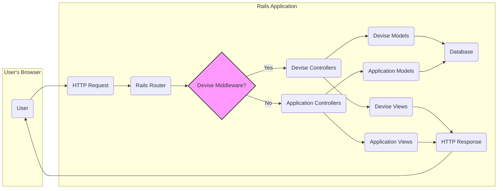

# Project Design Document: Devise Authentication Library

**Version:** 1.1
**Date:** October 26, 2023
**Author:** AI Software Architect

## 1. Introduction

This document provides an enhanced design overview of the Devise authentication library for Ruby on Rails applications. Building upon the previous version, this document offers further detail and clarity, serving as a robust foundation for subsequent threat modeling activities. It outlines the system's architecture, components, and data flow with greater precision.

## 2. Project Overview

Devise is a highly regarded and widely adopted authentication solution for Ruby on Rails applications, built upon the flexible Warden authentication framework. It offers a comprehensive suite of modules addressing common authentication needs, including user registration, login, password recovery, session management, and optional features like email confirmation and account locking. Its design emphasizes configurability and extensibility, enabling developers to tailor its behavior to the specific requirements of their applications.

## 3. Goals and Objectives

* Deliver a secure, reliable, and feature-rich authentication framework for Rails applications.
* Provide a modular architecture, allowing developers to selectively integrate necessary authentication functionalities.
* Streamline the implementation of standard authentication workflows, reducing boilerplate code.
* Offer extensive configuration options to accommodate diverse application scenarios and security policies.
* Ensure seamless integration within the Ruby on Rails ecosystem and its conventions.
* Promote secure development practices by providing well-tested and vetted authentication mechanisms.

## 4. Target Audience

This document is primarily intended for:

* Security engineers responsible for conducting threat modeling and security assessments.
* Developers involved in integrating, customizing, and maintaining Devise within Rails applications.
* Software architects reviewing the system's design and its security implications.
* Operations teams responsible for deploying and managing applications utilizing Devise.

## 5. System Architecture

Devise functions as a Rack middleware within a Rails application, strategically intercepting incoming HTTP requests to manage user authentication and session lifecycle. This middleware acts as a gatekeeper, determining if a user is authenticated before allowing access to protected resources.

**Detailed Explanation of Components:**

* **User:** The end-user interacting with the web application through their browser, initiating actions that may require authentication.
* **HTTP Request:** The request initiated by the user's browser, such as navigating to a page, submitting a form, or making an API call.
* **Rails Router:** The Rails component responsible for interpreting incoming HTTP requests and mapping them to specific controller actions based on defined routes.
* **Devise Middleware:** A crucial piece of Rack middleware that intercepts requests early in the processing pipeline. It checks for existing user sessions and triggers authentication procedures when necessary. This is the central point of Devise's operation.
* **Devise Controllers:** Specialized controllers provided by Devise to handle core authentication functionalities. Examples include `SessionsController` (for login/logout), `RegistrationsController` (for signup/account management), and `PasswordsController` (for password reset).
* **Application Controllers:** Controllers developed specifically for the application's unique business logic and features, often requiring authenticated access.
* **Devise Models:** ActiveRecord models provided by Devise, most notably the `User` model. This model stores essential user authentication data, including the encrypted password, email, and various tokens for password reset, confirmation, etc.
* **Application Models:** Models representing the application's specific data entities and their relationships, distinct from authentication-related data.
* **Database:** The persistent data store for the application, housing user authentication information managed by Devise alongside other application data. Common choices include PostgreSQL, MySQL, and SQLite.
* **Devise Views:**  ERB (or other templating engine) files that render the user interface elements for Devise's features, such as login forms, registration forms, and password reset prompts. These are designed to be customizable.
* **Application Views:** Template files responsible for rendering the user interface specific to the application's features and content.
* **HTTP Response:** The server's response to the user's request, containing the rendered HTML, data, or status codes.

## 6. Data Flow

The following details the data flow for common authentication scenarios, highlighting the exchange of information between components.

### 6.1. User Registration

1. The user submits registration details (e.g., email, password, optional fields) via a form in their browser.
2. The HTTP request is routed to the `RegistrationsController` provided by Devise.
3. The `RegistrationsController` instantiates a new `User` model with the submitted data.
4. Devise's model layer encrypts the user's provided password using bcrypt before attempting to save the record.
5. The `User` model is saved to the database.
6. Optionally, if email confirmation is enabled, Devise generates a confirmation token, stores it with the user record, and sends a confirmation email containing a link with this token to the user's provided email address.
7. Upon successful registration (and potentially email confirmation), the user is typically signed in, and a session is established by setting a session cookie in the user's browser.

### 6.2. User Login

1. The user submits their login credentials (e.g., email and password) through a login form.
2. The request is directed to the `SessionsController` provided by Devise.
3. The `SessionsController` retrieves the `User` record from the database based on the provided email address.
4. Devise compares the provided plain-text password with the encrypted password stored in the database for that user using bcrypt's comparison function.
5. If the credentials are valid, Devise generates a new session for the user. This typically involves creating a unique session identifier.
6. The session identifier is stored server-side (e.g., in memory, database, or a dedicated session store) and a corresponding session cookie (e.g., `_session_id`) containing this identifier is set in the user's browser.

### 6.3. Password Reset

1. The user initiates a password reset process, typically by clicking a "Forgot Password" link and providing their email address.
2. The request is routed to the `PasswordsController`.
3. The `PasswordsController` finds the user record associated with the provided email.
4. Devise generates a unique password reset token, stores it in the `User` record (`reset_password_token`), and records the timestamp of the request (`reset_password_sent_at`).
5. An email containing a link with the password reset token is sent to the user's email address.
6. The user clicks the link in the email, which directs them to a form to enter a new password. The request includes the reset token as a parameter.
7. Upon submitting the new password, the `PasswordsController` verifies the validity of the reset token against the one stored in the database for that user and checks if it has expired.
8. If the token is valid and not expired, Devise updates the user's password in the database with the newly provided password (after encryption) and clears the `reset_password_token` and `reset_password_sent_at` fields.

### 6.4. Session Management

1. After successful login, Devise creates a user session. The session ID is typically stored in a cookie named `_session_id` in the user's browser.
2. On subsequent requests, the Devise middleware intercepts the request and checks for the presence of a valid session cookie.
3. If a valid session cookie is found, the middleware retrieves the corresponding session data from the server-side session store.
4. Devise uses the session data to identify and authenticate the user, making the user object available to the application.
5. Sessions can expire due to inactivity (timeout) or when the user explicitly logs out. Logout clears the session cookie in the browser and invalidates the server-side session.

## 7. Key Components

* **Models:**
    * `User`: The core model representing a user. Devise adds crucial attributes like `encrypted_password` (the securely hashed password), `email`, `reset_password_token`, `reset_password_sent_at`, `remember_created_at`, `sign_in_count`, `current_sign_in_at`, `last_sign_in_at`, `current_sign_in_ip`, `last_sign_in_ip`, `confirmation_token`, `confirmed_at`, `confirmation_sent_at`, `unconfirmed_email`, `failed_attempts`, `unlock_token`, `locked_at`.
    * Additional models may be present depending on enabled modules (e.g., for OAuth integration).
* **Controllers:**
    * `SessionsController`: Manages user login (`new`, `create`) and logout (`destroy`).
    * `RegistrationsController`: Handles user sign-up (`new`, `create`), account updates (`edit`, `update`), and account deletion (`destroy`).
    * `PasswordsController`: Manages password reset requests (`new`, `create`) and password updates (`edit`, `update`).
    * `ConfirmationsController`: Handles email confirmation processes (`new`, `create`, `show`).
    * `UnlocksController`: Manages account unlocking after multiple failed login attempts (`new`, `create`, `show`).
    * `OmniauthCallbacksController`: Handles authentication callbacks from third-party OAuth providers (if the `omniauthable` module is enabled).
* **Views:**
    * Customizable ERB templates for rendering forms and messages related to login, registration, password reset, email confirmation, etc. These views are located within the `app/views/devise` directory.
* **Mailers:**
    * Used for sending emails related to account confirmation, password reset instructions, and other notifications. The default mailer is `Devise::Mailer`.
* **Routes:**
    * Devise automatically generates a set of routes for its controllers, providing standard paths like `/users/sign_in`, `/users/sign_up`, `/users/password/new`, etc. These routes can be customized.
* **Configuration:**
    * Devise is highly configurable through the `config/initializers/devise.rb` file. This allows developers to enable or disable modules, customize authentication keys, set password requirements, configure session timeouts, and adjust various other settings.
* **Warden Integration:**
    * Devise leverages Warden as its underlying authentication framework. Warden provides a flexible and extensible system for handling authentication strategies. Devise builds upon this foundation to provide its specific features.

## 8. Security Considerations (Detailed)

This section provides a more detailed overview of security considerations relevant for threat modeling.

* **Authentication:**
    * **Password Storage:** Devise uses bcrypt with a default cost factor of 12 for securely hashing passwords, making brute-force attacks computationally expensive.
    * **Brute-Force Protection:** The `lockable` module can be enabled to lock accounts after a certain number of failed login attempts, mitigating brute-force attacks.
    * **Account Enumeration:**  Care should be taken in custom code and error messages to avoid revealing whether a given email address is registered in the system.
* **Session Management:**
    * **Session Fixation:** Devise regenerates the session ID upon successful login to prevent session fixation attacks.
    * **Session Hijacking:**  Using HTTPS is crucial to encrypt session cookies and prevent them from being intercepted in transit. Setting the `secure` and `HttpOnly` flags on session cookies further enhances security.
    * **Session Timeout:** Devise allows configuration of session timeouts to limit the duration of inactivity before a session expires.
* **Password Reset:**
    * **Reset Token Security:** Reset tokens are designed to be unique and time-limited to reduce the window of opportunity for attackers.
    * ** предотвращение атак типа "человек посередине" (MITM) при сбросе пароля:**  Использование HTTPS для защиты процесса сброса пароля.
* **Input Validation and Output Encoding:**
    * **Cross-Site Scripting (XSS):** Developers must ensure proper input validation and output encoding in custom views and controllers to prevent XSS vulnerabilities. Devise's default views generally handle this, but customizations require careful attention.
    * **SQL Injection:**  Devise itself uses ActiveRecord, which provides protection against SQL injection when used correctly. However, custom database queries should be carefully reviewed.
* **Cross-Site Request Forgery (CSRF):** Rails provides built-in CSRF protection, which Devise seamlessly integrates with. Ensure that CSRF protection is enabled and that forms include the CSRF token.
* **Clickjacking:**  Consider implementing frame busting techniques or using HTTP headers like `X-Frame-Options` to prevent clickjacking attacks.
* **Mass Assignment:**  Ensure proper use of strong parameters in controllers to prevent mass assignment vulnerabilities when creating or updating user records.
* **Third-Party Authentication (OAuth):**
    * **Token Validation:** When using OAuth providers, rigorously validate access tokens and ID tokens received from the provider.
    * **State Parameter:** Utilize the `state` parameter in OAuth flows to prevent CSRF attacks.
    * **Secure Credential Storage:** Securely store OAuth client secrets and any access tokens obtained from providers.
* **General Security Practices:**
    * **Regular Updates:** Keep Devise and all other dependencies updated to patch known security vulnerabilities.
    * **Security Audits:** Conduct regular security audits and penetration testing to identify potential weaknesses.
    * **Principle of Least Privilege:** Grant only necessary permissions to database users and application components.

## 9. Technologies Used

* **Ruby on Rails:** The primary web application framework.
* **Warden:** The underlying authentication framework providing the core authentication mechanisms.
* **bcrypt:** The industry-standard library for securely hashing passwords using the bcrypt algorithm.
* **Rack:** The standard interface between Ruby web servers and web frameworks.
* **HTML, CSS, JavaScript:** Used for rendering the user interface elements.
* **Database (e.g., PostgreSQL, MySQL, SQLite):** For persistent storage of user data and other application information.
* **Action Mailer:**  The Rails component used for sending emails.

## 10. Deployment Considerations

Secure deployment of applications using Devise requires careful attention to several factors:

* **HTTPS Enforcement:**  Mandatory use of HTTPS (TLS/SSL) for all application traffic to protect sensitive data like login credentials and session cookies from eavesdropping. This includes proper certificate management and configuration.
* **Secret Key Management:** Securely manage the Rails `secret_key_base`, which is crucial for encrypting session cookies and other sensitive data. Avoid storing it directly in code; use environment variables or secure vault solutions.
* **Database Security:** Implement robust security measures for the database server, including strong passwords, access controls, and regular security updates.
* **Session Store Security:** If using a database or other persistent store for sessions, ensure its security is properly configured. Consider using secure and performant session stores like Redis or Memcached.
* **Regular Updates:**  Maintain up-to-date versions of Ruby, Rails, Devise, and all other dependencies to benefit from security patches and bug fixes.
* **Web Server Configuration:** Configure the web server (e.g., Nginx, Apache) with appropriate security headers (e.g., `Strict-Transport-Security`, `X-Frame-Options`, `Content-Security-Policy`) to mitigate various web application attacks.
* **Monitoring and Logging:** Implement comprehensive logging and monitoring to detect suspicious activity and potential security breaches.

## 11. Future Considerations

* **Enhanced Multi-Factor Authentication (MFA) Support:**  Explore tighter integration with popular MFA solutions or provide more built-in MFA capabilities beyond basic password-based authentication.
* **WebAuthn Integration:**  Consider adding native support for WebAuthn, enabling passwordless authentication using biometrics or security keys.
* **Improved Session Management Flexibility:** Offer more granular control over session storage options and session lifecycle management.
* **Rate Limiting:**  Integrate built-in rate limiting mechanisms to protect against brute-force attacks and other forms of abuse.
* **Integration with Modern Frontend Frameworks:**  Provide clearer guidance and potentially specific helpers for integrating Devise with modern JavaScript frontend frameworks (e.g., React, Vue.js, Angular) in API-driven architectures.

This enhanced design document provides a more in-depth understanding of the Devise authentication library, offering a solid foundation for comprehensive threat modeling and secure application development. The detailed information on architecture, data flow, components, and security considerations aims to equip security engineers and developers with the knowledge necessary to build and maintain secure Rails applications using Devise.