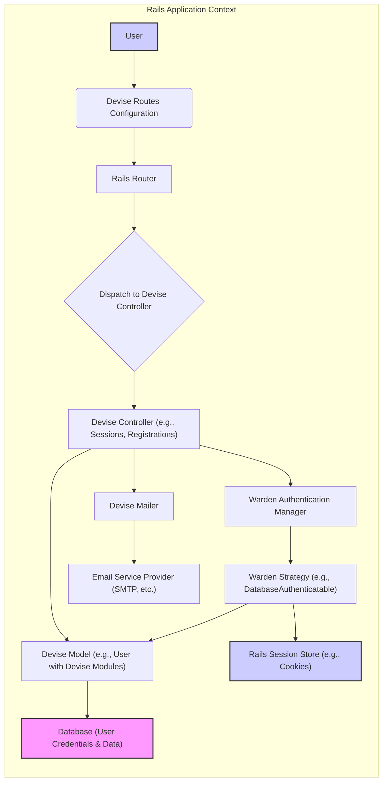
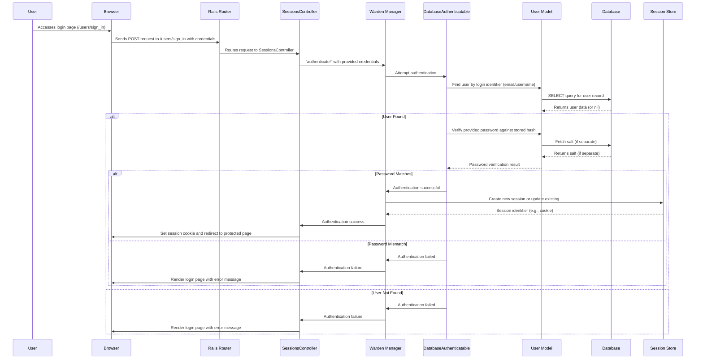
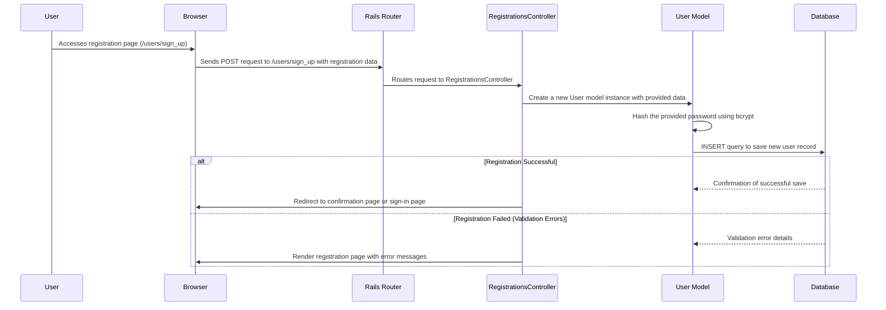
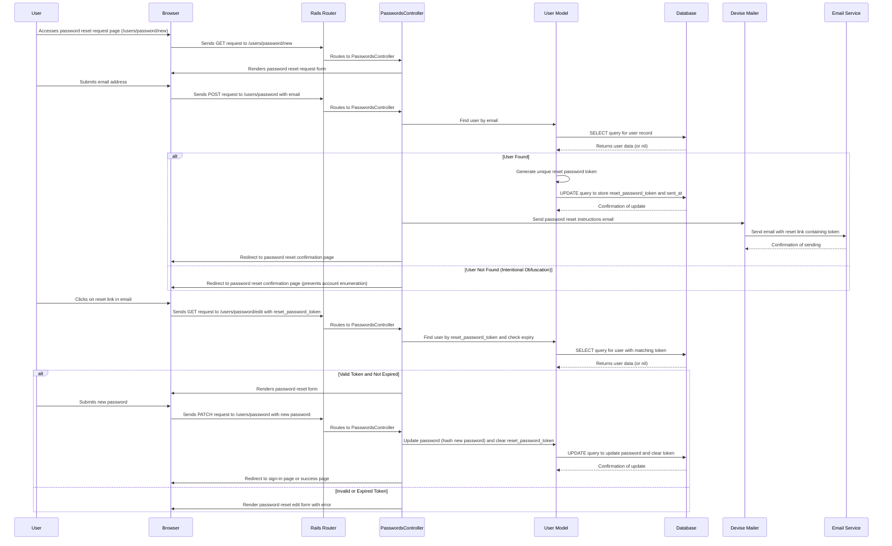

# Project Design Document: Devise Authentication Gem

**Version:** 1.1
**Date:** October 26, 2023
**Author:** Gemini (AI Language Model)

## 1. Introduction

This document provides an enhanced and more detailed design overview of the Devise authentication gem for Ruby on Rails applications. The primary goal is to offer a clear and comprehensive understanding of Devise's architecture, components, and data flow, specifically for the purpose of thorough threat modeling and security analysis.

Devise is a highly configurable authentication solution for Rails applications, built upon the Warden authentication framework. It offers a suite of modules catering to various authentication needs, including user registration, session management, password recovery, and more. This document will delve into the core functionalities with a strong emphasis on security-relevant aspects.

## 2. Goals and Objectives

*   Deliver a refined and more detailed architectural overview of the Devise gem's internal workings.
*   Clearly define the responsibilities and security implications of key components and their interactions.
*   Provide more granular data flow diagrams for critical authentication processes, highlighting sensitive data.
*   Serve as a robust and informative foundation for subsequent threat modeling exercises.
*   Empower security professionals with a deep understanding of the system's mechanics and potential attack vectors.

## 3. System Architecture

Devise acts as a middleware layer deeply integrated within a Rails application, providing a structured set of controllers, models, mailers, and views to manage user authentication lifecycle. It leverages Warden's extensible architecture for its underlying authentication logic.

**Detailed Component Breakdown:**

*   **User:** The individual interacting with the web application, attempting to authenticate or manage their account.
*   **Devise Routes Configuration:**  Defines the URL mappings provided by Devise (e.g., `/users/sign_in`, `/users/password/new`). These are typically defined in `config/routes.rb`.
*   **Rails Router:**  The core Rails component responsible for directing incoming HTTP requests to the appropriate controller action.
*   **Dispatch to Devise Controller:** The Rails routing mechanism identifies Devise-specific routes and directs the request to the corresponding Devise controller.
*   **Devise Controller:**  Specialized controllers provided by Devise to handle authentication-related actions. Examples include:
    *   `SessionsController`: Manages user login and logout.
    *   `RegistrationsController`: Handles user sign-up and account updates.
    *   `PasswordsController`: Manages password reset requests and updates.
    *   `ConfirmationsController`: Handles email verification processes.
    *   `UnlockController`: Manages account unlocking after failed login attempts.
*   **Devise Model:**  A standard Rails model (commonly named `User`) that incorporates Devise's module extensions. These modules (e.g., `:database_authenticatable`, `:registerable`, `:recoverable`) inject authentication logic and attributes into the model.
*   **Database (User Credentials & Data):** The persistent storage for user credentials (hashed passwords, email addresses, etc.) and other user-related information.
*   **Warden Authentication Manager:** The central component of the Warden framework, responsible for managing authentication strategies. Devise configures and utilizes Warden.
*   **Warden Strategy:**  Encapsulates a specific method of authenticating a user. Devise provides several strategies, with `DatabaseAuthenticatable` being the most common (verifying username/email and password against the database).
*   **Rails Session Store:**  Manages user sessions, typically using browser cookies or a database-backed session store. This stores a session identifier to maintain user login state.
*   **Devise Mailer:**  A Rails mailer provided by Devise for sending authentication-related emails, such as password reset instructions and confirmation links.
*   **Email Service Provider (SMTP, etc.):** The external service responsible for the actual delivery of emails sent by the Devise Mailer.

## 4. Data Flow Diagrams

### 4.1 User Sign-in (Login) - Detailed

**Key Data Elements:**

*   User login identifier (email or username)
*   User-provided password (plaintext during transmission - HTTPS is crucial)
*   Hashed password (stored in the database)
*   Salt (used in password hashing)
*   Session identifier (stored in the session store and as a cookie in the browser)
*   User object

### 4.2 User Registration (Sign-up) - Detailed

**Key Data Elements:**

*   User registration data (email, password, potentially other fields)
*   Plaintext password (during transmission - HTTPS is crucial)
*   Hashed password (before database storage)
*   User object

### 4.3 Password Reset - Detailed

**Key Data Elements:**

*   User's email address
*   Password reset token (unique, time-limited)
*   New password (plaintext during transmission - HTTPS is crucial)
*   Hashed new password (before database storage)
*   Timestamp of token generation

## 5. Key Components and Interactions - Security Focus

*   **Controllers:** Act as the entry point for user authentication requests. Security considerations include:
    *   **Parameter Tampering:** Ensure proper whitelisting of parameters to prevent malicious data injection.
    *   **Mass Assignment:** Protect against unintended data modification through mass assignment vulnerabilities.
    *   **Rate Limiting:** Implement rate limiting to prevent brute-force attacks on login and password reset endpoints.
*   **Models:** Represent user data and enforce data integrity. Security considerations include:
    *   **Password Hashing:** Devise uses `bcrypt` by default. Ensure the cost factor is appropriately configured for sufficient security.
    *   **Data Validation:** Implement strong validation rules to prevent invalid or malicious data from being stored.
    *   **Attribute Protection:** Use `attr_readonly` or similar mechanisms to protect sensitive attributes from modification.
*   **Warden Strategies:** Contain the core authentication logic. Security considerations include:
    *   **Authentication Logic Flaws:** Ensure the authentication logic is robust and free from vulnerabilities like time-of-check-time-of-use issues.
    *   **Credential Stuffing:** While Devise doesn't directly prevent this, application-level controls and MFA can mitigate it.
*   **Mailers:** Used for sending sensitive information like password reset links. Security considerations include:
    *   **Email Injection:** Sanitize data used in email content and headers to prevent email injection attacks.
    *   **Secure Delivery:** Ensure emails are sent over secure protocols (TLS).
    *   **Information Disclosure:** Avoid including sensitive information unnecessarily in emails.
*   **Routes:** Define the application's entry points. Security considerations include:
    *   **Route Protection:** Ensure sensitive routes are protected by authentication and authorization mechanisms.
    *   **Information Leakage:** Avoid exposing sensitive information in URL parameters.
*   **Views:** Present the user interface. Security considerations include:
    *   **Cross-Site Scripting (XSS):**  Thoroughly sanitize user inputs and escape outputs to prevent XSS vulnerabilities.
    *   **Clickjacking:** Implement frame busting or X-Frame-Options headers to prevent clickjacking attacks.
*   **Configuration (Devise Initializer):** Central point for configuring Devise's behavior. Security considerations include:
    *   **Secure Defaults:** Review and understand the security implications of default configurations.
    *   **Secret Key Management:** Securely manage the `secret_key_base` used for session encryption and other security features.

## 6. Security Considerations - Expanded

This section provides a more detailed breakdown of potential security considerations, aligning with common web application vulnerabilities:

*   **Password Storage (OWASP A02:2021 – Cryptographic Failures):**
    *   Devise's default use of `bcrypt` is good, but ensure the work factor (cost) is set high enough to make brute-force attacks computationally expensive. Regularly re-evaluate the cost factor as computing power increases.
    *   Consider using a separate salt per user if not using a modern `bcrypt` implementation that handles salting internally.
*   **Session Management (OWASP A01:2021 – Broken Access Control):**
    *   Ensure `httpOnly` and `secure` flags are set on session cookies to prevent client-side JavaScript access and transmission over insecure HTTP.
    *   Implement robust session fixation protection by regenerating the session ID upon successful login. Devise typically handles this.
    *   Implement appropriate session timeout mechanisms to limit the window of opportunity for attackers.
*   **Cross-Site Scripting (XSS) (OWASP A03:2021 – Injection):**
    *   Utilize Rails' built-in helpers (e.g., `h`, `sanitize`) to properly escape output in views, preventing the injection of malicious scripts.
    *   Be particularly cautious with user-generated content and data retrieved from external sources.
    *   Consider using a Content Security Policy (CSP) to further mitigate XSS risks.
*   **Cross-Site Request Forgery (CSRF) (OWASP A06:2021 – Vulnerable and Outdated Components & A07:2021 – Identification and Authentication Failures):**
    *   Ensure Rails' CSRF protection is enabled (it is by default).
    *   Use the `form_with` helper in Rails, which automatically includes CSRF tokens in forms.
    *   For non-browser clients (APIs), implement alternative CSRF protection mechanisms or use appropriate authentication methods.
*   **Account Enumeration (OWASP A07:2021 – Identification and Authentication Failures):**
    *   Avoid providing specific error messages that reveal whether an account exists during login or password reset attempts. Devise's default behavior is generally good here (e.g., generic "invalid credentials").
*   **Brute-Force Attacks (OWASP A07:2021 – Identification and Authentication Failures):**
    *   Implement rate limiting at the application level (e.g., using Rack::Attack) or through infrastructure (e.g., web application firewall).
    *   Consider implementing account lockout mechanisms after a certain number of failed login attempts. Devise provides the `:lockable` module for this.
    *   Use CAPTCHA or similar challenges for login and registration forms.
*   **Password Reset Vulnerabilities (OWASP A04:2021 – Insecure Design):**
    *   Ensure password reset tokens are generated using a cryptographically secure random number generator.
    *   Set a reasonable expiration time for password reset tokens.
    *   Invalidate the reset token immediately after it's used to prevent reuse.
    *   Send password reset links over HTTPS.
*   **Email Security (OWASP A04:2021 – Insecure Design):**
    *   Configure your application to send emails over TLS to encrypt communication with the email server.
    *   Be mindful of potential information leakage in the content of password reset and confirmation emails.
    *   Implement Sender Policy Framework (SPF), DomainKeys Identified Mail (DKIM), and Domain-based Message Authentication, Reporting & Conformance (DMARC) to prevent email spoofing.
*   **Multi-Factor Authentication (MFA) (OWASP A07:2021 – Identification and Authentication Failures):**
    *   Strongly consider integrating MFA for enhanced security. Devise provides hooks and integration guides for various MFA solutions.
*   **Remember Me Functionality (OWASP A07:2021 – Identification and Authentication Failures):**
    *   If using "remember me," ensure the tokens are stored securely (e.g., hashed) and have appropriate expiration times. Consider using persistent tokens that can be revoked.
*   **Confirmation Process (OWASP A07:2021 – Identification and Authentication Failures):**
    *   Ensure confirmation tokens are unique and generated securely.
    *   Implement appropriate handling for expired confirmation tokens.

## 7. Assumptions and Dependencies

*   The application is built using a supported version of Ruby on Rails.
*   A relational database (e.g., PostgreSQL, MySQL) is used for persistent data storage.
*   A properly configured email delivery service (e.g., SMTP server, SendGrid, Mailgun) is available.
*   Rails' default session management middleware is in use, typically relying on cookie-based sessions.
*   Standard Devise configurations are utilized as a baseline, with potential customizations.
*   HTTPS is enforced for all sensitive communications, especially during login, registration, and password reset processes.

## 8. Future Considerations

*   Seamless integration with federated identity providers using protocols like OAuth 2.0 or OpenID Connect for Single Sign-On (SSO) capabilities.
*   Implementation of more granular password complexity requirements and enforcement mechanisms, potentially leveraging gems for enhanced password policies.
*   Integration with threat detection and prevention systems to identify and respond to suspicious authentication activity.
*   Comprehensive auditing and logging of authentication-related events for security monitoring and incident response.
*   Adoption of passwordless authentication methods (e.g., WebAuthn) as a potential future enhancement.

This improved document provides a more in-depth and security-focused design overview of the Devise authentication gem. It aims to be a valuable resource for security professionals conducting threat modeling and security assessments.