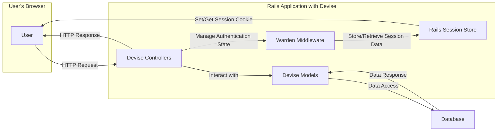
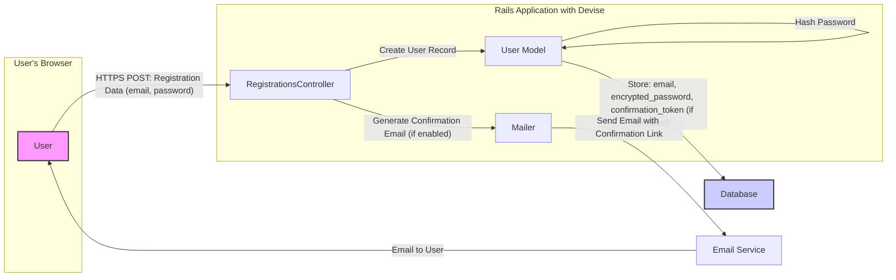
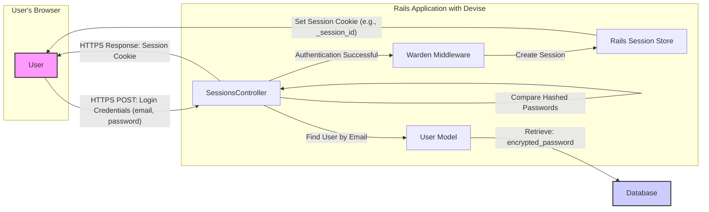
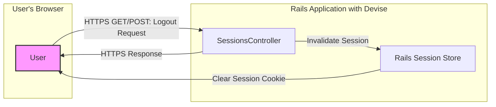
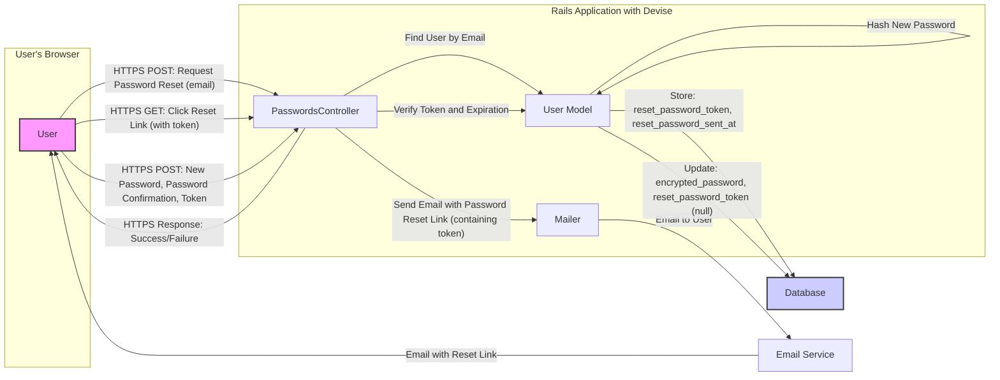

## Project Design Document: Devise Authentication Library (Improved)

**1. Introduction**

This document provides an enhanced design overview of the Devise authentication library for Ruby on Rails applications, specifically tailored for threat modeling. It details the key components, data flows, and functionalities of Devise, with a strong emphasis on security-relevant aspects. This document aims to provide a solid foundation for identifying potential threats and vulnerabilities within systems utilizing Devise.

**2. Goals and Objectives**

Devise's primary goal is to offer a robust and adaptable authentication solution for Rails applications. Its key objectives include:

*   Providing modular and configurable authentication features.
*   Simplifying the integration of authentication into Rails applications.
*   Establishing a secure and reliable framework for user management.
*   Offering extensibility and customization options to accommodate diverse application requirements.

**3. High-Level Architecture**

Devise operates as an integral part of a Rails application, leveraging its Model-View-Controller (MVC) structure. The following diagram illustrates the high-level interactions between key entities involved in the authentication process.

*   **User:** The individual interacting with the application through a web browser.
*   **Devise Controllers:** Rails controllers provided by Devise (e.g., `SessionsController`, `RegistrationsController`) that handle authentication-related requests.
*   **Devise Models:** The `User` model (or a similar model configured with Devise modules) containing user data and authentication attributes.
*   **Warden Middleware:** The underlying authentication framework used by Devise, responsible for managing authentication strategies and user sessions.
*   **Rails Session Store:** The mechanism used by the Rails application to store session data (e.g., cookies, database sessions).
*   **Database:** The persistent storage for user credentials and other relevant data.

**4. Component Details**

Devise's functionality is organized into a set of modules that can be included in a user model to enable specific authentication features.

*   **Models:**
    *   **User Model:** The central model representing a user. It incorporates Devise modules to provide authentication capabilities. Key attributes with security relevance include:
        *   `email`: User's email address (used for identification and communication).
        *   `encrypted_password`:  A securely hashed representation of the user's password.
        *   `reset_password_token`, `reset_password_sent_at`: Used for the password reset process.
        *   `remember_created_at`, `remember_token`:  Used for the "remember me" functionality.
        *   `confirmation_token`, `confirmed_at`, `confirmation_sent_at`: Used for email confirmation.
        *   `unlock_token`, `locked_at`, `failed_attempts`: Used for account locking after multiple failed login attempts.
        *   `authentication_token`:  Used for token-based authentication (e.g., for APIs).

*   **Controllers:**
    *   **SessionsController:** Handles user login (creation of a session) and logout (destruction of a session).
    *   **RegistrationsController:** Manages user sign-up, account updates, and account deletion.
    *   **PasswordsController:**  Handles requests for password resets and the process of updating a user's password.
    *   **ConfirmationsController:** Manages the email confirmation process for new accounts.
    *   **UnlocksController:** Handles the process of unlocking accounts that have been locked due to too many failed login attempts.

*   **Views:**
    *   Devise provides default views for authentication-related actions (login forms, registration forms, etc.). These views are often customized by application developers.

*   **Routes:**
    *   Devise automatically generates a set of routes that map URLs to the appropriate controller actions for authentication.

*   **Middleware:**
    *   **Warden::Manager:** The core middleware responsible for managing authentication strategies. It intercepts requests and determines if a user is authenticated.
    *   **Session Management Middleware:**  Handles the creation, storage, and retrieval of user session data, typically using cookies.

*   **Mailers:**
    *   Devise utilizes Rails mailers to send emails for various authentication-related events, such as password reset instructions, account confirmation links, and unlock instructions.

**5. Data Flow (Detailed)**

The following diagrams illustrate the data flow for key authentication scenarios, highlighting security-relevant data exchanges.

*   **User Registration Flow:**

*   **User Login Flow:**

*   **User Logout Flow:**

*   **Password Reset Flow:**

**6. Security Considerations (Detailed)**

Based on the architecture and data flow, the following security considerations are crucial for threat modeling:

*   **Password Storage:**
    *   **Threat:** Weak or outdated hashing algorithms could be vulnerable to brute-force or rainbow table attacks. Insufficient salt or iteration count weakens the hashing process.
    *   **Mitigation:** Devise uses bcrypt by default, which is a strong hashing algorithm. Ensure the cost factor (number of iterations) is set appropriately high.

*   **Session Management:**
    *   **Threat:** Session fixation, session hijacking (via XSS or network sniffing), and predictable session IDs can lead to unauthorized access.
    *   **Mitigation:** Devise relies on Rails' session management. Ensure secure cookies (`HttpOnly`, `Secure`) are used. Regenerate session IDs upon login to prevent fixation. Consider using a secure session store (e.g., database-backed).

*   **Password Reset Flow:**
    *   **Threat:**  Predictable or reusable reset tokens, lack of token expiration, and insecure token transmission can lead to account takeover.
    *   **Mitigation:** Devise generates unique, non-predictable reset tokens with a limited lifespan. Ensure HTTPS is used for all communication. Consider implementing rate limiting to prevent abuse.

*   **Account Confirmation:**
    *   **Threat:**  Bypassing the confirmation process can allow malicious users to create unauthorized accounts.
    *   **Mitigation:** Ensure the confirmation token is unique and securely generated. Require confirmation before granting full access to the application.

*   **Remember Me Functionality:**
    *   **Threat:**  If "remember me" tokens are not securely stored or managed, they can be stolen and used for persistent unauthorized access.
    *   **Mitigation:** Devise uses a "remember me" token that is stored in the database. Consider using a more robust approach like "remember me" with token invalidation on password change or other security-sensitive actions.

*   **Lockable Accounts:**
    *   **Threat:**  Insufficient lockout thresholds can lead to denial-of-service by locking out legitimate users. Conversely, too high a threshold increases the risk of brute-force attacks.
    *   **Mitigation:** Configure appropriate lockout thresholds and unlock strategies (e.g., email-based unlock).

*   **Authentication Tokens (for APIs):**
    *   **Threat:**  Insecure generation, storage, or transmission of API tokens can lead to unauthorized API access.
    *   **Mitigation:** Use strong, randomly generated tokens. Transmit tokens over HTTPS. Consider using short-lived tokens and refresh mechanisms.

*   **Cross-Site Scripting (XSS):**
    *   **Threat:**  If user input is not properly sanitized or output is not escaped in Devise's views or custom views interacting with Devise, it can lead to XSS attacks.
    *   **Mitigation:** Follow secure coding practices for input validation and output encoding. Leverage Rails' built-in XSS protection mechanisms.

*   **Cross-Site Request Forgery (CSRF):**
    *   **Threat:**  Attackers can trick authenticated users into performing unintended actions.
    *   **Mitigation:** Rails provides built-in CSRF protection. Ensure it is enabled and configured correctly. Devise's forms should include CSRF tokens.

*   **Information Disclosure:**
    *   **Threat:**  Error messages or debugging information might reveal sensitive details about the authentication process or user data.
    *   **Mitigation:**  Avoid displaying overly detailed error messages to users. Ensure sensitive information is not logged or exposed in development environments.

*   **Brute-Force Attacks:**
    *   **Threat:** Attackers can attempt to guess user passwords through repeated login attempts.
    *   **Mitigation:** Implement rate limiting on login and password reset endpoints. Utilize account lockout mechanisms. Consider using CAPTCHA for high-risk actions.

**7. Assumptions and Constraints**

*   The underlying Rails application framework and its dependencies are assumed to be reasonably secure and kept up-to-date with security patches.
*   This design document primarily focuses on the core authentication functionalities provided directly by Devise. Customizations and extensions implemented within the application may introduce additional security considerations not explicitly covered here.
*   It is assumed that secure communication protocols (HTTPS) are enforced for all sensitive interactions, including login, registration, password reset, and any API communication.
*   The database used for storing user credentials is assumed to be adequately secured with appropriate access controls and encryption at rest.

**8. Further Steps**

This enhanced design document provides a more detailed foundation for threat modeling Devise. The subsequent steps involve:

*   Conducting a structured threat modeling exercise (e.g., using the STRIDE model) based on the components and data flows outlined in this document.
*   Identifying specific threats and vulnerabilities related to each component and interaction.
*   Analyzing the likelihood and potential impact of the identified threats.
*   Developing and implementing appropriate mitigation strategies and security controls to address the identified risks.
*   Regularly reviewing and updating the threat model and security controls as the application and its dependencies evolve.