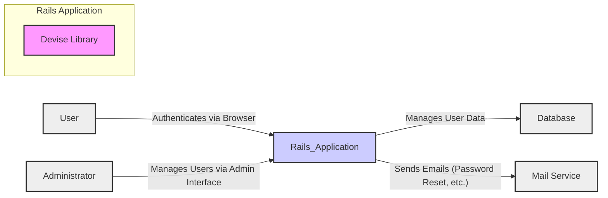
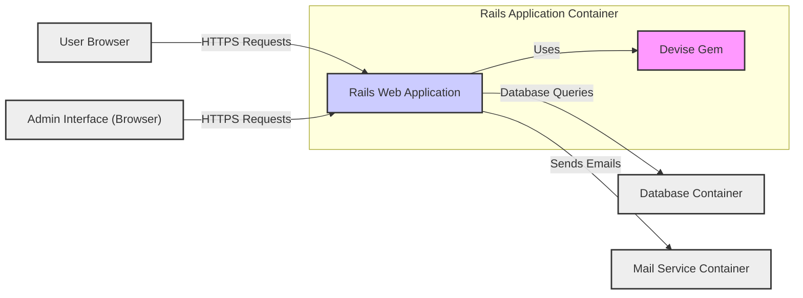
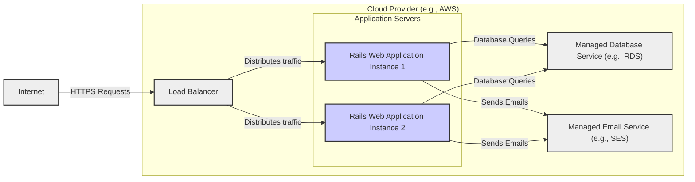

# BUSINESS POSTURE

Devise is a flexible authentication solution for Rails applications based on Warden. It provides a complete MVC solution based on Rails engines. It is designed to be a complete authentication framework, offering features like user registration, login, password recovery, and session management.

Business priorities and goals for using Devise in a project are typically focused on:
- Securely managing user authentication and authorization.
- Reducing development time and effort for implementing authentication features.
- Providing a robust and well-tested authentication solution.
- Enabling user self-service features like registration and password management.
- Complying with security best practices for user authentication.

Most important business risks related to authentication and authorization that need to be addressed:
- Account Takeover: Unauthorized access to user accounts leading to data breaches, financial loss, or reputational damage.
- Data Breach: Exposure of sensitive user data, including credentials, due to vulnerabilities in authentication or session management.
- Service Disruption: Denial of service attacks targeting authentication endpoints, preventing legitimate users from accessing the application.
- Compliance Violations: Failure to meet regulatory requirements related to data protection and user authentication (e.g., GDPR, HIPAA).
- Reputational Damage: Loss of user trust and negative publicity resulting from security incidents related to authentication.

# SECURITY POSTURE

Existing security controls for projects using Devise:
- security control: Password hashing using bcrypt (Devise default). Implemented within Devise library.
- security control: Session management to maintain user login state. Implemented within Devise library and Rails framework.
- security control: Protection against common web attacks like CSRF (Cross-Site Request Forgery) through Rails framework. Implemented within Rails framework.
- security control: Input validation on user credentials and registration data. Implemented within application code using Devise helpers and Rails validations.
- security control: Protection against mass assignment vulnerabilities through Rails strong parameters. Implemented within application code using Rails strong parameters.

Accepted risks for projects using Devise:
- accepted risk: Vulnerabilities in underlying dependencies of Devise and Rails.
- accepted risk: Misconfiguration of Devise or Rails leading to security weaknesses.
- accepted risk: Implementation flaws in custom code extending or integrating with Devise.
- accepted risk: Brute-force attacks against login endpoints (mitigated by rate limiting, CAPTCHA, etc. - not default in Devise).
- accepted risk: Phishing attacks targeting user credentials (user education and multi-factor authentication are mitigations).

Recommended security controls to implement:
- security control: Implement rate limiting on login and registration endpoints to mitigate brute-force attacks. Can be implemented using rack-attack or similar middleware.
- security control: Enforce strong password policies and password complexity requirements. Can be implemented using Devise configurations and custom validations.
- security control: Implement multi-factor authentication (MFA) for enhanced account security. Can be implemented using Devise and gems like devise-two-factor.
- security control: Regularly update Devise and Rails to the latest versions to patch known vulnerabilities. Implemented through dependency management practices.
- security control: Conduct security code reviews and penetration testing to identify and address potential security flaws in the application and Devise integration. Implemented as part of Secure Software Development Lifecycle.
- security control: Implement security headers (e.g., Content-Security-Policy, Strict-Transport-Security, X-Frame-Options) to protect against common web attacks. Implemented in web server configuration or Rails middleware.
- security control: Use HTTPS for all communication to protect data in transit. Implemented in web server and infrastructure configuration.

Security requirements for projects using Devise:
- Authentication:
    - security requirement: Securely authenticate users using username/email and password.
    - security requirement: Support for password recovery and reset mechanisms.
    - security requirement: Optional support for multi-factor authentication.
    - security requirement: Protection against brute-force attacks on authentication endpoints.
    - security requirement: Secure session management to maintain authenticated state.
- Authorization:
    - security requirement: Integrate with application authorization logic to control access to resources based on user roles or permissions. Devise provides user roles management, but application needs to implement authorization logic.
    - security requirement: Prevent unauthorized access to administrative functions.
- Input Validation:
    - security requirement: Validate all user inputs, especially during registration and login, to prevent injection attacks and data integrity issues.
    - security requirement: Sanitize user inputs before displaying them to prevent cross-site scripting (XSS) attacks.
- Cryptography:
    - security requirement: Use strong cryptographic algorithms for password hashing (bcrypt is default in Devise).
    - security requirement: Securely store and manage cryptographic keys if used for features like remember-me tokens or encryption of sensitive data.
    - security requirement: Use HTTPS to encrypt all communication between the client and server.

# DESIGN

## C4 CONTEXT

Context Diagram Elements:

- Element:
    - Name: User
    - Type: Person
    - Description: End-user of the Rails application who needs to authenticate to access protected resources.
    - Responsibilities: Authenticates to access the application, manages their profile information, and interacts with application features.
    - Security controls: Strong password management, multi-factor authentication (optional), awareness of phishing attacks.

- Element:
    - Name: Rails Application
    - Type: Software System
    - Description: The web application built using the Rails framework that utilizes Devise for authentication and authorization.
    - Responsibilities: Provides application functionality, handles user requests, manages user sessions, integrates with Devise for authentication, interacts with the database and mail service.
    - Security controls: Input validation, output encoding, session management, authorization checks, vulnerability scanning, security headers, HTTPS.

- Element:
    - Name: Devise Library
    - Type: Software System (External Library)
    - Description: Ruby gem that provides authentication and authorization functionality for the Rails application.
    - Responsibilities: Handles user registration, login, password recovery, session management, and other authentication-related tasks.
    - Security controls: Password hashing, secure session management, protection against common authentication vulnerabilities, regular security updates.

- Element:
    - Name: Database
    - Type: Data Store
    - Description: Persistent storage for user data, including credentials, profile information, and application data.
    - Responsibilities: Stores and retrieves user data, ensures data integrity and availability.
    - Security controls: Access control, encryption at rest (optional), regular backups, database hardening, vulnerability scanning.

- Element:
    - Name: Mail Service
    - Type: External System
    - Description: Service used to send emails, such as password reset instructions and registration confirmations.
    - Responsibilities: Delivers emails reliably.
    - Security controls: Secure SMTP configuration, SPF/DKIM/DMARC records to prevent email spoofing, rate limiting to prevent abuse.

- Element:
    - Name: Administrator
    - Type: Person
    - Description: User with administrative privileges who manages users and application settings.
    - Responsibilities: Manages user accounts, configures application settings, monitors system health.
    - Security controls: Strong authentication (MFA), role-based access control, audit logging, principle of least privilege.

## C4 CONTAINER

Container Diagram Elements:

- Element:
    - Name: Rails Web Application
    - Type: Web Application
    - Description: The main application server built with Ruby on Rails, responsible for handling user requests, business logic, and rendering web pages. It integrates the Devise gem for authentication.
    - Responsibilities: Handles HTTP requests, manages user sessions, implements application logic, integrates with Devise for authentication and authorization, interacts with the database and mail service.
    - Security controls: Input validation, output encoding, session management, authorization checks, vulnerability scanning, security headers, HTTPS, web application firewall (WAF - optional).

- Element:
    - Name: Devise Gem
    - Type: Library
    - Description: Ruby gem integrated into the Rails application, providing authentication and authorization functionalities.
    - Responsibilities: Handles user registration, login, password recovery, session management, and other authentication-related tasks within the Rails application.
    - Security controls: Password hashing, secure session management, protection against common authentication vulnerabilities, regular security updates, code reviews.

- Element:
    - Name: Database Container
    - Type: Database
    - Description: Containerized database system (e.g., PostgreSQL, MySQL) used to store application data, including user credentials and profile information.
    - Responsibilities: Persistent storage of application data, data integrity, data availability, and query processing.
    - Security controls: Database access control, database hardening, encryption at rest (optional), regular backups, vulnerability scanning, database firewall (optional).

- Element:
    - Name: Mail Service Container
    - Type: Mail Server
    - Description: Containerized mail server or integration with a cloud-based email service used for sending application emails.
    - Responsibilities: Sending emails reliably, managing email queues.
    - Security controls: Secure SMTP configuration, SPF/DKIM/DMARC records, rate limiting, monitoring of email sending activity.

- Element:
    - Name: User Browser
    - Type: Client Application
    - Description: Web browser used by users to access the Rails application.
    - Responsibilities: Rendering web pages, sending HTTP requests, managing cookies and local storage.
    - Security controls: Browser security features (e.g., Content Security Policy enforcement), user awareness of phishing and malware.

- Element:
    - Name: Admin Interface (Browser)
    - Type: Client Application
    - Description: Web browser used by administrators to access the administrative interface of the Rails application.
    - Responsibilities: Rendering admin interface, sending HTTP requests for administrative tasks.
    - Security controls: Browser security features, strong authentication for administrators (MFA), access control to admin interface.

## DEPLOYMENT

Deployment Architecture: Cloud Platform (e.g., AWS, Google Cloud, Azure)

Deployment Diagram Elements:

- Element:
    - Name: Load Balancer
    - Type: Infrastructure Component
    - Description: Distributes incoming HTTPS traffic across multiple application server instances for high availability and scalability.
    - Responsibilities: Traffic distribution, SSL termination, health checks for application instances.
    - Security controls: DDoS protection, SSL/TLS configuration, access control lists, security monitoring.

- Element:
    - Name: Rails Web Application Instance 1 & 2
    - Type: Compute Instance (e.g., EC2, Compute Engine)
    - Description: Virtual machines or containers running the Rails web application with Devise. Multiple instances for redundancy and scalability.
    - Responsibilities: Running the Rails application, handling user requests, executing application logic, interacting with the database and mail service.
    - Security controls: Operating system hardening, application security configuration, security patching, intrusion detection system (IDS - optional), regular security audits.

- Element:
    - Name: Managed Database Service (e.g., RDS)
    - Type: Managed Service
    - Description: Cloud provider's managed database service (e.g., AWS RDS, Google Cloud SQL, Azure Database for PostgreSQL) providing a scalable and reliable database.
    - Responsibilities: Database management, backups, high availability, scalability, security patching.
    - Security controls: Access control, encryption at rest, encryption in transit, regular backups, vulnerability scanning, security monitoring provided by the cloud provider.

- Element:
    - Name: Managed Email Service (e.g., SES)
    - Type: Managed Service
    - Description: Cloud provider's managed email service (e.g., AWS SES, Google Cloud SendGrid, Azure Communication Services) for sending emails.
    - Responsibilities: Email delivery, email sending infrastructure management, scalability.
    - Security controls: Secure SMTP configuration, SPF/DKIM/DMARC management, rate limiting, monitoring provided by the cloud provider.

- Element:
    - Name: Internet
    - Type: Network
    - Description: Public network through which users access the application.
    - Responsibilities: Connectivity for users to access the application.
    - Security controls: N/A - external network, focus on securing application and infrastructure exposed to the internet.

## BUILD

```mermaid
flowchart LR
    Developer["Developer"] -- "Code Changes, Gem Updates" --> CodeRepository["Code Repository (e.g., GitHub)"]
    CodeRepository -- "Webhook, Scheduled Trigger" --> CI_CD_Pipeline["CI/CD Pipeline (e.g., GitHub Actions)"]
    subgraph CI_CD_Pipeline
        direction TB
        BuildStage["Build Stage"]
        TestStage["Test Stage (Unit, Integration, Security Scans)"]
        PublishStage["Publish Stage (Package Gem)"]
        BuildStage -- "Runs Tests, Linters, SAST" --> TestStage
        TestStage -- "Builds Gem Package" --> PublishStage
    end
    PublishStage -- "Publishes Gem" --> PackageRegistry["Package Registry (e.g., RubyGems.org)"]
    PackageRegistry -- "Gem Download" --> RailsWebAppDeployment["Rails Web Application Deployment"]

    style Developer fill:#eee,stroke:#333,stroke-width:2px
    style CodeRepository fill:#eee,stroke:#333,stroke-width:2px
    style CI_CD_Pipeline fill:#ccf,stroke:#333,stroke-width:2px
    style BuildStage fill:#eee,stroke:#333,stroke-width:2px
    style TestStage fill:#eee,stroke:#333,stroke-width:2px
    style PublishStage fill:#eee,stroke:#333,stroke-width:2px
    style PackageRegistry fill:#eee,stroke:#333,stroke-width:2px
    style RailsWebAppDeployment fill:#eee,stroke:#333,stroke-width:2px
```

Build Process Description:

The build process for Devise, as a Ruby gem, typically involves the following steps, focusing on security controls:

1. Developer makes code changes or updates dependencies and commits them to the Code Repository (e.g., GitHub).
2. A CI/CD pipeline is triggered automatically on code changes (e.g., via webhook) or on a schedule.
3. **Build Stage**:
    - Fetches code from the repository.
    - Installs dependencies.
    - Runs linters and code formatters to enforce code quality and consistency.
    - Performs Static Application Security Testing (SAST) scans to identify potential security vulnerabilities in the code. Tools like Brakeman for Ruby on Rails applications can be used.
    - Runs unit tests to ensure code functionality and prevent regressions.
4. **Test Stage**:
    - Runs integration tests to verify interactions between different components.
    - May include dependency scanning to identify known vulnerabilities in dependencies. Tools like Bundler Audit or Dependabot can be used.
    - May include more comprehensive security testing, depending on the project's security posture.
5. **Publish Stage**:
    - If all tests and security checks pass, the pipeline proceeds to the publish stage.
    - Builds the gem package.
    - Signs the gem package with a private key for authenticity and integrity (if configured).
    - Publishes the gem package to a Package Registry (e.g., RubyGems.org). Secure credentials management for publishing is crucial.
6. **Rails Web Application Deployment**:
    - When a Rails application includes Devise as a dependency, it downloads the gem from the Package Registry during the application's build or deployment process.

Build Diagram Elements:

- Element:
    - Name: Developer
    - Type: Person
    - Description: Software developer contributing to the Devise project.
    - Responsibilities: Writing code, fixing bugs, adding features, updating dependencies, committing code changes.
    - Security controls: Secure development practices, code reviews, awareness of secure coding principles.

- Element:
    - Name: Code Repository (e.g., GitHub)
    - Type: Software System
    - Description: Version control system used to store and manage the Devise source code.
    - Responsibilities: Source code management, version control, collaboration, access control.
    - Security controls: Access control, branch protection, audit logging, vulnerability scanning of repository infrastructure.

- Element:
    - Name: CI/CD Pipeline (e.g., GitHub Actions)
    - Type: Automation System
    - Description: Automated pipeline for building, testing, and publishing the Devise gem.
    - Responsibilities: Automating build, test, and publish processes, running security checks, ensuring code quality.
    - Security controls: Secure pipeline configuration, access control to pipeline configuration and secrets, vulnerability scanning of pipeline infrastructure, audit logging.

- Element:
    - Name: Build Stage
    - Type: Pipeline Stage
    - Description: Stage in the CI/CD pipeline responsible for compiling code, running linters, SAST scans, and unit tests.
    - Responsibilities: Code compilation (if needed), code quality checks, static security analysis, unit testing.
    - Security controls: SAST tools, linters, secure build environment, dependency management.

- Element:
    - Name: Test Stage
    - Type: Pipeline Stage
    - Description: Stage in the CI/CD pipeline responsible for running integration tests and dependency vulnerability scans.
    - Responsibilities: Integration testing, dependency security scanning.
    - Security controls: Dependency scanning tools, secure test environment.

- Element:
    - Name: Publish Stage
    - Type: Pipeline Stage
    - Description: Stage in the CI/CD pipeline responsible for packaging and publishing the gem to the package registry.
    - Responsibilities: Gem packaging, signing, publishing to package registry.
    - Security controls: Secure credentials management for package registry, gem signing, access control to publish stage.

- Element:
    - Name: Package Registry (e.g., RubyGems.org)
    - Type: Software System
    - Description: Public or private registry for hosting and distributing Ruby gems.
    - Responsibilities: Gem hosting, distribution, version management.
    - Security controls: Access control, vulnerability scanning of registry infrastructure, malware scanning of uploaded packages, integrity checks.

- Element:
    - Name: Rails Web Application Deployment
    - Type: Process
    - Description: Deployment process of a Rails application that uses Devise, including downloading Devise gem from the package registry.
    - Responsibilities: Application deployment, dependency management.
    - Security controls: Secure dependency management practices, vulnerability scanning of dependencies in deployed application.

# RISK ASSESSMENT

Critical business processes protected by Devise:
- User Authentication: Verifying the identity of users attempting to access the application.
- User Authorization: Controlling access to resources and functionalities based on user roles and permissions.
- Account Management: Securely managing user accounts, including registration, password management, and profile updates.
- Session Management: Maintaining user login sessions securely and preventing unauthorized access.

Data we are trying to protect and their sensitivity:
- User Credentials (passwords): Highly sensitive. Must be securely hashed and protected from unauthorized access and disclosure.
- User Profile Information (email, username, etc.): Sensitive. Should be protected from unauthorized access and modification.
- Session Data: Sensitive. Contains information about authenticated user sessions and should be protected from hijacking and tampering.
- Personally Identifiable Information (PII): Sensitivity depends on the specific application and user data collected. Devise itself might handle PII depending on configured user attributes. Should be protected according to privacy regulations.

# QUESTIONS & ASSUMPTIONS

Questions:
- What is the specific application that will be using Devise? Understanding the application context will help tailor security requirements and design considerations.
- What are the specific regulatory compliance requirements for the application (e.g., GDPR, HIPAA, PCI DSS)?
- What is the risk appetite of the organization using Devise? This will influence the level of security controls to be implemented.
- Are there any specific security concerns or threats that are particularly relevant to the application or industry?
- What is the expected user base and usage patterns of the application? This can impact scalability and performance requirements, as well as security considerations like rate limiting.

Assumptions:
- Devise is being used in a typical web application context for user authentication and authorization.
- The application is being deployed in a cloud environment for scalability and availability.
- Standard security best practices for web applications are applicable.
- The organization using Devise is concerned about protecting user data and preventing unauthorized access.
- The latest stable version of Devise and Rails are being used or will be used.