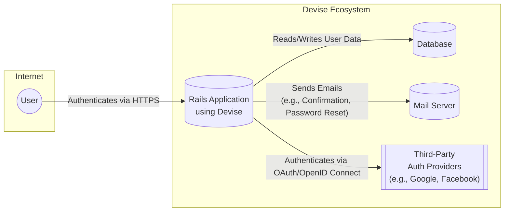
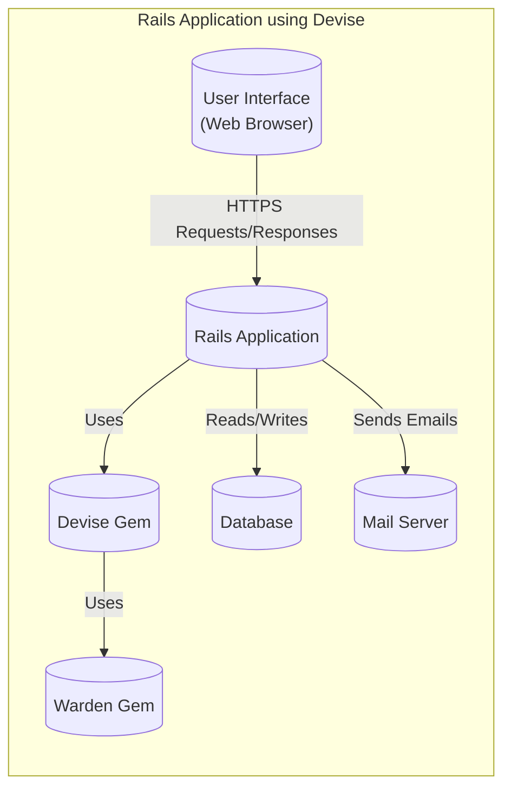
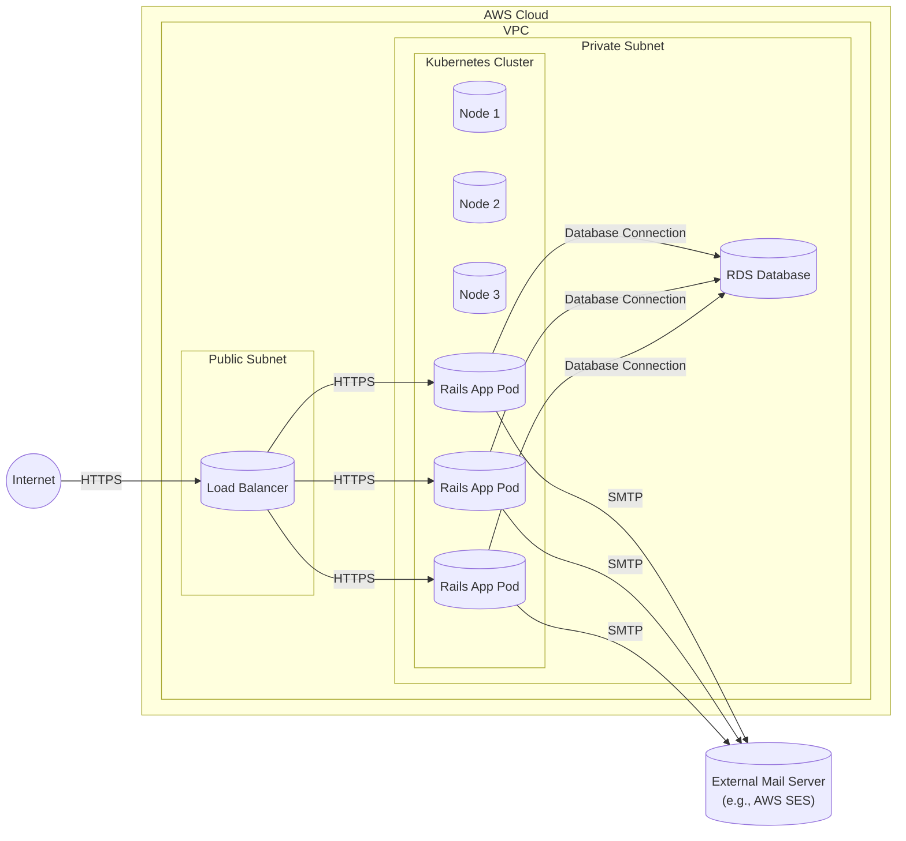
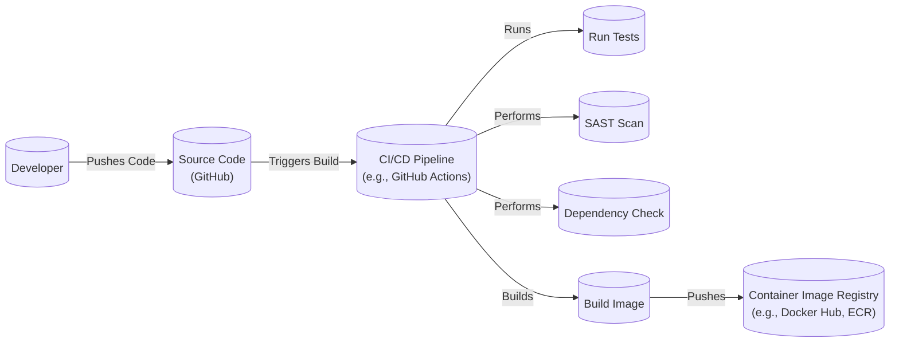

Okay, let's create a design document for the Devise project, focusing on aspects relevant for threat modeling.

# BUSINESS POSTURE

Devise is a flexible authentication solution for Rails based on Warden. It's a very popular gem, widely used in the Ruby on Rails community.  The primary business goal is to provide a simple, robust, and configurable authentication mechanism for Rails applications, reducing the development time and effort required to implement secure user authentication.

Business Priorities:

*   Ease of Use:  Devise should be easy to integrate and configure within a Rails application.
*   Flexibility:  It should support various authentication strategies and customization options to meet diverse application needs.
*   Security:  It must provide secure authentication mechanisms, protecting user credentials and preventing unauthorized access.
*   Maintainability:  The codebase should be well-maintained, with regular updates and security patches.
*   Community Support:  A strong community and readily available documentation are crucial for widespread adoption and user support.

Business Risks:

*   Compromised User Accounts:  Vulnerabilities in Devise could lead to unauthorized access to user accounts and sensitive data within applications that rely on it.
*   Reputational Damage:  Security breaches related to Devise would damage the reputation of the project and potentially the applications using it.
*   Integration Issues:  Difficulties in integrating or configuring Devise could lead to developer frustration and insecure implementations.
*   Lack of Updates:  Failure to address security vulnerabilities promptly could leave applications exposed to attacks.
*   Dependency Vulnerabilities: Vulnerabilities in dependencies used by Devise could be exploited.

# SECURITY POSTURE

Existing Security Controls:

*   security control: Password Hashing (bcrypt): Devise uses bcrypt to hash passwords, providing strong protection against brute-force attacks. Implemented in the `devise` gem, specifically within the password handling modules.
*   security control: Password Salting: Devise salts passwords before hashing, further enhancing security. Implemented in conjunction with bcrypt in the `devise` gem.
*   security control: Token Authentication: Supports token-based authentication for APIs. Implemented through modules like `devise_token_auth` (though this is a separate, related gem).
*   security control: Session Management: Devise manages user sessions, typically using cookies. Implemented using Warden and Rails session management.
*   security control: Confirmation Emails: Supports email confirmation to verify user email addresses. Implemented through the `Confirmable` module.
*   security control: Lockable Accounts:  Provides a mechanism to lock accounts after multiple failed login attempts. Implemented through the `Lockable` module.
*   security control: Recoverable Passwords: Allows users to reset their passwords via email. Implemented through the `Recoverable` module.
*   security control: Rememberable Functionality:  Provides "remember me" functionality for persistent sessions. Implemented through the `Rememberable` module.
*   security control: Trackable Functionality: Tracks sign-in count, timestamps, and IP addresses. Implemented through the `Trackable` module.
*   security control: Timeoutable Functionality: Automatically times out sessions after a period of inactivity. Implemented through the `Timeoutable` module.
*   security control: Omniauth Integration: Supports integration with various Omniauth providers for third-party authentication. Implemented through the `Omniauthable` module and separate Omniauth gems.
*   security control: Regular Security Audits: While not explicitly stated in the repository, it's highly likely that the Devise team and community perform regular security reviews and audits.
*   security control: Secure Defaults: Devise encourages secure defaults, such as strong password requirements (though these are often configured by the application).

Accepted Risks:

*   accepted risk:  Configuration Errors: Devise is highly configurable, and incorrect configuration by developers can introduce security vulnerabilities.
*   accepted risk:  Dependency Vulnerabilities: Devise relies on other gems (like Warden and bcrypt), and vulnerabilities in these dependencies could impact Devise's security.
*   accepted risk:  Application-Level Vulnerabilities: Devise provides authentication, but the overall security of the application also depends on the application's code and how it handles authorization and data protection.
*   accepted risk:  Outdated Versions: Users who don't keep Devise updated to the latest version may be vulnerable to known exploits.

Recommended Security Controls:

*   security control:  Two-Factor Authentication (2FA): While some extensions exist, native, built-in 2FA support would significantly enhance security.
*   security control:  Rate Limiting: Implement stricter rate limiting on login attempts, password resets, and other sensitive actions to mitigate brute-force and denial-of-service attacks. This should be configurable at the application level.
*   security control:  Input Validation: While Devise handles some input validation, explicitly document and enforce strong input validation for all user-provided data (email addresses, usernames, etc.) to prevent injection attacks.
*   security control:  Content Security Policy (CSP): Provide guidance and examples for implementing CSP in applications using Devise to mitigate XSS attacks.
*   security control:  Automated Security Testing: Integrate automated security testing tools (SAST, DAST) into the CI/CD pipeline to identify vulnerabilities early.

Security Requirements:

*   Authentication:
    *   All users must be authenticated before accessing protected resources.
    *   Support for strong password policies (configurable by the application).
    *   Secure password storage using bcrypt with salting.
    *   Protection against brute-force attacks (account lockout, rate limiting).
    *   Secure session management with appropriate timeouts.
    *   Option for email confirmation.
    *   Option for password recovery.
    *   Option for "remember me" functionality.

*   Authorization:
    *   Devise itself primarily handles authentication. Authorization is typically handled by the application (often using gems like Pundit or CanCanCan).  However, Devise should provide clear guidance on integrating with authorization frameworks.

*   Input Validation:
    *   All user-provided input (email, password, etc.) must be validated to prevent injection attacks.
    *   Email addresses should be validated for correct format.

*   Cryptography:
    *   Use of strong, industry-standard cryptographic algorithms (bcrypt for password hashing).
    *   Secure generation and storage of random tokens (for password resets, confirmations, etc.).

# DESIGN

## C4 CONTEXT

Element Descriptions:

*   Element:
    *   Name: User
    *   Type: Person
    *   Description: A person who interacts with the Rails application to access protected resources.
    *   Responsibilities: Provides credentials, interacts with the application's interface.
    *   Security controls: Strong passwords, potentially 2FA (if implemented).

*   Element:
    *   Name: Rails Application using Devise
    *   Type: Software System
    *   Description: A web application built using Ruby on Rails that utilizes Devise for authentication.
    *   Responsibilities: Handles user authentication, manages user sessions, provides access to protected resources.
    *   Security controls: Devise's built-in security features (password hashing, salting, etc.), application-level security controls (authorization, input validation, etc.).

*   Element:
    *   Name: Database
    *   Type: Data Store
    *   Description: Stores user data, including credentials (hashed and salted), session information, and other application data.
    *   Responsibilities: Persistently stores data, provides data retrieval and modification capabilities.
    *   Security controls: Database access controls, encryption at rest (if applicable), regular backups.

*   Element:
    *   Name: Mail Server
    *   Type: Software System
    *   Description: Sends emails on behalf of the Rails application, such as confirmation emails and password reset instructions.
    *   Responsibilities: Delivers emails to users.
    *   Security controls: Secure SMTP configuration, protection against spam and phishing.

*   Element:
    *   Name: Third-Party Auth Providers (e.g., Google, Facebook)
    *   Type: Software System
    *   Description: External authentication providers that the Rails application can integrate with using Omniauth.
    *   Responsibilities: Authenticates users using their existing accounts with these providers.
    *   Security controls: Relies on the security controls of the third-party providers.

## C4 CONTAINER

Element Descriptions:

*   Element:
    *   Name: User Interface (Web Browser)
    *   Type: Web Browser
    *   Description: The user's web browser, used to interact with the Rails application.
    *   Responsibilities: Renders the application's UI, sends requests to the server, receives responses.
    *   Security controls: Browser security settings, HTTPS.

*   Element:
    *   Name: Rails Application
    *   Type: Web Application
    *   Description: The core Rails application code, including controllers, models, views, and other application logic.
    *   Responsibilities: Handles user requests, interacts with Devise for authentication, interacts with the database, renders responses.
    *   Security controls: Application-level security controls (authorization, input validation, etc.).

*   Element:
    *   Name: Devise Gem
    *   Type: Library
    *   Description: The Devise gem, providing authentication functionality.
    *   Responsibilities: Provides authentication modules (Confirmable, Recoverable, Lockable, etc.), manages user sessions, handles password hashing.
    *   Security controls: Devise's built-in security features (password hashing, salting, etc.).

*   Element:
    *   Name: Warden Gem
    *   Type: Library
    *   Description: The Warden gem, a general authentication framework used by Devise.
    *   Responsibilities: Provides a low-level authentication framework.
    *   Security controls: Secure session management.

*   Element:
    *   Name: Database
    *   Type: Database
    *   Description: Stores user data and other application data.
    *   Responsibilities: Persistently stores data.
    *   Security controls: Database access controls, encryption at rest (if applicable).

*   Element:
    *   Name: Mail Server
    *   Type: Software System
    *   Description: Sends emails on behalf of the Rails application.
    *   Responsibilities: Delivers emails.
    *   Security controls: Secure SMTP configuration.

## DEPLOYMENT

Possible Deployment Solutions:

1.  Traditional Server Deployment (e.g., using Capistrano, Passenger, and Nginx/Apache).
2.  Containerized Deployment (e.g., using Docker, Kubernetes, and a cloud provider like AWS, GCP, or Azure).
3.  Platform-as-a-Service (PaaS) Deployment (e.g., using Heroku).

Chosen Solution: Containerized Deployment using Docker and Kubernetes on AWS.

Element Descriptions:

*   Element:
    *   Name: Internet
    *   Type: Network
    *   Description: The public internet.
    *   Responsibilities: Routes traffic to the load balancer.
    *   Security controls: Standard internet security protocols.

*   Element:
    *   Name: Load Balancer
    *   Type: Load Balancer
    *   Description: Distributes incoming traffic across multiple Rails application pods.
    *   Responsibilities: Load balancing, SSL termination.
    *   Security controls: SSL certificates, security groups.

*   Element:
    *   Name: Node 1, Node 2, Node 3
    *   Type: Virtual Machine
    *   Description: Kubernetes worker nodes, running the application pods.
    *   Responsibilities: Hosting application containers.
    *   Security controls: OS-level security hardening, network policies.

*   Element:
    *   Name: Pod 1, Pod 2, Pod 3
    *   Type: Container
    *   Description: Kubernetes pods, running instances of the Rails application container.
    *   Responsibilities: Running the Rails application.
    *   Security controls: Container image security, resource limits.

*   Element:
    *   Name: RDS Database
    *   Type: Database
    *   Description: Managed relational database service (e.g., PostgreSQL, MySQL).
    *   Responsibilities: Persistently stores application data.
    *   Security controls: Database access controls, encryption at rest, security groups.

*   Element:
    *   Name: External Mail Server (e.g., AWS SES)
    *   Type: Software System
    *   Description: Service for sending transactional emails.
    *   Responsibilities: Sending emails.
    *   Security controls: API keys, DKIM, SPF.

## BUILD

Build Process Description:

1.  Developer pushes code changes to the GitHub repository.
2.  This triggers the CI/CD pipeline (e.g., GitHub Actions).
3.  The pipeline runs automated tests (unit tests, integration tests).
4.  A Static Application Security Testing (SAST) scan is performed to identify potential vulnerabilities in the code.
5.  A dependency check is performed to identify known vulnerabilities in project dependencies.
6.  If all tests and scans pass, the pipeline builds a Docker image containing the Rails application and Devise.
7.  The Docker image is pushed to a container image registry (e.g., Docker Hub, Amazon ECR).

Security Controls:

*   security control:  Automated Tests: Unit and integration tests help ensure code quality and prevent regressions.
*   security control:  SAST Scanning: Identifies potential vulnerabilities in the application code.
*   security control:  Dependency Checking: Identifies known vulnerabilities in project dependencies.
*   security control:  Least Privilege: Build agents should have minimal permissions.
*   security control:  Signed Commits: Developers should sign their commits to ensure code integrity.
*   security control:  Image Scanning: Container images should be scanned for vulnerabilities before deployment.

# RISK ASSESSMENT

Critical Business Processes:

*   User Authentication: Ensuring only authorized users can access the application.
*   User Account Management: Allowing users to manage their accounts (profile, password changes, etc.).
*   Data Protection: Protecting sensitive user data stored within the application.

Data Sensitivity:

*   User Credentials (passwords - hashed): Highly sensitive.
*   Email Addresses: Personally Identifiable Information (PII), sensitive.
*   Session Tokens: Highly sensitive.
*   User Profile Data (depending on the application): Can range from low to high sensitivity.
*   Application-Specific Data: Varies greatly depending on the application's purpose.

# QUESTIONS & ASSUMPTIONS

Questions:

*   What specific compliance requirements (e.g., GDPR, HIPAA, PCI DSS) must applications using Devise adhere to? This will influence the necessary security controls.
*   What is the expected scale of applications using Devise (number of users, requests per second)? This will impact performance and scalability considerations.
*   What are the specific threat models for the types of applications that commonly use Devise? This will help prioritize security controls.
*   Are there any specific security concerns or past incidents related to Devise or similar authentication libraries?

Assumptions:

*   BUSINESS POSTURE: Assumes that the primary goal is to provide a secure and easy-to-use authentication solution for Rails applications.
*   SECURITY POSTURE: Assumes that developers using Devise will follow security best practices and properly configure the library. Assumes that the Devise team and community actively address security vulnerabilities.
*   DESIGN: Assumes a standard Rails application architecture with a relational database and a mail server. Assumes a containerized deployment using Docker and Kubernetes. Assumes the use of a CI/CD pipeline for building and deploying the application.