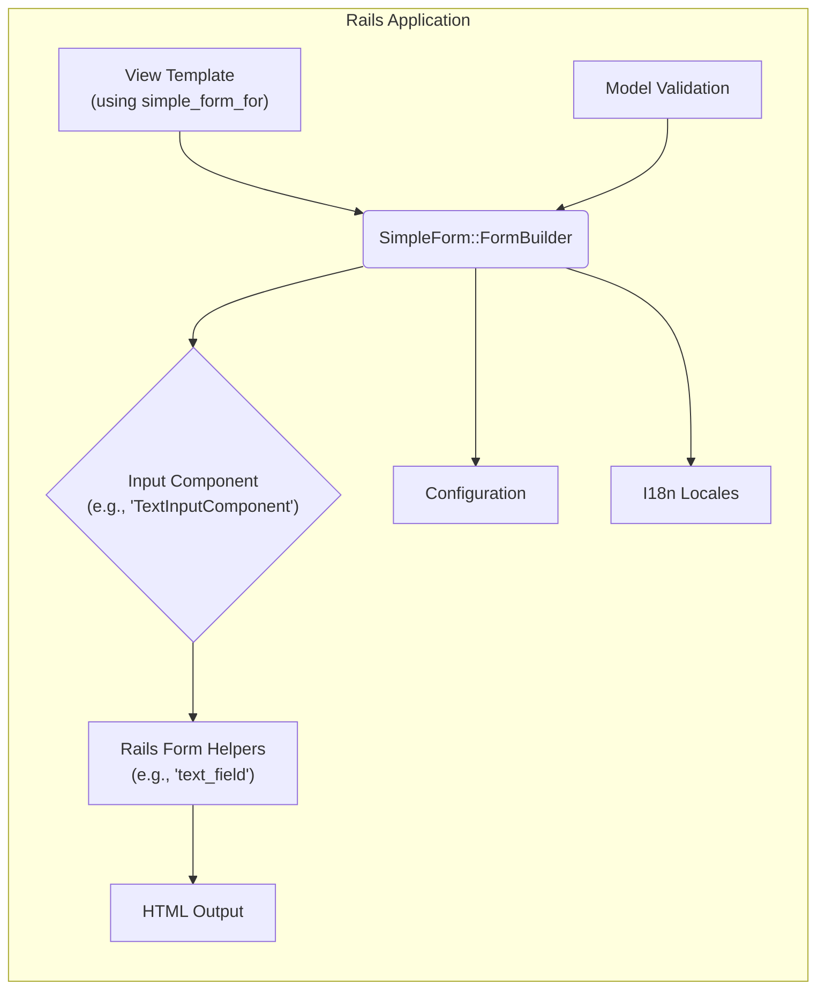
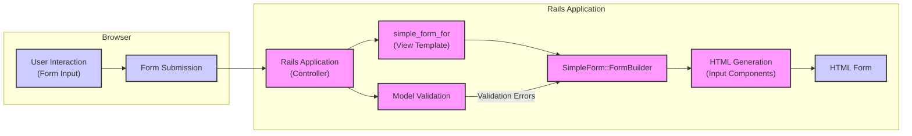

## Project Design Document: Simple Form Gem (Improved)

**1. Introduction**

This document provides an enhanced design overview of the `simple_form` Ruby gem (available at [https://github.com/heartcombo/simple_form](https://github.com/heartcombo/simple_form)). This detailed design serves as a crucial foundation for subsequent threat modeling activities. It comprehensively outlines the gem's purpose, architecture, data flow, and key components, with a particular focus on aspects relevant to security. This document is primarily intended for security engineers, developers, and anyone involved in assessing the security posture of applications utilizing `simple_form`.

**2. Project Overview**

`simple_form` is a widely adopted Ruby gem designed to streamline and standardize the creation of forms within Ruby on Rails applications. It offers a declarative Domain Specific Language (DSL) that simplifies the process of generating form inputs with consistent HTML markup, labels, associated hints, and error message displays. The core objective of `simple_form` is to minimize boilerplate code, enhance developer productivity, and promote a more maintainable and consistent approach to form development within the Rails ecosystem. It achieves this by building upon and extending Rails' existing form helpers and view rendering mechanisms.

**3. System Architecture**

The `simple_form` gem operates exclusively within the context of a Ruby on Rails application's view layer. It does not introduce any new server-side processes, external services, or database interactions. Its functionality is entirely contained within the Rails rendering pipeline.

*   **Core Components:**
    *   **`SimpleForm::FormBuilder`:** This is the central orchestrator of the gem's functionality. It extends Rails' native `ActionView::Helpers::FormBuilder`, providing the core DSL methods used within view templates to define form elements. It manages the configuration and rendering of individual input components.
    *   **Input Components (Wrappers, Labels, Inputs, Hints, Errors):**  `simple_form` employs a highly modular and configurable system of wrappers and individual components to structure the generated HTML output for each input field.
        *   **Wrappers:** Define the overall HTML structure surrounding an input, allowing for consistent layout and styling.
        *   **Labels:** Render the label associated with the input field, often leveraging Rails' internationalization (i18n) for localization.
        *   **Inputs:** Generate the actual HTML input element (e.g., `<input type="text">`, `<select>`). These often directly utilize Rails' form helpers.
        *   **Hints:** Display contextual help text associated with the input field.
        *   **Errors:** Render validation error messages associated with the input, typically retrieved from the model's validation results.
    *   **Configuration:**  `simple_form` offers extensive configuration options, enabling developers to customize various aspects of form rendering. This includes:
        *   Default wrappers and component order.
        *   HTML attributes applied to different elements.
        *   Error handling behavior and display.
        *   Mapping of input types to specific HTML elements.
        Configuration can be applied globally within the application or on a per-form basis.
    *   **Input Types:**  The gem provides built-in support for a wide range of standard HTML input types (e.g., text, password, email, select, radio buttons, checkboxes, date/time pickers). It also allows for the creation and integration of custom input types to handle specific application requirements.
    *   **Locales (Internationalization):**  `simple_form` seamlessly integrates with Rails' built-in i18n framework. This allows for the localization of labels, hints, and error messages, making applications accessible to a global audience.

*   **Interaction with Rails:**
    *   **View Templates:** Developers interact with `simple_form` primarily within Rails view templates using the `simple_form_for` helper method. This method instantiates a `SimpleForm::FormBuilder` object.
    *   **Form Helpers:**  Internally, `simple_form` leverages Rails' core form helpers (e.g., `text_field`, `select_tag`, `password_field`) to generate the fundamental HTML input elements. It acts as an abstraction layer on top of these helpers.
    *   **Model Validation:**  `simple_form` seamlessly integrates with Rails' Active Model validation framework. It automatically displays error messages associated with model attributes when validation fails.
    *   **Rendering Pipeline:**  `simple_form` operates within the standard Rails view rendering pipeline. It generates HTML that is then incorporated into the final response sent to the user's browser.

**4. Data Flow**

The data flow involving `simple_form` is primarily focused on the generation of HTML form elements for display to the user and the subsequent presentation of validation errors upon form submission.

*   **Form Rendering:**
    1. A Rails controller action prepares the necessary data for the view, including the model object (if any) that the form will be associated with.
    2. The relevant view template utilizes the `simple_form_for` helper, passing in the model object or a URL for a model-less form.
    3. The `simple_form_for` helper instantiates a `SimpleForm::FormBuilder` object.
    4. Within the view template, the developer uses the `FormBuilder`'s methods (e.g., `f.input :name`, `f.association :category`) to define individual form inputs.
    5. For each input, `SimpleForm::FormBuilder` determines the appropriate input component to use based on the input type, model attribute type, and configured wrappers.
    6. The selected input component leverages Rails' form helpers to generate the core HTML for the input element. It also renders associated labels, hints (using i18n), and error messages (if any, based on model validation).
    7. Configuration settings are applied at various stages to customize the HTML attributes, CSS classes, and overall structure of the form elements.
    8. Locale files are consulted to provide localized text for labels, hints, and error messages.
    9. The generated HTML form is then integrated into the overall view and sent to the user's browser.

*   **Form Submission and Validation Errors:**
    1. The user interacts with the rendered HTML form in their browser, entering data into the input fields.
    2. Upon form submission, the browser sends an HTTP request (typically POST or PUT) to the Rails application.
    3. The Rails controller receives the request and processes the submitted form data.
    4. Typically, the controller will attempt to create or update a model instance using the submitted data.
    5. Rails' Active Model validation framework is invoked to validate the data against the model's defined validation rules.
    6. If validation fails, the controller often re-renders the form view.
    7. When the view is re-rendered, `simple_form` again generates the form HTML. This time, however, the `FormBuilder` has access to the model's validation errors.
    8. For each input with a validation error, the corresponding error component within `simple_form` will render the appropriate error message, typically retrieved from the model's `errors` object and potentially localized using i18n.
    9. The HTML form, now including the validation error messages, is sent back to the user's browser.

**5. Security Considerations**

While `simple_form` primarily operates within the presentation layer, it plays a crucial role in how user input is rendered and presented, making security considerations paramount.

*   **Cross-Site Scripting (XSS):**
    *   **Output Escaping:** The primary concern is ensuring that any user-provided data or model attribute values rendered within form elements (e.g., default values, error messages) are properly escaped to prevent XSS attacks. `simple_form` relies on Rails' built-in HTML escaping mechanisms. However, developers should be cautious when using raw output or custom components that might bypass this escaping.
    *   **Configuration Risks:**  Configuration options that allow for arbitrary HTML attributes or content could be exploited if not carefully managed. For instance, allowing user-controlled data to populate HTML attributes without proper sanitization could lead to XSS.
*   **HTML Injection:**  Similar to XSS, improper handling of configuration options or custom input types that allow for the inclusion of arbitrary HTML can lead to HTML injection vulnerabilities. This could allow attackers to inject malicious content into the page.
*   **Reliance on Rails Security Mechanisms:** `simple_form` inherently relies on the security features provided by the underlying Ruby on Rails framework.
    *   **Cross-Site Request Forgery (CSRF) Protection:** `simple_form` itself doesn't directly handle CSRF tokens, but it operates within the context of Rails forms, which include CSRF tokens by default. It's crucial that CSRF protection is enabled and configured correctly in the Rails application.
    *   **Parameter Sanitization:** `simple_form` generates HTML form elements that, upon submission, send data to the server. The responsibility of sanitizing and validating this input lies with the Rails controller and model layers. `simple_form` does not perform server-side sanitization.
*   **Information Disclosure:**
    *   **Error Message Content:**  While helpful for users, overly verbose or detailed error messages generated by `simple_form` (based on model validation) could inadvertently disclose sensitive information about the application's internal workings or data structure to potential attackers.
    *   **Hint Content:** Similarly, hints should be carefully reviewed to avoid revealing sensitive details.
*   **Mass Assignment Vulnerabilities:** Although not directly a vulnerability within `simple_form` itself, the forms it generates are used to submit data that can be vulnerable to mass assignment if not handled correctly in the Rails controller. Developers must use strong parameter filtering (strong parameters) to prevent unintended modification of model attributes.
*   **Third-Party Input Components/Wrappers:** If developers create or use third-party custom input components or wrappers with `simple_form`, the security of these components becomes a concern. These custom components might introduce vulnerabilities if not developed with security best practices in mind.
*   **Misconfiguration:** Incorrect configuration of `simple_form`, such as disabling default escaping or using unsafe HTML in wrappers, can introduce security vulnerabilities.

**6. Dependencies**

*   **Ruby on Rails:** `simple_form` is tightly integrated with and dependent on the Ruby on Rails framework. It requires a functional Rails environment to operate.
*   **ActionView:** Specifically, it extends the `ActionView::Helpers::FormBuilder` class, a core component of Rails' view layer.
*   **i18n (Internationalization):**  The gem leverages Rails' i18n framework for handling localized text within form elements.

**7. Deployment Environment**

`simple_form` is deployed as an integral part of a standard Ruby on Rails application. No specific deployment configurations or considerations are required beyond those for deploying a typical Rails application. It operates within the application's existing server environment.

**8. Future Considerations (Potential Extensions and Security Implications)**

*   **Enhanced Accessibility (ARIA attributes):** Future development could focus on more comprehensive and automatic integration of ARIA attributes to improve the accessibility of generated forms. This would need to be done carefully to avoid introducing any new attack vectors.
*   **Improved Integration with Front-End JavaScript Frameworks:** As the use of front-end JavaScript frameworks increases, ensuring secure and seamless integration with these frameworks when using `simple_form` is important. This might involve considerations around data binding and preventing client-side manipulation of form elements.
*   **More Granular Control over Output Escaping:** Providing developers with more fine-grained control over HTML escaping within `simple_form` could be beneficial, but it also introduces the risk of developers inadvertently disabling necessary escaping.
*   **Security Audits and Best Practices Documentation:**  Regular security audits of the `simple_form` codebase and comprehensive documentation on security best practices for its usage are crucial for maintaining its security posture.

This improved document provides a more in-depth understanding of the `simple_form` gem's design, with a stronger emphasis on security considerations. This detailed information will be invaluable for conducting thorough threat modeling exercises to identify potential vulnerabilities and develop effective mitigation strategies for applications utilizing this gem.
