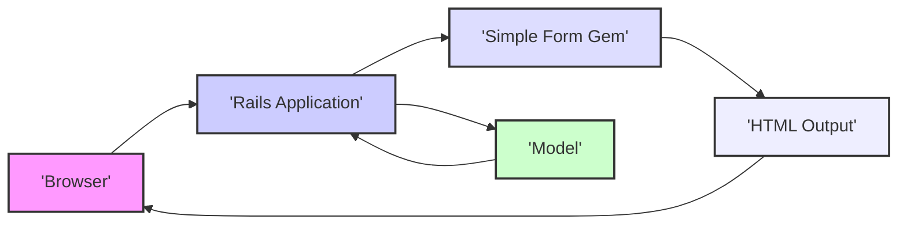
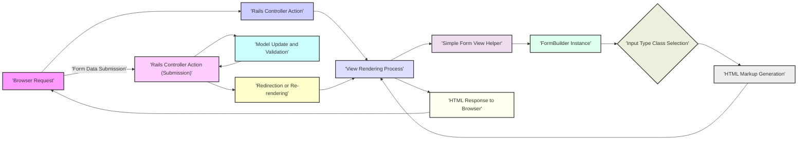

# Project Design Document: Simple Form Ruby Gem

**Project Title:** Simple Form - Streamlining Form Creation in Ruby on Rails

**Version:** 1.1

**Date:** October 26, 2023

**Author:** Gemini (AI Language Model)

## 1. Introduction

This document provides an enhanced design overview of the `simple_form` Ruby gem, a library meticulously crafted to simplify and standardize the creation of forms within Ruby on Rails applications. This document expands on the previous version, offering deeper insights into the gem's architecture, the intricate interactions between its components, and the flow of data during form rendering and submission. This detailed design serves as a robust foundation for comprehensive threat modeling activities.

## 2. Project Goals

The core objectives driving the development and utilization of the `simple_form` gem are:

* **Abstraction of Form Markup Complexity:** To significantly reduce the verbose and repetitive HTML often associated with building forms, leading to cleaner and more maintainable view templates.
* **Enforcement of Design System Consistency:** To facilitate the implementation of a unified look and feel across all forms within an application through configurable wrappers and input types.
* **Provision of Extensive Customization Capabilities:** To offer developers a wide array of options for tailoring form elements, their presentation, and behavior to meet specific application requirements.
* **Improvement of Code Readability and Maintainability:** To produce form-related code that is easier for developers to understand, modify, and debug, reducing development time and potential errors.
* **Seamless Integration with the Ruby on Rails Ecosystem:** To operate harmoniously with other Rails features, such as model attributes, validations, and internationalization.

## 3. Scope

This refined design document remains focused on the internal structure and operational mechanics of the `simple_form` gem. The scope encompasses:

* **In-depth analysis of the gem's core components and their responsibilities.**
* **A detailed explanation of the data flow involved in both rendering forms to the user and processing form submissions.**
* **Comprehensive coverage of key configuration options and the mechanisms provided for extending the gem's functionality.**

This document explicitly excludes:

* **The internal workings and implementation specifics of the Ruby on Rails framework itself.**
* **The specific application-level code where the `simple_form` gem is integrated and utilized.**
* **The details of front-end styling (CSS), although the gem provides hooks and structures for applying CSS classes effectively.**

## 4. System Architecture

### 4.1 High-Level Architecture

The `simple_form` gem functions as an integral part of the view layer within a Ruby on Rails application. It exposes a set of helper methods that are invoked within ERB or other templating engines to dynamically generate the HTML markup for form elements. This abstraction simplifies the view logic and promotes a more declarative approach to form creation.

* **Browser:** The user's web browser, acting as the client that initiates requests to the Rails application and subsequently renders the received HTML.
* **Rails Application:** The encompassing Ruby on Rails application that incorporates and leverages the functionality of the `simple_form` gem.
* **Simple Form Gem:** The core library responsible for the programmatic generation of HTML form elements based on provided configurations, data from model attributes, and user-defined options.
* **HTML Output:** The resulting HTML code representing the form elements, ready to be interpreted and displayed by the browser.
* **Model:** The data model within the Rails application that the form is designed to interact with, providing data to populate fields and receiving submitted data for processing.

### 4.2 Component Architecture

The `simple_form` gem is structured into a set of interconnected components, each with a specific responsibility:

* **`SimpleForm::FormBuilder`:** This is the central orchestrator for building forms. It provides a fluent interface with methods for generating various form elements, including input fields, labels, hints, and error messages. It acts as the primary point of interaction for developers within the view templates.
* **Input Type Classes:** This collection of classes (e.g., `SimpleForm::Inputs::StringInput`, `SimpleForm::Inputs::TextInput`, `SimpleForm::Inputs::BooleanInput`, `SimpleForm::Inputs::CollectionSelectInput`) is responsible for rendering the specific HTML markup for different types of input fields. Each class encapsulates the logic for generating the appropriate HTML attributes and structure for its corresponding input type.
* **Wrappers:** Wrappers define the surrounding HTML structure for form elements, allowing for consistent styling and organization. They specify how labels, inputs, hints, and error messages are arranged. Wrappers can be configured globally for the entire application or individually for specific form elements, offering granular control over presentation.
* **Locales (Internationalization):** The gem leverages YAML files to store text content for labels, hints, and error messages. This enables the internationalization of forms, allowing applications to support multiple languages without modifying the core form logic.
* **Configuration Options:**  A comprehensive set of configuration options allows developers to customize the gem's behavior and appearance. These options can be set globally within an initializer or passed as options when invoking the `simple_form_for` helper. Examples include setting the default wrapper, specifying error classes, and defining the style for boolean inputs.
* **View Helpers:** These helpers, such as `simple_form_for` and `simple_fields_for`, provide a convenient and idiomatic way to instantiate and utilize the `FormBuilder` within Rails view templates. They streamline the process of creating forms associated with model objects.
* **Validators Integration:** `simple_form` seamlessly integrates with Rails' built-in validation framework. It automatically detects validations defined on model attributes and displays corresponding error messages next to the relevant form fields, enhancing the user experience by providing immediate feedback.
* **Custom Inputs:** The gem provides a mechanism for developers to define their own custom input types, extending the gem's functionality to handle specific or complex form elements not included in the default set.

## 5. Data Flow

The process of rendering and submitting a form using `simple_form` involves a well-defined sequence of steps, illustrating the flow of data through the system:

1. **Browser Request:** The user initiates a request to the Rails application, typically to access a page containing a form.
2. **Rails Controller Action:** The Rails router directs the request to the appropriate controller action responsible for handling the request.
3. **View Rendering Process:** The controller action triggers the rendering of the associated view template.
4. **Simple Form View Helper:** Within the view template, a `simple_form` helper (e.g., `simple_form_for`) is invoked, initiating the form generation process.
5. **FormBuilder Instance:** The `simple_form` helper instantiates a `SimpleForm::FormBuilder` object, which is typically associated with a model instance.
6. **Input Type Class Selection:** For each form element to be rendered, the `FormBuilder` determines the appropriate input type class to use based on the model attribute's data type or explicit configuration.
7. **HTML Markup Generation:** The selected input type class generates the corresponding HTML markup for the form element, incorporating labels, input fields, hints, and error messages according to the configured wrappers, locales, and model validations.
8. **HTML Response to Browser:** The generated HTML, representing the complete form, is embedded within the larger HTML response sent back to the user's browser.
9. **Form Data Submission:** The user interacts with the form and submits the data.
10. **Rails Controller Action (Submission):** The browser sends the form data to a designated controller action within the Rails application.
11. **Model Update and Validation:** The controller action receives the submitted data and typically uses it to update the associated model. Rails' validation framework is invoked to ensure the data meets the defined constraints.
12. **Redirection or Re-rendering:** Based on the outcome of the model update and validation process, the controller action either redirects the user to a success page or re-renders the form view, potentially displaying error messages if validation failed.

## 6. Technologies Used

* **Ruby:** The foundational programming language in which the gem is developed.
* **Ruby on Rails:** The web application framework that provides the environment for the gem's operation.
* **HTML (HyperText Markup Language):** The standard markup language used for generating the structure of form elements.
* **ERB (Embedded Ruby) or other templating engines:** Used to embed Ruby code within HTML templates, enabling dynamic form generation.
* **YAML (YAML Ain't Markup Language):** Utilized for storing locale data, facilitating the internationalization of form elements.

## 7. Deployment Considerations

The `simple_form` gem is deployed as a dependency within a Ruby on Rails application. The standard deployment process involves:

* **Declaration in Gemfile:** Adding the `simple_form` gem to the application's `Gemfile`.
* **Installation via Bundler:** Running the `bundle install` command to download and install the gem and its dependencies.
* **No Separate Deployment Process:** The gem itself does not require a separate deployment process. It becomes available to the application once installed.

## 8. Security Considerations (Detailed for Threat Modeling)

This section expands on the initial security considerations, providing more detailed insights for threat modeling:

* **Cross-Site Scripting (XSS):**
    * **Threat:** Malicious scripts could be injected through user-provided data that is not properly sanitized when rendered within form elements (e.g., labels, hints, default values).
    * **Mitigation:** `simple_form` relies on Rails' built-in HTML escaping mechanisms by default. However, developers should be cautious when using the `as: :string` input type with user-provided content or when using the `input_html` option to directly insert HTML. Ensure proper escaping of any dynamic content.
* **Mass Assignment Vulnerabilities:**
    * **Threat:** Attackers could manipulate form data to update model attributes they should not have access to, potentially leading to data breaches or unauthorized modifications.
    * **Mitigation:** This vulnerability primarily resides in the Rails controller layer. Developers must use strong parameters (`params.require(:model_name).permit(:allowed_attributes)`) to explicitly define which attributes can be updated through form submissions. `simple_form` itself does not directly mitigate this but provides the structure for submitting data.
* **Cross-Site Request Forgery (CSRF):**
    * **Threat:** Attackers could trick authenticated users into submitting unintended requests on the application, potentially performing actions without the user's knowledge.
    * **Mitigation:** Rails provides built-in CSRF protection using authenticity tokens. `simple_form` automatically includes the necessary hidden field for the CSRF token when used with `form_for` or `simple_form_for`. Ensure CSRF protection is enabled in the `ApplicationController`.
* **HTML Injection:**
    * **Threat:** Similar to XSS, attackers could inject arbitrary HTML into the form structure if user-provided data is not properly handled.
    * **Mitigation:**  Avoid directly rendering unsanitized user input within form elements. Utilize `simple_form`'s options and Rails' escaping mechanisms to ensure safe rendering.
* **Denial of Service (DoS):**
    * **Threat:** An attacker could attempt to overwhelm the server by submitting extremely large or complex forms, consuming excessive resources.
    * **Mitigation:** While `simple_form` simplifies form generation, the potential for DoS attacks is more related to the application's handling of form submissions and overall resource management. Implement rate limiting, input validation (e.g., limiting the size of text fields), and proper server infrastructure to mitigate DoS risks.
* **Man-in-the-Middle (MitM) Attacks:**
    * **Threat:**  Attackers could intercept communication between the user's browser and the server, potentially stealing sensitive form data.
    * **Mitigation:** This is primarily addressed at the transport layer using HTTPS (SSL/TLS). Ensure that the application is served over HTTPS to encrypt all communication, including form submissions. `simple_form` does not directly address this but relies on the secure transport configuration of the application.
* **Insecure Defaults/Configurations:**
    * **Threat:** Default configurations within `simple_form` or the application using it might introduce security vulnerabilities.
    * **Mitigation:** Review the default configurations of `simple_form` and customize them as needed for the specific application's security requirements. Regularly update the gem to benefit from security patches and improvements.

## 9. Diagrams

This document incorporates the following visual aids:

* **High-Level Architecture Diagram:** Provides a conceptual overview of the `simple_form` gem's role within a Rails application.
* **Data Flow Diagram:** Illustrates the sequence of steps and the movement of data during form rendering and submission processes.

These diagrams offer a clear visual representation of the system's structure and interactions, which is crucial for identifying potential attack vectors and understanding the system's behavior during threat modeling exercises.