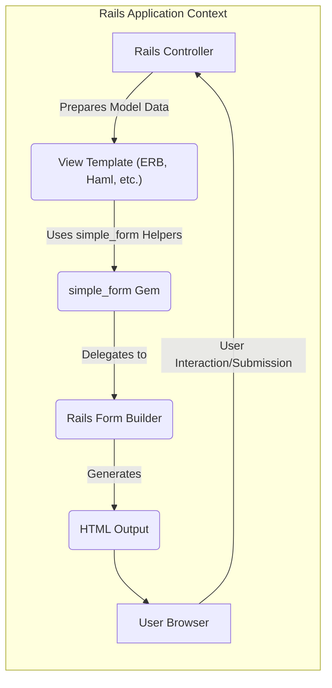
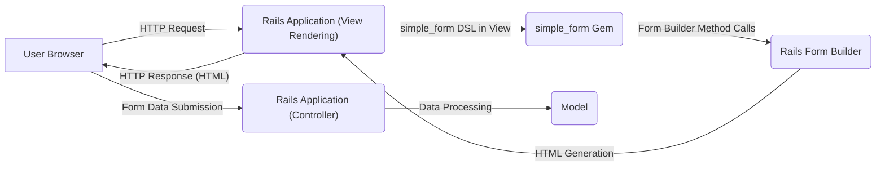

## Project Design Document: simple_form Ruby Gem (Improved)

**1. Introduction**

This document provides an enhanced design overview of the `simple_form` Ruby gem. `simple_form` is a library designed to streamline and simplify the creation of HTML forms within Ruby on Rails applications. This document aims to provide a detailed understanding of the gem's architecture, data flow, and security considerations, making it a valuable resource for subsequent threat modeling activities. The improvements in this version focus on providing more granular detail and clearer explanations.

**2. Goals**

* To offer a declarative and intuitive Domain Specific Language (DSL) for defining form inputs within Rails views.
* To significantly reduce the amount of repetitive boilerplate code typically required for generating common HTML form elements.
* To provide extensive flexibility and customization options for the rendering of form elements and their surrounding structure.
* To integrate seamlessly and consistently with Rails' built-in form builder infrastructure and view rendering mechanisms (e.g., ERB, Haml).
* To support a wide range of standard HTML input types, along with associated labels, hints, error messages, and configurable wrappers.

**3. Non-Goals**

* The gem does not handle the actual submission of forms or the processing of form data. This remains the responsibility of the Rails controller and model layers.
* `simple_form` does not provide built-in client-side validation logic. While it can render attributes that might be used by client-side validation libraries, the validation rules themselves are managed separately.
* Authentication and authorization features are outside the scope of this gem.
* Managing complex, dynamic form state or intricate client-side interactions beyond the basic rendering of form elements is not a goal.

**4. System Architecture**

The `simple_form` gem operates as an extension within the Ruby on Rails framework. It enhances Rails' existing form building capabilities by offering a more abstract and developer-friendly interface.

**Detailed Component Descriptions:**

* **"Rails Controller"**:  The controller is responsible for preparing the data required by the view, including instantiating or retrieving the model object that the form will be associated with.
* **"View Template (ERB, Haml, etc.)"**: This is where developers utilize `simple_form`'s helper methods within their view templates to define and render forms.
* **"simple_form Gem"**: The core of the library. It parses the DSL used in the view templates and translates it into instructions for the Rails Form Builder. It manages the configuration of inputs, wrappers, and other form elements.
* **"Rails Form Builder"**:  The underlying Rails component responsible for the actual generation of HTML form elements. `simple_form` acts as a layer on top of this, simplifying its usage.
* **"HTML Output"**: The generated HTML code representing the form, which is sent from the Rails application to the user's browser.
* **"User Browser"**: The user's web browser, which renders the HTML form, allowing the user to interact with it and input data.

**5. Data Flow (Detailed)**

The data flow when using `simple_form` can be broken down into the following steps:

* **Initial Request:** A user's browser sends an HTTP request to a specific route in the Rails application, typically triggering an action in a Rails controller.
* **Controller Action:** The Rails controller action prepares any necessary data, including the model object that the form will be built for.
* **View Rendering Initiation:** The controller action instructs Rails to render a specific view template.
* **`simple_form_for` Invocation:** Within the view template, the `simple_form_for` helper method is called. This method takes the model object (or a symbol representing the form) and optional configuration options as arguments.
* **DSL Processing and Form Builder Delegation:** The `simple_form_for` helper yields a `simple_form` builder object. Within the block provided to `simple_form_for`, developers use `simple_form`'s DSL (e.g., `input :attribute_name`, `button :submit`). These DSL calls are intercepted by the `simple_form` gem.
* **Translation to Form Builder Calls:** The `simple_form` gem translates the high-level DSL calls into specific method calls on the underlying Rails Form Builder object (e.g., `text_field`, `select`, `submit_tag`). Configuration options provided to `simple_form` are passed along to the Form Builder.
* **HTML Generation by Rails:** The Rails Form Builder generates the actual HTML markup for each form element based on the method calls it receives from `simple_form`. This includes generating tags for inputs, labels, hints, errors, and any surrounding wrapper elements.
* **HTML Response:** The fully generated HTML for the form is embedded within the overall HTML structure of the view and sent back to the user's browser as the HTTP response.
* **User Interaction:** The user views the rendered form in their browser and interacts with the input fields, entering data.
* **Form Submission:** When the user submits the form, the browser sends a new HTTP request (typically a POST or PUT request) back to the Rails application. This request includes the data entered by the user in the form.
* **Controller Processing of Form Data:** The Rails controller receives the submitted form data (usually accessible through `params`). The controller then processes this data, often updating the corresponding model object.

**6. Key Components and Interactions (Detailed)**

* **`simple_form_for` Helper:** The primary entry point for using `simple_form`. It establishes the form context, associates the form with a model or symbol, and yields a `simple_form` builder instance.
* **Input Components (e.g., `input :name`, `input :email`, `input :password`):** These DSL methods are used within the `simple_form_for` block to define individual form fields. They accept a variety of options to customize the input type, label, hint, placeholder, HTML attributes, and more.
* **Wrappers:** Define the HTML structure that surrounds individual form elements (e.g., the container for the label, input, hint, and error). Wrappers are highly configurable and allow for consistent styling and semantic markup.
* **Inputs (Specific Input Types):** `simple_form` provides specialized input classes for different HTML input types (e.g., `TextInput`, `SelectInput`, `BooleanInput`). These classes handle the specific logic for rendering each type of input.
* **Labels:** The text displayed alongside form fields to clearly indicate their purpose. `simple_form` automatically generates labels based on attribute names but allows for customization.
* **Hints:**  Optional descriptive text provided below or alongside form fields to offer guidance to the user.
* **Errors:**  Display validation error messages associated with specific form fields. `simple_form` integrates with Rails' error handling to display these messages.
* **Collections:** Used for generating select dropdowns or radio button groups from a collection of data. `simple_form` simplifies the process of iterating through collections and generating the appropriate HTML.
* **Associations:**  Facilitates the creation of form inputs for associated model objects (e.g., nested attributes).

**7. Security Considerations (Enhanced)**

While `simple_form` primarily focuses on the presentation layer of form creation, it's crucial to consider the security implications within the context of its usage:

* **Cross-Site Scripting (XSS) Vulnerabilities:**
    * **Output Escaping Reliance:** `simple_form` relies heavily on Rails' built-in output escaping mechanisms to prevent XSS when rendering dynamic content such as labels, hints, and error messages. It's paramount that the underlying Rails view rendering engine (e.g., ERB with `<%= %>`) is configured correctly to escape HTML entities.
    * **Custom Input Renderers:** If developers create custom input types or custom rendering logic within `simple_form`, they bear the responsibility of ensuring proper output escaping of any user-provided or dynamic data to prevent XSS. Failure to do so can introduce vulnerabilities.
* **Cross-Site Request Forgery (CSRF) Protection:**
    * **Rails Responsibility:** `simple_form` itself does not implement CSRF protection. This is handled by Rails at a lower level. The `form_for` helper (which `simple_form_for` extends) automatically includes CSRF tokens in the generated form. Developers should ensure that CSRF protection is enabled in their Rails application.
* **Mass Assignment Vulnerabilities:**
    * **Controller Level Mitigation:** `simple_form` renders form inputs that correspond to model attributes. It's the developer's responsibility in the Rails controller to use strong parameters (e.g., `params.require(:model_name).permit(:attribute1, :attribute2)`) to explicitly define which attributes can be updated through the form submission, thus preventing mass assignment vulnerabilities.
* **HTML Injection Risks:**
    * **Care with Customization:** While `simple_form` aims to generate valid and safe HTML, improper or insecure use of custom wrappers, custom HTML attributes, or direct embedding of user-controlled data within `simple_form` configurations could potentially lead to HTML injection vulnerabilities if not carefully sanitized.
* **Denial of Service (DoS) Considerations:**
    * **Form Complexity:** Generating extremely large or deeply nested forms using `simple_form` could potentially consume significant server resources during rendering, potentially leading to performance issues or even DoS if not managed carefully. This is more of an application design consideration than a direct vulnerability within `simple_form` itself.
* **Information Disclosure:**
    * **Sensitive Data in Forms:** Developers should exercise caution when rendering sensitive information (e.g., API keys, internal IDs) directly within form labels, hints, default values, or error messages. Ensure that only necessary and non-sensitive information is displayed to the user.

**8. Assumptions and Constraints**

* **Ruby on Rails Environment:** `simple_form` is explicitly designed to function within a Ruby on Rails application.
* **Rails View Rendering Engine:** It assumes the presence and correct configuration of a standard Rails view rendering engine (e.g., ERB, Haml, Slim).
* **Underlying Rails Form Builder:**  It relies on the core functionality provided by Rails' built-in form builder infrastructure.
* **Developer Security Responsibility:** Developers are ultimately responsible for implementing proper data validation, authorization, and other security measures within their Rails application. `simple_form` simplifies form rendering but does not replace these critical security practices.
* **Configuration Management:** The behavior and appearance of forms generated by `simple_form` are heavily influenced by its configuration. It's assumed that these configurations are managed securely and appropriately.

**9. Future Considerations (Beyond Initial Threat Model)**

* **Enhanced Accessibility Features:** Further improvements to support accessibility standards, such as more comprehensive ARIA attribute generation.
* **Improved Integration with JavaScript Frameworks:** Exploring ways to facilitate smoother integration with front-end JavaScript frameworks for dynamic form behavior and interactions.
* **Support for More Advanced Input Types:**  Adding built-in support for less common or more specialized HTML input types.

This improved design document provides a more detailed and nuanced understanding of the `simple_form` gem, offering a stronger foundation for conducting thorough threat modeling activities. By carefully considering the components, data flow, and potential security implications outlined here, developers can better identify and mitigate potential risks associated with using this valuable library.