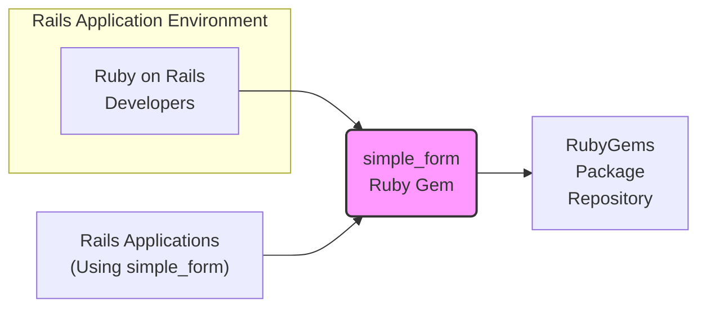
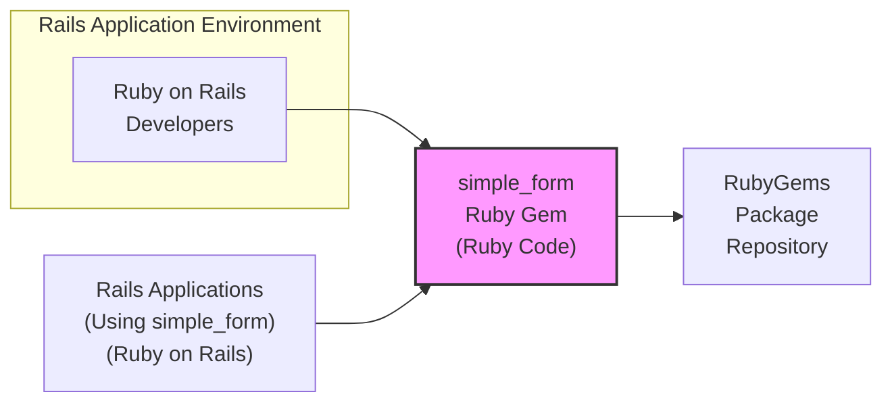
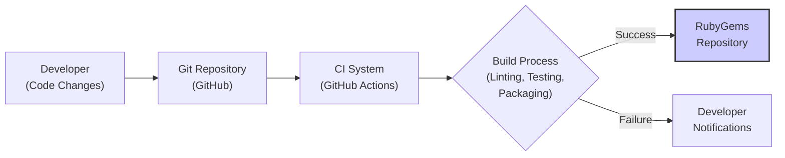

# BUSINESS POSTURE

This project is a Ruby on Rails library called `simple_form` which aims to simplify and streamline the process of creating forms in Ruby on Rails applications. The primary business priority is to enhance developer productivity by providing a more intuitive and concise way to define forms, reducing boilerplate code and improving maintainability of Rails applications that utilize forms. The goal is to offer a flexible and user-friendly form builder that caters to common form patterns and customization needs within the Rails ecosystem.

The most important business risks associated with this project are:

- Introduction of vulnerabilities: Security flaws in the `simple_form` library could be inherited by all Rails applications that depend on it. This could lead to potential security breaches in those applications, impacting their users and the businesses relying on them.
- Dependency risk: As a library, `simple_form` depends on other Ruby gems and the Ruby on Rails framework itself. Vulnerabilities in these dependencies could indirectly affect `simple_form` and the applications using it.
- Maintainability and long-term support: If the library is not actively maintained or becomes outdated, it could become a liability for projects that depend on it. Lack of updates and security patches could lead to increased risk over time.
- Adoption risk: If the library is not well-received by the Ruby on Rails community or fails to address developer needs effectively, its adoption rate might be low, limiting its business value and impact.

# SECURITY POSTURE

Existing security controls for the `simple_form` project are currently limited, typical for many open-source libraries focused on functionality:

- security control: GitHub repository with version control. Implemented in: GitHub.
- security control: Publicly accessible source code. Implemented in: GitHub.
- accepted risk: Lack of automated security scanning.
- accepted risk: Reliance on community contributions for security awareness.
- accepted risk: No formal security audit process.

Recommended security controls to implement as high priority:

- recommended security control: Implement automated Static Application Security Testing (SAST) in the CI/CD pipeline to identify potential code-level vulnerabilities.
- recommended security control: Implement Dependency Scanning in the CI/CD pipeline to detect known vulnerabilities in dependencies.
- recommended security control: Establish a clear vulnerability disclosure policy to allow security researchers to report issues responsibly.
- recommended security control: Consider performing periodic security audits, especially before major releases.

Security requirements for the `simple_form` project:

- Authentication: Not directly applicable to a library. Authentication is handled by the consuming Rails applications.
- Authorization: Not directly applicable to a library. Authorization is handled by the consuming Rails applications.
- Input Validation: While `simple_form` generates HTML form elements, input validation is primarily the responsibility of the Rails application server-side code that processes form submissions. However, `simple_form` should generate forms that facilitate proper client-side validation (e.g., using HTML5 validation attributes) and not hinder server-side validation.
- Cryptography: Not directly applicable to the core functionality of `simple_form` as a form builder. Cryptographic operations are handled by the consuming Rails applications when dealing with sensitive data in forms. However, `simple_form` should not introduce any practices that would weaken cryptography in consuming applications (e.g., insecure defaults in form generation related to sensitive data).

# DESIGN

## C4 CONTEXT



### C4 CONTEXT Elements

- list:
    - list:
        - Name: Ruby on Rails Developers
        - Type: Person
        - Description: Software developers who use the `simple_form` library to build forms in their Ruby on Rails applications.
        - Responsibilities: Use `simple_form` to create and manage forms in Rails applications. Report issues and contribute to the library.
        - Security controls: Secure development practices on their local machines and in their development workflows.
    - list:
        - Name: simple_form
        - Type: Software System
        - Description: A Ruby gem that simplifies form creation in Ruby on Rails applications. It provides a DSL for defining forms and generates HTML form markup.
        - Responsibilities: Provide a user-friendly API for building forms, generate correct and accessible HTML form markup, be compatible with different Rails versions and form-related gems.
        - Security controls: Input sanitization (output encoding of form elements to prevent XSS), dependency management, secure coding practices.
    - list:
        - Name: RubyGems
        - Type: Software System
        - Description: The public package repository for Ruby gems. `simple_form` is published to RubyGems for distribution.
        - Responsibilities: Host and distribute Ruby gems, provide access to gem packages for download and installation.
        - Security controls: Package integrity checks, malware scanning, access control for gem publishing.
    - list:
        - Name: Rails Applications (Using simple_form)
        - Type: Software System
        - Description: Ruby on Rails web applications that integrate and utilize the `simple_form` gem to build forms within their user interfaces.
        - Responsibilities: Use `simple_form` to render forms, handle form submissions, perform server-side validation, and process user data.
        - Security controls: Input validation, output encoding, authentication, authorization, session management, protection against common web vulnerabilities.

## C4 CONTAINER



### C4 CONTAINER Elements

- list:
    - list:
        - Name: Ruby on Rails Developers
        - Type: Person
        - Description: Software developers who write Ruby code and use the `simple_form` library.
        - Responsibilities: Write code that utilizes the `simple_form` API, test form functionality, and contribute to the library.
        - Security controls: Secure coding practices, code review, local development environment security.
    - list:
        - Name: simple_form Ruby Gem (Ruby Code)
        - Type: Container
        - Description: The Ruby code that constitutes the `simple_form` library. It is distributed as a Ruby gem.
        - Responsibilities: Implement the form building DSL, generate HTML form markup, provide configuration options, and ensure compatibility with Rails.
        - Security controls: Secure coding practices, input sanitization (output encoding), dependency management, unit and integration testing, SAST scanning.
    - list:
        - Name: RubyGems Package Repository
        - Type: Container
        - Description: The infrastructure that hosts and serves Ruby gems, including the `simple_form` gem.
        - Responsibilities: Store and distribute gem files, manage gem metadata, provide API access for gem installation.
        - Security controls: Access control, package integrity verification, malware scanning, infrastructure security.
    - list:
        - Name: Rails Applications (Using simple_form) (Ruby on Rails)
        - Type: Container
        - Description: The Ruby on Rails application runtime environment where `simple_form` is used.
        - Responsibilities: Execute Rails application code, render views including forms built with `simple_form`, handle user requests, and interact with databases and other services.
        - Security controls: Web application firewall (WAF), runtime environment security, framework-level security features (Rails security defaults), application-level security controls.

## DEPLOYMENT

`simple_form` itself is not deployed as a standalone application. It is deployed as a Ruby gem to RubyGems and then integrated into Ruby on Rails applications. The deployment context is primarily within the development and build pipelines of Rails applications that use `simple_form`.

Deployment Diagram (Illustrative of gem publication and usage):

```mermaid
flowchart LR
    subgraph "Developer Environment"
    A["Developer Machine\n(Local Ruby Env)"]
    end
    subgraph "CI/CD Pipeline"
    B["CI Server\n(Build & Test)"]
    C["RubyGems\nPublishing\nService"]
    end
    subgraph "Rails Application Deployment"
    D["Application Server\n(Rails Runtime)"]
    end

    A --> B: Push Code
    B --> C: Publish Gem
    D --> C: Install Gem
    style C fill:#ccf,stroke:#333,stroke-width:2px
```

### DEPLOYMENT Elements

- list:
    - list:
        - Name: Developer Machine (Local Ruby Env)
        - Type: Environment
        - Description: The local development environment of a `simple_form` library developer, including Ruby, Git, and development tools.
        - Responsibilities: Code development, testing, and gem packaging.
        - Security controls: Developer workstation security, code signing (if applicable), secure development practices.
    - list:
        - Name: CI Server (Build & Test)
        - Type: Environment
        - Description: Continuous Integration server (e.g., GitHub Actions) used to automate building, testing, and publishing the `simple_form` gem.
        - Responsibilities: Automated build process, running tests, performing security checks (if implemented), and publishing the gem to RubyGems.
        - Security controls: Secure CI/CD pipeline configuration, access control to CI system, secrets management for publishing credentials, automated security scans.
    - list:
        - Name: RubyGems Publishing Service
        - Type: Environment
        - Description: The RubyGems infrastructure responsible for receiving, storing, and distributing published gems.
        - Responsibilities: Gem package hosting, version management, access control for gem publishing.
        - Security controls: Infrastructure security, access control, package integrity checks, malware scanning.
    - list:
        - Name: Application Server (Rails Runtime)
        - Type: Environment
        - Description: The runtime environment where Rails applications using `simple_form` are deployed (e.g., production servers, staging environments).
        - Responsibilities: Running Rails application code, serving web requests, rendering forms built with `simple_form`.
        - Security controls: Server hardening, network security, web application firewall, runtime environment security controls.

## BUILD

Build Process Diagram:



Build Process Description:

1. Developer makes code changes to the `simple_form` library and commits them to a Git repository (e.g., GitHub).
2. The CI system (e.g., GitHub Actions) is triggered by code changes pushed to the repository.
3. The CI system executes the build process, which typically includes:
    - Linting: Code style checks and static analysis.
    - Testing: Running unit and integration tests to ensure code functionality.
    - Packaging: Creating the Ruby gem package.
4. If the build process is successful, the CI system publishes the gem package to the RubyGems repository.
5. If the build process fails (e.g., tests fail, linting errors), the CI system notifies the developers about the failure.

Security Controls in Build Process:

- security control: Source code hosted in a version control system (GitHub). Implemented in: GitHub.
- security control: Automated build process using CI (GitHub Actions). Implemented in: GitHub Actions configuration.
- security control: Code linting and static analysis during build. Implemented in: CI build scripts (e.g., using RuboCop).
- security control: Automated unit and integration tests. Implemented in: CI build scripts (e.g., using RSpec).
- recommended security control: Dependency scanning during build to identify vulnerable dependencies. To be implemented in: CI build scripts (e.g., using bundler-audit).
- recommended security control: SAST scanning during build to identify code-level vulnerabilities. To be implemented in: CI build scripts (e.g., using CodeQL).
- security control: Access control to CI/CD pipeline and publishing credentials. Implemented in: GitHub and RubyGems access control settings.

# RISK ASSESSMENT

Critical business process we are trying to protect:

- Developer productivity and efficiency in building Ruby on Rails applications.
- Reputation and trust in the `simple_form` library within the Ruby on Rails community.
- Security of applications that depend on `simple_form` (indirectly).

Data we are trying to protect and their sensitivity:

- Source code of the `simple_form` library: Sensitivity: Medium. Publicly available but integrity and confidentiality are important to prevent malicious modifications.
- RubyGems publishing credentials: Sensitivity: High. Compromise could lead to malicious gem releases.
- CI/CD pipeline configuration and secrets: Sensitivity: Medium to High. Misconfiguration or compromise could lead to unauthorized code changes or malicious builds.

# QUESTIONS & ASSUMPTIONS

Questions:

- What is the intended scope of security considerations for this document? Should it primarily focus on the `simple_form` library itself, or also consider the security implications for applications that use it? (Assumption: Focus is primarily on the library itself, but with consideration for its impact on consuming applications).
- What is the current level of security awareness and maturity within the `simple_form` project maintainers and community? (Assumption: Moderate, typical for open-source projects, with room for improvement in formal security practices).
- Are there any specific security compliance requirements or industry standards that the `simple_form` library needs to adhere to? (Assumption: No specific compliance requirements beyond general secure coding practices and awareness of common web vulnerabilities).
- What is the process for handling security vulnerabilities reported in `simple_form`? Is there a defined vulnerability disclosure policy and incident response plan? (Assumption: Currently informal, recommended to formalize a vulnerability disclosure policy).

Assumptions:

- BUSINESS POSTURE: The primary goal is to provide a useful and developer-friendly library that simplifies form creation in Rails. Security is important but secondary to functionality and usability in the current project priorities.
- SECURITY POSTURE: Current security controls are basic, typical for an open-source library. There is an opportunity to enhance security posture by implementing automated security scanning and establishing a vulnerability disclosure process.
- DESIGN: The design is relatively simple, centered around a Ruby gem. Security considerations should focus on secure coding practices within the gem and ensuring it does not introduce vulnerabilities into consuming applications.