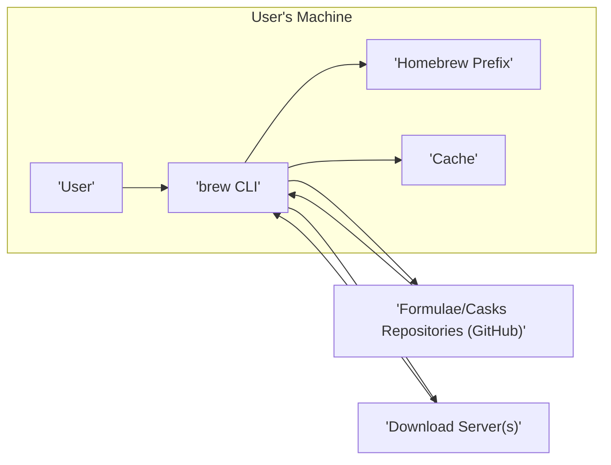
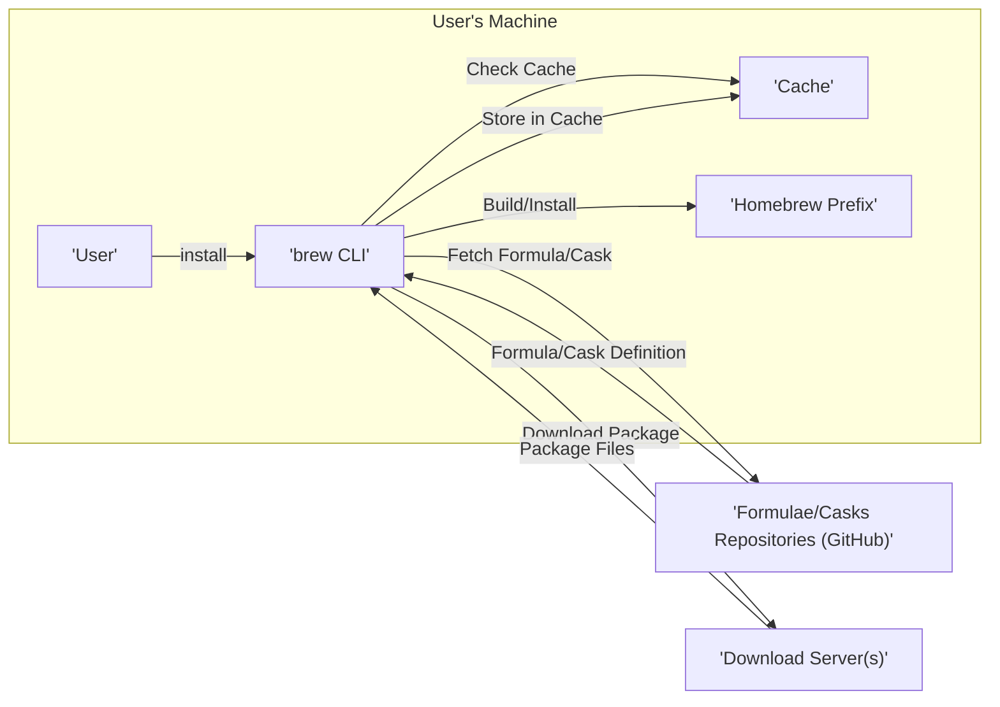

## Project Design Document: Homebrew Package Manager

**1. Introduction**

This document outlines the design of Homebrew, a popular package manager for macOS and Linux. It provides a comprehensive overview of the system's architecture, components, and data flow, serving as a foundation for subsequent threat modeling activities.

**2. Goals**

*   Provide a clear and detailed description of the Homebrew system.
*   Outline the key components and their interactions.
*   Illustrate the data flow within the system.
*   Serve as a basis for identifying potential security threats and vulnerabilities.

**3. System Overview**

Homebrew simplifies the installation of software on macOS and Linux. It operates by downloading and building software packages (called "formulae" or "casks") from remote repositories. It manages dependencies, ensuring that required libraries and tools are also installed. Homebrew aims to provide a consistent and user-friendly experience for installing and managing software outside of the operating system's default package manager.

**4. Target Users**

*   Software developers
*   System administrators
*   General users who want to install software not available through the operating system's app store or default package manager.

**5. System Architecture**

Homebrew's architecture can be broadly divided into the following key components:

*   **`brew` CLI:** The command-line interface is the primary way users interact with Homebrew. It handles user commands, parses arguments, and orchestrates actions across other components.
*   **Formulae/Casks Repositories:** These are Git repositories (primarily on GitHub) containing the definitions for software packages.
    *   **Formulae:** Describe command-line tools and libraries.
    *   **Casks:** Describe GUI applications and other non-command-line software.
*   **Homebrew Core:** The main repository containing a large collection of commonly used formulae.
*   **Homebrew Cask:** The main repository containing definitions for GUI applications.
*   **Taps:**  Mechanisms for adding external repositories of formulae and casks. Users can "tap" into these repositories to access additional software.
*   **Download Server(s):**  Servers hosting the actual software packages (tarballs, zip files, etc.) referenced by the formulae and casks. These are often the upstream project's servers or mirrors.
*   **Build System:**  The logic within Homebrew that interprets formulae/casks, downloads source code or binaries, compiles software (if necessary), and installs it into the Homebrew prefix.
*   **Homebrew Prefix:** The directory (typically `/usr/local` on macOS or `/home/linuxbrew/.linuxbrew` on Linux) where Homebrew installs software.
*   **Cache:** A local directory where downloaded files (source code, binaries) are stored to avoid redundant downloads.
*   **Git:** Used extensively for managing repositories, updating formulae/casks, and tracking changes.

**6. Data Flow**

The typical workflow for installing a package involves the following steps:

1. **User Command:** The user issues a command to the `brew` CLI (e.g., `brew install <package_name>`).
2. **Formula/Cask Retrieval:** The `brew` CLI consults the local copy of the formulae/casks repositories. If the information is outdated, it fetches updates from the remote repositories (GitHub).
3. **Dependency Resolution:** Homebrew analyzes the formula/cask to identify any dependencies.
4. **Download:** Homebrew downloads the necessary files (source code, pre-compiled binaries) from the specified download server(s). These files are often cached locally.
5. **Build and Installation:**
    *   For formulae, Homebrew typically compiles the software from source using the instructions in the formula.
    *   For casks, Homebrew usually downloads and installs a pre-compiled application bundle.
6. **Installation to Prefix:** The compiled software or application bundle is installed into the Homebrew prefix.
7. **Path Updates:** Homebrew may update the user's shell environment (e.g., `PATH` variable) to make the installed software accessible.

**7. Key Components in Detail**

*   **`brew` CLI:**
    *   Written primarily in Ruby.
    *   Parses user input and dispatches commands.
    *   Manages the lifecycle of packages (install, uninstall, upgrade).
    *   Interacts with Git for repository management.
    *   Provides various subcommands for different operations (e.g., `install`, `uninstall`, `update`, `search`).
*   **Formulae/Casks:**
    *   Ruby files that define how to download, build, and install a specific software package.
    *   Contain metadata such as the package name, version, dependencies, download URL, and build instructions.
    *   Follow a specific syntax and structure.
*   **Homebrew Repositories (GitHub):**
    *   Centralized locations for storing and managing formulae and casks.
    *   Utilize Git for version control and collaboration.
    *   Pull requests are used for contributing new or updated formulae/casks.
*   **Download Servers:**
    *   Decentralized; the location of the software packages is specified in the formulae/casks.
    *   Can be the official release servers of the software project, mirrors, or other hosting providers.
*   **Build System (within `brew` CLI):**
    *   Interprets the instructions within a formula.
    *   Executes commands to download source code, configure build environments, compile code, and install the resulting binaries.
    *   Handles dependency management by recursively installing required packages.
*   **Homebrew Prefix:**
    *   A dedicated directory to isolate Homebrew-installed software from the system's default software.
    *   Helps prevent conflicts and provides a consistent environment.
*   **Cache:**
    *   Stores downloaded files to speed up subsequent installations or upgrades.
    *   Reduces network traffic and reliance on external servers.

**8. Security Considerations (For Threat Modeling)**

*   **Supply Chain Security:**
    *   Trust in the maintainers of formulae/casks repositories is crucial. Compromised repositories could lead to the distribution of malicious software.
    *   The integrity of download servers needs to be ensured. Man-in-the-middle attacks could redirect downloads to malicious sources.
    *   Verification of downloaded files (e.g., using checksums) is important to detect tampering.
*   **Local Security:**
    *   Permissions within the Homebrew prefix need to be managed carefully to prevent unauthorized access or modification.
    *   The `brew` CLI runs with user privileges, so vulnerabilities in the CLI could be exploited.
*   **Dependency Management:**
    *   Vulnerabilities in dependencies can be inherited by the installed software.
    *   Ensuring that dependencies are up-to-date and secure is important.
*   **Code Execution:**
    *   Formulae can contain arbitrary build instructions, which are executed on the user's machine. This presents a potential risk if a formula is malicious.
*   **Update Mechanism:**
    *   The process of updating Homebrew itself and its formulae/casks needs to be secure to prevent malicious updates.

**9. Future Considerations**

*   Further modularization of the `brew` CLI.
*   Enhanced security features, such as more robust verification of downloaded packages.
*   Improved support for different operating systems and architectures.
*   More granular control over dependency management.

**10. Diagrams**

*   **High-Level Architecture Diagram:** (See section 5)
*   **Data Flow Diagram:** (See section 6)

This document provides a detailed overview of the Homebrew project's design, laying the groundwork for a comprehensive threat modeling exercise. By understanding the system's components, data flow, and potential security considerations, we can effectively identify and mitigate potential risks.
