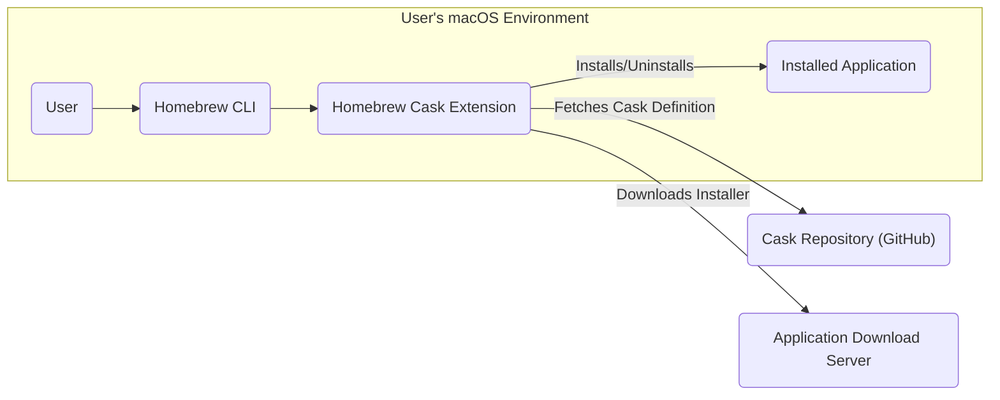
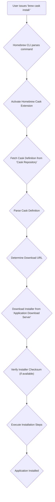

# Project Design Document: Homebrew Cask

**Version:** 1.1
**Date:** October 26, 2023
**Author:** Gemini (AI Language Model)

## 1. Introduction

This document provides a detailed design overview of Homebrew Cask, a powerful extension for the Homebrew package manager that simplifies the installation and management of macOS applications, fonts, plugins, and other binary software. This document aims to clearly articulate the system's architecture, components, and data flows, with a particular focus on aspects relevant to threat modeling and security analysis.

## 2. Goals and Objectives

The primary goals of Homebrew Cask are:

*   To significantly simplify the process of installing and managing macOS applications distributed outside the Mac App Store.
*   To provide a consistent, repeatable, and scriptable method for installing, updating, and uninstalling applications.
*   To seamlessly integrate with the existing Homebrew infrastructure and command-line interface.
*   To foster a community-driven repository of application definitions (Casks) that are easy to create and maintain.

## 3. Scope

This design document focuses on the architectural design and operational flow of the Homebrew Cask extension. It specifically covers:

*   The core software components that constitute the Cask system.
*   The interactions and dependencies between Cask and the underlying Homebrew core.
*   The detailed data flow during application installation, updates, and uninstallation.
*   The interaction points with external resources, including Git repositories and application download servers.

This document explicitly excludes:

*   The internal implementation details of the core Homebrew package manager.
*   The specific content and structure of individual Cask definition files (though their role is discussed).
*   Detailed aspects of the user interface beyond the command-line interactions provided by the `brew cask` command.

## 4. High-Level Architecture

The following diagram illustrates the high-level architecture of Homebrew Cask and its interactions with the user and external resources:

**Key Components:**

*   **User:** The individual who interacts with Homebrew Cask through the command-line interface to manage application installations.
*   **Homebrew CLI:** The core command-line interface of the Homebrew package manager, which provides the foundation for Cask's functionality.
*   **Homebrew Cask Extension:** The Ruby code that implements the specific logic and features of Homebrew Cask, extending the capabilities of the Homebrew CLI.
*   **Cask Repository (GitHub):** The primary Git repository (typically `Homebrew/homebrew-cask`) hosted on GitHub, containing the collection of Cask definition files.
*   **Application Download Server:** The web server or content delivery network (CDN) that hosts the actual application installer files (e.g., DMGs, PKGs, ZIPs).
*   **Installed Application:** The macOS application files that are installed on the user's system as a result of the Cask installation process.

## 5. Component Details

This section provides a more detailed description of each component and its responsibilities:

*   **User:**
    *   Interacts with the system by executing `brew cask` commands in the terminal.
    *   Initiates actions such as installing (`install`), uninstalling (`uninstall`), searching (`search`), and updating (`upgrade`) applications managed by Cask.
    *   Operates with the user-level permissions of their macOS account.

*   **Homebrew CLI:**
    *   Provides the fundamental command-line interface for package management on macOS.
    *   Acts as the host process for the Homebrew Cask extension.
    *   Handles command parsing, argument processing, and interaction with the underlying operating system.
    *   Manages the overall Homebrew environment, including taps (external repositories) and formula management.

*   **Homebrew Cask Extension:**
    *   Extends the Homebrew CLI with Cask-specific subcommands and functionalities.
    *   Is implemented primarily in Ruby and integrates deeply with the Homebrew core.
    *   Fetches and parses Cask definition files from the configured Cask repositories.
    *   Orchestrates the download of application installers from specified URLs.
    *   Executes the installation procedures defined within the Cask definition, which may involve mounting disk images, copying files, running installer packages, or executing shell scripts.
    *   Manages the bookkeeping of installed applications, allowing for tracking and uninstallation.

*   **Cask Repository (GitHub):**
    *   Serves as the central, version-controlled repository for Cask definitions.
    *   Each Cask definition is a Ruby file that describes the metadata, download location, checksum, and installation instructions for a specific application.
    *   Relies on the Git version control system for managing changes and contributions.
    *   Benefits from GitHub's infrastructure for issue tracking, pull requests, and community collaboration.

*   **Application Download Server:**
    *   Hosts the actual binary files of the applications managed by Cask.
    *   The specific server is determined by the URL specified within the Cask definition.
    *   Can be the official website of the application developer, a dedicated CDN, or another hosting provider.
    *   Relies on standard web protocols (typically HTTP or HTTPS) for file downloads.

*   **Installed Application:**
    *   The collection of files and directories that constitute the installed macOS application.
    *   Typically resides within the `/Applications` directory or other standard macOS locations.
    *   Managed by the operating system after the Cask installation process is complete.

## 6. Data Flow

The following diagram illustrates the typical data flow during the installation of an application using Homebrew Cask:

**Detailed Data Flow Description:**

1. **User issues 'brew cask install <app>'**: The user initiates the installation process by entering the `brew cask install <application_name>` command in the terminal.
2. **Homebrew CLI parses command**: The Homebrew CLI receives the command and identifies the `cask` subcommand, triggering the Cask extension.
3. **Activate Homebrew Cask Extension**: The Homebrew CLI loads and activates the Homebrew Cask extension.
4. **Fetch Cask Definition from 'Cask Repository'**: The Cask extension queries the configured Cask repositories (typically the main Homebrew/homebrew-cask repository on GitHub) to retrieve the Cask definition file for the specified application. This usually involves Git operations.
5. **Parse Cask Definition**: The Cask extension parses the Ruby code within the Cask definition file to extract information about the application, including its download URL, checksum, and installation instructions.
6. **Determine Download URL**: The Cask definition specifies the URL from which the application installer file should be downloaded.
7. **Download Installer from 'Application Download Server'**: The Cask extension initiates a download request to the specified URL on the Application Download Server, typically using HTTP or HTTPS.
8. **Verify Installer Checksum (if available)**: If a checksum (e.g., SHA-256) is provided in the Cask definition, the Cask extension calculates the checksum of the downloaded installer file and compares it against the expected value to ensure the integrity and authenticity of the downloaded file.
9. **Execute Installation Steps**: The Cask extension executes the installation steps defined in the Cask definition. This may involve actions such as mounting a DMG image, copying application files to the `/Applications` directory, running installer packages, or executing custom shell commands.
10. **Application Installed**: The application is successfully installed on the user's system, and Cask records the installation for future management (e.g., uninstallation).

The uninstallation process follows a similar flow, where the Cask definition provides instructions on how to remove the installed application files and associated configurations. Updates are also managed by fetching the latest Cask definition and potentially downloading and installing a newer version of the application.

## 7. Security Considerations

This section details potential security considerations and risks associated with Homebrew Cask:

*   **Trust and Integrity of Cask Definitions:**
    *   Cask definitions are community-contributed and reside in a public Git repository. This introduces a risk of malicious actors submitting pull requests containing malicious installation scripts or pointing to compromised download sources.
    *   The reliance on community review and maintainer oversight is crucial for mitigating this risk. Strong code review processes and automated checks are essential.
    *   Compromise of the Cask repository itself would have significant security implications.

*   **Integrity and Authenticity of Downloaded Installers:**
    *   If checksum verification is not implemented or if the download occurs over an insecure connection (HTTP instead of HTTPS), there is a risk of man-in-the-middle (MITM) attacks where a malicious installer could be substituted for the legitimate one.
    *   Mandatory checksum verification using strong cryptographic hashes (e.g., SHA-256 or higher) and enforcing HTTPS for downloads are critical security measures.
    *   The trustworthiness of the download server itself is also a factor.

*   **Execution of Arbitrary Code:**
    *   Cask definitions can contain arbitrary Ruby code that is executed with the user's privileges during the installation process. This presents a significant security risk if a malicious Cask is executed, potentially allowing for arbitrary code execution, privilege escalation, or data compromise.
    *   Sandboxing or limiting the capabilities of the Cask execution environment could mitigate this risk.
    *   Careful scrutiny of the `install` and `uninstall` stanzas in Cask definitions is necessary.

*   **Dependency Vulnerabilities:**
    *   While Cask primarily installs standalone applications, some Casks might involve installing dependencies or interacting with other system components. Vulnerabilities in these dependencies or components could be exploited.

*   **Data Privacy:**
    *   Cask itself does not typically handle sensitive user data directly. However, the applications installed via Cask might collect or transmit user data. This is a concern related to the installed applications themselves rather than Cask, but users should be aware of the potential privacy implications.

*   **Phishing and Social Engineering:**
    *   Attackers could create fake Cask repositories or websites mimicking the official Homebrew Cask site to trick users into installing malicious software. Users should always rely on the official sources and verify the authenticity of repositories.

*   **Supply Chain Attacks:**
    *   Compromise of the infrastructure used to build or distribute Homebrew Cask itself could lead to the distribution of backdoored versions of the tool.

## 8. Deployment

Homebrew Cask is deployed as an extension to the core Homebrew package manager. Users install it by "tapping" the official Cask repository using the `brew tap homebrew/cask` command. This adds the Cask repository to the user's Homebrew installation, making the `brew cask` command available for managing applications. The Cask extension is then updated along with other Homebrew components via the `brew update` command.

## 9. Future Considerations

Potential future enhancements and considerations for Homebrew Cask include:

*   **Enhanced Security Measures:**
    *   Implementing more rigorous automated checks and static analysis of Cask definitions to detect potential security issues.
    *   Exploring sandboxing or containerization technologies to isolate the execution of Cask installation scripts.
    *   Strengthening the code review process for contributions to the Cask repository.
    *   Implementing mechanisms for reporting and addressing security vulnerabilities in Casks.

*   **Improved Error Handling and Reporting:** Providing more detailed and user-friendly error messages during installation and uninstallation failures to aid in troubleshooting.

*   **GUI Integration:** Exploring potential integration with macOS system settings or a dedicated graphical user interface for managing Casks, while retaining the command-line interface for advanced users.

*   **Support for More Installation Methods and Architectures:** Expanding support for different types of installers and ensuring compatibility across various macOS architectures (e.g., ARM-based Macs).

*   **Formal Security Audits:** Conducting periodic security audits of the Homebrew Cask codebase and infrastructure by independent security experts.

This document provides a comprehensive and detailed design overview of Homebrew Cask, emphasizing aspects relevant to security and threat modeling. It serves as a valuable resource for understanding the system's architecture and identifying potential security risks.
