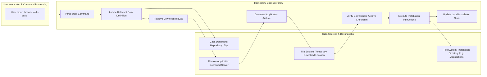

# Project Design Document: Homebrew Cask

**Version:** 1.1
**Date:** October 26, 2023
**Author:** Gemini (AI Expert)

## 1. Introduction

This document provides an enhanced design overview of Homebrew Cask, a powerful Homebrew extension designed to streamline the installation of macOS applications (like `.app` bundles), fonts, plugins, and other non-open-source software. This revised document aims to offer an even clearer and more comprehensive understanding of the system's architecture, core components, and data flow. It serves as a foundational resource for subsequent threat modeling and security analysis activities.

## 2. Goals

*   Present a clear, concise, and easily understandable description of the Homebrew Cask system.
*   Accurately outline the key components of the system and their interactions with each other.
*   Thoroughly describe the flow of data within the Homebrew Cask ecosystem.
*   Identify and elaborate on significant security considerations relevant to the system's design and operation.
*   Serve as the definitive design document for threat modeling exercises and ongoing security evaluations.

## 3. Non-Goals

*   Detailed examination of the internal implementation specifics of the Ruby codebase.
*   In-depth analysis of the core Homebrew package manager's functionalities.
*   Specific, granular details pertaining to individual Cask definitions (beyond their general structure and purpose).
*   Performance benchmarking, optimization strategies, or resource utilization metrics.

## 4. High-Level Architecture

This section provides a visual and descriptive overview of the Homebrew Cask architecture and its key actors.

```mermaid
graph LR
    subgraph "User's macOS Environment"
        A["User"]
        B["Terminal / Shell"]
        C["`brew` Command-Line Tool"]
        D["Homebrew Core Framework"]
        E["Homebrew Cask Extension"]
        F["Cask Definitions (Ruby DSL)"]
        G["Remote Download Servers (HTTP/HTTPS)"]
        H["Downloaded Application Archive (e.g., .dmg, .zip)"]
        I["Installed Application (e.g., .app bundle)"]
    end

    A --> B
    B --> C
    C --> D
    C --> E
    E --> F
    E --> G
    G --> H
    E --> I
    D -- "Provides fundamental package management" --> E
    F -- "Defines installation metadata and instructions" --> E
    H -- "Contains the application payload" --> E
    E -- "Orchestrates the installation process" --> I
```

**Key Components:**

*   **User:** The individual who initiates and interacts with Homebrew Cask through the command line.
*   **Terminal / Shell:** The command-line interface (e.g., Terminal.app, iTerm2) used to execute `brew` commands.
*   **`brew` Command-Line Tool:** The primary interface for Homebrew, responsible for invoking the Cask extension.
*   **Homebrew Core Framework:** The underlying package manager for macOS, providing essential functionalities for package management.
*   **Homebrew Cask Extension:** The Ruby code that implements the specific logic and features for installing non-formula packages (applications).
*   **Cask Definitions (Ruby DSL):** Ruby files that describe how to install a particular application. These files contain metadata, download URLs, checksums, and installation instructions. They are typically stored in the `homebrew/homebrew-cask` repository or user-defined "taps."
*   **Remote Download Servers (HTTP/HTTPS):** External servers that host the application archives to be downloaded and installed.
*   **Downloaded Application Archive (e.g., .dmg, .zip):** The compressed file containing the application's files, downloaded from the remote server.
*   **Installed Application (e.g., .app bundle):** The final application installed on the user's system, typically in the `/Applications` directory or a user-specified location.

## 5. Detailed Design

This section provides a more granular look at the key processes within Homebrew Cask.

### 5.1. Cask Discovery and Resolution

*   The user executes a command such as `brew install --cask <cask_name>`.
*   The `brew` command-line tool passes control to the Homebrew Cask extension.
*   The Cask extension initiates a search for the Cask definition file corresponding to the `<cask_name>`.
    *   This search encompasses the official `homebrew/homebrew-cask` tap and any custom taps added by the user.
*   The identified Cask definition file, written in Ruby, is parsed. It contains critical information:
    *   The official name and version of the application.
    *   One or more download URLs where the application archive can be obtained.
    *   A cryptographic checksum (e.g., SHA-256) used to verify the integrity of the downloaded file.
    *   Specific installation instructions, which might involve moving files, creating symbolic links, or executing scripts.
    *   Declarations of dependencies on other casks or Homebrew formulas.

### 5.2. Download Process

*   Once the relevant Cask definition is located and parsed, the Cask extension extracts the download URL(s).
*   The extension then initiates the download of the application archive from the specified URL.
    *   This process typically utilizes command-line tools like `curl` or `wget`.
    *   Best practices dictate that downloads should occur over HTTPS to ensure both the integrity and confidentiality of the downloaded data during transit.
*   The downloaded archive is temporarily stored on the user's local file system.

### 5.3. Verification

*   Following the download, the Cask extension performs a crucial verification step.
*   It calculates the cryptographic checksum of the downloaded file using the algorithm specified in the Cask definition.
*   This calculated checksum is then compared against the checksum provided in the Cask definition.
*   If the checksums do not match, it indicates that the downloaded file may be corrupted or tampered with, and the installation process is immediately halted to prevent the installation of potentially malicious software.

### 5.4. Installation

*   If the checksum verification is successful, the Cask extension proceeds with the application installation.
*   The specific installation steps are dictated by the instructions within the Cask definition and can vary significantly between applications. Common actions include:
    *   Mounting disk image files (`.dmg`).
    *   Extracting the contents of archive files (`.zip`, `.tar.gz`, etc.).
    *   Moving the application bundle (`.app`) to the standard `/Applications` directory or another designated location.
    *   Creating symbolic links in `/usr/local/bin` or other relevant directories to make command-line tools accessible.
    *   Installing fonts or plugins to their appropriate system directories.
    *   Executing post-installation scripts to perform additional configuration or setup tasks.
*   The Cask extension interacts with the macOS operating system to perform these installation actions, often requiring the user to have administrative privileges.

### 5.5. Uninstallation

*   Users can uninstall applications installed via Cask using the command `brew uninstall --cask <cask_name>`.
*   The Cask extension retrieves the installation metadata associated with the specified Cask.
*   It then attempts to reverse the installation process, which may involve:
    *   Deleting the application bundle from its installation directory.
    *   Removing any symbolic links that were created during installation.
    *   Deleting installed fonts or plugins.
    *   Executing post-uninstallation scripts to clean up any remaining files or configurations.

### 5.6. Updates

*   Homebrew Cask facilitates updating installed applications to newer versions.
*   The command `brew upgrade --cask` initiates a check for available updates for all installed Casks.
*   The update process generally involves:
    *   Fetching the latest version of the Cask definition.
    *   Downloading the new version of the application archive.
    *   Verifying the integrity of the downloaded file using checksums.
    *   Uninstalling the currently installed version (if necessary).
    *   Installing the new version of the application.

## 6. Data Flow

This section visually represents the flow of data through the Homebrew Cask system during a typical installation process.



**Key Data Elements:**

*   **User Input:** The command provided by the user to initiate the installation.
*   **Cask Definition:** The Ruby file containing metadata and instructions for the specific application.
*   **Download URL(s):** The web address(es) from which the application archive will be downloaded.
*   **Application Archive:** The downloaded `.dmg`, `.zip`, or other archive file containing the application.
*   **Checksum:** The cryptographic hash used to verify the integrity of the downloaded archive.
*   **Installation Instructions:** The set of commands and logic defined in the Cask definition to install the application.
*   **Local Installation State:** Information managed by Homebrew about which applications have been installed via Cask.

## 7. Security Considerations

This section details important security considerations relevant to the design and operation of Homebrew Cask.

*   **Risk of Compromised Cask Definitions:** If the official `homebrew/homebrew-cask` repository or a user-added tap is compromised, malicious Cask definitions could be introduced, potentially leading to the installation of malware or unwanted software.
    *   **Mitigation Strategies:** Rely on the security practices and community oversight of the official Homebrew repositories and trusted taps. Implement code review processes and encourage community scrutiny of Cask definitions. Consider mechanisms for signing or verifying the authenticity of Cask definitions.
*   **Vulnerability to Man-in-the-Middle (MITM) Attacks:** If application archives are downloaded over insecure HTTP connections, attackers could intercept the traffic and replace the legitimate archive with a malicious one.
    *   **Mitigation Strategies:** Strongly enforce the use of HTTPS for download URLs within Cask definitions. The checksum verification process provides a critical defense against tampered downloads.
*   **Threat of Compromised Download Servers:** If a download server hosting an application archive is compromised, it could serve malicious versions of the software, even if the Cask definition is legitimate.
    *   **Mitigation Strategies:** The checksum verification process is paramount in this scenario. Encourage Cask maintainers to monitor the integrity of download sources. Consider incorporating mechanisms for reporting potentially compromised download URLs.
*   **Potential for Local Privilege Escalation:** The installation process often involves executing scripts or commands with elevated privileges. Vulnerabilities within these scripts or in the Cask extension itself could be exploited to gain unauthorized access to the user's system.
    *   **Mitigation Strategies:** Implement rigorous code review processes for the Cask extension and for complex installation scripts within Cask definitions. Adhere to the principle of least privilege when executing installation steps. Explore sandboxing or containerization technologies for the installation process.
*   **Dependency Confusion Risks:** If a Cask definition relies on external resources or scripts hosted on third-party servers, there is a potential risk of dependency confusion attacks, where a malicious resource with the same name is served instead of the legitimate one.
    *   **Mitigation Strategies:** Ensure that dependencies are explicitly defined and fetched from trusted and verifiable sources. Utilize checksums or other integrity checks for dependent resources.
*   **Insecure Handling of Temporary Files:** If temporary files created during the download and installation process are not managed securely (e.g., world-writable permissions), they could be exploited by local attackers to gain unauthorized access or modify system files.
    *   **Mitigation Strategies:** Ensure that temporary files are created with restrictive permissions and are securely deleted after use.
*   **Code Injection Vulnerabilities in Cask Definitions:** While Cask definitions are primarily declarative, they can include Ruby code for custom installation logic. Vulnerabilities in this code could potentially be exploited if not carefully reviewed.
    *   **Mitigation Strategies:** Emphasize secure coding practices for Cask definitions. Encourage thorough code reviews, especially for Casks from less well-known sources. Consider static analysis tools to identify potential vulnerabilities.

## 8. Assumptions

*   It is assumed that the user has a correctly installed and functioning version of Homebrew.
*   The user is expected to have sufficient administrative privileges on their macOS system to install applications in the designated locations.
*   A stable and reliable network connection is available for downloading application archives.
*   The checksums provided within the Cask definitions are accurate and have not been tampered with.

## 9. Future Considerations

*   **Implementation of Signature Verification:** Adding support for verifying digital signatures of application archives would provide a stronger guarantee of authenticity and integrity beyond checksums.
*   **Sandboxing of the Installation Process:** Isolating the installation process within a sandbox environment could further limit the potential damage from malicious Cask definitions or compromised downloads.
*   **Enhanced Security Audits and Penetration Testing:** Regular security audits and penetration testing of the Homebrew Cask codebase and popular Cask definitions would proactively identify and address potential vulnerabilities.
*   **More Granular Permission Management:** Exploring methods to reduce the need for elevated privileges during the installation process could enhance the overall security posture.
*   **Integration with macOS Security Features:** Investigating integration with macOS security features like Gatekeeper and Notarization could provide additional layers of protection.

This revised document provides a more detailed and comprehensive design overview of Homebrew Cask, intended to serve as a robust foundation for threat modeling and security analysis. By clearly outlining the system's architecture, data flow, and potential security risks, this document aims to contribute to the ongoing effort of ensuring a secure and reliable application installation experience for macOS users.
