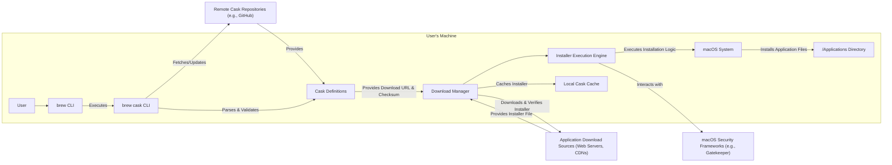
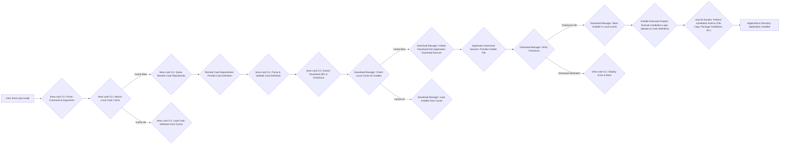
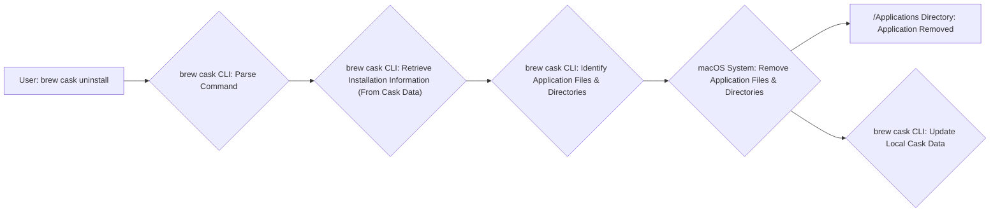

# Project Design Document: Homebrew Cask

**Version:** 1.1
**Date:** October 26, 2023
**Author:** AI Software Architect

## 1. Introduction

This document provides an enhanced and more detailed design overview of the Homebrew Cask project, building upon the previous version. It aims to provide a comprehensive understanding of the system's architecture, key components, data flows, and interactions, specifically tailored for subsequent threat modeling activities. The increased level of detail will facilitate a more thorough identification of potential security vulnerabilities and risks.

### 1.1. Purpose

The purpose of this document is to:

*   Provide a highly detailed and clear description of the architecture and functionality of Homebrew Cask.
*   Precisely identify key components, their specific responsibilities, and their interactions.
*   Thoroughly document data flows within the system, highlighting sensitive data and potential points of manipulation.
*   Serve as a robust foundation for identifying potential security threats, vulnerabilities, and attack vectors.
*   Act as a definitive reference for developers, security analysts, and anyone seeking a deep understanding of Homebrew Cask.

### 1.2. Scope

This document encompasses the core functionality of Homebrew Cask, with a granular focus on the installation, management (including updates and upgrades), and uninstallation of macOS applications. It delves into the command-line interface, the intricate mechanisms for fetching, verifying, and installing applications, and the interactions with the macOS operating system at a system call level where relevant.

### 1.3. Goals

The goals of this enhanced design document are to be:

*   Exhaustive: Covering all significant aspects of the system, including error handling and edge cases.
*   Unambiguous: Employing precise and unambiguous language, supplemented by detailed diagrams for clarity.
*   Granular: Providing a level of detail sufficient for in-depth threat modeling and security analysis.
*   Up-to-date: Reflecting the most current understanding of the system's implementation and behavior.

## 2. System Overview

Homebrew Cask, as an extension to Homebrew, streamlines the installation of macOS applications and other large binaries that are not typically managed through command-line compilation. It achieves this by downloading pre-packaged applications from their official sources, verifying their integrity, and installing them in designated locations, primarily the `/Applications` directory. The process is driven by "Cask" definitions, which are Ruby files containing the necessary instructions and metadata.

### 2.1. High-Level Architecture Diagram

### 2.2. Key Components

*   **User:** The entity interacting with Homebrew Cask via the command-line interface to manage application installations.
*   **`brew` CLI:** The foundational Homebrew command-line tool, providing the infrastructure and extension mechanism for Cask.
*   **`brew cask` CLI:** The specific command-line interface dedicated to Cask operations, handling user commands and orchestrating the installation process.
*   **Cask Definitions:** Ruby files containing declarative instructions and metadata for installing a specific application, including download URLs, checksums, and installation procedures.
*   **Download Manager:** The component responsible for fetching application installer files from remote sources, implementing integrity checks (checksum verification), and potentially caching downloaded files.
*   **Installer Execution Engine:** The module that executes the downloaded installer (e.g., `.dmg`, `.pkg`) or performs the steps defined in the Cask definition to install the application, interacting directly with the macOS system.
*   **macOS System:** The underlying operating system providing the environment for Homebrew Cask and the installed applications, including file system access, process execution, and security features.
*   **`/Applications` Directory:** The standard macOS directory where most applications are installed, serving as the primary target location for Cask installations.
*   **Local Cask Cache:** A local storage area where downloaded installers and potentially other Cask-related data are cached to optimize performance and reduce redundant downloads.
*   **Remote Cask Repositories:** Online repositories (typically Git repositories on platforms like GitHub) hosting the Cask definition files, acting as the source of truth for available applications.
*   **Application Download Sources:** The web servers, CDNs, or other online locations hosting the actual application installer files, as specified in the Cask definitions.
*   **macOS Security Frameworks:**  macOS built-in security mechanisms like Gatekeeper, notarization, and sandboxing that may interact with or be influenced by the Cask installation process.

## 3. Component Details

### 3.1. User

*   **Purpose:** To initiate and manage the lifecycle of macOS applications (installation, uninstallation, updates, upgrades) through the `brew cask` command-line interface.
*   **Functionality:** Executes commands such as `brew cask install <app>`, `brew cask uninstall <app>`, `brew cask upgrade <app>`, and related operations.
*   **Interactions:** Directly interacts with the `brew` CLI, specifically invoking the `brew cask` subcommand with various arguments and options.

### 3.2. `brew` CLI

*   **Purpose:** To serve as the core package management framework for macOS, providing the necessary infrastructure for extensions like Cask to operate.
*   **Functionality:** Manages the installation, updating, and removal of software packages and extensions, including the `brew cask` extension itself. Handles command-line argument parsing and execution.
*   **Interactions:** Provides the execution environment and core functionalities leveraged by the `brew cask` CLI.

### 3.3. `brew cask` CLI

*   **Purpose:** To offer a specialized command-line interface for managing macOS applications, simplifying their installation and management.
*   **Functionality:**
    *   Parses user-provided commands and arguments.
    *   Searches for relevant Cask definitions in configured Remote Cask Repositories.
    *   Retrieves, parses, and validates Cask definitions, ensuring their integrity and correctness.
    *   Orchestrates the download process by delegating tasks to the Download Manager.
    *   Invokes the Installer Execution Engine to perform the actual installation steps.
    *   Maintains metadata about installed applications, enabling tracking and management.
    *   Handles error conditions and provides feedback to the user.
*   **Interactions:**
    *   Receives commands from the User.
    *   Interacts with Remote Cask Repositories to fetch and update Cask definitions.
    *   Reads and interprets data from Cask Definitions.
    *   Instructs the Download Manager to download installer files.
    *   Triggers the Installer Execution Engine to initiate installation procedures.
    *   Interacts with the macOS System for file system operations, process execution, and accessing system information.

### 3.4. Cask Definitions

*   **Purpose:** To provide a structured and declarative method for describing the installation process of a specific macOS application.
*   **Functionality:** Contains Ruby code specifying:
    *   The unique identifier and version of the application.
    *   One or more download URLs for retrieving the application installer.
    *   Cryptographic checksums (typically SHA-256) for verifying the integrity of the downloaded installer.
    *   Detailed installation instructions, which may involve moving application bundles, running package installers, or executing custom scripts.
    *   Information about dependencies, conflicts with other applications, and potential caveats.
*   **Interactions:**
    *   Fetched from Remote Cask Repositories by the `brew cask` CLI.
    *   Parsed and validated by the `brew cask` CLI to ensure correctness and prevent malicious code injection.
    *   Provides crucial information (download URL, checksum, installation steps) to the Download Manager and Installer Execution Engine.

### 3.5. Download Manager

*   **Purpose:** To securely and efficiently download application installer files from remote sources and verify their integrity.
*   **Functionality:**
    *   Initiates HTTP/HTTPS requests to download files from specified URLs.
    *   Handles HTTP redirects and potential download failures.
    *   Verifies the integrity of downloaded files by comparing their checksum against the value provided in the Cask definition.
    *   May implement caching mechanisms to store downloaded installers in the Local Cask Cache, reducing download times for subsequent installations.
    *   Potentially interacts with macOS security features to ensure secure downloads.
*   **Interactions:**
    *   Receives download URLs and checksums from the `brew cask` CLI (derived from Cask definitions).
    *   Downloads installer files from Application Download Sources.
    *   Stores downloaded files in the Local Cask Cache.
    *   Provides the downloaded and verified installer file to the Installer Execution Engine.

### 3.6. Installer Execution Engine

*   **Purpose:** To execute the downloaded installer or perform the necessary actions to install the application on the macOS system.
*   **Functionality:**
    *   Identifies the type of installer (e.g., `.dmg`, `.pkg`, `.zip`, `.app` bundle).
    *   Mounts disk images (`.dmg`) to access their contents.
    *   Executes package installers (`.pkg`), potentially requiring elevated privileges.
    *   Extracts archives (`.zip`, `.tar.gz`, etc.).
    *   Copies application bundles (`.app`) to the `/Applications` directory or other specified locations.
    *   May execute post-installation scripts or perform other tasks defined in the Cask definition.
    *   Interacts with macOS security frameworks (e.g., Gatekeeper) during the installation process.
*   **Interactions:**
    *   Receives the downloaded installer file from the Download Manager.
    *   Interacts directly with the macOS System to perform file system operations, execute processes, and potentially request user authorization for privileged actions.
    *   May interact with macOS Security Frameworks to comply with security policies.

### 3.7. macOS System

*   **Purpose:** To provide the underlying operating system environment for Homebrew Cask and the applications it manages.
*   **Functionality:** Provides core system services, including file system management, process execution, memory management, and security features.
*   **Interactions:**
    *   Interacted with extensively by the `brew cask` CLI for file system operations (creating directories, moving files, checking file existence).
    *   Interacted with by the Installer Execution Engine to perform the actual installation of applications.
    *   Hosts the installed applications within the `/Applications` directory and other potential locations.
    *   Enforces security policies and restrictions that may affect the installation process.

### 3.8. `/Applications` Directory

*   **Purpose:** The conventional location for installing macOS applications, making them accessible through the Finder and Launchpad.
*   **Functionality:** Stores application bundles and related files.
*   **Interactions:** Applications are typically copied to this directory by the Installer Execution Engine as part of the installation process.

### 3.9. Local Cask Cache

*   **Purpose:** To store downloaded installer files and potentially other Cask-related data locally to improve performance and reduce network traffic.
*   **Functionality:** Caches downloaded installers, allowing for faster re-installations or installations on multiple machines.
*   **Interactions:**
    *   The Download Manager writes downloaded files to the cache.
    *   The Installer Execution Engine may read installer files from the cache.

### 3.10. Remote Cask Repositories

*   **Purpose:** To serve as a central repository for Cask definition files, making applications discoverable and manageable.
*   **Functionality:** Hosts and distributes Cask definition files, typically using Git version control.
*   **Interactions:**
    *   The `brew cask` CLI fetches and updates Cask definitions from these repositories.

### 3.11. Application Download Sources

*   **Purpose:** To host the actual application installer files that are downloaded and installed by Homebrew Cask.
*   **Functionality:** Provides downloadable files via HTTP/HTTPS. These are typically the official websites or CDNs of the application developers.
*   **Interactions:**
    *   The Download Manager downloads installer files from these sources based on URLs provided in Cask definitions.

### 3.12. macOS Security Frameworks

*   **Purpose:** To provide system-level security mechanisms that may influence or interact with the Cask installation process.
*   **Functionality:** Includes features like Gatekeeper (verifying application signatures), notarization (Apple's malware scanning service), and sandboxing (restricting application access to system resources).
*   **Interactions:**
    *   The Installer Execution Engine and the macOS System may interact with Gatekeeper to verify the integrity and legitimacy of downloaded applications.
    *   The installation process may be subject to sandboxing restrictions.

## 4. Data Flow Diagrams

### 4.1. Application Installation Flow (Detailed)

### 4.2. Application Uninstallation Flow

## 5. Security Considerations (Detailed)

This section expands upon the initial security considerations, providing more specific examples and potential attack vectors.

*   **Compromised Cask Repositories:**
    *   **Attack Vector:** An attacker gains control of a Remote Cask Repository and modifies existing Cask definitions or introduces new, malicious ones.
    *   **Impact:** Users installing applications through the compromised repository could unknowingly download and install malware.
    *   **Mitigation:** Rely on trusted and well-maintained repositories. Implement mechanisms for verifying the integrity and authenticity of Cask definitions (e.g., signing).
*   **Insecure Download Sources:**
    *   **Attack Vector:** Application Download Sources are compromised, serving malicious installers instead of legitimate ones.
    *   **Impact:** Even with a legitimate Cask definition, users could download and install malware.
    *   **Mitigation:** Cask definitions should ideally point to HTTPS URLs. Implement robust checksum verification. Consider verifying digital signatures of installers where available.
*   **Man-in-the-Middle Attacks:**
    *   **Attack Vector:** An attacker intercepts network traffic during the download process and replaces the legitimate installer with a malicious one.
    *   **Impact:** Users install malware disguised as the intended application.
    *   **Mitigation:** Enforce HTTPS for downloads. Implement strong checksum verification. Consider techniques like certificate pinning.
*   **Checksum Verification Bypass:**
    *   **Attack Vector:** Vulnerabilities in the Download Manager or `brew cask` CLI allow attackers to bypass or manipulate checksum verification.
    *   **Impact:** Malicious installers can be installed even if their checksum doesn't match the Cask definition.
    *   **Mitigation:** Implement robust and well-tested checksum verification logic. Ensure that checksums are retrieved securely and cannot be easily modified.
*   **Privilege Escalation:**
    *   **Attack Vector:** Malicious Cask definitions or installers exploit vulnerabilities to gain elevated privileges during the installation process.
    *   **Impact:** Attackers can gain control of the user's system.
    *   **Mitigation:** Minimize the need for elevated privileges during installation. Carefully review Cask definitions for potentially dangerous installation scripts. Leverage macOS security features to restrict installer actions.
*   **Local File Manipulation:**
    *   **Attack Vector:** Malicious Cask definitions contain instructions to modify or delete arbitrary files on the user's system.
    *   **Impact:** Data loss or system compromise.
    *   **Mitigation:** Implement strict validation of installation instructions in Cask definitions. Limit the actions that Cask can perform.
*   **Dependency Vulnerabilities:**
    *   **Attack Vector:** Homebrew Cask or its dependencies contain security vulnerabilities that can be exploited.
    *   **Impact:** System compromise or denial of service.
    *   **Mitigation:** Keep Homebrew Cask and its dependencies up-to-date. Regularly scan for vulnerabilities.
*   **Code Injection in Cask Definitions:**
    *   **Attack Vector:** Attackers inject malicious Ruby code into Cask definitions that is executed by the `brew cask` CLI.
    *   **Impact:** Arbitrary code execution on the user's system.
    *   **Mitigation:** Implement strict parsing and validation of Cask definitions. Sanitize any user-provided input. Consider using a safer, more restricted language for Cask definitions.
*   **Caching Vulnerabilities:**
    *   **Attack Vector:**  If the Local Cask Cache is not properly secured, attackers could replace cached installers with malicious ones.
    *   **Impact:** Users could unknowingly install malware from the cache.
    *   **Mitigation:** Secure the Local Cask Cache directory with appropriate permissions. Implement mechanisms to verify the integrity of cached files.

## 6. Future Considerations

*   **Enhanced Verification Mechanisms:** Implementing stronger verification methods for Cask definitions, such as digital signatures from trusted maintainers. Exploring methods for verifying the authenticity of download sources beyond basic HTTPS.
*   **Sandboxing of Installation Processes:** Investigating the feasibility of sandboxing the installation process to further isolate it from the rest of the system and limit the potential damage from malicious installers.
*   **User Interface Improvements:** Exploring more user-friendly interfaces beyond the command line, potentially a graphical application for managing Casks.
*   **Integration with System Integrity Protection (SIP) and Notarization:** Ensuring full compatibility with macOS security features like SIP and leveraging Apple's notarization service to enhance the security of installed applications.
*   **Formal Security Audits:** Conducting regular security audits of the Homebrew Cask codebase and infrastructure to identify and address potential vulnerabilities proactively.

## 7. Conclusion

This enhanced design document provides a comprehensive and detailed overview of the Homebrew Cask project, specifically tailored for in-depth threat modeling. By meticulously outlining the system's architecture, components, and data flows, and by elaborating on potential security considerations, this document serves as a valuable resource for identifying and mitigating potential risks. Continuous review and updates to this document are crucial to maintaining a secure and reliable application management system for macOS users.