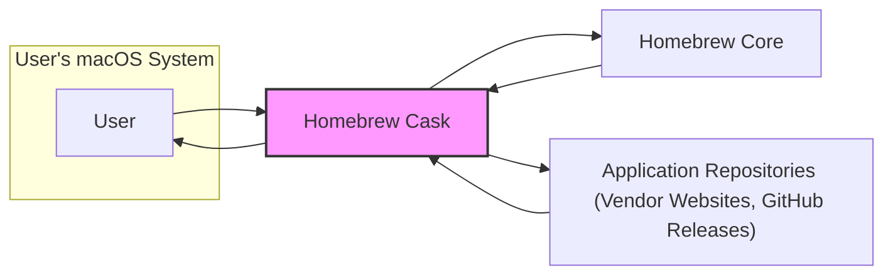
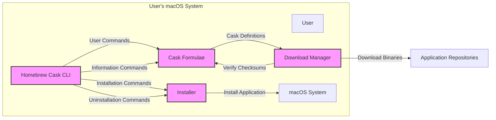
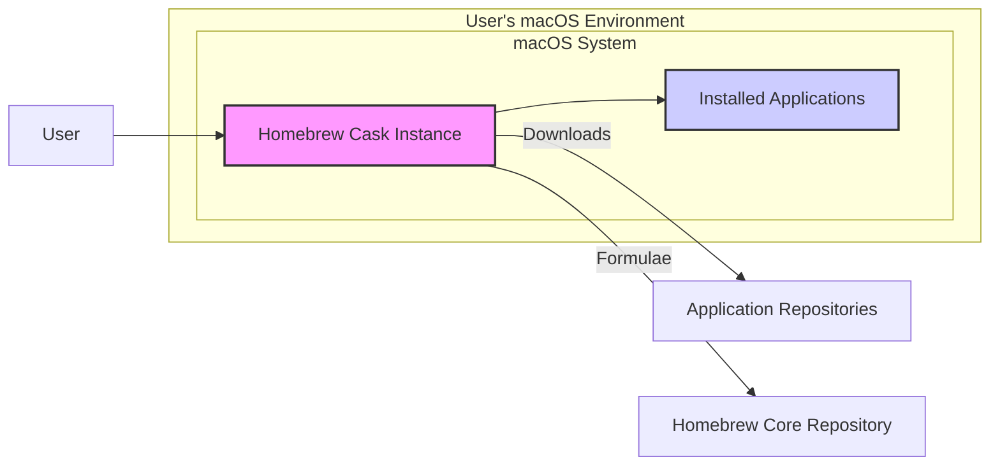

# BUSINESS POSTURE

- Business Priorities and Goals:
 - Provide a user-friendly command-line interface for installing and managing macOS applications (packages distributed as binaries).
 - Simplify the installation process for macOS applications, making it consistent and automated.
 - Offer a wide range of applications available for installation through a centralized repository.
 - Maintain a reliable and stable system for application management.
- Business Risks:
 - Introduction of malicious software through compromised casks, leading to user system compromise.
 - Casks failing to install or uninstall correctly, causing system instability or data loss.
 - Availability and reliability of application download sources, impacting user experience.
 - Reputation damage due to security incidents or unreliable application management.

# SECURITY POSTURE

- Existing Security Controls:
 - security control: Checksums (SHA-256) for downloaded application binaries, implemented in cask formulae.
 - security control: Community review of cask formulae through pull requests on GitHub, described in the contribution guidelines.
 - security control: Homebrew infrastructure for hosting and distributing cask formulae, assumed to have standard security measures.
 - security control: Code signing of Homebrew Cask CLI tool, assumed to be standard practice for macOS applications.
- Accepted Risks:
 - accepted risk: Reliance on external application vendors and their download sources, which may be compromised or unreliable.
 - accepted risk: Potential vulnerabilities in application binaries themselves, which are outside the scope of Homebrew Cask to control.
 - accepted risk: Risk of malicious casks being introduced despite community review, due to human error or sophisticated attacks.
- Recommended Security Controls:
 - security control: Automated vulnerability scanning of cask formulae for potential security issues (e.g., using linters or static analysis tools).
 - security control: Enhanced cask review process with dedicated security reviewers and checklists.
 - security control: Implement a system for reporting and quickly addressing malicious or vulnerable casks.
 - security control: User education and warnings about the risks of installing applications from untrusted sources, even through Homebrew Cask.
 - security control: Consider signing cask formulae themselves to ensure integrity and authenticity.
- Security Requirements:
 - Authentication: Not directly applicable to Homebrew Cask itself, as it relies on user's macOS user account for permissions.
 - Authorization: Homebrew Cask operates with user's permissions on macOS. Casks may require administrator privileges for installation, which is handled by macOS security prompts.
 - Input Validation: Cask formulae need robust validation to prevent injection attacks or unexpected behavior during parsing and execution. Validation should be performed on cask syntax, URLs, checksums, and installation scripts.
 - Cryptography: Checksums (SHA-256) are used for verifying downloaded application binaries. Consider using signatures for cask formulae to ensure authenticity and integrity.

# DESIGN

## C4 CONTEXT

### C4 Context Elements

- Element:
 - Name: User
 - Type: Person
 - Description: A macOS user who wants to install and manage applications using the command line.
 - Responsibilities: Initiates application installation and management commands using Homebrew Cask. Reviews and accepts security prompts during installation.
 - Security controls: macOS user account and permissions. User awareness of security risks associated with software installation.

- Element:
 - Name: Homebrew Cask
 - Type: Software System
 - Description: A macOS command-line tool that extends Homebrew to install and manage binary applications (casks).
 - Responsibilities: Provides CLI for cask management. Downloads cask formulae and application binaries. Verifies checksums. Executes installation and uninstallation scripts.
 - Security controls: Checksum verification. Community review of cask formulae. Code signing of Homebrew Cask CLI. Input validation of cask formulae.

- Element:
 - Name: Homebrew Core
 - Type: Software System
 - Description: The core package manager for macOS (and Linux), upon which Homebrew Cask is built. Provides infrastructure and dependencies for Homebrew Cask.
 - Responsibilities: Provides base package management functionality. Hosts and distributes Homebrew Cask formulae.
 - Security controls: Homebrew Core security infrastructure.

- Element:
 - Name: Application Repositories (Vendor Websites, GitHub Releases)
 - Type: External System
 - Description: External sources where application binaries are hosted. These can be vendor websites, GitHub release pages, or other download locations.
 - Responsibilities: Host and provide application binaries for download.
 - Security controls: HTTPS for download links (recommended). Checksums provided by vendors (sometimes). Vendor security practices.

## C4 CONTAINER

### C4 Container Elements

- Element:
 - Name: Homebrew Cask CLI
 - Type: Application
 - Description: Command-line interface for users to interact with Homebrew Cask. Parses user commands, interacts with other containers, and presents output to the user.
 - Responsibilities: Command parsing. Orchestration of cask operations (install, uninstall, etc.). User interaction.
 - Security controls: Input validation of user commands. Secure handling of user credentials (if any, though unlikely for cask itself). Code signing.

- Element:
 - Name: Cask Formulae
 - Type: Data Store
 - Description: Repository of cask definitions written in Ruby. Contains metadata about applications, download URLs, checksums, and installation instructions.
 - Responsibilities: Store cask definitions. Provide data for download manager and installer.
 - Security controls: Checksum verification of downloaded binaries based on formulae. Community review of formulae. Potential for signature of formulae (recommended).

- Element:
 - Name: Download Manager
 - Type: Application
 - Description: Responsible for downloading application binaries from specified URLs in cask formulae. Verifies checksums of downloaded files.
 - Responsibilities: Downloading files from URLs. Checksum verification. Handling download errors.
 - Security controls: HTTPS for downloads (enforced or recommended). Checksum verification against formulae.

- Element:
 - Name: Installer
 - Type: Application
 - Description: Executes installation and uninstallation scripts defined in cask formulae. Interacts with the macOS system to install applications.
 - Responsibilities: Application installation and uninstallation. Execution of installation scripts. System integration.
 - Security controls: Operates with user permissions. May require administrator privileges for certain installations (handled by macOS).

- Element:
 - Name: macOS System
 - Type: Container
 - Description: The underlying macOS operating system where Homebrew Cask and applications are installed.
 - Responsibilities: Provides the environment for running Homebrew Cask and installed applications. Manages user permissions and system security.
 - Security controls: macOS security features (Gatekeeper, System Integrity Protection, etc.). User account controls.

## DEPLOYMENT

### Deployment Elements

- Element:
 - Name: Homebrew Cask Instance
 - Type: Software Instance
 - Description: A running instance of the Homebrew Cask CLI tool on a user's macOS system.
 - Responsibilities: Executes user commands, manages cask installations, interacts with other system components and external repositories.
 - Security controls: Operates within the user's macOS security context. Relies on macOS security features.

- Element:
 - Name: Installed Applications
 - Type: Software Instance
 - Description: Applications installed and managed by Homebrew Cask on the user's macOS system.
 - Responsibilities: Provide application functionality to the user.
 - Security controls: Application-specific security controls. macOS security features protecting applications.

- Element:
 - Name: Application Repositories
 - Type: Infrastructure
 - Description: External servers hosting application binaries.
 - Responsibilities: Provide application binaries for download.
 - Security controls: HTTPS. Vendor security controls.

- Element:
 - Name: Homebrew Core Repository
 - Type: Infrastructure
 - Description: Repository hosting Homebrew Cask formulae and potentially related infrastructure.
 - Responsibilities: Provide cask formulae.
 - Security controls: Homebrew infrastructure security controls.

## BUILD

```mermaid
flowchart LR
    Developer["Developer"] --> CodeChanges["Code Changes (Cask Formulae, CLI Updates)"]
    CodeChanges --> GitHub["GitHub Repository (homebrew-cask/homebrew-cask)"]
    GitHub -- Pull Request --> Review["Code Review & Community Contribution"]
    Review --> MergedCode["Merged Code"]
    MergedCode --> CI["CI System (GitHub Actions)"]
    CI -- Build & Test --> Artifacts["Build Artifacts (Cask Formulae Updates, CLI Binaries)"]
    Artifacts --> Distribution["Distribution (Homebrew Core, GitHub Releases)"]
    style CI fill:#f9f,stroke:#333,stroke-width:2px
```

### Build Elements

- Element:
 - Name: Developer
 - Type: Person
 - Description: Contributors who develop and maintain Homebrew Cask, including cask formulae and CLI tool updates.
 - Responsibilities: Writing and updating cask formulae. Developing and maintaining the Homebrew Cask CLI.
 - Security controls: Developer code signing (for CLI contributions). Secure development practices.

- Element:
 - Name: GitHub Repository (homebrew-cask/homebrew-cask)
 - Type: Code Repository
 - Description: The primary source code repository for Homebrew Cask, hosted on GitHub.
 - Responsibilities: Version control. Collaboration platform. Hosting cask formulae and CLI code.
 - Security controls: GitHub access controls. Branch protection. Audit logs.

- Element:
 - Name: Code Review & Community Contribution
 - Type: Process
 - Description: Process of reviewing code changes (cask formulae and CLI updates) submitted as pull requests by the community.
 - Responsibilities: Ensure code quality and security. Identify and prevent malicious or erroneous changes.
 - Security controls: Mandatory code review for pull requests. Community scrutiny.

- Element:
 - Name: CI System (GitHub Actions)
 - Type: Automation System
 - Description: Continuous Integration system, likely GitHub Actions, used to automate the build, test, and release process for Homebrew Cask.
 - Responsibilities: Automated building of CLI binaries. Running tests. Publishing build artifacts.
 - Security controls: Secure CI/CD pipeline configuration. Access controls to CI system. Secrets management. Automated security checks (linters, static analysis - recommended).

- Element:
 - Name: Build Artifacts (Cask Formulae Updates, CLI Binaries)
 - Type: Data Artifact
 - Description: Output of the build process, including updated cask formulae and compiled CLI binaries.
 - Responsibilities: Distributable components of Homebrew Cask.
 - Security controls: Checksums of build artifacts. Signing of CLI binaries.

- Element:
 - Name: Distribution (Homebrew Core, GitHub Releases)
 - Type: Distribution System
 - Description: Mechanisms for distributing Homebrew Cask updates to users, likely through Homebrew Core and potentially GitHub Releases for CLI binaries.
 - Responsibilities: Making Homebrew Cask updates available to users.
 - Security controls: Secure distribution channels (HTTPS). Integrity checks during updates.

# RISK ASSESSMENT

- Critical Business Processes:
 - Application installation and management on macOS for users.
 - Maintaining the reputation and trustworthiness of Homebrew Cask as a reliable tool.
 - Ensuring the security and stability of user systems when using Homebrew Cask.
- Data to Protect and Sensitivity:
 - Integrity of user systems: High sensitivity. Malicious casks can compromise the entire system.
 - Availability of user systems: Medium sensitivity. Faulty casks can cause instability.
 - User data (indirectly): Low to Medium sensitivity. While Homebrew Cask doesn't directly handle user data, compromised applications installed through it could access user data. Cask formulae themselves are public data.

# QUESTIONS & ASSUMPTIONS

- Questions:
 - What is the detailed process for reviewing and approving new cask formulae and updates?
 - Are there any automated security scans performed on cask formulae or the Homebrew Cask CLI codebase?
 - Is there a formal incident response plan for handling reports of malicious or vulnerable casks?
 - How are checksums for application binaries generated and verified? Is this process documented and auditable?
 - Is there any mechanism for users to report potentially malicious casks or security vulnerabilities?
 - Are cask formulae signed to ensure their integrity and authenticity beyond community review?
 - What security measures are in place for the Homebrew Core infrastructure that hosts cask formulae?
- Assumptions:
 - BUSINESS POSTURE: The primary business goal is to provide a convenient and reliable application management tool for macOS users, with a strong emphasis on community contributions and a balance between ease of use and security.
 - SECURITY POSTURE: Security relies heavily on community review and checksum verification. There is an awareness of supply chain risks associated with external application sources. Security controls are primarily focused on preventing malicious casks from being introduced.
 - DESIGN: Homebrew Cask is designed as an extension to Homebrew Core, leveraging its infrastructure and package management principles. The architecture is relatively simple, focused on downloading, verifying, and installing applications based on community-maintained formulae. Deployment is user-side on macOS systems. Build process is likely automated using CI/CD pipelines.