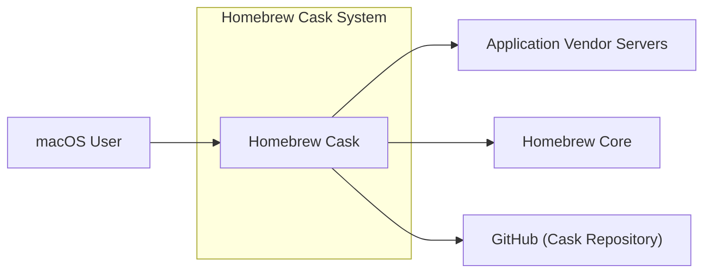
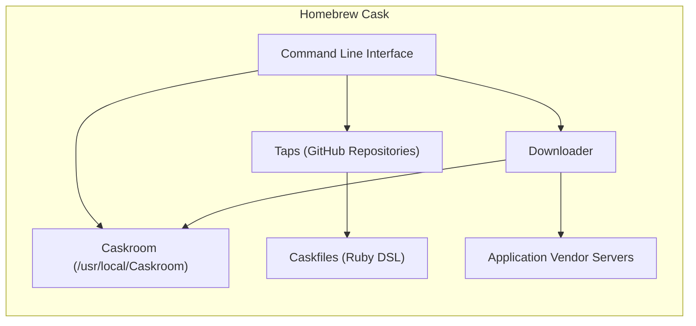
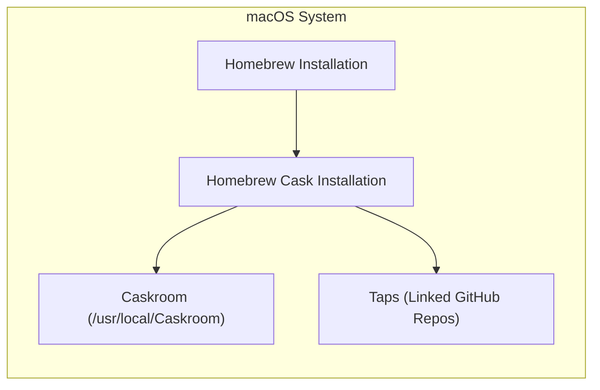
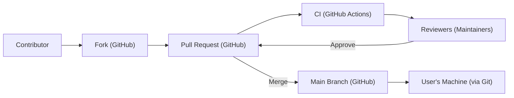

Okay, let's create a design document for the Homebrew Cask project, focusing on aspects relevant to threat modeling.

# BUSINESS POSTURE

Homebrew Cask extends Homebrew, a popular package manager for macOS, to manage the installation of graphical applications (like Google Chrome, VSCode, etc.).  The primary business goal is to provide a simple, reliable, and consistent way for macOS users to install, update, and uninstall applications.  This improves user experience and productivity.  The project is community-driven and open-source.

Business Priorities:

*   User Experience:  Easy installation and management of applications.
*   Reliability:  Applications install and function as expected.
*   Community Trust:  Maintain the trust of the large user base.
*   Maintainability:  Keep the project easy to maintain and contribute to.

Business Risks:

*   Malicious Casks:  The most significant risk is the potential for malicious actors to submit or modify casks (the installation scripts) to install malware or compromise user systems.  This could severely damage the project's reputation and harm users.
*   Broken Casks:  Incorrectly configured casks can lead to failed installations, broken applications, or system instability, frustrating users.
*   Supply Chain Attacks:  Compromise of the Homebrew Cask repository, build infrastructure, or distribution channels could allow attackers to inject malicious code.
*   Denial of Service:  While less critical than malware, attacks that prevent users from installing or updating applications can disrupt workflows.

# SECURITY POSTURE

Existing Security Controls:

*   security control: Code Review: All changes to the Homebrew Cask repository (casks and core code) go through a pull request review process on GitHub. This is the primary defense against malicious or incorrect casks. (Implemented in: GitHub repository and contribution guidelines)
*   security control: Community Moderation: The large and active Homebrew community acts as a distributed monitoring system, reporting broken or suspicious casks. (Implemented in: GitHub issues and community forums)
*   security control: Automated Checks: Some automated checks are in place to validate cask syntax and metadata. (Implemented in: CI workflows on GitHub)
*   security control: Sandboxing (macOS): macOS itself provides some level of sandboxing for applications, limiting the potential damage from a compromised application. (Implemented in: macOS operating system)
*   security control: Read-only Cask Repository: The main repository is read-only for most users, requiring pull requests for modifications. (Implemented in: GitHub repository permissions)

Accepted Risks:

*   accepted risk: Implicit Trust in Upstream Providers: Homebrew Cask, by its nature, downloads and installs software from third-party sources (the application developers' websites). There's an inherent risk in trusting these sources.
*   accepted risk: Limited Static Analysis: While some automated checks exist, they are not comprehensive and may not catch all potential security issues in casks.
*   accepted risk: Reliance on Community Reporting: The project heavily relies on the community to identify and report malicious or broken casks. This is reactive rather than proactive.

Recommended Security Controls:

*   security control: Enhanced Static Analysis: Implement more robust static analysis tools to scan casks for potentially malicious patterns, such as obfuscated code, network connections to suspicious domains, or attempts to modify system files.
*   security control: Cask Signing: Implement a system for digitally signing casks to verify their authenticity and integrity. This would help prevent tampering and ensure that users are installing the intended software.
*   security control: Two-Factor Authentication (2FA): Enforce 2FA for all maintainers and contributors with write access to the repository.
*   security control: Vulnerability Scanning: Regularly scan the codebase and dependencies for known vulnerabilities.

Security Requirements:

*   Authentication: Not directly applicable to the core functionality of Homebrew Cask (it doesn't manage user accounts). However, authentication is crucial for repository maintainers (via GitHub).
*   Authorization: GitHub repository permissions control who can modify casks and core code. This is crucial for preventing unauthorized changes.
*   Input Validation: Cask definitions should be strictly validated to prevent unexpected behavior or security vulnerabilities. This includes checking URLs, checksums, and other metadata.
*   Cryptography:
    *   Checksums (e.g., SHA256) are used to verify the integrity of downloaded application files.
    *   HTTPS should be enforced for all downloads to protect against man-in-the-middle attacks.
    *   Cask Signing (recommended) would use cryptographic signatures to verify cask authenticity.

# DESIGN

## C4 CONTEXT

C4 CONTEXT Elements:

*   Element:
    *   Name: macOS User
    *   Type: Person
    *   Description: A user of macOS who wants to install and manage applications.
    *   Responsibilities: Interacts with Homebrew Cask commands to install, update, and uninstall applications.
    *   Security controls: Relies on macOS security features and user-level security practices.

*   Element:
    *   Name: Homebrew Cask
    *   Type: Software System
    *   Description: The system for managing the installation of graphical applications on macOS.
    *   Responsibilities: Interprets cask definitions, downloads application files, and performs installation steps.
    *   Security controls: Code review, community moderation, automated checks, read-only repository.

*   Element:
    *   Name: Application Vendor Servers
    *   Type: External System
    *   Description: Servers hosting the application installers provided by the application developers.
    *   Responsibilities: Providing application installers for download.
    *   Security controls: Outside the direct control of Homebrew Cask; relies on the vendor's security practices.

*   Element:
    *   Name: Homebrew Core
    *   Type: External System
    *   Description: The core Homebrew package manager, which Homebrew Cask extends.
    *   Responsibilities: Provides core functionality for package management, including dependency resolution.
    *   Security controls: Similar to Homebrew Cask (code review, community moderation, etc.).

*   Element:
    *   Name: GitHub (Cask Repository)
    *   Type: External System
    *   Description: The Git repository hosted on GitHub that stores the cask definitions.
    *   Responsibilities: Storing cask definitions, managing pull requests, and providing version control.
    *   Security controls: GitHub's security features, including access controls, 2FA (recommended for maintainers), and audit logs.

## C4 CONTAINER

C4 CONTAINER Elements:

*   Element:
    *   Name: Command Line Interface (CLI)
    *   Type: Component
    *   Description: The user-facing interface for interacting with Homebrew Cask (e.g., `brew install --cask firefox`).
    *   Responsibilities: Parsing user commands, interacting with other components, and displaying output.
    *   Security controls: Input validation.

*   Element:
    *   Name: Caskroom (/usr/local/Caskroom)
    *   Type: Directory
    *   Description: The directory where downloaded and installed applications are stored.
    *   Responsibilities: Storing application files and metadata.
    *   Security controls: macOS file system permissions.

*   Element:
    *   Name: Taps (GitHub Repositories)
    *   Type: Repository
    *   Description: Git repositories containing cask definitions (default and user-added).
    *   Responsibilities: Providing cask definitions.
    *   Security controls: GitHub repository permissions, code review, community moderation.

*   Element:
    *   Name: Caskfiles (Ruby DSL)
    *   Type: File
    *   Description: Files written in a Ruby-based DSL that define how to install an application.
    *   Responsibilities: Specifying download URLs, checksums, installation steps, and dependencies.
    *   Security controls: Code review, automated checks, static analysis (recommended).

*   Element:
    *   Name: Downloader
    *   Type: Component
    *   Description: The component responsible for downloading application files from vendor servers.
    *   Responsibilities: Downloading files, verifying checksums, and handling network connections.
    *   Security controls: HTTPS enforcement, checksum verification.

*   Element:
    *   Name: Application Vendor Servers
    *   Type: External System
    *   Description: Servers hosting the application installers.
    *   Responsibilities: Providing application installers.
    *   Security controls: Outside the direct control of Homebrew Cask.

## DEPLOYMENT

Possible Deployment Solutions:

1.  User's Local Machine (Standard): Homebrew and Homebrew Cask are installed directly on the user's macOS machine.
2.  CI/CD Environment: Homebrew Cask can be used within CI/CD pipelines to set up build environments or test application installations.

Chosen Deployment Solution (Standard - User's Local Machine):

DEPLOYMENT Elements:

*   Element:
    *   Name: Homebrew Installation
    *   Type: Software Installation
    *   Description: The core Homebrew package manager installed on the user's system.
    *   Responsibilities: Providing the foundation for Homebrew Cask.
    *   Security controls: macOS file system permissions.

*   Element:
    *   Name: Homebrew Cask Installation
    *   Type: Software Installation
    *   Description: Homebrew Cask installed as an extension to Homebrew.
    *   Responsibilities: Managing the installation of graphical applications.
    *   Security controls: macOS file system permissions.

*   Element:
    *   Name: Caskroom (/usr/local/Caskroom)
    *   Type: Directory
    *   Description: The directory where downloaded and installed applications are stored.
    *   Responsibilities: Storing application files and metadata.
    *   Security controls: macOS file system permissions.

*   Element:
    *   Name: Taps (Linked GitHub Repos)
    *   Type: Directory
    *   Description:  Local clones of the GitHub repositories containing cask definitions.
    *   Responsibilities:  Providing access to cask definitions.
    *   Security controls: macOS file system permissions, Git's integrity checks.

## BUILD

Homebrew Cask itself doesn't have a traditional "build" process in the sense of compiling code.  The "build" is essentially the process of contributing and merging changes to the cask definitions (Caskfiles) in the GitHub repository.

Build Process Security Controls:

*   security control: Code Review: All changes go through pull requests and are reviewed by maintainers.
*   security control: Automated Checks (CI): GitHub Actions run automated checks to validate cask syntax and metadata.
*   security control: Branch Protection: The main branch is protected, requiring pull requests and reviews for all changes.
*   security control: (Recommended) 2FA for Maintainers: Enforce 2FA for all maintainers with write access.
*   security control: (Recommended) Enhanced Static Analysis: Integrate more robust static analysis tools into the CI pipeline.

# RISK ASSESSMENT

Critical Business Processes:

*   Application Installation: The core process of installing applications via `brew install --cask`.
*   Cask Update: Updating existing casks and installed applications.
*   Cask Management:  Listing, searching, and uninstalling casks.
*   Repository Maintenance:  The process of managing contributions and ensuring the integrity of the cask repository.

Data and Sensitivity:

*   Cask Definitions (Caskfiles):  These contain URLs, checksums, and installation instructions.  Sensitivity: Medium (could be manipulated to point to malicious downloads).
*   Downloaded Application Files:  These are the actual application installers. Sensitivity: High (could contain malware).
*   User System Files:  Homebrew Cask interacts with the user's file system. Sensitivity: High (compromise could lead to system-wide issues).
*   No Personally Identifiable Information (PII) is directly handled by Homebrew Cask itself.

# QUESTIONS & ASSUMPTIONS

Questions:

*   What is the current level of detail and coverage of the automated checks performed by GitHub Actions?
*   What are the specific criteria used by maintainers during code review to assess the security of a cask?
*   Are there any plans to implement cask signing or other integrity verification mechanisms?
*   What is the process for handling reported security vulnerabilities in casks?
*   How frequently are the core Homebrew and Homebrew Cask codebases audited for security vulnerabilities?

Assumptions:

*   BUSINESS POSTURE: The primary goal is to provide a convenient and reliable way to install applications, balancing security with usability.
*   SECURITY POSTURE: The project relies heavily on community contributions and code review as the primary security mechanisms.
*   DESIGN: The design is relatively simple, with the main complexity being in the cask definitions themselves and the interaction with external application vendor servers. The user's macOS system provides the underlying security context.