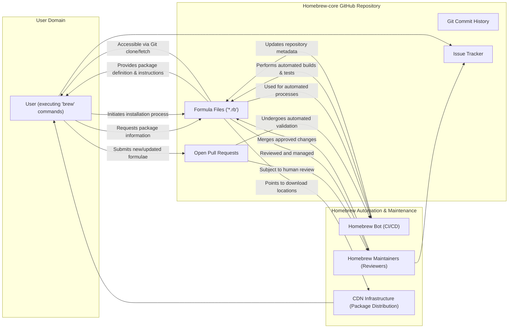

## Project Design Document: Homebrew-core (Improved)

**1. Introduction**

This document provides an enhanced design overview of the Homebrew-core project, a foundational component of the Homebrew package manager for macOS and Linux. The purpose of this document is to offer a clear and comprehensive understanding of Homebrew-core's architecture, constituent parts, and data movement, specifically tailored to facilitate subsequent threat modeling activities. This improved version aims to provide greater detail and clarity compared to the initial design.

**2. Goals and Objectives**

The core objectives of Homebrew-core are:

* **Authoritative Formula Repository:** To serve as the definitive, curated repository for Homebrew "formulae." These Ruby scripts contain the instructions for downloading, building, and installing software packages.
* **Community-Driven Expansion:** To foster a collaborative environment where community contributions of new software formulae and updates to existing ones are welcomed and managed.
* **Historical Package Management:** To maintain a complete history of formula modifications, enabling users to install specific historical versions of software packages when needed.
* **Declarative Dependency Management:** To explicitly define and manage the relationships (dependencies) between different software packages, ensuring a consistent and functional installation environment.
* **Cross-Platform Support:** To provide a unified package management experience across both macOS and Linux operating systems, adapting to platform-specific nuances.
* **Scriptable Package Management:** To enable seamless automation and scripting of package management tasks through the Homebrew command-line interface (`brew`).

**3. High-Level Architecture**

Homebrew-core is fundamentally a version-controlled collection of files, primarily Ruby scripts, managed within a Git repository. Interactions occur through the `brew` CLI, automated systems, and human maintainers.

**4. Detailed Design**

This section provides a more granular view of the key components within Homebrew-core.

* **Formula Files (`.rb`):**
    * These are Ruby Domain Specific Language (DSL) files, each representing a single software package.
    * Each formula file contains essential metadata:
        * `name`: The canonical name of the software package.
        * `version`: The specific version of the software being packaged.
        * `desc`: A concise description of the software.
        * `homepage`: The official website of the software project.
        * `license`: The licensing terms under which the software is distributed.
        * `stable`: Defines the primary download URL and associated checksum (e.g., SHA-256) for the stable release.
        * `head`: (Optional) Specifies the Git repository URL and commit identifier for building from the development branch.
        * `livecheck`: (Optional) Instructions for automatically checking for new versions.
        * `depends_on`: An array specifying other Homebrew packages that must be installed before this package.
        * `conflicts_with`: An array listing packages that cannot be installed alongside this one.
        * `patch`: (Optional) Instructions for applying patches to the source code before building.
        * `resource`: (Optional) Defines additional resources (e.g., data files) to be downloaded.
        * `install`: A Ruby block containing the commands to build and install the software.
        * `test`: A Ruby block containing commands to verify the installation.
    * Formula files are organized within the repository, often categorized into subdirectories (e.g., `Formula/a/`).

* **Git Repository (GitHub):**
    * Homebrew-core is hosted on GitHub, leveraging Git for version control and collaboration.
    * The complete history of every formula change is preserved, allowing for auditing and rollback.
    * Branching strategies are employed for development and managing contributions. The `master` branch typically reflects the current stable state.
    * Git tags are used to mark significant releases or milestones within the repository's history.

* **Pull Requests (GitHub):**
    * The primary mechanism for contributing new or updated formulae.
    * Each pull request represents a proposed set of changes to the repository.
    * Pull requests facilitate code review and discussion among contributors and maintainers.
    * Automated checks are triggered upon pull request creation and updates.

* **Homebrew Bot (Automation System):**
    * A suite of automated processes that ensure the quality and consistency of Homebrew-core.
    * Performs static analysis and linting of formula files to enforce style guidelines.
    * Executes automated builds and tests of formulae in isolated environments (using CI/CD pipelines).
    * Checks for dependency conflicts and circular dependencies.
    * May automatically update repository metadata, such as generating lists of available packages.
    * Can interact with external services, such as triggering CDN updates when new package versions are available.

* **Homebrew Maintainers:**
    * A group of trusted community members with write access to the Homebrew-core repository.
    * Responsible for reviewing and merging pull requests, ensuring the quality and security of contributions.
    * Provide guidance and feedback to contributors.
    * Address reported issues and bugs related to formulae.
    * Enforce contribution guidelines and community standards.

* **CDN Infrastructure:**
    * While not directly part of the Homebrew-core repository, the CDN is a critical dependency.
    * Formulae contain download URLs that often point to CDN locations for distributing pre-compiled binaries or source code archives.
    * The CDN ensures fast and reliable downloads for users worldwide.

* **Homebrew CLI (`brew`):**
    * The user's primary interface for interacting with Homebrew and Homebrew-core.
    * Responsible for fetching formula files from the local clone of the Homebrew-core repository or by fetching from GitHub.
    * Parses the Ruby code within formulae to extract package information, dependencies, and installation instructions.
    * Manages the download of software packages from the URLs specified in the formulae.
    * Performs checksum verification to ensure the integrity of downloaded files.
    * Executes the build and installation steps defined in the formula.

**5. Data Flow**

This section details the typical flow of data during common operations.

* **Package Installation:**
    1. **User Invocation:** A user executes `brew install <package_name>`.
    2. **Formula Lookup:** The `brew` CLI searches for the formula file corresponding to `<package_name>` within the local Homebrew-core repository.
    3. **Formula Retrieval & Parsing:** The formula file is read and parsed to extract metadata, including download URLs and checksums.
    4. **Dependency Analysis:** `brew` examines the `depends_on` section and recursively retrieves and parses the formulae for any required dependencies.
    5. **Download Initiation:** `brew` initiates downloads of the software package and its dependencies from the URLs specified in their respective formulae.
    6. **Checksum Verification:** After each download, `brew` calculates the checksum of the downloaded file and compares it against the checksum in the formula.
    7. **Build & Installation:** If the checksum is valid, `brew` executes the build and installation commands defined in the formula.
    8. **Installation Completion:** The software package is installed on the user's system.

* **Contributing a New Formula:**
    1. **Formula Creation (Local):** A contributor creates a new formula file locally, adhering to Homebrew's conventions.
    2. **Fork & Branch:** The contributor forks the Homebrew-core repository on GitHub and creates a new branch for their changes.
    3. **Formula Addition:** The new formula file is added to the forked repository.
    4. **Pull Request Submission:** The contributor submits a pull request from their branch to the main Homebrew-core repository.
    5. **Automated Checks:** The Homebrew bot automatically runs a series of checks on the pull request (linting, basic validation).
    6. **Maintainer Review:** Homebrew maintainers review the pull request, examining the formula for correctness, security, and adherence to guidelines.
    7. **Iteration & Updates:** Based on feedback, the contributor may need to update the formula and push new commits to the pull request.
    8. **Merge (Upon Approval):** If the review is successful, a maintainer merges the pull request into the main branch.
    9. **Repository Update:** The Homebrew-core repository is updated with the new formula.

**6. Key Interactions and Dependencies**

Homebrew-core relies on and interacts with several external systems and services:

* **GitHub (git-scm.com):**  Provides the platform for hosting the Git repository, managing pull requests, handling issue tracking, and authenticating contributors. This is the central hub for code management and collaboration.
* **Content Delivery Networks (Various Providers):** Host the downloadable software packages referenced in the formulae. Homebrew relies on the availability and integrity of these CDNs for successful package installations. The specific CDN used varies depending on the software being packaged.
* **Software Project Websites/Repositories (e.g., GitHub, GitLab, SourceForge):**  The ultimate source of the software packages. Formulae often link directly to official release pages or source code repositories hosted on these platforms. Homebrew depends on the stability and security of these upstream sources.
* **Homebrew Infrastructure (Internal Services):**  The broader Homebrew ecosystem includes the `brew` CLI tool, the Homebrew website (brew.sh), and potentially other internal services for managing bottles (pre-compiled binaries) and infrastructure. Homebrew-core is a core component of this larger ecosystem.

**7. Security Considerations (Detailed)**

This section expands on the initial security considerations, providing more specific examples and categorizations.

* **Formula Manipulation (Supply Chain Attacks):**
    * **Malicious Formula Insertion:** Attackers could attempt to introduce entirely malicious formulae designed to install malware or execute harmful commands.
    * **Formula Content Tampering:** Existing formulae could be modified to point to compromised download locations or include malicious build instructions.
    * **Dependency Confusion:** Attackers might create malicious packages with names similar to legitimate dependencies, hoping to be included in installations.

* **Infrastructure Security:**
    * **Compromised Maintainer Accounts:** If maintainer accounts are compromised, attackers could directly merge malicious pull requests or modify formulae. Multi-factor authentication is crucial here.
    * **Homebrew Bot Compromise:**  If the automation system is compromised, attackers could inject malicious code into the build process or manipulate repository metadata.
    * **GitHub Account Security:** The security of the Homebrew organization's GitHub account is paramount to prevent unauthorized access and modifications.

* **Download Integrity:**
    * **Compromised Download URLs:** If the download URLs in formulae are compromised, users could download malicious software instead of the intended package. HTTPS should be enforced.
    * **Checksum Mismatches:**  Attackers could try to provide a valid checksum for a malicious download. Strong cryptographic hash functions (SHA-256 or higher) are essential.
    * **Man-in-the-Middle Attacks:** While HTTPS helps, ensuring the integrity of the initial connection to download servers is important.

* **Code Execution Risks:**
    * **Unsafe Build Scripts:** Formulae contain Ruby code that is executed during the installation process. Vulnerabilities in this code could be exploited.
    * **Post-Install Scripts:** Some packages may execute scripts after installation, which could pose a security risk if not carefully vetted.

* **Dependency Management Issues:**
    * **Vulnerable Dependencies:** Formulae may depend on other packages with known security vulnerabilities. Automated vulnerability scanning of dependencies is important.
    * **Outdated Dependencies:**  Failure to update dependencies can leave users vulnerable to known exploits.

* **Pull Request Review Process Weaknesses:**
    * **Insufficient Review:**  If pull requests are not thoroughly reviewed, malicious or flawed contributions could be merged.
    * **Social Engineering:** Attackers might try to socially engineer maintainers into approving malicious changes.

**8. Deployment Model**

Homebrew-core is deployed as a public Git repository hosted on GitHub. Users interact with it in the following ways:

* **Local Cloning:** The `brew` CLI typically clones the Homebrew-core repository to the user's local machine upon initial installation. This provides a local copy of all formulae.
* **Remote Fetching:** The `brew update` command fetches the latest changes from the remote Homebrew-core repository on GitHub, keeping the local copy synchronized.
* **Direct GitHub Access:** Users and developers can directly access and browse the Homebrew-core repository on the GitHub website to view formulae, examine the commit history, and participate in discussions.
* **API Access (Indirect):** While there isn't a formal API for Homebrew-core, tools and scripts can interact with the repository data by cloning it and parsing the formula files.

This improved design document provides a more detailed and structured understanding of the Homebrew-core project, enhancing its value for subsequent threat modeling activities. The added granularity and clarity in the descriptions of components, data flows, and security considerations will facilitate a more comprehensive and effective threat analysis.
