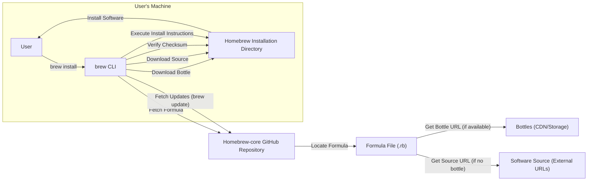

# Project Design Document: Homebrew-core

**Version:** 1.1
**Date:** October 26, 2023
**Author:** AI Software Architect

## 1. Introduction

This document provides a detailed design overview of the Homebrew-core project, located at [https://github.com/homebrew/homebrew-core](https://github.com/homebrew/homebrew-core). This document serves as a foundation for future threat modeling activities by outlining the key components, data flows, and interactions within the system. It aims to provide a comprehensive understanding of the project's architecture and functionality for security analysis.

## 2. Goals and Objectives

The primary goal of Homebrew-core is to provide a central, curated, and reliable repository of "formulae" – Ruby scripts that describe how to install software packages on macOS and Linux systems using the Homebrew package manager. Key objectives include:

* **Centralized Package Definitions:** Maintain a canonical and trustworthy collection of software installation recipes.
* **Ease of Use:** Provide a straightforward and consistent method for users to install software via the `brew` command-line interface (CLI).
* **Reproducibility:** Ensure software installations are consistent and repeatable across diverse environments.
* **Community Contribution:** Facilitate and manage contributions from the open-source community for adding, updating, and maintaining formulae.
* **Integration with Homebrew CLI:** Seamlessly integrate with the `brew` CLI tool for all package management operations.
* **Efficiency:** Provide pre-compiled binaries (bottles) where possible to speed up installations.

## 3. System Architecture

Homebrew-core is fundamentally a Git repository hosted on GitHub, containing a structured collection of Ruby files (formulae) and associated resources. It doesn't involve running persistent services but relies on the infrastructure provided by GitHub and external hosting for bottles.

### 3.1. Key Components

* **Formulae:** Ruby files residing within the `Formula/` directory. Each formula contains the instructions for installing a specific software package, including:
    * `url`: The primary download location for the software's source code.
    * `sha256`: A cryptographic hash for verifying the integrity of the downloaded source code.
    * `license`: The software license.
    * `depends_on`: A list of other Homebrew packages that must be installed beforehand.
    * `bottle`: Definitions for pre-compiled binary packages (bottles) for different operating systems and architectures, including their download URLs and checksums.
    * `install`: Ruby code defining the steps to build and install the software.
* **Bottles:** Pre-compiled binary packages for specific macOS and Linux distributions. These are typically stored on Content Delivery Networks (CDNs) or cloud storage services to provide fast downloads. Formulae reference these bottles to avoid local compilation.
* **`brew` CLI Tool:** The primary user interface for interacting with Homebrew. It performs actions such as:
    * Fetching and parsing formulae from Homebrew-core.
    * Downloading source code or bottles.
    * Verifying checksums.
    * Executing installation instructions defined in formulae.
    * Managing installed packages.
* **Homebrew Installation Directory:** The local directory on a user's machine where Homebrew is installed. This includes the `brew` CLI tool, downloaded formulae, downloaded source code/bottles, and installed software.
* **GitHub Repository (`homebrew/homebrew-core`):** The authoritative source for all formulae and related metadata. It leverages Git for version control, issue tracking, and pull request management for community contributions.
* **Homebrew Organization (GitHub):** The entity responsible for managing the `homebrew-core` repository, setting contribution guidelines, and ensuring the quality and security of the formulae.
* **Maintainers:** A group of trusted individuals within the Homebrew community who have the authority to review, approve, and merge contributions to Homebrew-core.
* **Taps:**  A mechanism for extending Homebrew's functionality by adding external repositories of formulae. While Homebrew-core is the main tap, users can add other taps for less common or specialized software.
* **Users:** Individuals who utilize the `brew` CLI to install and manage software packages defined within Homebrew-core and other taps.

### 3.2. Data Flow Diagram

### 3.3. Data Flow Description

The primary data flows within the Homebrew-core ecosystem are:

* **Formula Acquisition:**
    * When a user initiates an installation (e.g., `brew install <package>`), the `brew` CLI first contacts the `homebrew-core` GitHub repository.
    * It retrieves the relevant formula file (`.rb`) containing the installation instructions and metadata.
    * This formula is stored locally within the Homebrew installation directory.
* **Software Download (Bottles):**
    * If a bottle is available for the user's system, the formula provides the download URL and checksum of the pre-compiled binary.
    * The `brew` CLI downloads the bottle from the specified CDN or storage location.
    * The downloaded bottle is stored temporarily within the Homebrew installation directory.
* **Software Download (Source Code):**
    * If no bottle is available, the formula provides the URL and checksum of the software's source code.
    * The `brew` CLI downloads the source code from the external URL.
    * The downloaded source code is stored temporarily within the Homebrew installation directory.
* **Checksum Verification:**
    * After downloading either a bottle or source code, the `brew` CLI calculates the cryptographic hash of the downloaded file.
    * This calculated hash is compared against the `sha256` value specified in the formula.
    * This verification step ensures the integrity and authenticity of the downloaded file.
* **Installation Execution:**
    * The `brew` CLI executes the installation instructions defined within the formula.
    * For bottles, this typically involves extracting the pre-compiled binaries to the appropriate locations on the user's system.
    * For source code, this involves running build scripts (as defined in the formula) to compile the software and then installing the compiled binaries.
* **`brew update` Process:**
    * When a user runs `brew update`, the `brew` CLI fetches the latest changes from the `homebrew-core` Git repository.
    * This updates the local copies of all formulae, ensuring the user has access to the latest package definitions and versions.

## 4. Security Considerations

Security is paramount in Homebrew-core due to its role in installing software on user systems. Potential threats and mitigation strategies include:

* **Formula Integrity Compromise:**
    * **Threat:** Malicious actors could attempt to compromise the `homebrew-core` repository and modify formulae to inject malicious code or point to compromised download locations.
    * **Mitigation:**
        * Strong access controls and multi-factor authentication for maintainers.
        * Code review processes for all pull requests.
        * Git history and signing to track changes and verify authorship.
        * Monitoring for unauthorized changes to the repository.
* **Download Integrity Attacks (Bottles and Source Code):**
    * **Threat:** Attackers could compromise the servers hosting bottles or source code and replace legitimate files with malicious ones.
    * **Mitigation:**
        * Mandatory checksum verification (SHA256) for all downloaded files. The `brew` CLI will refuse to install if the checksum doesn't match.
        * Using HTTPS for all download URLs to ensure secure communication.
        * Encouraging the use of reputable and secure hosting providers for bottles.
* **Supply Chain Attacks:**
    * **Threat:**  The software being packaged in Homebrew-core could itself be compromised at its source.
    * **Mitigation:**
        * Relying on the security practices of upstream software projects.
        * Community scrutiny and reporting of suspicious packages.
        * Users should be aware of the software they are installing.
* **Maintainer Account Compromise:**
    * **Threat:** If a maintainer's GitHub account is compromised, an attacker could merge malicious changes.
    * **Mitigation:**
        * Enforcing strong passwords and multi-factor authentication for maintainer accounts.
        * Auditing maintainer activity.
* **`brew` CLI Vulnerabilities:**
    * **Threat:** Security vulnerabilities in the `brew` CLI tool itself could be exploited to compromise user systems.
    * **Mitigation:**
        * Regular security audits and penetration testing of the `brew` CLI codebase.
        * Prompt patching of identified vulnerabilities.
* **Tap Security:**
    * **Threat:**  Adding untrusted taps can expose users to potentially malicious formulae.
    * **Mitigation:**
        * Users should exercise caution when adding third-party taps.
        * Homebrew provides warnings about the risks of using external taps.
* **Execution Security:**
    * **Threat:**  The `install` scripts within formulae are executed with user privileges and could potentially perform malicious actions.
    * **Mitigation:**
        * Code review of formulae aims to identify potentially harmful scripts.
        * Users should be aware of the actions performed by installation scripts.
        * Consider future enhancements like sandboxing or more restricted execution environments for install scripts.

## 5. Deployment

Homebrew-core's "deployment" is not a traditional server-based deployment but rather the distribution and consumption of its formulae by users.

* **GitHub Repository Hosting:** The primary deployment is the hosting of the `homebrew-core` Git repository on GitHub, making the formulae accessible to the `brew` CLI.
* **User-Driven Deployment:** Users "deploy" Homebrew-core to their local machines by installing the `brew` CLI, which then interacts with the GitHub repository.
* **Distributed Bottle Storage:** Bottles are deployed to and served from a distributed network of CDNs and cloud storage providers, ensuring efficient downloads for users globally. The specific locations are defined within the formulae.

## 6. Technologies Used

* **Git:**  For distributed version control of formulae and managing the repository history.
* **Ruby:** The programming language used for writing formulae and the `brew` CLI tool.
* **GitHub:**  The platform hosting the `homebrew-core` repository, providing features for collaboration, issue tracking, and pull request management.
* **SHA256:**  The cryptographic hash algorithm used for verifying the integrity of downloaded files (bottles and source code).
* **HTTPS:**  The secure protocol used for downloading files, ensuring confidentiality and integrity during transit.
* **Various Build Systems (Make, CMake, Autotools, etc.):**  Tools used within the installation instructions of formulae to build software from source code.
* **Package Management Systems (dpkg, rpm, etc.):** Underlying operating system package management tools that Homebrew interacts with for final software installation.

## 7. Future Considerations

Potential future developments and considerations include:

* **Enhanced Formula Verification:** Implementing more rigorous automated checks and static analysis of formulae to identify potential security issues.
* **Improved Supply Chain Security Measures:** Exploring methods for verifying the provenance and integrity of upstream software dependencies.
* **Fine-grained Permissions for Install Scripts:**  Investigating ways to limit the privileges of installation scripts to minimize potential damage from malicious code.
* **Formal Security Audits:** Conducting regular independent security audits of both the `brew` CLI and the Homebrew-core repository.
* **Standardized Security Metadata:**  Potentially adding more structured security-related metadata to formulae.

This document provides a comprehensive design overview of Homebrew-core, focusing on aspects relevant to threat modeling. The detailed description of components, data flows, and security considerations will serve as a valuable resource for identifying and mitigating potential security risks associated with the project.