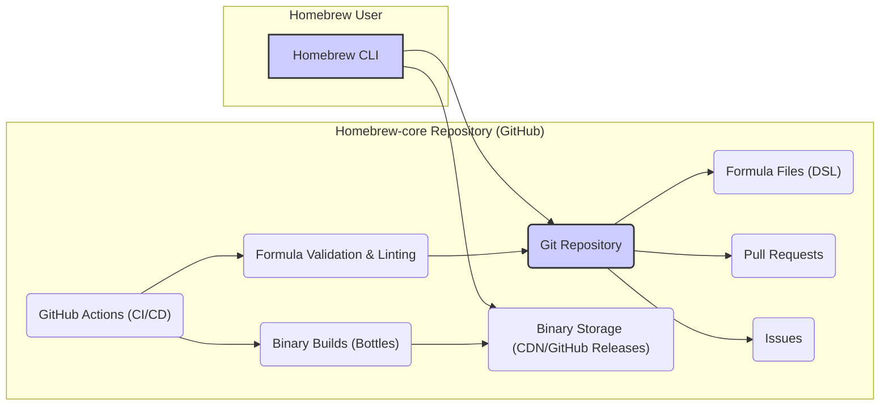
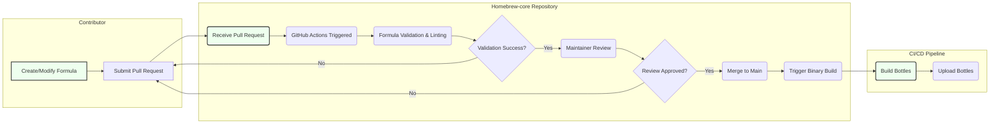
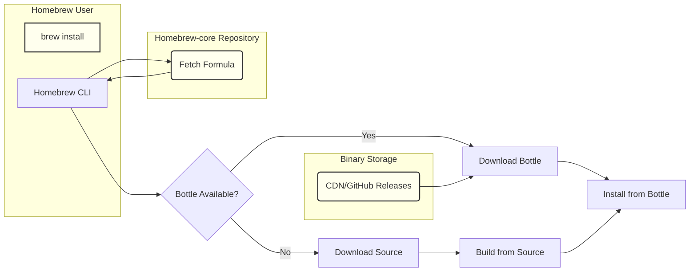

# Project Design Document: Homebrew-core

**Version:** 2.0
**Date:** October 26, 2023
**Author:** AI Software Architect

## 1. Introduction

This document provides an enhanced and more detailed design overview of the Homebrew-core project, located at [https://github.com/homebrew/homebrew-core](https://github.com/homebrew/homebrew-core). Building upon the previous version, this document further clarifies the project's architecture, components, data flow, and key security considerations, making it even more suitable for subsequent threat modeling activities. Homebrew-core remains the central repository for formulae, which are Ruby scripts defining how software packages are downloaded, built, and installed by the Homebrew package manager.

## 2. Goals and Objectives

*   Provide a comprehensive and granular architectural overview of Homebrew-core.
*   Clearly identify and describe the purpose and interactions of each key component.
*   Detail the data flow within the project, including specific actions and data transformations.
*   Thoroughly highlight security-relevant aspects, providing context for potential threats.
*   Serve as a robust and detailed foundational document for security analysis and risk assessment, specifically for threat modeling exercises.

## 3. Architectural Overview

Homebrew-core's architecture revolves around the Git repository and the lifecycle of formulae within it. The system involves contributions, automated processes, and user interactions.

## 4. Key Components

*   **Git Repository:** The foundational element, hosted on GitHub, providing version control and a collaborative platform.
    *   Stores the complete history of all formulae and supporting files.
    *   Manages branching, merging, and access control through GitHub's features.
    *   Serves as the single source of truth for the project's state.
*   **Formula Files (DSL):** Ruby scripts adhering to a Domain Specific Language (DSL) that define package installation procedures.
    *   Specify download URLs, often with checksums (SHA256, etc.) for integrity verification.
    *   Declare dependencies on other formulae or system libraries.
    *   Contain build instructions, including commands to compile and install the software.
    *   Define installation steps, including file placement and configuration.
    *   Undergo community review and validation to ensure correctness and security.
*   **Pull Requests:** The collaborative mechanism for proposing changes to formulae.
    *   Submitted by contributors to introduce new formulae or update existing ones.
    *   Require review and approval by maintainers before being merged.
    *   Act as a point of scrutiny for potential security vulnerabilities or errors.
    *   Trigger automated checks via GitHub Actions.
*   **Issues:** The system for reporting bugs, suggesting enhancements, and discussing topics related to formulae and the repository.
*   **GitHub Actions (CI/CD):** The automation platform for various tasks triggered by events in the repository.
    *   Provides the infrastructure for automated testing and building.
    *   Executes workflows defined in `.github/workflows`.
*   **Formula Validation & Linting:** Automated checks performed by GitHub Actions to ensure formula quality.
    *   Verifies the syntax and structure of the Ruby code in formulae.
    *   Enforces style guidelines and best practices.
    *   May include checks for potential security issues or common errors.
*   **Binary Builds (Bottles):** The process of pre-compiling and packaging software binaries for different operating systems and architectures.
    *   Results in "bottles," which are compressed archives containing pre-built binaries.
    *   Significantly speeds up the installation process for users.
    *   Builds are typically performed in isolated environments within GitHub Actions.
*   **Binary Storage (CDN/GitHub Releases):** The location where pre-built binaries are stored and served to users.
    *   Often utilizes a Content Delivery Network (CDN) for efficient and fast distribution.
    *   GitHub Releases may also be used for storing and distributing bottles.
*   **Homebrew CLI:** The client-side application used by end-users to interact with Homebrew.
    *   Fetches formula definitions from the Homebrew-core repository (primarily the `master` branch).
    *   Parses formulae to determine download locations, dependencies, and installation instructions.
    *   Downloads pre-built binaries (bottles) if available and applicable to the user's system.
    *   Downloads source code if a bottle is not available or the user requests a source installation.
    *   Executes build and installation steps as defined in the formula.

## 5. Data Flow

The data flow within Homebrew-core can be broken down into two primary paths: formula contribution and user installation.

**5.1 Formula Contribution Flow:**

1. **Contributor Action:** A contributor creates or modifies a formula file locally.
2. **Pull Request Submission:** The contributor submits a pull request to the Homebrew-core repository on GitHub.
3. **Automated Validation:** GitHub Actions is triggered, running formula validation and linting checks.
4. **Validation Results:** The results of the automated checks are reported back to the pull request.
5. **Maintainer Review:** Maintainers review the proposed changes, examining the formula's correctness, security implications, and adherence to guidelines.
6. **Feedback and Iteration:** Maintainers may provide feedback, requiring the contributor to make revisions.
7. **Merging:** Once approved, a maintainer merges the pull request into the main branch of the repository.
8. **CI/CD Trigger:** Merging the pull request triggers the CI/CD pipeline to build bottles for the updated or new formula.
9. **Binary Build:** GitHub Actions executes the build process in isolated environments.
10. **Binary Upload:** Successfully built bottles are uploaded to the designated binary storage location (CDN or GitHub Releases).

**5.2 User Installation Flow:**

1. **User Command:** A user executes a command in the Homebrew CLI to install a package (e.g., `brew install <package>`).
2. **Formula Retrieval:** The Homebrew CLI fetches the corresponding formula from the Homebrew-core repository.
3. **Bottle Check:** The CLI checks if a pre-built binary (bottle) is available for the user's operating system and architecture.
4. **Binary Download (If Available):** If a bottle is available, the CLI downloads it from the CDN or GitHub Releases.
5. **Source Download (If No Bottle):** If a bottle is not available, the CLI downloads the source code as specified in the formula.
6. **Dependency Resolution:** The CLI resolves and downloads any dependencies specified in the formula.
7. **Installation:** The CLI executes the installation steps defined in the formula, either by extracting the bottle or by building from source.

## 6. Security Considerations

Security is a paramount concern for Homebrew-core due to its role in distributing software to a large user base. Key security considerations include:

*   **Formula Integrity:** Ensuring that formulae are not malicious or compromised.
    *   **Automated Validation:** Helps catch syntax errors and potential issues but may not detect sophisticated attacks.
    *   **Maintainer Review:** A crucial human element in verifying the correctness and safety of formulae.
    *   **Checksum Verification:** Formulae specify checksums for downloaded resources to ensure integrity.
*   **Supply Chain Security:** Protecting against vulnerabilities introduced through dependencies or build processes.
    *   **Dependency Review:** Maintainers assess the security of dependencies.
    *   **Isolated Build Environments:** GitHub Actions provides isolated environments to minimize the risk of build-time compromises.
*   **Binary Integrity:** Guaranteeing that pre-built binaries ("bottles") are authentic and haven't been tampered with.
    *   **Potential for Binary Signing:** While not currently universally implemented, signing bottles would provide stronger assurance of their origin and integrity.
    *   **Secure Storage and Delivery:** Relying on the security of CDN and GitHub Releases infrastructure.
*   **CI/CD Pipeline Security:** Securing the GitHub Actions workflows and the infrastructure they run on.
    *   **Access Control:** Limiting who can modify workflows and secrets.
    *   **Secret Management:** Securely storing and using API keys and other sensitive information.
    *   **Dependency Management for CI/CD:** Ensuring the tools used in the CI/CD pipeline are secure.
*   **Maintainer Account Security:** Protecting maintainer accounts from compromise.
    *   **Strong Authentication:** Encouraging or enforcing multi-factor authentication.
    *   **Limited Permissions:** Granting only necessary permissions to maintainers.
*   **GitHub Infrastructure Security:** Relying on the security measures implemented by GitHub.
*   **"Tap" Security:** While this document focuses on `homebrew/homebrew-core`, users can add third-party "taps," which introduces additional security considerations outside the scope of this document but worth noting for the broader Homebrew ecosystem.
*   **Rate Limiting and Abuse Prevention:** Implementing measures to prevent abuse of the repository and CI/CD resources.

## 7. Deployment Considerations

*   **GitHub Repository:** The primary deployment is the Git repository hosted on GitHub.
*   **GitHub Actions Infrastructure:** The CI/CD pipeline is deployed and executed on GitHub's infrastructure.
*   **Content Delivery Network (CDN):**  Bottles are typically deployed to a CDN (e.g., Fastly) for efficient distribution to users globally.
*   **GitHub Releases:**  May also be used as a storage and distribution mechanism for bottles.

## 8. Technologies Used

*   **Git:** Distributed version control system.
*   **GitHub:** Platform for repository hosting, collaboration, and CI/CD.
*   **Ruby:** Programming language used for defining formulae.
*   **GitHub Actions:** Workflow automation platform for CI/CD.
*   **Bash/Shell Scripting:** Commonly used within formulae for build and installation instructions.
*   **Various Build Tools:** Compilers (e.g., `gcc`, `clang`), linkers, and other tools specific to the software being packaged.
*   **Content Delivery Network (CDN):** For distributing binary packages efficiently.

## 9. Future Considerations

*   **Enhanced Security Audits:** Regular and thorough security audits of the codebase, infrastructure, and processes.
*   **Formal Binary Signing:** Implementing a robust system for signing pre-built binaries.
*   **Improved Dependency Vulnerability Scanning:** Integrating more sophisticated tools for detecting vulnerabilities in package dependencies.
*   **Stricter Formula Review Processes:** Continuously refining the review process to catch potential security issues.
*   **Community Security Engagement:** Encouraging and facilitating community involvement in security efforts.

This improved design document provides a more granular and detailed understanding of the Homebrew-core project. The enhanced descriptions of components, the clearer articulation of data flows, and the more specific security considerations make this document a valuable resource for conducting thorough threat modeling activities.