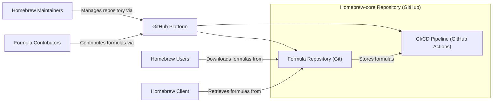
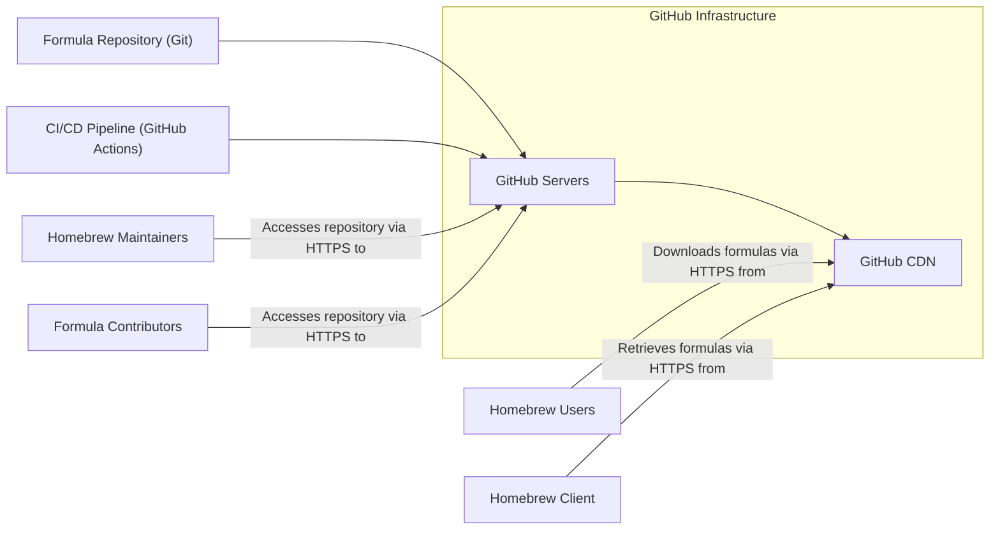
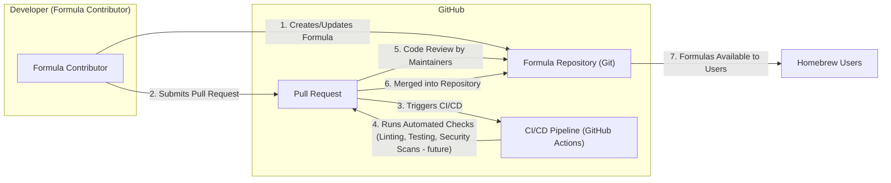

# BUSINESS POSTURE

- Business Priorities and Goals:
  - Provide a comprehensive and reliable repository of software formulas for the Homebrew package manager.
  - Enable Homebrew users to easily discover, install, and manage software packages on macOS and Linux.
  - Maintain an up-to-date catalog of software formulas, reflecting the latest software releases and updates.
  - Foster a collaborative community of contributors to expand and improve the formula repository.

- Business Risks:
  - Risk of malicious formulas being introduced into the repository, potentially compromising user systems.
  - Risk of formula availability issues, disrupting users' ability to install or update software.
  - Risk of formula integrity compromise, leading to users installing incorrect or tampered software.
  - Risk of reputational damage if the repository is perceived as insecure or unreliable.
  - Risk of operational disruption due to infrastructure failures or security incidents.

# SECURITY POSTURE

- Existing Security Controls:
  - security control: Code Review - Formula contributions are reviewed via GitHub Pull Requests by Homebrew maintainers. Implemented in: GitHub Pull Request workflow.
  - security control: Automated Linting and Testing - Formulas are automatically checked for syntax errors and basic functionality using linters and tests in CI. Implemented in: GitHub Actions workflows.
  - security control: Community Reporting - Users can report issues and vulnerabilities through GitHub issues. Implemented in: GitHub Issue tracking system.
  - security control: GitHub Security Features - Reliance on GitHub's platform security features, including access controls, audit logs, and vulnerability scanning for the underlying infrastructure. Implemented in: GitHub platform.

- Accepted Risks:
  - accepted risk: Potential for vulnerabilities in formulas due to the large volume of contributions and the complexity of software packages.
  - accepted risk: Reliance on volunteer maintainers and community contributions for security monitoring and incident response.
  - accepted risk: Risk of supply chain attacks targeting upstream software sources referenced in formulas.
  - accepted risk: Limited resources for dedicated security testing and in-depth formula security audits.

- Recommended Security Controls:
  - security control: Formalized Security Review Process - Implement a more structured security review process specifically focused on identifying potential security vulnerabilities in formulas, beyond basic functionality and syntax.
  - security control: Automated Security Scanning - Integrate automated security scanning tools into the CI/CD pipeline to detect known vulnerabilities in formula dependencies and potential security issues in formula code.
  - security control: Dependency Scanning - Implement dependency scanning to track and manage dependencies of formulas and identify vulnerable dependencies.
  - security control: Formula Signing or Checksumming - Introduce a mechanism to sign or checksum formulas to ensure integrity and authenticity, preventing tampering during distribution.
  - security control: Vulnerability Disclosure Program - Establish a clear vulnerability disclosure program to encourage responsible reporting of security issues and streamline the vulnerability remediation process.

- Security Requirements:
  - Authentication:
    - Requirement: While direct authentication to the repository is not applicable for public access, authentication is required for maintainers and contributors to manage the repository and submit changes via GitHub accounts.
    - Requirement: Consider authentication mechanisms for future potential features that might require user-specific actions or data.

  - Authorization:
    - Requirement: Implement fine-grained authorization controls within GitHub to manage permissions for maintainers, contributors, and automated systems to access and modify repository content.
    - Requirement: Define clear roles and responsibilities for maintainers and contributors regarding formula management and security.

  - Input Validation:
    - Requirement: Rigorously validate formula syntax and structure to prevent injection attacks or other forms of malicious formula construction.
    - Requirement: Validate URLs and checksums of upstream software sources to ensure they are legitimate and haven't been tampered with.
    - Requirement: Implement input validation for any user-provided data in future features, such as search queries or formula submission forms (if introduced).

  - Cryptography:
    - Requirement: Utilize HTTPS for all communication to and from the repository to protect data in transit. Implemented in: GitHub platform.
    - Requirement: Explore the feasibility of using cryptographic signatures or checksums for formulas to ensure integrity and authenticity during distribution to Homebrew clients. Recommended security control: Formula Signing or Checksumming.
    - Requirement: Securely manage any cryptographic keys or secrets used for signing or other security functions, if implemented.

# DESIGN

## C4 CONTEXT

```mermaid
flowchart LR
    subgraph "Homebrew Ecosystem"
        center "Homebrew-core Repository"
    end
    U["Homebrew Users"] --> center
    C["Homebrew Client"] --> center
    G["GitHub"] --> center
    US["Upstream Software Sources"] --> center
    M["Homebrew Maintainers"] --> center
    CO["Formula Contributors"] --> center

    center -- "Downloads formulas" --> C
    center -- "Hosts repository" --> G
    center -- "Provides software" --> US
    U -- "Installs software using" --> C
    C -- "Uses formulas from" --> center
    M -- "Manages and reviews" --> center
    CO -- "Contributes formulas to" --> center
    G -- "Provides infrastructure for" --> center
```

- Context Diagram Elements:
  - Element:
    - Name: Homebrew-core Repository
    - Type: Software System
    - Description: The central repository containing formula definitions for software packages managed by Homebrew.
    - Responsibilities: Stores and provides access to formula definitions. Ensures formula integrity and availability.
    - Security controls: Access control via GitHub, code review process, automated checks, potential future formula signing.

  - Element:
    - Name: Homebrew Users
    - Type: Person
    - Description: Individuals who use the Homebrew client to install and manage software on their macOS or Linux systems.
    - Responsibilities: Consume formulas to install software. Report issues and contribute to the Homebrew community.
    - Security controls: Rely on Homebrew-core and Homebrew Client to provide secure software packages.

  - Element:
    - Name: Homebrew Client
    - Type: Software System
    - Description: The command-line tool used by users to interact with Homebrew, including installing, updating, and managing software packages.
    - Responsibilities: Downloads and interprets formulas from Homebrew-core. Downloads software from upstream sources. Manages software installations.
    - Security controls: Formula validation, checksum verification of downloaded software, secure communication channels (HTTPS).

  - Element:
    - Name: GitHub
    - Type: Software System / Infrastructure
    - Description: The platform hosting the Homebrew-core repository, providing version control, issue tracking, pull request management, and CI/CD capabilities.
    - Responsibilities: Hosts the repository. Provides infrastructure for collaboration and automation. Manages access control and security of the platform.
    - Security controls: GitHub platform security features, access controls, audit logs, vulnerability scanning.

  - Element:
    - Name: Upstream Software Sources
    - Type: External System
    - Description: External websites and repositories from which the actual software packages are downloaded, as defined in the formulas.
    - Responsibilities: Host and provide software packages. Maintain software integrity and availability.
    - Security controls: HTTPS for downloads, checksum verification (often implemented in formulas and Homebrew Client).

  - Element:
    - Name: Homebrew Maintainers
    - Type: Person
    - Description: Volunteers who manage and curate the Homebrew-core repository, review contributions, and ensure the quality and security of formulas.
    - Responsibilities: Review and merge formula contributions. Maintain repository health and security. Respond to security issues.
    - Security controls: GitHub account security, code review process, access control to repository management functions.

  - Element:
    - Name: Formula Contributors
    - Type: Person
    - Description: Community members who contribute new formulas or updates to existing formulas to the Homebrew-core repository.
    - Responsibilities: Create and submit formula contributions. Adhere to contribution guidelines and security best practices.
    - Security controls: GitHub account security, adherence to contribution guidelines, code review by maintainers.

## C4 CONTAINER



- Container Diagram Elements:
  - Element:
    - Name: Formula Repository (Git)
    - Type: Data Store / Version Control System
    - Description: Git repository hosted on GitHub that stores all formula definitions as code files.
    - Responsibilities: Persistently store formula data. Manage version history of formulas. Provide access to formula data via Git.
    - Security controls: GitHub access controls, Git history integrity, potential future formula signing stored within the repository.

  - Element:
    - Name: CI/CD Pipeline (GitHub Actions)
    - Type: Automation System
    - Description: Automated workflows defined using GitHub Actions that perform tasks such as linting, testing, and potentially security scanning of formulas.
    - Responsibilities: Automate formula checks. Ensure formula quality and consistency. Potentially automate security checks.
    - Security controls: Secure configuration of GitHub Actions workflows, access control to workflow definitions, audit logs of workflow executions.

  - Element:
    - Name: GitHub Platform
    - Type: Infrastructure / Platform as a Service
    - Description: The underlying platform provided by GitHub that hosts the repository and CI/CD pipelines, providing essential services like authentication, authorization, storage, and networking.
    - Responsibilities: Provide infrastructure for hosting the repository and CI/CD. Manage platform security and availability.
    - Security controls: GitHub platform security features, infrastructure security controls, access management, monitoring and logging.

## DEPLOYMENT

- Deployment Architecture:
  - The Homebrew-core repository is deployed on GitHub's infrastructure. There isn't a traditional "deployment" in the sense of deploying application code to servers. The repository *is* the deployed artifact, accessible via Git and HTTPS.



- Deployment Diagram Elements:
  - Element:
    - Name: GitHub Servers
    - Type: Infrastructure (Servers)
    - Description: Physical and virtual servers within GitHub's data centers that host the Git repository, CI/CD pipelines, and related services.
    - Responsibilities: Execute Git operations, run CI/CD workflows, store repository data, serve web requests.
    - Security controls: Physical security of data centers, server hardening, network security controls, intrusion detection systems, access control, monitoring and logging.

  - Element:
    - Name: GitHub CDN
    - Type: Content Delivery Network
    - Description: GitHub's Content Delivery Network used to distribute repository content, including formula files, to users globally, improving download speeds and availability.
    - Responsibilities: Cache and serve repository content. Improve download performance and availability.
    - Security controls: CDN security features, DDoS protection, secure content delivery (HTTPS), access control to CDN configuration.

## BUILD

- Build Process:
  - The "build" process for Homebrew-core is primarily focused on the continuous integration and validation of formula contributions, rather than compiling application code.



- Build Diagram Elements:
  - Element:
    - Name: Formula Contributor
    - Type: Person
    - Description: Developers or community members who create or update formula definitions.
    - Responsibilities: Write and test formula code. Adhere to contribution guidelines.
    - Security controls: Developer workstation security, secure coding practices.

  - Element:
    - Name: Formula Repository (Git)
    - Type: Version Control System
    - Description: Git repository on GitHub where formula code is stored and managed.
    - Responsibilities: Store formula code. Track changes. Manage versions.
    - Security controls: GitHub access controls, Git history integrity.

  - Element:
    - Name: Pull Request
    - Type: Collaboration Workflow
    - Description: GitHub Pull Request mechanism used for submitting, reviewing, and merging formula contributions.
    - Responsibilities: Facilitate code review and collaboration. Control code merging process.
    - Security controls: Code review process, access control to merging permissions.

  - Element:
    - Name: CI/CD Pipeline (GitHub Actions)
    - Type: Automation System
    - Description: Automated workflows triggered by pull requests to perform checks on formula code.
    - Responsibilities: Automate linting, testing, and potentially security scanning. Provide feedback on formula quality.
    - Security controls: Secure workflow definitions, access control to workflow configuration, audit logs.

  - Element:
    - Name: Homebrew Users
    - Type: Person
    - Description: Users who download and use formulas from the repository.
    - Responsibilities: Consume formulas to install software.
    - Security controls: Rely on the security of the build and distribution process.

# RISK ASSESSMENT

- Critical Business Processes:
  - Distribution of software formulas to Homebrew users is the most critical business process. Any disruption or compromise to this process directly impacts Homebrew's value proposition.
  - Formula contribution and review process is also critical to maintain the quality and comprehensiveness of the repository.

- Data to Protect and Sensitivity:
  - Formula definitions are the primary data to protect. While formulas are publicly accessible, their integrity and authenticity are crucial.
  - Metadata associated with formulas (e.g., version information, dependencies) also needs to be protected for integrity.
  - Sensitivity: Publicly available, but integrity is highly critical. Compromised formulas can lead to widespread security issues for Homebrew users.

# QUESTIONS & ASSUMPTIONS

- Questions:
  - What specific automated security checks are currently implemented in the CI/CD pipeline beyond basic linting and testing?
  - Is there a formal process for handling security vulnerabilities reported in formulas or the repository itself?
  - Are there any plans to implement formula signing or checksumming to enhance integrity verification?
  - What is the current process for dependency management and vulnerability scanning of formula dependencies?
  - Are there any security awareness training programs for Homebrew maintainers and contributors?

- Assumptions:
  - Homebrew-core relies heavily on the security provided by the GitHub platform.
  - Formula contributions are generally reviewed for basic functionality and syntax, but in-depth security reviews might be limited due to resource constraints.
  - The Homebrew community plays a significant role in identifying and reporting potential issues, including security vulnerabilities.
  - Security is a shared responsibility between Homebrew maintainers, contributors, and the wider community.
  - The primary focus of security efforts is on preventing malicious or vulnerable formulas from being introduced into the repository and distributed to users.