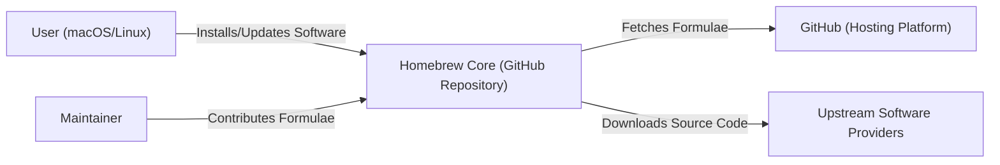
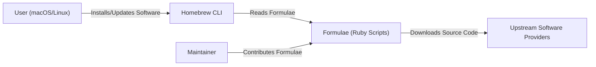
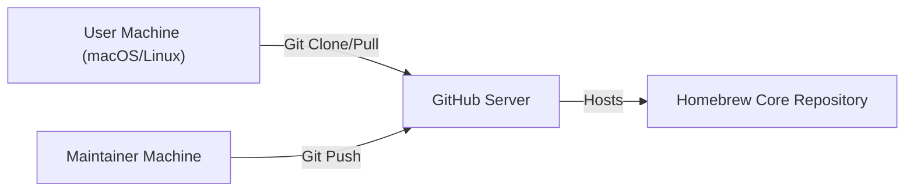
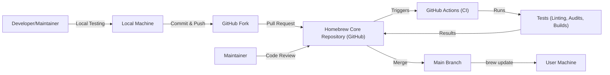

# Project Design Document: Homebrew Core

## BUSINESS POSTURE

Homebrew Core is the heart of the Homebrew package manager, providing formulae (recipes) for installing software on macOS and Linux. The primary business goal is to provide a reliable, up-to-date, and secure repository of software packages for its users. The project's success hinges on user trust and the integrity of the software it delivers.

Business Priorities:

*   Maintainability: Ensure the repository is easy to maintain and update by a community of volunteers.
*   Reliability: Provide consistent and dependable access to software packages.
*   Security: Protect users from malicious or compromised software.
*   Up-to-dateness: Offer the latest stable versions of software packages.
*   Community: Foster a healthy and active contributor community.

Business Risks:

*   Distribution of compromised software: The most significant risk is the potential for a malicious actor to inject compromised software into the repository, leading to widespread infection of user systems.
*   Repository unavailability: Downtime or inaccessibility of the repository would disrupt users' ability to install or update software.
*   Loss of community trust: Any security incident or significant issue could damage the project's reputation and erode user trust.
*   Supply chain attacks: Compromise of upstream software sources or build systems could lead to the distribution of tainted packages.
*   Formulae inconsistencies: Inconsistent or broken formulae can lead to user frustration and a perception of unreliability.

## SECURITY POSTURE

Existing Security Controls:

*   security control: Code Review: All formulae changes are subject to review by maintainers before being merged. (Implemented in GitHub pull request process).
*   security control: Automated Testing: Formulae are tested automatically to ensure they build and function correctly. (Implemented in GitHub Actions workflows).
*   security control: Two-Factor Authentication (2FA): 2FA is strongly encouraged (and likely enforced) for maintainers with write access to the repository. (Implemented in GitHub organization settings).
*   security control: Sandboxing: Homebrew encourages the use of macOS sandboxing features where applicable. (Described in Homebrew documentation and best practices).
*   security control: Upstream Monitoring: Maintainers monitor upstream software sources for security updates and vulnerabilities. (Described in Homebrew documentation and best practices).
*   security control: SHA256 Checksums: Formulae include SHA256 checksums of downloaded source code to verify integrity. (Implemented in formulae definitions).

Accepted Risks:

*   accepted risk: Reliance on Upstream Security: Homebrew relies on the security practices of upstream software developers. A vulnerability in upstream software can impact Homebrew users.
*   accepted risk: Volunteer-Based Maintenance: The project relies on volunteer maintainers, which can lead to variations in response times to security issues.
*   accepted risk: Limited Static Analysis: While some automated testing is performed, comprehensive static analysis of all formulae is not feasible due to the scale of the repository.

Recommended Security Controls:

*   security control: Implement a Software Bill of Materials (SBOM) for each formula. This would improve supply chain visibility and aid in vulnerability management.
*   security control: Introduce more robust static analysis tooling, potentially leveraging existing solutions or developing custom tools tailored to Homebrew formulae.
*   security control: Formalize a vulnerability disclosure program to encourage responsible reporting of security issues.
*   security control: Explore the use of code signing for formulae or compiled binaries to further enhance integrity verification.
*   security control: Regularly audit maintainer access and permissions to ensure least privilege.

Security Requirements:

*   Authentication: Not directly applicable to the repository itself, as it provides publicly available software. However, maintainer access to the repository requires authentication via GitHub credentials (with 2FA strongly recommended).
*   Authorization: Maintainers have write access to the repository, while the general public has read-only access. Access control is managed through GitHub's permission system.
*   Input Validation: Formulae are Ruby scripts, and input validation is crucial to prevent code injection vulnerabilities. This is primarily addressed through code review and automated testing. The Ruby interpreter itself also provides some level of protection.
*   Cryptography: SHA256 checksums are used to verify the integrity of downloaded source code. HTTPS is used for communication with GitHub and, ideally, for downloading source code from upstream providers.

## DESIGN

### C4 CONTEXT

Element Descriptions:

*   Element:
    *   Name: User (macOS/Linux)
    *   Type: Person
    *   Description: A user who uses Homebrew to install and manage software on their macOS or Linux system.
    *   Responsibilities: Interacts with the Homebrew command-line tool to install, update, and manage software packages.
    *   Security controls: Relies on the security controls implemented by Homebrew Core and their operating system.

*   Element:
    *   Name: Homebrew Core (GitHub Repository)
    *   Type: Software System
    *   Description: The core repository of Homebrew formulae, hosted on GitHub.
    *   Responsibilities: Stores and provides access to formulae, manages contributions, and facilitates the build and distribution process.
    *   Security controls: Code review, automated testing, 2FA for maintainers, SHA256 checksums, upstream monitoring.

*   Element:
    *   Name: GitHub (Hosting Platform)
    *   Type: External System
    *   Description: The platform that hosts the Homebrew Core repository and provides version control, collaboration tools, and infrastructure.
    *   Responsibilities: Provides hosting, version control, access control, and workflow automation.
    *   Security controls: GitHub's internal security controls, 2FA enforcement, access controls.

*   Element:
    *   Name: Upstream Software Providers
    *   Type: External System
    *   Description: The original developers and distributors of the software packages that Homebrew provides.
    *   Responsibilities: Develop, maintain, and distribute their software.
    *   Security controls: Varies depending on the provider. Homebrew relies on the security practices of these providers.

*   Element:
    *   Name: Maintainer
    *   Type: Person
    *   Description: A volunteer contributor who maintains and updates formulae in the Homebrew Core repository.
    *   Responsibilities: Creates, updates, and tests formulae; reviews contributions; monitors upstream sources.
    *   Security controls: 2FA for GitHub access, adherence to Homebrew's contribution guidelines and security best practices.

### C4 CONTAINER

Since Homebrew Core is primarily a repository of scripts (formulae), the container diagram is very similar to the context diagram. The main "container" is the GitHub repository itself.

Element Descriptions:

*   Element:
    *   Name: User (macOS/Linux)
    *   Type: Person
    *   Description: A user who uses Homebrew to install and manage software.
    *   Responsibilities: Interacts with the Homebrew command-line tool.
    *   Security controls: Relies on the security controls implemented by Homebrew Core and their operating system.

*   Element:
    *   Name: Homebrew CLI
    *   Type: Application
    *   Description: Command Line Interface that user uses to interact with Homebrew.
    *   Responsibilities: Reads and executes commands, interacts with Formulae.
    *   Security controls: Input validation, secure communication with GitHub.

*   Element:
    *   Name: Formulae (Ruby Scripts)
    *   Type: Application
    *   Description: Ruby scripts that define how to download, build, and install software packages.
    *   Responsibilities: Define the build process, dependencies, and installation steps for each package.
    *   Security controls: Code review, automated testing, SHA256 checksums.

*   Element:
    *   Name: Upstream Software Providers
    *   Type: External System
    *   Description: The original developers and distributors of the software.
    *   Responsibilities: Develop, maintain, and distribute their software.
    *   Security controls: Varies depending on the provider.

*   Element:
    *   Name: Maintainer
    *   Type: Person
    *   Description: A volunteer contributor who maintains and updates formulae.
    *   Responsibilities: Creates, updates, and tests formulae.
    *   Security controls: 2FA for GitHub access, adherence to Homebrew's guidelines.

### DEPLOYMENT

Homebrew Core is deployed as a Git repository hosted on GitHub. There are several deployment models, but the primary one is:

1.  **GitHub-Hosted Repository:** The primary deployment model is the GitHub repository itself. Users interact with this repository directly through the `brew` command-line tool.

2.  **Mirrors (Optional):** While not officially part of the core deployment, community-maintained mirrors of the repository may exist to improve download speeds or provide redundancy.

3.  **Bottles (Pre-compiled Binaries):** Homebrew provides pre-compiled binaries ("bottles") for some packages. These are hosted on a separate service (currently Bintray, with plans to migrate to GitHub Packages).

Deployment Diagram (GitHub-Hosted Repository):

Element Descriptions:

*   Element:
    *   Name: User Machine (macOS/Linux)
    *   Type: Infrastructure Node
    *   Description: The user's computer where Homebrew is installed.
    *   Responsibilities: Runs the `brew` command-line tool, downloads and installs software.
    *   Security controls: Operating system security controls, user-level permissions.

*   Element:
    *   Name: GitHub Server
    *   Type: Infrastructure Node
    *   Description: The servers operated by GitHub that host the Homebrew Core repository.
    *   Responsibilities: Provides Git hosting, access control, and web interface.
    *   Security controls: GitHub's internal security controls, network security, access controls.

*   Element:
    *   Name: Homebrew Core Repository
    *   Type: Data Store
    *   Description: The Git repository containing the Homebrew formulae.
    *   Responsibilities: Stores the formulae and their version history.
    *   Security controls: Git's integrity checks, access controls managed by GitHub.

*   Element:
    *   Name: Maintainer Machine
    *   Type: Infrastructure Node
    *   Description: A computer used by a Homebrew maintainer to contribute to the repository.
    *   Responsibilities: Used to create, update, and test formulae.
    *   Security controls: Operating system security controls, maintainer's security practices.

### BUILD

The build process for Homebrew Core primarily involves creating and updating formulae (Ruby scripts).  There isn't a traditional "build" in the sense of compiling code, except for the individual software packages that Homebrew installs, which are built according to the instructions in their respective formulae. The build process for the *repository* itself is focused on ensuring the integrity and correctness of the formulae.

Build Process:

1.  **Developer/Maintainer:** A developer or maintainer creates or modifies a formula on their local machine.
2.  **Local Testing:** The developer uses `brew install --build-from-source <formula>` and `brew audit` to test the formula locally.
3.  **Commit and Push:** The developer commits the changes to their local Git repository and pushes them to a fork of the Homebrew Core repository on GitHub.
4.  **Pull Request:** The developer creates a pull request on GitHub to merge their changes into the main Homebrew Core repository.
5.  **Automated Testing (GitHub Actions):** GitHub Actions automatically runs tests on the proposed changes. This includes:
    *   **Linting:** Checks the Ruby code style and syntax.
    *   **Formulae Audits:** Runs `brew audit` to check for common errors and inconsistencies.
    *   **Build Tests:** Attempts to build the formula from source on different macOS versions.
6.  **Code Review:** Other Homebrew maintainers review the pull request, examining the code for correctness, security, and adherence to guidelines.
7.  **Merge:** If the pull request passes automated tests and code review, a maintainer merges it into the main branch of the Homebrew Core repository.
8.  **Distribution:** Users receive the updated formulae when they run `brew update`.

Build Diagram:

Security Controls in Build Process:

*   security control: Code Review: Manual review of all changes by maintainers.
*   security control: Automated Testing: GitHub Actions runs various tests to catch errors and inconsistencies.
*   security control: Linting: Ensures code style and syntax consistency, reducing the risk of certain types of errors.
*   security control: Formulae Audits: Checks for common errors and potential security issues in formulae.
*   security control: Build Tests: Verifies that formulae can be built successfully on different platforms.
*   security control: SHA256 checksums: Ensures integrity of downloaded source.

## RISK ASSESSMENT

Critical Business Processes:

*   Software Installation: The core process is enabling users to install software. Any disruption to this process is critical.
*   Software Updates: Keeping software up-to-date is crucial for security and functionality.
*   Formulae Maintenance: Maintaining and updating the formulae repository is essential for the long-term viability of the project.

Data to Protect:

*   Formulae (Ruby Scripts): Sensitivity: Medium. While publicly available, the integrity of the formulae is paramount. Tampering could lead to the distribution of malicious software.
*   Maintainer Credentials: Sensitivity: High. Compromise of maintainer credentials could allow an attacker to inject malicious code into the repository.
*   User Data (Indirectly): Sensitivity: High. Homebrew itself doesn't directly handle user data, but the software it installs might. Therefore, the integrity of Homebrew is crucial for protecting user data handled by the installed software.

## QUESTIONS & ASSUMPTIONS

Questions:

*   What is the specific process for handling security vulnerabilities reported in Homebrew Core or in upstream software packages?
*   Are there any plans to implement more advanced security features, such as code signing or SBOM generation?
*   What is the current status of the migration from Bintray to GitHub Packages for hosting bottles?
*   What are the specific criteria used by maintainers during code review to assess the security of formulae?
*   How are decisions made regarding the inclusion of new formulae or the removal of existing ones?

Assumptions:

*   BUSINESS POSTURE: The primary goal of Homebrew Core is to provide a reliable and secure way for users to install software on macOS and Linux.
*   SECURITY POSTURE: Maintainers have a strong understanding of security best practices and actively work to prevent the distribution of malicious software.
*   DESIGN: The design of Homebrew Core is relatively simple, with the main components being the GitHub repository, the formulae, and the `brew` command-line tool. The deployment model relies heavily on GitHub's infrastructure. The build process is primarily focused on ensuring the integrity and correctness of the formulae.