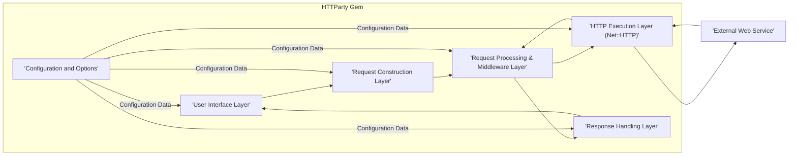
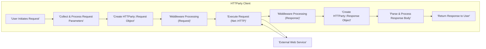

# Project Design Document: HTTParty

**Project Name:** HTTParty

**Project Repository:** https://github.com/jnunemaker/httparty

**Document Version:** 1.1

**Date:** October 26, 2023

**Author:** AI Software Architect

## 1. Introduction

This document provides an enhanced design overview of the HTTParty Ruby gem, specifically tailored for threat modeling. It details the architecture, key components, and data flow within the library, highlighting aspects relevant to security considerations. This document serves as the foundation for identifying potential threats and vulnerabilities.

## 2. Project Overview

HTTParty is a widely used Ruby gem designed to simplify the process of making HTTP requests. It offers a user-friendly interface for interacting with web services, supporting various HTTP methods, managing headers and parameters, and handling different response formats. The core objective of HTTParty is to abstract the complexities of Ruby's native `Net::HTTP` library, providing a more convenient and developer-centric experience for HTTP communication.

## 3. Architectural Overview

HTTParty employs a layered architecture, abstracting the intricacies of HTTP communication from the end-user. Understanding these layers is crucial for identifying potential attack surfaces.

*   **User Interface Layer:** This is the direct point of interaction for developers using the gem. It exposes methods for initiating HTTP requests and configuring request options.
*   **Request Construction Layer:** This layer takes the user's input and builds a structured HTTP request, including the URL, headers, parameters, and request body. This is a critical point for input validation considerations.
*   **Request Processing & Middleware Layer:** Before execution, requests pass through a middleware stack. This allows for interception and modification of requests, offering extensibility but also potential security risks if not managed properly.
*   **HTTP Execution Layer:** This layer utilizes Ruby's built-in `Net::HTTP` library (or a configured adapter) to transmit the constructed HTTP request over the network. This layer is responsible for the actual network communication and is subject to network-level security concerns.
*   **Response Handling Layer:**  This layer processes the raw HTTP response received from the server, parsing headers, status codes, and the response body. It provides methods for accessing and interpreting the response data.
*   **Configuration and Options:** HTTParty allows for both global and per-request configuration, influencing various aspects of the HTTP communication. Insecure configurations can introduce vulnerabilities.

## 4. Key Components

This section provides a more detailed look at the core components of HTTParty, highlighting their security-relevant aspects.

*   **`HTTParty` Module:** The primary module, serving as the namespace and entry point for the gem's functionality.
*   **`HTTParty::ClassMethods`:**  Included in classes that utilize HTTParty, providing class-level methods for defining base URIs, default parameters, headers, and initiating HTTP requests (e.g., `get`, `post`). This is the main interface developers interact with and a key area for considering input sanitization.
*   **`HTTParty::Request`:** Represents an HTTP request object. It encapsulates the HTTP method, URL, headers, parameters, and body. Improper construction or manipulation of this object could lead to vulnerabilities.
*   **`HTTParty::Response`:** Represents the HTTP response received from the server, containing the status code, headers, and body. Secure handling of response data is crucial to prevent information leakage.
*   **`Net::HTTP` (Ruby Standard Library):** The underlying library responsible for the actual network communication. Vulnerabilities in `Net::HTTP` directly impact HTTParty.
*   **Middleware Stack:** A series of interceptors that can modify requests before they are sent and responses after they are received. While powerful, poorly written or malicious middleware can introduce significant security risks.
*   **Configuration Options (Security Relevant Examples):**
    *   `base_uri`:  Ensuring the base URI is correctly set prevents unintended requests to different domains.
    *   `default_params` & `headers`:  Careless use can lead to unintended data exposure.
    *   `timeout`:  Properly configured timeouts can mitigate some denial-of-service attempts.
    *   `ssl_options`:  Crucial for ensuring secure communication over HTTPS. Incorrect settings can lead to MITM vulnerabilities.
    *   `http_proxy`:  Using proxies introduces trust dependencies and potential interception points.
    *   `basic_auth` & other authentication methods: Secure storage and transmission of credentials are vital.

## 5. Data Flow

Understanding how data flows through HTTParty is essential for identifying potential points of interception or manipulation.

1. **User Initiates Request:** A developer calls a method on a class including `HTTParty::ClassMethods` (e.g., `MyApiClient.get('/data', query: { id: 1 })`).
2. **Request Parameters are Collected and Processed:** HTTParty gathers the request URL, parameters (including user-provided input), headers, and any configured defaults. This stage is critical for input validation and sanitization.
3. **`HTTParty::Request` Object is Created:** An instance of `HTTParty::Request` is created, encapsulating the details of the outgoing HTTP request.
4. **Middleware Processing (Request Phase):** The `HTTParty::Request` object is passed through the configured middleware stack. Each middleware can inspect and potentially modify the request (e.g., adding authentication headers, logging).
5. **HTTP Request Execution via `Net::HTTP`:** The `HTTParty::Request` object is used by the `HTTP Execution Layer` (leveraging `Net::HTTP`) to send the request to the target web service over the network.
6. **Response is Received from External Service:** The external web service sends an HTTP response back to the client.
7. **Middleware Processing (Response Phase):** The raw HTTP response is passed back through the middleware stack. Middleware can inspect and potentially modify the response (e.g., caching, error handling).
8. **`HTTParty::Response` Object is Created:** An instance of `HTTParty::Response` is created, containing the status code, headers, and body of the received response.
9. **Response Body Parsing and Processing:** HTTParty attempts to parse the response body based on the `Content-Type` header (e.g., JSON, XML). Vulnerabilities in parsing libraries could be exploited here.
10. **Response is Returned to the User:** The `HTTParty::Response` object is returned to the developer's application for further processing.

## 6. Security Considerations for Threat Modeling

This section outlines potential security threats and vulnerabilities within HTTParty, categorized for clarity during threat modeling.

*   **Input Validation Vulnerabilities:**
    *   **Request Parameter Injection:** Maliciously crafted input in request parameters could be interpreted as commands by the server.
    *   **Header Injection:**  Manipulating headers could lead to various attacks, such as cross-site scripting (XSS) or cache poisoning.
    *   **URL Manipulation:**  Improper handling of URLs could lead to unintended requests to different endpoints.
*   **Network Security Risks:**
    *   **Man-in-the-Middle (MITM) Attacks:** If SSL/TLS verification is disabled or misconfigured, attackers could intercept communication.
    *   **Insecure Proxy Usage:**  Using untrusted proxies can expose traffic to interception and modification.
*   **Dependency Vulnerabilities:**
    *   **`Net::HTTP` Vulnerabilities:** Security flaws in the underlying `Net::HTTP` library could directly impact HTTParty.
    *   **Middleware Vulnerabilities:**  Security issues in custom or third-party middleware components.
    *   **Parsing Library Vulnerabilities:**  Flaws in libraries used to parse response bodies (e.g., JSON, XML parsers).
*   **Authentication and Authorization Issues:**
    *   **Insecure Credential Handling:**  Storing or transmitting authentication credentials insecurely.
    *   **Bypassing Authentication:**  Vulnerabilities that allow attackers to bypass authentication mechanisms.
*   **Configuration and Defaults:**
    *   **Insecure Default Settings:**  Default configurations that are not secure (e.g., disabled SSL verification).
    *   **Misconfiguration:**  Developers incorrectly configuring HTTParty, leading to vulnerabilities.
*   **Information Disclosure:**
    *   **Exposure of Sensitive Data in Requests/Responses:**  Accidentally logging or including sensitive information in requests or responses.
    *   **Verbose Error Messages:**  Revealing sensitive information through overly detailed error messages.
*   **Denial of Service (DoS):**
    *   **Request Flooding:**  Sending excessive requests to overwhelm the target server.
    *   **Resource Exhaustion:**  Crafting requests that consume excessive resources on the server.
*   **Middleware Security:**
    *   **Malicious Middleware:**  Intentionally designed to introduce vulnerabilities or exfiltrate data.
    *   **Vulnerable Middleware:**  Middleware with its own security flaws.

## 7. Diagrams

The architecture and data flow diagrams are included in the respective sections above.

## 8. Conclusion

This enhanced design document provides a detailed overview of the HTTParty gem, focusing on aspects relevant to security. By understanding its architecture, key components, and data flow, along with the identified security considerations, security professionals and developers can effectively perform threat modeling to identify and mitigate potential vulnerabilities. This document serves as a crucial input for a comprehensive security assessment of systems utilizing the HTTParty gem.