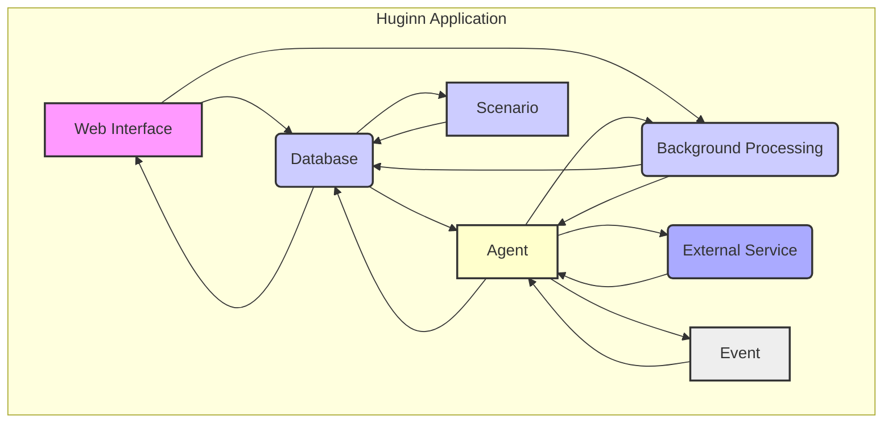
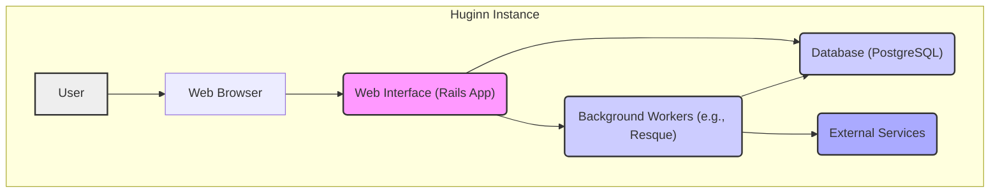
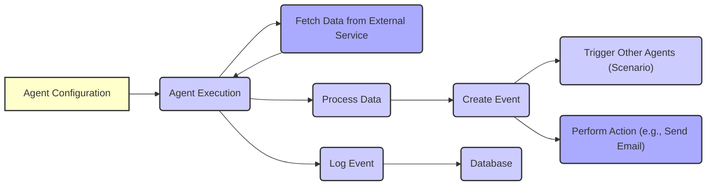

# Project Design Document: Huginn

**Version:** 1.1
**Date:** October 26, 2023
**Prepared By:** Gemini (AI Language Model)

## 1. Project Overview

Huginn is a powerful and flexible open-source platform designed for building autonomous agents that perform tasks on the user's behalf across the internet. It empowers users to create interconnected "agents" that monitor web content, interact with various online services (like Twitter, email, and RSS feeds), and trigger actions based on predefined rules and events. It serves as a self-hosted and highly customizable alternative to services like IFTTT or Zapier.

This document details the architecture and key components of the Huginn platform, specifically to facilitate a comprehensive threat modeling exercise.

## 2. Goals of this Document

* Provide a detailed and unambiguous description of Huginn's architecture and its constituent components.
* Clearly delineate the key data flows and interactions within the Huginn system.
* Serve as the definitive reference document for conducting thorough and effective threat modeling sessions.
* Enable security engineers, software developers, and DevOps engineers to gain a deep understanding of the system's structure and potential security vulnerabilities.

## 3. Target Audience

* Security Engineers responsible for identifying and mitigating security risks.
* Software Developers involved in the development and maintenance of Huginn.
* DevOps Engineers responsible for deploying and operating the Huginn platform.
* Anyone participating in the security assessment or threat modeling of Huginn.

## 4. Scope

This document encompasses the core components and functionalities of the Huginn application as represented in the linked GitHub repository. The focus is on the application's internal architecture, its interactions with external services, and the data it processes. The scope intentionally excludes the underlying operating system, containerization platform (if used), or hosting infrastructure, unless these directly impact the application's design and security.

## 5. High-Level Architecture

Huginn is architected following a Model-View-Controller (MVC) pattern, primarily implemented using the Ruby on Rails framework. It utilizes a robust background processing system for managing asynchronous tasks and relies on a relational database for persistent data storage.

* **Web Interface:**  The primary point of user interaction, providing a graphical interface for managing agents, defining scenarios, and inspecting event logs.
* **Background Processing System:**  Responsible for executing asynchronous tasks, such as fetching data from external sources, processing events, and triggering agent actions.
* **Database:**  The central repository for storing all application data, including user accounts, agent configurations, scenario definitions, event history, and sensitive credentials.
* **External Services:**  The various third-party services that Huginn interacts with through its agents, such as social media platforms, email providers, and web APIs.

## 6. Component Details

### 6.1. Web Interface

* **Technology:** Ruby on Rails framework
* **Functionality:**
    * **User Authentication and Authorization:** Managing user logins, sessions, and access control to different features. This likely involves mechanisms like password hashing (e.g., `bcrypt`), session cookies, and potentially role-based access control.
    * **Agent Management:**  Providing interfaces for creating, configuring, editing, enabling, and disabling individual agents. This includes setting agent-specific parameters and credentials.
    * **Scenario Management:**  Allowing users to define and manage workflows by connecting multiple agents, specifying data flow and triggering conditions.
    * **Event Log Viewing and Searching:**  Presenting a user-friendly interface for viewing, filtering, and searching historical events generated by agents.
    * **Administrative Functions:**  Providing tools for managing the Huginn instance itself, such as user management, system settings, and potentially monitoring dashboards.
    * **User Profile Management:**  Allowing users to manage their personal settings and preferences.
* **Key Components:**
    * **Controllers:**  Handle incoming HTTP requests, interact with models to retrieve or update data, and select appropriate views for rendering responses (e.g., `AgentsController`, `ScenariosController`).
    * **Views:**  Responsible for rendering the user interface, typically using HTML, CSS, and JavaScript (potentially leveraging frameworks like jQuery or others). These present data to the user and handle user interactions.
    * **Models:**  Represent the application's data and business logic, encapsulating data structures and validation rules (e.g., `User`, `Agent`, `Scenario`, `Event`). They interact with the database.
    * **Routes:**  Define the mapping between URLs and specific controller actions, determining how the application responds to different web requests.
    * **Sessions:**  Manage the state of logged-in users, typically using cookies to maintain authentication across requests.
    * **Cookies:**  Used for session management, storing user preferences, and potentially other client-side data.
* **Security Considerations:**
    * Susceptible to standard web application vulnerabilities such as Cross-Site Scripting (XSS), Cross-Site Request Forgery (CSRF), and SQL Injection.
    * The security of authentication and authorization mechanisms is paramount to prevent unauthorized access.
    * Secure session management is crucial to prevent session hijacking.

### 6.2. Background Processing System

* **Technology:**  Likely Resque, Sidekiq, or a similar background job processing library for Ruby.
* **Functionality:**
    * **Asynchronous Task Execution:**  Executes tasks that do not need to be performed immediately in the web request cycle, improving responsiveness.
    * **External Data Fetching:**  Handles the process of retrieving data from external APIs and websites, often involving network requests and handling various data formats.
    * **Agent Action Execution:**  Performs the actions defined by agents, such as sending emails, posting to social media, or triggering other external services.
    * **Agent Scheduling:**  Manages the scheduled execution of agents based on user-defined intervals or cron-like expressions.
* **Key Components:**
    * **Workers:**  Processes individual jobs from the queue. These are typically long-running processes that pick up and execute tasks.
    * **Queues:**  Hold pending jobs that are waiting to be processed by workers. These are often backed by a message broker like Redis.
    * **Job Definitions:**  Represent the specific tasks to be executed, including the code to run and any necessary arguments.
* **Security Considerations:**
    * Potential for code injection vulnerabilities if job arguments are not properly sanitized before being used in execution.
    * Access control to the background processing system is important to prevent unauthorized job creation or manipulation.
    * Sensitive data might be processed within background jobs, requiring careful handling and potential encryption.

### 6.3. Database

* **Technology:**  PostgreSQL is the default, but other relational databases might be supported (e.g., MySQL).
* **Functionality:**
    * **Persistent Data Storage:**  Provides long-term storage for all application data, ensuring data persistence across restarts and failures.
    * **User Credential Storage:**  Stores user login credentials, ideally using strong one-way hashing algorithms (like bcrypt) with salting.
    * **Agent Configuration Storage:**  Stores the configuration details for each agent, including parameters, API keys, and secrets required for interacting with external services.
    * **Scenario Definition Storage:**  Stores the definitions of user-created workflows, outlining the connections and data flow between agents.
    * **Event Log Storage:**  Records historical events generated by agents, providing an audit trail and allowing users to track activity.
* **Key Components:**
    * **Tables:**  Organize data into structured rows and columns (e.g., `users`, `agents`, `events`, `credentials`, `scenarios`).
    * **Indexes:**  Improve the performance of database queries by providing faster access to specific data.
    * **Stored Procedures (potentially):**  May contain pre-compiled SQL code that encapsulates business logic, although this might be less common in typical Rails applications.
* **Security Considerations:**
    * Critical to protect against SQL Injection vulnerabilities through parameterized queries and input validation.
    * Robust database access control is essential to restrict access to authorized users and processes only.
    * Encryption of sensitive data at rest within the database should be strongly considered to protect data even if the database is compromised.

### 6.4. Agents

* **Functionality:**
    * **Represent Individual Tasks:** Each agent performs a specific function, such as monitoring a website, checking an email inbox, or posting to a social media account.
    * **User-Configurable:** Users define the behavior of agents through configuration parameters, specifying what data to fetch, how to process it, and what actions to take.
    * **Data Acquisition:** Agents can fetch data from various external sources using protocols like HTTP(S), IMAP, or platform-specific APIs.
    * **Data Processing and Transformation:** Agents can process and transform the acquired data, extracting relevant information or modifying its format.
    * **Action Triggering:** Agents can trigger actions based on events or processed data, such as sending notifications, creating new events, or interacting with other services.
* **Types of Agents (Examples):**
    * **WebsiteAgent:**  Scrapes data from specified web pages based on CSS selectors or other extraction methods.
    * **TwitterAgent:**  Monitors Twitter feeds for specific keywords or user activity.
    * **EmailAgent:**  Sends or receives emails, potentially triggering actions based on email content.
    * **RSSAgent:**  Monitors RSS or Atom feeds for new items.
    * **DataOutputAgent:**  Performs output actions, such as sending notifications via email, SMS, or other channels.
* **Security Considerations:**
    * Agents often handle sensitive data, including API keys, authentication tokens, and user-specific information. Secure storage and handling of this data are crucial.
    * Vulnerable to injection attacks if processing external data without proper sanitization (e.g., if an agent executes commands based on website content).
    * Improperly configured agents could potentially expose sensitive information or perform unintended actions.

### 6.5. Scenarios

* **Functionality:**
    * **Workflow Definition:** Scenarios allow users to create complex automated workflows by connecting multiple agents together.
    * **Agent Interconnection:**  Define how the output of one agent is passed as input to another agent, creating chains of actions.
    * **Conditional Logic (potentially):**  May include mechanisms for conditional execution of agents based on event data or other criteria.
* **Security Considerations:**
    * The security implications of chained agent actions need careful consideration, as vulnerabilities in one agent could be exploited through the data flow from another.
    * The integrity and confidentiality of data flowing between agents within a scenario should be maintained.

### 6.6. External Services

* **Functionality:**
    * **Third-Party Integrations:** Huginn interacts with a wide array of external services based on the configured agents, extending its functionality and reach.
    * **API Communication:**  Interaction typically occurs through APIs using protocols like REST or other service-specific protocols.
* **Security Considerations:**
    * Ensuring secure communication with external services using HTTPS is essential to protect data in transit.
    * Secure storage and management of API keys, OAuth tokens, and other credentials required for authenticating with external services are critical.
    * Implementing appropriate error handling and rate limiting when interacting with external services is important for stability and security.

## 7. Data Flow

A typical data flow within Huginn involves these key stages:

1. **User Interaction:** A user interacts with the **"Web Interface"** to create, configure, or manage an agent or scenario.
2. **Configuration Storage:** The agent and scenario configurations are persisted in the **"Database"**.
3. **Scheduled Execution or Event Trigger:** An **"Agent"** is either executed based on a predefined schedule managed by the **"Background Processing System"**, or it's triggered by an **"Event"** generated by another agent.
4. **Data Fetching (if applicable):** The **"Agent"** may initiate a request to an **"External Service"** (via HTTP(S) or other protocols) to retrieve data.
5. **Data Processing:** The **"Agent"** processes the fetched data according to its configuration, potentially transforming or filtering it.
6. **Event Creation:** Based on the processed data, the **"Agent"** may create a new **"Event"** representing a significant occurrence.
7. **Event Propagation:** The newly created **"Event"** is passed to other relevant agents within a **"Scenario"**, triggering further actions.
8. **Action Execution (if applicable):** An **"Agent"** may perform an action, such as sending an email via an **"External Service"**, posting to social media, or triggering another external API.
9. **Event Logging:** All significant **"Events"** and actions are logged and stored in the **"Database"** for auditing and historical tracking.

## 8. Key Technologies

* **Primary Programming Language:** Ruby
* **Web Application Framework:** Ruby on Rails
* **Background Job Processing:** Resque, Sidekiq, or similar
* **Relational Database:** PostgreSQL (default)
* **Web Server:** Likely Puma or Unicorn
* **Templating Engine:** ERB (Embedded Ruby)
* **Client-Side JavaScript (likely):**  Potentially jQuery, or a more modern framework like React or Vue.js.

## 9. Security Considerations (Focus for Threat Modeling)

This section outlines key security considerations that will be the primary focus of the subsequent threat modeling exercise. These points highlight potential vulnerabilities and areas requiring careful security analysis:

* **Authentication and Authorization:**
    * **Password Security:** Strength of the password hashing algorithm used (e.g., bcrypt), salting implementation, and protection against brute-force attacks.
    * **Session Management:** Security of session cookies (HTTP-only, Secure flags), protection against session fixation and hijacking.
    * **Access Control:** Granularity of access control for managing agents, scenarios, and administrative functions. Potential for privilege escalation.
* **Input Validation and Sanitization:**
    * **Web Interface Vulnerabilities:** Prevention of XSS, SQL Injection, and command injection attacks through thorough input validation and output encoding in the web interface.
    * **Agent Configuration Security:**  Sanitizing user-provided agent configurations to prevent injection attacks or the execution of malicious code.
    * **External Data Handling:**  Securely processing and sanitizing data fetched from external sources to prevent injection attacks or other vulnerabilities.
* **Secure Storage of Secrets:**
    * **Credential Management:** Securely storing API keys, OAuth tokens, database credentials, and other sensitive information required for interacting with external services. Consideration of encryption at rest.
    * **Configuration Security:** Protecting configuration files that might contain sensitive information.
* **Communication Security:**
    * **HTTPS Enforcement:** Ensuring that HTTPS is enforced for all communication, both within the application and with external services, to protect data in transit.
    * **TLS Configuration:**  Proper configuration of TLS/SSL certificates and protocols.
* **Dependency Management:**
    * **Vulnerability Management:** Regularly updating dependencies (gems, libraries) to patch known security vulnerabilities.
    * **Supply Chain Security:**  Awareness of potential vulnerabilities in third-party libraries.
* **Rate Limiting and Abuse Prevention:**
    * **API Rate Limiting:** Implementing rate limits to prevent abuse of the application's API endpoints.
    * **Agent Execution Limits:**  Mechanisms to prevent individual agents from consuming excessive resources or making excessive requests to external services.
* **Error Handling and Logging:**
    * **Secure Logging:**  Logging relevant security events and avoiding the exposure of sensitive information in error messages or logs.
    * **Error Disclosure:**  Preventing the disclosure of sensitive information through overly verbose error messages.
* **Background Job Security:**
    * **Job Argument Security:** Ensuring that arguments passed to background jobs cannot be manipulated to execute arbitrary code.
    * **Access Control:**  Restricting access to the background processing system.
* **Agent Security:**
    * **Agent Isolation:**  Exploring mechanisms for isolating agent execution to prevent malicious agents from impacting the system or other users.
    * **Resource Limits:**  Setting limits on the resources that individual agents can consume.

## 10. Diagrams

### 10.1. High-Level Component Diagram

### 10.2. Agent Data Flow Diagram

## 11. Future Considerations

* **Scalability and Performance:**  Strategies for scaling the system to handle a growing number of agents, users, and events.
* **Advanced Monitoring and Logging:** Implementing comprehensive monitoring and logging solutions for both operational and security purposes, including intrusion detection and security auditing.
* **Multi-Tenancy Support:**  Exploring the possibility of supporting multiple independent user instances within a single Huginn deployment.
* **Agent Sandboxing/Isolation:**  Investigating more robust mechanisms for isolating agent execution to enhance security and prevent resource contention.
* **Deployment Considerations:**  Documenting secure deployment practices, including infrastructure security, network segmentation, and secure configuration management.

This document provides a detailed architectural overview of Huginn, specifically tailored to facilitate a thorough threat modeling process. The identified components, data flows, and security considerations serve as a solid foundation for identifying and mitigating potential security vulnerabilities within the platform.