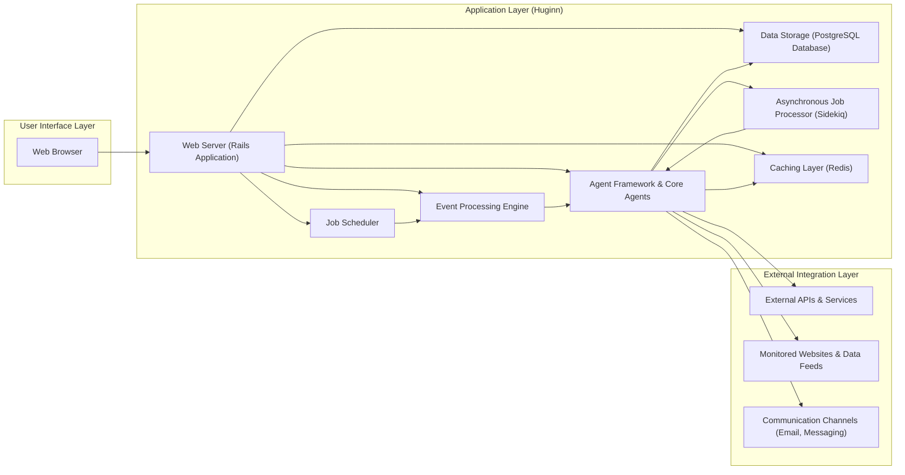
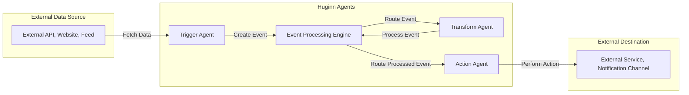

# Project Design Document: Huginn - Create Agents That Watch And Act On Your Behalf

**Version:** 1.1
**Date:** October 26, 2023
**Author:** Gemini (AI Language Model)

## 1. Introduction

This document provides an enhanced and more detailed design overview of the Huginn project, an open-source intelligent agent platform. Building upon the previous version, this document aims to offer a deeper understanding of the system's architecture, components, and data flow, providing a robust foundation for subsequent threat modeling activities. The focus is on clarity and comprehensive description to facilitate a thorough security analysis.

## 2. Project Overview

Huginn empowers users to automate tasks and workflows by creating interconnected "Agents." These agents monitor various data sources, process information based on user-defined logic, and trigger actions in response to specific events. The system's flexibility allows users to create sophisticated automation scenarios without requiring extensive programming knowledge.

**Key Features:**

*   **Modular Agent-Based Architecture:** The system is built around independent, reusable agents, each designed for a specific purpose. This modularity promotes flexibility and maintainability.
*   **Event-Driven, Directed Acyclic Graph (DAG) Workflow:** Agents communicate through "Events," and scenarios are structured as DAGs, ensuring a clear and manageable flow of information.
*   **Extensible Agent Framework:**  Developers can easily create new agent types to integrate with different services and data sources, expanding Huginn's capabilities.
*   **User-Friendly Web Interface:**  A comprehensive web interface allows users to create, configure, manage, and monitor agents and scenarios visually.
*   **Integration Capabilities:** Huginn is designed to interact with a wide range of external services, APIs, and data sources through its agent framework.

## 3. Architecture Overview

Huginn employs a layered architecture, separating concerns and promoting modularity. The core application logic is built upon the Ruby on Rails framework.

## 4. Component Details

This section provides a detailed description of each major component within the Huginn architecture, outlining their responsibilities and interactions.

*   **Web Browser:** The primary interface for users to interact with Huginn. It provides views for managing users, agents, scenarios, logs, and system settings.
*   **Web Server (Rails Application):** The central component responsible for handling user requests, managing application logic, and coordinating interactions between other components.
    *   **Authentication and Authorization:** Manages user accounts, sessions, and permissions to control access to Huginn's features and data.
    *   **API Endpoints:** Provides RESTful APIs for the web interface and potential external integrations.
    *   **View Rendering:** Generates the HTML, CSS, and JavaScript for the user interface using server-side rendering.
    *   **Background Task Initiation:** Enqueues background jobs for asynchronous processing via Sidekiq.
*   **Event Processing Engine:** The core logic for routing and distributing events between agents.
    *   **Event Reception:** Receives events generated by agents, scheduled tasks, or external triggers.
    *   **Event Matching and Routing:**  Matches events to subscribing agents based on user-defined filters and the scenario's structure.
    *   **Event Queuing:** Manages a queue of events waiting to be processed by their respective agents.
*   **Agent Framework & Core Agents:** Provides the structure and base classes for developing and running individual agents. Includes a set of built-in, core agents for common tasks.
    *   **Agent Lifecycle Management:** Handles the creation, configuration, execution, and destruction of agents.
    *   **Data Persistence:** Provides mechanisms for agents to store and retrieve persistent data.
    *   **Event Generation and Consumption:** Defines how agents create and process events.
    *   **Core Agent Library:** Includes agents for tasks like HTTP requests, RSS feed monitoring, email handling, data transformation, and more.
*   **Job Scheduler:** Responsible for triggering agents that need to run at specific times or intervals.
    *   **Schedule Management:** Stores and manages cron-like schedules defined by users for individual agents.
    *   **Job Enqueueing:**  Creates and enqueues background jobs for scheduled agents to be executed by Sidekiq.
*   **Data Storage (PostgreSQL Database):** The persistent storage for all of Huginn's data.
    *   **User Data:** Stores user accounts, profiles, and authentication credentials.
    *   **Agent Configurations:** Stores the settings and parameters for each agent instance.
    *   **Scenario Definitions:** Stores the structure and connections between agents in a scenario.
    *   **Event History:** Optionally stores a history of events processed by the system.
    *   **Logs:** Stores application logs and agent execution logs.
*   **Asynchronous Job Processor (Sidekiq):**  Handles computationally intensive or time-consuming tasks outside the main web request cycle.
    *   **Background Task Execution:** Executes jobs enqueued by the web server and the scheduler, such as fetching data from external sources, sending notifications, and performing complex data processing.
    *   **Queue Management:** Manages a queue of background jobs using Redis.
*   **Caching Layer (Redis):**  Provides a fast in-memory data store for caching frequently accessed data, improving performance.
    *   **Session Storage:** Can be used to store user session data.
    *   **Cache Invalidation:** Helps manage cached data to ensure consistency.

## 5. Data Flow

This section illustrates the typical flow of data through the Huginn system, highlighting key interactions between components.

**Detailed Data Flow:**

1. A **Trigger Agent** (e.g., `WebsiteAgent`, `TwitterStreamAgent`) is scheduled or triggered to fetch data from an **External Data Source**.
2. The Trigger Agent retrieves the data and creates an **Event** object containing the relevant information.
3. The **Event Processing Engine** receives the newly created Event.
4. Based on the scenario configuration and event filters, the Engine routes the Event to one or more **Transform Agents**.
5. A **Transform Agent** (e.g., `DataBagAgent`, `JavaScriptAgent`) receives the Event, processes the data according to its configuration (e.g., filtering, mapping, enriching), and generates a new or modified Event.
6. The **Event Processing Engine** receives the processed Event from the Transform Agent.
7. The Engine then routes this (potentially modified) Event to one or more **Action Agents**.
8. An **Action Agent** (e.g., `EmailAgent`, `PushoverAgent`, `WebhookAgent`) receives the Event and performs an action, such as sending an email, pushing a notification, or making a request to an **External Destination**.

## 6. Deployment Model

Huginn is designed for self-hosting and offers flexibility in deployment options.

*   **Direct Installation (Manual):** Installing all dependencies (Ruby, Rails, PostgreSQL, Redis, etc.) directly on the operating system. This provides the most control but requires more manual configuration.
*   **Containerization (Docker):**  Deploying Huginn within Docker containers. This is the recommended approach, providing isolation, reproducibility, and easier management. Docker Compose can be used to orchestrate multiple containers.
*   **Cloud Platform Deployment:** Deploying on cloud platforms like AWS, Google Cloud, or Azure using services like virtual machines, container orchestration (e.g., Kubernetes), or platform-as-a-service offerings.

**Key Deployment Components:**

*   **PostgreSQL Server:** A running instance of the PostgreSQL database to store application data.
*   **Redis Server:** A running instance of Redis for caching and Sidekiq's job queue.
*   **Web Server Process:**  A process running the Rails application (e.g., using Puma or Unicorn).
*   **Sidekiq Worker Process:** One or more processes running Sidekiq to handle background jobs.
*   **Scheduler Process (Optional):** While Sidekiq can handle scheduled jobs, a separate scheduler process (like `clockwork`) might be used for more complex scheduling needs.

## 7. Key Technologies

*   **Ruby on Rails:** The primary web application framework.
*   **PostgreSQL:** The relational database system.
*   **Sidekiq:**  The background job processing library, relying on Redis.
*   **Redis:** An in-memory data store used for caching and message queuing.
*   **HTML, CSS, JavaScript:**  For the front-end user interface.
*   **Various Ruby Gems:** A rich ecosystem of libraries for tasks like API interaction, data parsing, and more.

## 8. Security Considerations (Detailed)

This section expands on the initial security considerations, providing more specific potential risks and areas of focus for threat modeling.

*   **Authentication and Authorization Vulnerabilities:**
    *   **Weak Password Policies:** Susceptible to brute-force attacks.
    *   **Session Hijacking:** Risk of unauthorized access if session management is not secure.
    *   **Insufficient Authorization Checks:**  Users might be able to access or modify resources they shouldn't.
*   **Input Validation and Injection Attacks:**
    *   **SQL Injection:**  Vulnerabilities in database queries could allow attackers to manipulate or extract data.
    *   **Cross-Site Scripting (XSS):** Malicious scripts injected into the web interface could compromise user sessions or data.
    *   **Command Injection:**  If agents execute external commands based on user input, vulnerabilities could allow arbitrary command execution.
*   **Secure Storage of Sensitive Data:**
    *   **Plaintext Storage of Credentials:**  API keys, passwords, and other sensitive information should be encrypted at rest.
    *   **Insecure Handling of API Keys:**  Agents interacting with external services need to securely manage API keys.
*   **Cross-Site Request Forgery (CSRF):**  Attackers could trick authenticated users into performing unintended actions.
*   **Insecure Communication:**
    *   **Lack of HTTPS:**  Data transmitted between the browser and the server could be intercepted.
    *   **Insecure API Communication:**  Communication with external APIs should use HTTPS.
*   **Dependency Vulnerabilities:**  Outdated or vulnerable dependencies could introduce security flaws.
*   **Rate Limiting and Denial of Service (DoS):**
    *   **Lack of Rate Limiting on API Endpoints:** Susceptible to abuse and resource exhaustion.
    *   **Agent Misconfiguration Leading to Excessive External Requests:**  Agents could be configured to make a large number of requests, potentially leading to denial of service for external services or the Huginn instance itself.
*   **Agent Security:**
    *   **Malicious Agents:**  Users could potentially create agents that perform malicious actions.
    *   **Data Leakage through Agents:**  Poorly designed agents might unintentionally expose sensitive data.
*   **Logging and Monitoring:**
    *   **Insufficient Logging:**  Makes it difficult to detect and investigate security incidents.
    *   **Exposure of Sensitive Information in Logs:**  Logs should be carefully reviewed to avoid exposing sensitive data.

## 9. Future Considerations

*   **Improved Scalability and Performance:**  Architectural enhancements to handle a larger number of agents and events.
*   **Enhanced Monitoring and Alerting:**  More comprehensive monitoring dashboards and alerting mechanisms for system health and security events.
*   **Agent Marketplace or Sharing Platform:**  A platform for users to share and discover reusable agents.
*   **More Granular Access Control:**  More fine-grained permissions for managing agents and scenarios.
*   **Support for Distributed Agent Execution:**  Allowing agents to run on different nodes for improved resource utilization and resilience.

## 10. Glossary

*   **Agent:** A modular, independent component responsible for a specific task within Huginn.
*   **Event:** A data structure representing a piece of information or a trigger that is passed between agents.
*   **Scenario:** A directed acyclic graph (DAG) defining the flow of events and interactions between agents to achieve a specific automation goal.
*   **Job:** A unit of work that is processed asynchronously by Sidekiq.
*   **Trigger Agent:** An agent that initiates a scenario by creating an initial event, often based on external data or a schedule.
*   **Transform Agent:** An agent that processes and modifies events, transforming the data they contain.
*   **Action Agent:** An agent that performs an action based on the events it receives, such as sending a notification or interacting with an external service.

This improved design document provides a more detailed and comprehensive overview of the Huginn project, intended to facilitate a thorough and effective threat modeling process.
