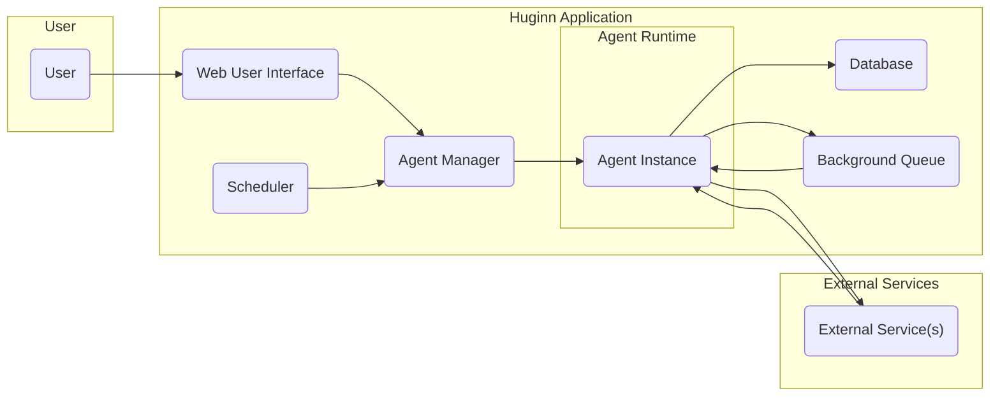

## Project Design Document: Huginn - Create Agents That Watch And Act On Your Behalf

**Version:** 1.1
**Date:** October 26, 2023
**Author:** AI Software Architect

### 1. Project Overview

Huginn is a web-based, open-source platform designed to empower users to automate online tasks and workflows. It achieves this through the creation and management of autonomous "agents" that can monitor web sources, interact with external services, and trigger actions based on user-defined rules and events. This document details the architectural design of Huginn, providing a foundation for subsequent threat modeling activities.

### 2. Goals

*   Present a clear and comprehensive description of Huginn's architectural components and their interactions.
*   Identify the key functional units within the system and their respective responsibilities.
*   Illustrate the flow of data through the Huginn platform.
*   Highlight potential security vulnerabilities and areas of concern to guide future threat modeling efforts.

### 3. Non-Goals

*   In-depth analysis of the internal implementation of individual agent types or specific agent logic.
*   Detailed performance analysis, benchmarking results, or optimization strategies for the platform.
*   Specific and exhaustive deployment instructions or configurations for various environments.
*   Line-by-line code review or analysis of the Huginn codebase.

### 4. Architecture

#### 4.1. High-Level Architecture Diagram

#### 4.2. Component Details

*   **User:** The individual who interacts with the Huginn platform to create, configure, and manage agents and scenarios. Interaction is primarily through the Web User Interface.
*   **Web User Interface (WUI):**  The graphical interface providing users with the ability to:
    *   Create new agents and define their specific configurations (e.g., source URLs, triggers, actions).
    *   Organize agents into scenarios to create complex workflows.
    *   Monitor the status and logs of running agents.
    *   Manage user accounts, roles, and permissions within the Huginn platform.
    *   View and analyze events generated by agents.
*   **Scheduler (SCH):** The component responsible for the timely execution of agents. Its primary functions include:
    *   Reading agent schedules and trigger conditions from the Database.
    *   Initiating the execution of Agent Instances based on their defined schedules (e.g., cron-like expressions).
    *   Triggering agents based on events generated by other agents.
*   **Agent Manager (AM):**  The central component responsible for managing the lifecycle of agents. Its key responsibilities include:
    *   Creating new Agent Instances based on user configurations.
    *   Starting, stopping, and restarting Agent Instances.
    *   Monitoring the health and status of running Agent Instances.
    *   Providing an interface for the Web User Interface and Scheduler to interact with agents.
*   **Agent Instance (AGI):** A runtime execution environment for a specific agent configuration. Each Agent Instance:
    *   Executes the logic defined by its agent type and user-provided configuration.
    *   Fetches data from external sources.
    *   Processes data according to its defined rules.
    *   Triggers actions, such as sending notifications or interacting with other services.
    *   Generates events based on its activity and processing results.
    *   Logs its activities and any errors encountered.
*   **Database (DB):** The persistent storage layer for Huginn, responsible for storing:
    *   User account information, including usernames, passwords (hashed), and roles.
    *   Agent definitions, configurations, schedules, and trigger rules.
    *   Scenario definitions, outlining the relationships and flow between agents.
    *   Events generated by agents, including timestamps, data, and associated agent information.
    *   System configuration settings and preferences.
    *   Agent logs and historical data.
*   **Background Queue (BQ):** A message queue system used for asynchronous task processing, typically implemented with Redis. It enables:
    *   Offloading time-consuming or potentially blocking tasks from the main application thread.
    *   Ensuring reliable execution of tasks, even if components are temporarily unavailable.
    *   Commonly used for tasks such as sending email notifications or making API calls to external services.
*   **External Service(s) (ES):**  Any third-party service or system that Huginn agents interact with. This encompasses a wide range of possibilities, including:
    *   Websites and APIs for retrieving data (e.g., news feeds, social media APIs).
    *   Email servers (SMTP) for sending notifications.
    *   Social media platforms (e.g., Twitter, Facebook APIs).
    *   Messaging services (e.g., Slack, Telegram APIs).
    *   Other online services and APIs.

#### 4.3. Data Flow

The typical flow of data within Huginn can be described as follows:

1. **User Configuration:** A User interacts with the "Web User Interface" to create or modify an agent's configuration or a scenario. This configuration data is then persisted in the "Database".
2. **Scheduling and Triggering:** The "Scheduler" periodically checks the "Database" for agents that need to be executed based on their schedules or trigger conditions.
3. **Agent Instantiation:** When an agent needs to run, the "Scheduler" instructs the "Agent Manager" to create and execute an "Agent Instance".
4. **Data Acquisition and Processing:** The "Agent Instance" performs its core function, which may involve:
    *   Fetching data from "External Service(s)" via API calls or web scraping.
    *   Processing the retrieved data according to its defined logic and rules.
    *   Storing or updating data within the "Database".
5. **Event Generation:** Based on the processed data and defined conditions, the "Agent Instance" may generate new events. These events are stored in the "Database" and can trigger other agents.
6. **Action Execution:** An "Agent Instance" may perform actions based on its configuration, such as:
    *   Sending notifications via email or other messaging services (often using the "Background Queue").
    *   Interacting with other "External Service(s)" to post data or trigger actions.
    *   Creating new events or triggering other "Agent Instance" executions.
7. **Logging and Monitoring:** Throughout its execution, the "Agent Instance" logs its activities, errors, and significant events to the "Database".
8. **Asynchronous Tasks:** For tasks that are time-consuming or might block the main thread, the "Agent Instance" can enqueue tasks to the "Background Queue" for asynchronous processing. Workers process these tasks and may update the "Database" or interact with "External Service(s)".

#### 4.4. Key Interactions

*   **User <-> "Web User Interface":** Direct interaction for managing agents, scenarios, and user accounts.
*   **"Web User Interface" <-> "Agent Manager":** Communication for creating, starting, stopping, and managing agents.
*   **"Scheduler" <-> "Agent Manager":** Communication to initiate the execution of specific agents.
*   **"Agent Instance" <-> "Database":** Reading agent configurations, storing events, logs, and processed data.
*   **"Agent Instance" <-> "External Service(s)":** Interacting with external APIs and services to fetch data or perform actions.
*   "**Agent Instance" <-> "Background Queue":** Enqueuing tasks for asynchronous processing (e.g., sending emails).
*   **"Background Queue" <-> "Agent Instance":**  Potentially for callbacks or status updates related to background tasks, although less common in a typical queue setup.

### 5. Security Considerations

This section outlines potential security considerations relevant to Huginn's architecture, providing a basis for future threat modeling.

*   **Authentication and Authorization:**
    *   **Risk:** Weak or missing authentication mechanisms could allow unauthorized access to the platform and its data. Insufficient authorization could allow users to perform actions beyond their privileges.
    *   **Considerations:** How are user credentials stored and protected? Is multi-factor authentication supported? Are there clear role-based access controls? How are API access tokens managed and secured?
*   **Agent Configuration Security:**
    *   **Risk:**  Storing sensitive information (e.g., API keys, passwords) in agent configurations without proper encryption or access control could lead to exposure. Maliciously crafted agent configurations could exploit vulnerabilities.
    *   **Considerations:** How are sensitive configuration parameters stored (e.g., using environment variables, encrypted stores)? Is there input validation and sanitization for agent configurations to prevent injection attacks? Are there restrictions on the types of actions agents can perform?
*   **Data Security:**
    *   **Risk:**  Sensitive data stored in the database or transmitted within the system could be vulnerable to unauthorized access or interception.
    *   **Considerations:** Is data at rest in the database encrypted? Is data transmitted over secure channels (HTTPS)? Are there mechanisms to control access to specific data within the database? How is personally identifiable information (PII) handled and protected?
*   **External Service Interactions:**
    *   **Risk:**  Agents interacting with compromised or malicious external services could expose the Huginn platform or its data. Leaked or compromised API keys could be exploited.
    *   **Considerations:** How are credentials for external services managed and rotated? Are there mechanisms to validate the authenticity and integrity of external services? Are there rate limiting and error handling mechanisms to prevent abuse of external APIs?
*   **Input Validation and Sanitization:**
    *   **Risk:**  Failure to properly validate and sanitize user input in the Web User Interface could lead to vulnerabilities like Cross-Site Scripting (XSS) or SQL Injection.
    *   **Considerations:** Is input validation performed on both the client-side and server-side? Are appropriate sanitization techniques used to prevent injection attacks? Are Content Security Policies (CSP) implemented to mitigate XSS risks?
*   **Agent Code Security:**
    *   **Risk:**  While Huginn provides a framework, custom agent logic could contain vulnerabilities or be intentionally malicious.
    *   **Considerations:** Are there mechanisms to review or audit custom agent code? Are there security best practices and guidelines for developing agents? How are agent dependencies managed and updated to address known vulnerabilities? Is there sandboxing or isolation for agent execution?
*   **Rate Limiting and Abuse Prevention:**
    *   **Risk:**  The platform could be susceptible to denial-of-service attacks or abuse if there are no mechanisms to limit the rate of requests or agent executions.
    *   **Considerations:** Are there rate limits in place for API requests to the Web User Interface? Are there limits on the frequency of agent executions? Are there mechanisms to detect and prevent malicious activity?
*   **Logging and Monitoring:**
    *   **Risk:**  Insufficient logging and monitoring could hinder the detection and investigation of security incidents.
    *   **Considerations:** Are security-related events logged adequately? Are logs stored securely and accessible for analysis? Are there monitoring systems in place to alert on suspicious activity or security breaches?
*   **Background Queue Security:**
    *   **Risk:**  An insecure background queue could allow unauthorized access to pending tasks or the injection of malicious tasks.
    *   **Considerations:** Is access to the background queue restricted? Is the communication with the background queue secured? Are there mechanisms to validate the integrity of tasks in the queue?
*   **Secrets Management:**
    *   **Risk:**  Improper handling of secrets (API keys, database credentials, etc.) can lead to their exposure.
    *   **Considerations:** Are secrets stored securely (e.g., using a dedicated secrets management service)? Are secrets rotated regularly? Are secrets never hardcoded in the application code?

### 6. Deployment

Huginn's deployment can vary depending on the user's needs and infrastructure. Common deployment scenarios include:

*   **Self-Hosted on Virtual Machines or Bare Metal:**  Deploying Huginn directly on user-managed servers. This provides maximum control but requires managing the underlying infrastructure and security.
*   **Cloud Platforms (IaaS):** Utilizing cloud provider infrastructure like AWS EC2, Azure Virtual Machines, or Google Compute Engine. This offers scalability and flexibility but still requires managing the operating system and application stack. Security considerations include securing the virtual machines and network configurations.
*   **Containerized Deployments (Docker, Kubernetes):** Packaging Huginn and its dependencies into containers for easier deployment and management. Container orchestration platforms like Kubernetes can automate scaling and management. Security considerations include securing the container images, registry, and orchestration platform.
*   **Platform as a Service (PaaS):** Deploying Huginn on platforms like Heroku or cloud provider PaaS offerings. This simplifies deployment and management but may offer less control over the underlying infrastructure. Security considerations depend on the PaaS provider's security measures.

### 7. Technologies Used

*   **Ruby on Rails:** The primary web application framework.
*   **PostgreSQL:** The recommended relational database management system.
*   **Redis:**  Typically used as the backend for the Sidekiq background processing queue.
*   **HTML, CSS, JavaScript:**  For building the user interface.
*   **Various Ruby Gems:**  Providing a wide range of functionalities and integrations.

This revised design document provides a more detailed and structured overview of the Huginn architecture, further enhancing its value for subsequent threat modeling activities. The expanded descriptions and security considerations offer a more comprehensive understanding of the system's components and potential vulnerabilities.