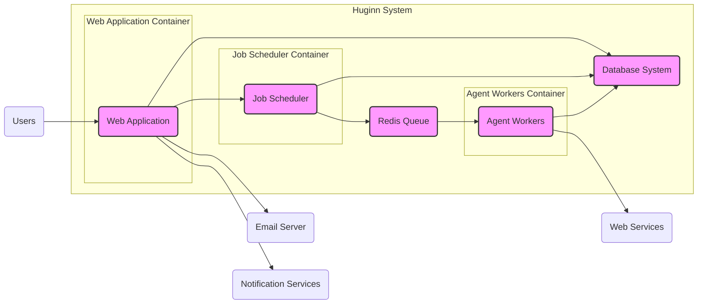
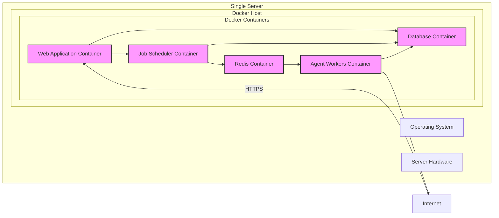

# BUSINESS POSTURE

Huginn is a self-hosted system for building agents that perform automated tasks online. It allows users to automate various web-based activities, such as monitoring websites, tracking data, and interacting with online services.

Business Priorities and Goals:
- Automate repetitive online tasks to improve efficiency and productivity for individuals and organizations.
- Provide a flexible and customizable platform for creating diverse automated workflows.
- Offer a self-hosted solution to give users control over their data and automation processes.
- Enable users to integrate various online services and APIs into their automated workflows.

Business Risks:
- Data privacy and security risks associated with handling sensitive information from online services and user inputs.
- Availability and reliability risks if the Huginn instance becomes unavailable, disrupting automated tasks.
- Complexity of configuration and maintenance, potentially leading to errors and misconfigurations.
- Risk of misuse for malicious purposes if not properly secured and monitored.
- Dependence on external services and APIs, which can change or become unavailable, impacting Huginn's functionality.

# SECURITY POSTURE

Existing Security Controls:
- security control: HTTPS for web interface access (assumed best practice for web applications).
- security control: User authentication and authorization for accessing and managing agents (likely implemented within the application).
- security control: Input validation to prevent common web vulnerabilities (likely implemented within the application).
- security control: Regular software updates and patching of underlying operating system and dependencies (standard system administration practice).
- accepted risk: Reliance on the security of underlying infrastructure (OS, network, hosting provider).
- accepted risk: Potential vulnerabilities in third-party libraries and dependencies.

Recommended Security Controls:
- security control: Implement a robust Content Security Policy (CSP) to mitigate Cross-Site Scripting (XSS) attacks.
- security control: Regularly perform security audits and penetration testing to identify and address vulnerabilities.
- security control: Implement rate limiting and input sanitization to protect against denial-of-service and injection attacks.
- security control: Securely manage API keys and credentials used by agents to interact with external services, potentially using a secrets management solution.
- security control: Implement logging and monitoring of security-relevant events for incident detection and response.
- security control: Conduct security code reviews as part of the development process.
- security control: Implement automated security scanning (SAST/DAST) in the CI/CD pipeline.

Security Requirements:
- Authentication:
    - requirement: Secure user authentication mechanism to control access to the Huginn web interface.
    - requirement: Support for strong password policies and potentially multi-factor authentication.
    - requirement: Secure session management to prevent session hijacking.
- Authorization:
    - requirement: Role-based access control (RBAC) to manage permissions for different users and actions within Huginn.
    - requirement: Principle of least privilege applied to user permissions and agent capabilities.
- Input Validation:
    - requirement: Comprehensive input validation for all user inputs and data received from external services to prevent injection attacks (e.g., SQL injection, command injection, XSS).
    - requirement: Input sanitization and encoding to neutralize potentially malicious input.
- Cryptography:
    - requirement: Use HTTPS for all communication to protect data in transit.
    - requirement: Secure storage of sensitive data at rest, such as API keys and user credentials, potentially using encryption.
    - requirement: Use of strong cryptographic algorithms and libraries for any encryption or hashing operations.

# DESIGN

## C4 CONTEXT

```mermaid
flowchart LR
    subgraph "Huginn System"
        H(Huginn)
    end
    U(Users) --> H
    WS(Web Services) --> H
    E(Email Server) --> H
    N(Notification Services) --> H
    DB(Database System) <-- H
    RQ(Redis Queue) <-- H
    style H fill:#f9f,stroke:#333,stroke-width:2px
```

### Context Diagram Elements

- Name: Users
  - Type: Person
  - Description: Individuals who interact with the Huginn system through the web interface to create, manage, and monitor agents.
  - Responsibilities: Define and manage automated tasks, monitor agent activity, and review results.
  - Security controls: User authentication, authorization, session management.

- Name: Huginn
  - Type: Software System
  - Description: The core automation platform that orchestrates agents, processes data, and interacts with external services.
  - Responsibilities: Agent execution, data processing, scheduling, web interface, interaction with databases and message queues.
  - Security controls: Authentication, authorization, input validation, secure configuration, logging, monitoring.

- Name: Web Services
  - Type: External System
  - Description: External websites, APIs, and online services that Huginn agents interact with to gather data or perform actions.
  - Responsibilities: Provide data and functionality to Huginn agents based on API requests.
  - Security controls: API authentication (if required), rate limiting, input validation on data received from Huginn.

- Name: Email Server
  - Type: External System
  - Description: SMTP server used by Huginn to send email notifications to users.
  - Responsibilities: Relaying email messages from Huginn to recipients.
  - Security controls: SMTP authentication, TLS encryption for email transmission.

- Name: Notification Services
  - Type: External System
  - Description: Third-party notification services (e.g., Pushover, Slack) used by Huginn to send notifications to users through various channels.
  - Responsibilities: Delivering notifications to users via different platforms.
  - Security controls: API authentication, secure communication channels.

- Name: Database System
  - Type: Container
  - Description: Persistent storage for Huginn's data, including agent configurations, user information, and event logs.
  - Responsibilities: Data persistence, data retrieval, data integrity.
  - Security controls: Access control, encryption at rest (optional), regular backups.

- Name: Redis Queue
  - Type: Container
  - Description: Message queue used for asynchronous task processing within Huginn, particularly for background agent execution.
  - Responsibilities: Task queuing, task distribution, message persistence (optional).
  - Security controls: Access control, secure configuration.

## C4 CONTAINER



### Container Diagram Elements

- Name: Web Application
  - Type: Container
  - Description: Ruby on Rails application providing the web interface for user interaction, agent management, and API endpoints.
  - Responsibilities: User interface, authentication, authorization, agent configuration management, API request handling, task scheduling, data presentation.
  - Security controls: Web application firewall (WAF) (optional), input validation, output encoding, session management, authentication, authorization, CSP, rate limiting.

- Name: Job Scheduler
  - Type: Container
  - Description: Component responsible for scheduling agent runs and managing background tasks. Likely implemented using Ruby on Rails and a scheduling library.
  - Responsibilities: Scheduling agent execution, managing recurring tasks, interacting with the message queue.
  - Security controls: Secure task scheduling configuration, access control to scheduling mechanisms.

- Name: Agent Workers
  - Type: Container
  - Description: Background workers that execute the logic of Huginn agents, interacting with web services and processing data. Likely implemented using Sidekiq workers consuming from Redis Queue.
  - Responsibilities: Agent execution, data fetching from web services, data processing, interaction with the database, sending notifications.
  - Security controls: Secure agent execution environment, resource limits, input validation for agent configurations, secure handling of API keys and credentials.

- Name: Database System
  - Type: Container
  - Description: PostgreSQL database storing persistent data for Huginn.
  - Responsibilities: Persistent data storage, data retrieval, data integrity, data backups.
  - Security controls: Database access control, database user authentication, encryption at rest (optional), regular backups, database hardening.

- Name: Redis Queue
  - Type: Container
  - Description: Redis message queue used for asynchronous communication between the Web Application and Agent Workers.
  - Responsibilities: Message queuing, task distribution, message persistence (optional).
  - Security controls: Redis access control, secure Redis configuration, network segmentation.

## DEPLOYMENT

Deployment Solution: Docker Compose on a single server.



### Deployment Diagram Elements

- Name: Server Hardware
  - Type: Infrastructure
  - Description: Physical or virtual server providing the underlying compute resources.
  - Responsibilities: Providing compute, memory, and storage resources.
  - Security controls: Physical security of data center, hardware security features, secure BIOS/firmware.

- Name: Operating System
  - Type: Infrastructure
  - Description: Server operating system (e.g., Linux) hosting the Docker environment.
  - Responsibilities: Resource management, process isolation, system security.
  - Security controls: OS hardening, regular patching, access control, firewall.

- Name: Docker Host
  - Type: Container Platform
  - Description: Docker engine and runtime environment for managing containers.
  - Responsibilities: Container orchestration, resource isolation, image management.
  - Security controls: Docker security configuration, container isolation, image scanning, access control to Docker daemon.

- Name: Web Application Container
  - Type: Container
  - Description: Docker container running the Web Application.
  - Responsibilities: Serving the web interface, handling user requests.
  - Security controls: Container image security, resource limits, network policies.

- Name: Job Scheduler Container
  - Type: Container
  - Description: Docker container running the Job Scheduler.
  - Responsibilities: Scheduling agent tasks.
  - Security controls: Container image security, resource limits, network policies.

- Name: Agent Workers Container
  - Type: Container
  - Description: Docker container running Agent Workers.
  - Responsibilities: Executing agent tasks.
  - Security controls: Container image security, resource limits, network policies.

- Name: Database Container
  - Type: Container
  - Description: Docker container running the PostgreSQL database.
  - Responsibilities: Persistent data storage.
  - Security controls: Container image security, volume security, database access control, network policies.

- Name: Redis Container
  - Type: Container
  - Description: Docker container running the Redis message queue.
  - Responsibilities: Message queuing.
  - Security controls: Container image security, volume security, Redis access control, network policies.

- Name: Internet
  - Type: External Environment
  - Description: Public network through which users access the Huginn web interface and agents interact with web services.
  - Responsibilities: Network connectivity.
  - Security controls: Firewall, intrusion detection/prevention system (IDS/IPS) at the network perimeter.

## BUILD

```mermaid
flowchart LR
    Developer[Developer] -->|Code Changes, Commit| VCS[Version Control System (GitHub)]
    VCS -->|Webhook, Code Push| CI[CI/CD System (GitHub Actions)]
    CI -->|Build, Test, Scan| BA[Build Artifacts (Docker Images)]
    BA -->|Publish| CR[Container Registry (Docker Hub/Self-hosted)]
    CR -->|Pull Image| Deployment[Deployment Environment]
    style VCS fill:#f9f,stroke:#333,stroke-width:2px
    style CI fill:#f9f,stroke:#333,stroke-width:2px
    style BA fill:#f9f,stroke:#333,stroke-width:2px
    style CR fill:#f9f,stroke:#333,stroke-width:2px
```

### Build Diagram Elements

- Name: Developer
  - Type: Person
  - Description: Software developer contributing code to the Huginn project.
  - Responsibilities: Writing code, committing changes, creating pull requests.
  - Security controls: Secure development environment, code review process, security training.

- Name: Version Control System (GitHub)
  - Type: Tool
  - Description: GitHub repository hosting the Huginn source code.
  - Responsibilities: Source code management, version control, collaboration.
  - Security controls: Access control, branch protection, audit logs.

- Name: CI/CD System (GitHub Actions)
  - Type: Tool
  - Description: GitHub Actions used for automated build, test, and deployment pipelines.
  - Responsibilities: Build automation, testing, security scanning, deployment automation.
  - Security controls: Secure pipeline configuration, secret management, access control, audit logs.

- Name: Build Artifacts (Docker Images)
  - Type: Artifact
  - Description: Docker images built by the CI/CD pipeline containing the Huginn application and its dependencies.
  - Responsibilities: Packaging the application for deployment.
  - Security controls: Base image security, dependency scanning, vulnerability scanning, image signing.

- Name: Container Registry (Docker Hub/Self-hosted)
  - Type: Tool
  - Description: Registry for storing and distributing Docker images.
  - Responsibilities: Image storage, image distribution, access control.
  - Security controls: Access control, vulnerability scanning, image signing, audit logs.

- Name: Deployment Environment
  - Type: Environment
  - Description: Target environment where Huginn is deployed (e.g., server, cloud platform).
  - Responsibilities: Running the Huginn application.
  - Security controls: Infrastructure security, runtime security, configuration management.

# RISK ASSESSMENT

Critical Business Processes:
- Automation of online tasks: This is the core functionality of Huginn. Disruption would impact user productivity and automated workflows.
- Data collection and processing: Agents collect and process data from various sources. Data loss or corruption would impact the integrity of automated tasks.
- Notification delivery: Huginn sends notifications to users. Failure to deliver notifications could lead to missed alerts or important updates.

Data Sensitivity:
- User credentials: Passwords and API keys used to access Huginn and external services are highly sensitive.
- Agent configurations: Agent definitions may contain sensitive information or business logic.
- Data collected by agents: Depending on the agents, collected data can range from public information to sensitive personal or business data. Sensitivity depends on the specific use case and agents configured by users. It is important to assume that data handled by Huginn can be sensitive.

# QUESTIONS & ASSUMPTIONS

Questions:
- What is the intended scale of deployment (number of users, agents, data volume)?
- What are the specific compliance requirements (e.g., GDPR, HIPAA)?
- What is the organization's risk tolerance?
- Are there any specific security tools or technologies already in use that should be integrated with Huginn?
- What is the process for managing secrets and API keys used by agents?
- What is the incident response plan in case of a security breach?

Assumptions:
- BUSINESS POSTURE: The primary goal is to provide a functional and reliable automation platform. Security is important but balanced with usability and development speed.
- SECURITY POSTURE: Basic security controls like HTTPS and user authentication are assumed to be in place.  A moderate security posture is desired, focusing on common web application security best practices.
- DESIGN: Docker Compose on a single server is a reasonable initial deployment scenario for a self-hosted application like Huginn. The build process involves standard CI/CD practices using GitHub Actions and Docker.