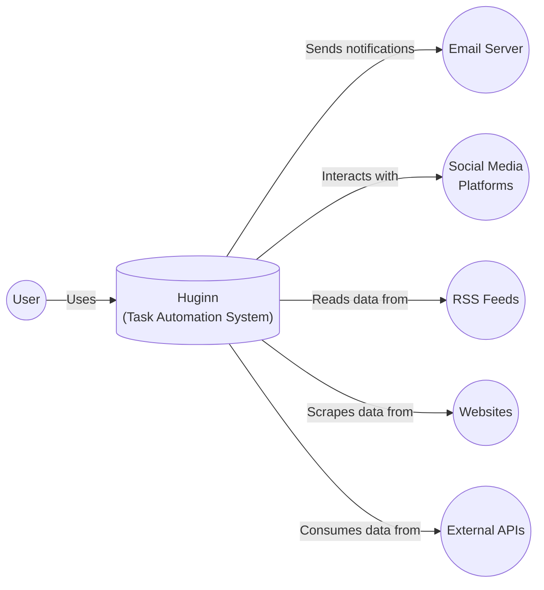
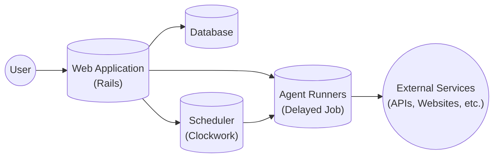
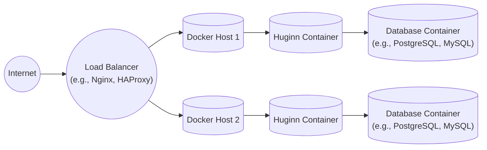

# BUSINESS POSTURE

Huginn is a self-hosted, open-source system for automating tasks. It's akin to a private, customizable version of IFTTT or Zapier. Based on the repository, the following business priorities and goals can be inferred:

Priorities and Goals:

*   Provide users with a flexible and powerful platform for automating online tasks.
*   Enable users to connect various services and APIs without requiring extensive coding knowledge.
*   Maintain a high degree of customizability and extensibility.
*   Foster a strong community around the project, encouraging contributions and user support.
*   Offer a self-hosted solution, giving users full control over their data and automation workflows.
*   Minimize the barrier to entry for users who want to self-host and manage their own instance.

Business Risks:

*   Data breaches: Since Huginn handles potentially sensitive user data and credentials for various online services, a data breach could expose this information, leading to significant reputational damage and potential legal liabilities.
*   Service abuse: Malicious actors could exploit Huginn's automation capabilities for spamming, denial-of-service attacks, or other harmful activities.
*   System instability: Bugs or vulnerabilities in Huginn or its dependencies could lead to system crashes, data loss, or unexpected behavior, disrupting users' workflows.
*   Maintenance burden: As an open-source project, maintaining Huginn and keeping it up-to-date with evolving web standards and security threats requires ongoing effort from the core developers and community contributors.
*   Lack of adoption: If Huginn fails to attract a sufficient user base or active contributors, the project may become stagnant and eventually unsustainable.
*   Supply chain attacks: Compromised dependencies or build tools could introduce vulnerabilities into Huginn, affecting all users.

# SECURITY POSTURE

Existing Security Controls:

*   security control: Authentication: Huginn uses Devise, a flexible authentication solution for Rails, to manage user accounts and logins. (Described in Gemfile and Devise documentation)
*   security control: Authorization: Basic authorization is implemented to restrict access to certain features or data based on user roles. (Mentioned in documentation and code)
*   security control: Input validation: Rails' built-in mechanisms for sanitizing and validating user input are likely used to prevent common web vulnerabilities like cross-site scripting (XSS) and SQL injection. (Rails guides and best practices)
*   security control: Dependency management: Dependencies are managed using Bundler, which helps ensure consistent and reproducible builds. (Gemfile and Gemfile.lock)
*   security control: Secrets management: Sensitive information like API keys and passwords should be stored outside the codebase, likely using environment variables or a dedicated secrets management solution. (Mentioned in documentation and .env.example)
*   security control: Regular updates: The project appears to be actively maintained, with regular updates and bug fixes. (GitHub activity)
*   security control: HTTPS: Documentation recommends using HTTPS to protect data in transit.

Accepted Risks:

*   accepted risk: Self-hosting complexity: Users are responsible for setting up and maintaining their own Huginn instances, which requires technical expertise and may expose them to security risks if not done correctly.
*   accepted risk: Third-party service vulnerabilities: Huginn relies on external services and APIs, which may have their own security vulnerabilities that are outside the project's control.
*   accepted risk: Agent vulnerabilities: Custom agents created by users or the community may contain vulnerabilities or malicious code.

Recommended Security Controls:

*   Implement Content Security Policy (CSP) to mitigate XSS attacks.
*   Introduce robust rate limiting and throttling to prevent abuse.
*   Implement two-factor authentication (2FA) for enhanced account security.
*   Conduct regular security audits and penetration testing.
*   Establish a clear vulnerability disclosure process.
*   Provide security hardening guidelines for self-hosting users.
*   Implement a sandboxing mechanism for running agents to limit their potential impact.
*   Use static analysis security testing (SAST) tools during development.
*   Use dynamic analysis security testing (DAST) tools on deployed instances.

Security Requirements:

*   Authentication:
    *   Support strong password policies.
    *   Offer 2FA options.
    *   Protect against brute-force attacks.
    *   Securely store and manage user credentials.
*   Authorization:
    *   Implement role-based access control (RBAC).
    *   Enforce least privilege principle.
    *   Prevent unauthorized access to sensitive data and functionality.
*   Input Validation:
    *   Sanitize all user input to prevent XSS.
    *   Validate data types and formats to prevent injection attacks.
    *   Implement output encoding to prevent stored XSS.
*   Cryptography:
    *   Use HTTPS for all communication.
    *   Securely store sensitive data at rest using encryption.
    *   Use strong, industry-standard cryptographic algorithms.
    *   Properly manage cryptographic keys.

# DESIGN

## C4 CONTEXT



Element Descriptions:

*   Element:
    *   Name: User
    *   Type: Person
    *   Description: A person who interacts with Huginn to create and manage automated tasks.
    *   Responsibilities: Configures agents, sets schedules, views results, manages credentials.
    *   Security controls: Strong passwords, 2FA (recommended), session management.

*   Element:
    *   Name: Huginn (Task Automation System)
    *   Type: Software System
    *   Description: The core application that provides the task automation functionality.
    *   Responsibilities: Executes agents, manages schedules, stores data, interacts with external services.
    *   Security controls: Authentication (Devise), authorization, input validation, secrets management, HTTPS.

*   Element:
    *   Name: Email Server
    *   Type: Software System
    *   Description: An external system used by Huginn to send email notifications.
    *   Responsibilities: Delivers emails generated by Huginn agents.
    *   Security controls: Secure SMTP configuration, TLS encryption.

*   Element:
    *   Name: Social Media Platforms
    *   Type: Software System
    *   Description: Various social media platforms (e.g., Twitter, Facebook) that Huginn can interact with.
    *   Responsibilities: Provide APIs for Huginn to post updates, read data, etc.
    *   Security controls: API authentication, OAuth, rate limiting.

*   Element:
    *   Name: RSS Feeds
    *   Type: Software System
    *   Description: RSS feeds that Huginn can monitor for new content.
    *   Responsibilities: Provide structured data in RSS/Atom format.
    *   Security controls: HTTPS for feed URLs.

*   Element:
    *   Name: Websites
    *   Type: Software System
    *   Description: Websites that Huginn can scrape data from.
    *   Responsibilities: Serve web pages.
    *   Security controls: Website's own security measures.

*   Element:
    *   Name: External APIs
    *   Type: Software System
    *   Description: Various external APIs that Huginn can interact with.
    *   Responsibilities: Provide specific functionalities and data.
    *   Security controls: API authentication, OAuth, rate limiting.

## C4 CONTAINER



Element Descriptions:

*   Element:
    *   Name: Web Application (Rails)
    *   Type: Web Application
    *   Description: The main web interface and API endpoint for Huginn, built using Ruby on Rails.
    *   Responsibilities: Handles user requests, manages agents, displays data, interacts with other components.
    *   Security controls: Authentication (Devise), authorization, input validation, CSRF protection, session management.

*   Element:
    *   Name: Database
    *   Type: Database
    *   Description: Stores user data, agent configurations, event logs, and other persistent data.
    *   Responsibilities: Provides data persistence and retrieval.
    *   Security controls: Database access controls, encryption at rest (recommended), regular backups.

*   Element:
    *   Name: Scheduler (Clockwork)
    *   Type: Background Process
    *   Description: Schedules and triggers agents to run at specified intervals.
    *   Responsibilities: Manages the timing of agent executions.
    *   Security controls: Secure scheduling configuration, protection against timing attacks.

*   Element:
    *   Name: Agent Runners (Delayed Job)
    *   Type: Background Process
    *   Description: Executes agents in the background, handling their logic and interactions with external services.
    *   Responsibilities: Runs agent code, manages agent lifecycles, handles errors.
    *   Security controls: Sandboxing (recommended), resource limits, error handling.

*   Element:
    *   Name: External Services (APIs, Websites, etc.)
    *   Type: External Systems
    *   Description: The various external services that Huginn agents interact with.
    *   Responsibilities: Provide data and functionality to agents.
    *   Security controls: API authentication, OAuth, rate limiting, website security measures.

## DEPLOYMENT

Possible deployment solutions:

1.  Docker (using the provided Dockerfile)
2.  Manual installation on a server (following the installation guide)
3.  Cloud platforms (e.g., Heroku, AWS, DigitalOcean) using either Docker or manual installation.

Chosen solution (for detailed description): Docker



Element Descriptions:

*   Element:
    *   Name: Internet
    *   Type: Network
    *   Description: The public internet.
    *   Responsibilities: Routes traffic to the load balancer.
    *   Security controls: Firewall, DDoS protection.

*   Element:
    *   Name: Load Balancer (e.g., Nginx, HAProxy)
    *   Type: Load Balancer
    *   Description: Distributes incoming traffic across multiple Docker hosts.
    *   Responsibilities: Handles SSL termination, provides high availability.
    *   Security controls: HTTPS configuration, DDoS protection, WAF (recommended).

*   Element:
    *   Name: Docker Host 1 & 2
    *   Type: Server
    *   Description: Physical or virtual servers that run the Docker engine.
    *   Responsibilities: Hosts Docker containers.
    *   Security controls: OS hardening, firewall, intrusion detection system (IDS).

*   Element:
    *   Name: Huginn Container
    *   Type: Container
    *   Description: Docker container running the Huginn application.
    *   Responsibilities: Executes the Huginn web application and background processes.
    *   Security controls: Container security best practices, minimal base image, regular image updates.

*   Element:
    *   Name: Database Container (e.g., PostgreSQL, MySQL)
    *   Type: Container
    *   Description: Docker container running the database server.
    *   Responsibilities: Provides data persistence for Huginn.
    *   Security controls: Database access controls, encryption at rest (recommended), regular backups, secure network configuration.

## BUILD

```mermaid
graph LR
    Developer[("Developer")] --> GitRepository(("Git Repository\n(GitHub)")]
    GitRepository -- "Push" --> CI[("CI Server\n(e.g., GitHub Actions)")]
    CI --> Build[("Build Process")]
    Build --> SAST[("SAST Scanner")]
    Build --> DependencyCheck[("Dependency Check")]
    SAST --> Report[("Security Report")]
    DependencyCheck --> Report
    Build --> DockerImageRegistry(("Docker Image Registry"))
```

Build Process Description:

1.  Developer commits code to the Git repository (GitHub).
2.  A push to the repository triggers the CI server (e.g., GitHub Actions, Jenkins).
3.  The CI server starts the build process.
4.  The build process includes:
    *   Running a SAST scanner (e.g., Brakeman) to identify potential security vulnerabilities in the code.
    *   Performing a dependency check (e.g., bundler-audit) to identify known vulnerabilities in project dependencies.
    *   Building the Docker image using the provided Dockerfile.
5.  The SAST scanner and dependency check generate security reports.
6.  If the build is successful and security checks pass (based on predefined thresholds), the Docker image is pushed to a Docker image registry.

Security Controls:

*   security control: SAST scanning: Identifies vulnerabilities in the codebase during development.
*   security control: Dependency checking: Identifies known vulnerabilities in project dependencies.
*   security control: Build automation: Ensures consistent and reproducible builds.
*   security control: Secure Docker image build: Uses a minimal base image and follows best practices for container security.
*   security control: Image signing (recommended): Digitally sign Docker images to ensure their integrity.

# RISK ASSESSMENT

Critical Business Processes:

*   User authentication and authorization.
*   Agent execution and scheduling.
*   Data storage and retrieval.
*   Interaction with external services.

Data Sensitivity:

*   User credentials (passwords, API keys): Highly sensitive.
*   Agent configurations: Potentially sensitive, depending on the services and data involved.
*   Event logs: May contain sensitive information, depending on the agents' actions.
*   User data stored by agents: Varies in sensitivity depending on the user's configuration.

# QUESTIONS & ASSUMPTIONS

Questions:

*   What is the expected user base size and growth rate?
*   What are the specific compliance requirements (if any)?
*   What is the budget for security tools and infrastructure?
*   What is the level of technical expertise of the target users?
*   Are there any specific external services that are considered critical for Huginn's functionality?
*   What is the process for handling security vulnerabilities reported by external researchers?

Assumptions:

*   BUSINESS POSTURE: The project prioritizes user privacy and data security.
*   BUSINESS POSTURE: The project aims to be a long-term, sustainable open-source initiative.
*   SECURITY POSTURE: Users are responsible for securing their own Huginn instances.
*   SECURITY POSTURE: The core development team is committed to addressing security issues promptly.
*   DESIGN: The provided Dockerfile and installation guide are the primary deployment methods.
*   DESIGN: The database is the primary data storage mechanism.
*   DESIGN: The CI environment is used for building and testing the application.