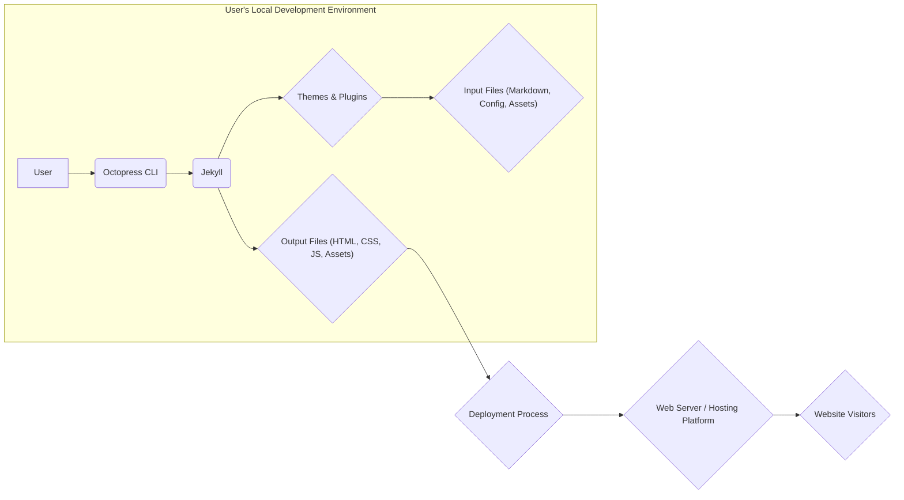
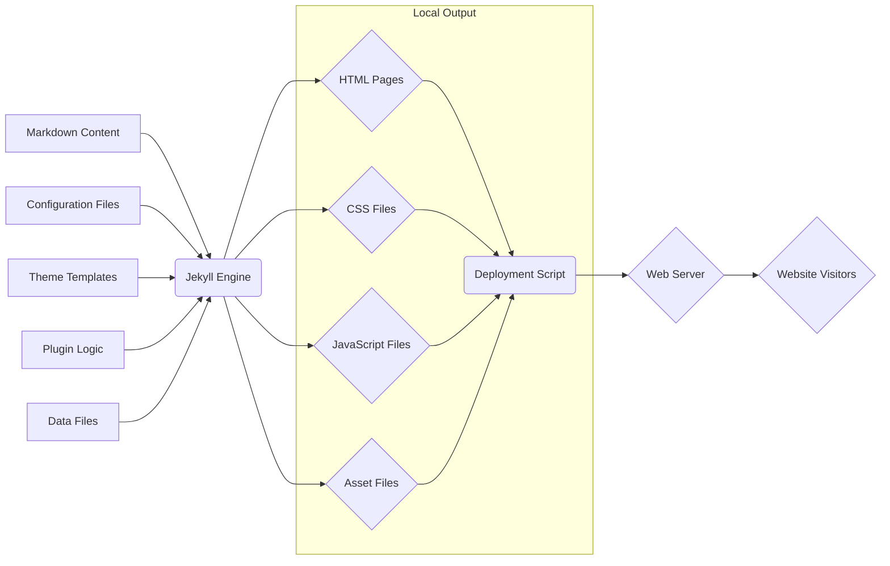
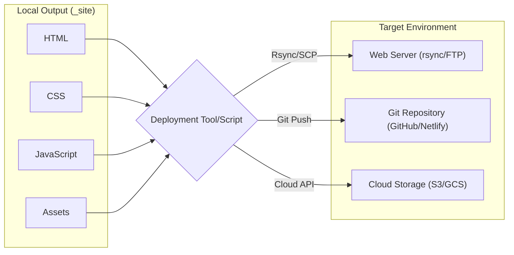

# Project Design Document: Octopress Static Site Generator

**Version:** 1.1
**Date:** October 26, 2023
**Author:** AI Software Architect

## 1. Introduction

This document provides an enhanced and detailed design overview of the Octopress static site generator project, based on the repository found at [https://github.com/imathis/octopress](https://github.com/imathis/octopress). This document aims to clearly outline the system's architecture, components, data flow, and key technologies to facilitate future threat modeling activities and provide a deeper understanding of the system.

Octopress is a blogging framework built on top of Jekyll, designed to streamline the creation and publishing of static websites, particularly blogs. This document focuses on the core functionalities, architecture, and typical usage patterns as presented in the provided repository. We will delve deeper into the interactions between components and the lifecycle of content.

## 2. Goals

*   Clearly and comprehensively define the architecture and components of the Octopress system, providing greater detail on their interactions.
*   Illustrate the data flow within the system, from content creation to deployment and end-user access, with a focus on transformations and dependencies.
*   Identify key technologies and their specific roles and responsibilities within the project.
*   Provide a robust and detailed foundation for subsequent threat modeling exercises, highlighting potential attack surfaces.
*   Document the typical deployment process with more specific examples and considerations.
*   Enhance clarity and readability for a wider audience.

## 3. System Architecture

Octopress functions as a command-line toolchain orchestrating Jekyll to generate static websites. The core process involves transforming user-authored content (primarily Markdown), applying themes and plugins for presentation and functionality, and ultimately outputting static HTML, CSS, and JavaScript files ready for deployment.

### 3.1. High-Level Architecture

### 3.2. Detailed Component Breakdown

*   **User:** The individual responsible for creating, managing, and deploying the website content. This includes writing posts, configuring the site, and initiating the generation and deployment processes.
*   **Octopress CLI:** The command-line interface acts as a user-friendly wrapper around Jekyll. It provides simplified commands for common tasks such as:
    *   Creating new posts and pages.
    *   Generating the static website.
    *   Previewing the site locally.
    *   Deploying the generated site to various hosting platforms.
    *   Managing plugins and themes.
*   **Jekyll:** The foundational static site generator that performs the core transformation of content into a website. Key responsibilities include:
    *   Parsing Markdown and other input formats.
    *   Applying Liquid templating for dynamic content injection.
    *   Processing layouts and includes to structure pages.
    *   Executing plugins to extend functionality.
    *   Generating the final static HTML, CSS, and JavaScript files.
*   **Themes:** Define the visual presentation and user experience of the website. Themes consist of:
    *   HTML layout templates that define the structure of pages.
    *   CSS stylesheets for styling the content and layout.
    *   JavaScript files for adding interactive elements.
    *   Asset files (images, fonts) used for visual design.
*   **Plugins:** Ruby code extensions that enhance Jekyll's capabilities. They can perform various tasks, such as:
    *   Generating sitemaps and RSS feeds.
    *   Implementing custom tag functionality.
    *   Integrating with external services (e.g., analytics).
    *   Optimizing output files.
*   **Input Files:** The raw materials for generating the website:
    *   **Markdown Files:** Text files written in Markdown syntax, containing the primary content for blog posts and static pages. These often include front matter (YAML headers) for metadata like title, date, and categories.
    *   **Configuration Files (`_config.yml`):** A YAML file that centralizes site-wide settings, including:
        *   Website title, URL, and author information.
        *   Theme selection and configuration.
        *   Plugin activation and settings.
        *   Deployment configurations.
    *   **Layout Files (`_layouts`):** HTML templates that define the overall structure of different page types (e.g., default, post, page).
    *   **Include Files (`_includes`):** Reusable HTML or Liquid code snippets that can be embedded in layouts and posts.
    *   **Data Files (`_data`):** YAML, JSON, or CSV files containing structured data that can be accessed and rendered within templates, enabling dynamic content generation.
    *   **Asset Files (`images`, `css`, `js` within the source directory):** Static files like images, custom stylesheets, and JavaScript files that are copied or processed during site generation.
*   **Output Files:** The resulting static website ready for deployment:
    *   **HTML Files:** The final rendered web pages that browsers display.
    *   **CSS Files:** Stylesheets that control the visual presentation of the HTML.
    *   **JavaScript Files:** Client-side scripts that add interactivity and dynamic behavior.
    *   **Asset Files (Copied):** Images, fonts, and other static assets are copied from the source directory to the output directory.
*   **Deployment Process:** The mechanism for transferring the generated output files to a live web server or hosting platform. This often involves:
    *   **Command-line tools:** Such as `rsync`, `scp`, or Git commands.
    *   **Dedicated deployment scripts:** Often defined using Rake tasks within Octopress.
    *   **Integration with hosting platforms:**  Like GitHub Pages or Netlify, where pushing changes to a repository triggers automated deployment.
*   **Web Server / Hosting Platform:** The infrastructure that serves the static website to end-users. This can range from:
    *   **Traditional web servers:** Like Apache or Nginx on a virtual private server (VPS).
    *   **Static site hosting providers:** Such as Netlify, Vercel, or GitHub Pages, which are specifically designed for serving static content.
    *   **Cloud storage services:** Like AWS S3 or Google Cloud Storage, configured for static website hosting.
*   **Website Visitors:** The end-users who access and interact with the published website through their web browsers.

## 4. Data Flow

The data flow in Octopress illustrates how content is transformed from its source to the final rendered website:

1. **Content Authoring:** The user creates content in Markdown files, potentially with embedded HTML or Liquid tags.
2. **Configuration Loading:** When the Octopress CLI invokes Jekyll, Jekyll loads the settings from `_config.yml` and other configuration sources.
3. **Input File Processing:** Jekyll reads and parses various input files:
    *   Markdown files are parsed to extract content and metadata (front matter).
    *   Layout files provide the structural HTML for pages.
    *   Include files are incorporated into layouts and posts.
    *   Data files are loaded into memory for use in templates.
4. **Theme Rendering:** Jekyll applies the selected theme. Liquid tags within layouts and includes are processed, injecting dynamic content based on the input files and configuration.
5. **Plugin Execution:** Plugins are executed at specific points in the generation process, potentially modifying content, generating new files, or interacting with external services.
6. **Content Transformation:** Markdown content is transformed into HTML based on the theme's templates and any plugin modifications. Liquid tags are evaluated and replaced with dynamic content.
7. **Output File Generation:** Jekyll writes the processed HTML, CSS (from the theme and potentially custom CSS), JavaScript (from the theme and custom scripts), and asset files to the output directory (`_site` by default).
8. **Deployment Preparation:** The user initiates the deployment process, which may involve building optimized versions of the output files or preparing them for transfer.
9. **File Transfer:** Deployment tools or scripts transfer the contents of the output directory to the designated web server or hosting platform.
10. **Content Serving:** The web server or hosting platform serves the static files to website visitors upon request.

## 5. Key Technologies

*   **Ruby:** The primary programming language for Jekyll and Octopress, providing the runtime environment and core libraries.
*   **Jekyll:** The central static site generator, responsible for content processing, templating, and output generation.
*   **Liquid:** Shopify's templating language, embedded within HTML to enable dynamic content injection and logic within Jekyll themes and layouts.
*   **Markdown:** A lightweight markup language used for writing content, allowing for easy formatting and conversion to HTML.
*   **HTML (HyperText Markup Language):** The standard markup language for creating the structure and content of web pages.
*   **CSS (Cascading Style Sheets):** The stylesheet language used to control the visual presentation and styling of HTML elements.
*   **JavaScript:** A scripting language primarily used for adding interactive elements and dynamic behavior to the client-side of the website.
*   **YAML (YAML Ain't Markup Language):** A human-readable data serialization language, extensively used for configuration files in Octopress and Jekyll.
*   **Git:** A distributed version control system often used for managing the Octopress project, tracking changes, and facilitating deployment to platforms like GitHub Pages and Netlify.
*   **Rake:** A Ruby-based build automation tool used by Octopress to define and manage tasks such as site generation, deployment, and previewing.
*   **Bundler:** A dependency manager for Ruby gems, ensuring consistent versions of required libraries for Octopress and Jekyll.

## 6. Deployment Process Details

The deployment process in Octopress involves transferring the locally generated static website files to a hosting environment. Specific steps and tools vary depending on the chosen deployment method.

Common deployment workflows include:

*   **`rsync` Deployment:**
    1. **Generate the Site:** Execute `rake generate` to build the static website in the `_site` directory.
    2. **Configure `_deploy.yml`:** Specify the remote server details (hostname, username, target directory) in the `_deploy.yml` configuration file.
    3. **Initiate Deployment:** Run `rake deploy`. Octopress uses `rsync` to efficiently synchronize the contents of the `_site` directory with the remote server.
    *   **Security Consideration:** Ensure secure SSH key exchange is configured for passwordless `rsync` to avoid storing passwords in configuration files.
*   **Git-based Deployment (GitHub Pages/Netlify/Vercel):**
    1. **Generate the Site:** Execute `rake generate`.
    2. **Initialize Git Repository:** Ensure the Octopress project is a Git repository.
    3. **Commit Changes:** Commit the generated files in the `_site` directory (or the root of the repository, depending on the platform's requirements).
    4. **Push to Remote Repository:** Push the changes to the remote Git repository (e.g., on GitHub, GitLab, or Bitbucket).
    5. **Platform-Specific Configuration:** Configure the hosting platform to build and deploy the site from the repository. This often involves specifying the build command (`jekyll build` or similar) and the output directory.
    *   **Security Consideration:** Securely manage Git credentials and ensure the repository has appropriate access controls.
*   **FTP/SFTP Deployment:**
    1. **Generate the Site:** Execute `rake generate`.
    2. **Configure FTP/SFTP Details:** Store the FTP/SFTP server address, username, and password (or use a more secure method like key-based authentication) in a configuration file or environment variables.
    3. **Initiate Deployment:** Use an FTP/SFTP client or a script to upload the contents of the `_site` directory to the web server.
    *   **Security Consideration:** Avoid storing FTP/SFTP passwords directly in scripts. Use secure methods like environment variables or dedicated credential management tools. SFTP is preferred over FTP due to encryption.
*   **Cloud Storage Deployment (AWS S3/Google Cloud Storage):**
    1. **Generate the Site:** Execute `rake generate`.
    2. **Configure Cloud Storage Bucket:** Create and configure a cloud storage bucket for static website hosting.
    3. **Upload Files:** Use cloud provider-specific command-line tools (e.g., `aws s3 sync`, `gsutil cp`) or SDKs to upload the contents of the `_site` directory to the bucket.
    4. **Configure Bucket Permissions:** Set appropriate permissions to allow public access to the website files.
    *   **Security Consideration:** Implement proper access controls and bucket policies to prevent unauthorized access or modification of the website content.

## 7. Security Considerations (Detailed)

This section expands on potential security considerations, providing more specific examples and recommendations for mitigation.

*   **Dependency Vulnerabilities (Ruby Gems):**
    *   **Threat:** Outdated or vulnerable Ruby gems used by Jekyll and Octopress can be exploited by attackers.
    *   **Mitigation:**
        *   Regularly update gems using `bundle update`.
        *   Use tools like `bundler-audit` or `dependency-check` to scan for known vulnerabilities in dependencies.
        *   Pin gem versions in the `Gemfile.lock` file to ensure consistent and tested dependencies.
*   **Theme Security:**
    *   **Threat:** Malicious code (e.g., JavaScript) embedded within themes can lead to cross-site scripting (XSS) attacks or other client-side vulnerabilities.
    *   **Mitigation:**
        *   Use themes from trusted and reputable sources.
        *   Review theme code for suspicious or obfuscated JavaScript.
        *   Implement a Content Security Policy (CSP) to restrict the sources from which the browser can load resources.
*   **Plugin Security:**
    *   **Threat:** Similar to themes, plugins can contain vulnerabilities or malicious code that could compromise the website or the server.
    *   **Mitigation:**
        *   Only use plugins from trusted and well-maintained sources.
        *   Review plugin code before installation, especially if it involves handling user input or interacting with external services.
        *   Keep plugins updated to patch any discovered vulnerabilities.
*   **Input Validation and Sanitization:**
    *   **Threat:** While Markdown itself is generally safe, custom plugins or improper handling of user-provided data within plugins could introduce vulnerabilities like XSS.
    *   **Mitigation:**
        *   Sanitize any user-provided input before rendering it on the page.
        *   Be cautious when using plugins that allow arbitrary code execution or external data inclusion.
*   **Deployment Credential Management:**
    *   **Threat:** Exposed or compromised deployment credentials (e.g., SSH keys, FTP passwords, cloud API keys) can allow unauthorized access to the hosting environment, leading to website defacement or data breaches.
    *   **Mitigation:**
        *   Avoid storing credentials directly in configuration files.
        *   Use secure methods for managing credentials, such as SSH key-based authentication, environment variables, or dedicated secret management tools (e.g., HashiCorp Vault).
        *   Implement proper access controls and limit the scope of deployment credentials.
*   **Web Server Security:**
    *   **Threat:** Vulnerabilities in the underlying web server software or misconfigurations can be exploited to compromise the hosting environment.
    *   **Mitigation:**
        *   Keep the web server software (e.g., Apache, Nginx) up to date with the latest security patches.
        *   Follow security best practices for web server configuration, such as disabling unnecessary features and setting appropriate file permissions.
        *   Implement a firewall to restrict access to the server.
*   **Content Security Policy (CSP):**
    *   **Threat:** Without a CSP, the browser has no restrictions on the sources from which it can load resources, increasing the risk of XSS attacks.
    *   **Mitigation:** Implement a strict CSP to define the allowed sources for scripts, stylesheets, images, and other resources.
*   **HTTPS Implementation:**
    *   **Threat:** Serving the website over HTTP exposes data transmitted between the server and the user's browser to eavesdropping and man-in-the-middle attacks.
    *   **Mitigation:** Ensure the website is served over HTTPS by obtaining and configuring an SSL/TLS certificate. Enforce HTTPS by redirecting HTTP traffic to HTTPS.

## 8. Future Considerations

*   **Migration to Modern Static Site Generators:** Evaluating newer static site generators like Hugo, Gatsby, or Next.js for potential performance improvements, enhanced features, or improved security.
*   **Continuous Integration/Continuous Deployment (CI/CD) Pipelines:** Implementing automated build and deployment pipelines using tools like GitHub Actions, GitLab CI, or Jenkins to streamline the deployment process and improve reliability.
*   **Headless CMS Integration:** Exploring integration with headless Content Management Systems (CMS) to provide content editors with a more user-friendly interface while still leveraging the benefits of static site generation.
*   **Improved Asset Management:** Investigating more robust asset management solutions for handling images, videos, and other media files.
*   **Performance Optimization:** Implementing advanced performance optimization techniques such as content delivery networks (CDNs), image optimization, and code minification.

This revised document provides a more in-depth and detailed design overview of the Octopress project, offering a stronger foundation for threat modeling and a better understanding of the system's intricacies.