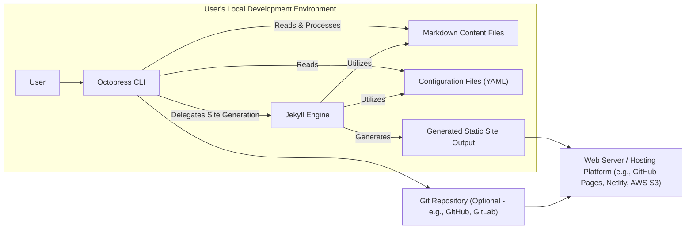
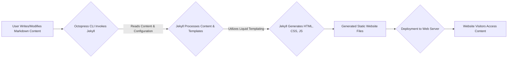

# Project Design Document: Octopress

**Version:** 1.1
**Date:** October 26, 2023
**Author:** Gemini (AI Language Model)

## 1. Introduction

This document provides a detailed design overview of the Octopress blogging framework, focusing on aspects relevant to security analysis and threat modeling. It aims to capture the key architectural components, data flows, and interactions within the system, with a particular emphasis on potential vulnerabilities and attack surfaces.

Octopress is a static site generator built upon Jekyll, leveraging Ruby. It streamlines the creation and publication of blog content using Markdown, Git for version control, and various deployment strategies. This document serves as a foundational resource for identifying and mitigating potential security risks associated with Octopress deployments.

## 2. Goals

The primary goals of Octopress are:

*   To simplify the creation and management of blog content through a command-line interface.
*   To generate static websites, enhancing performance and reducing the attack surface compared to dynamic content management systems.
*   To offer a flexible and customizable platform for bloggers through themes and plugins.
*   To facilitate integration with various deployment platforms, enabling diverse hosting options.

## 3. High-Level Architecture

The following diagram illustrates the high-level architecture of Octopress, emphasizing the key actors and components involved in the content creation and deployment lifecycle:

**Components:**

*   **User:** The individual responsible for creating, managing, and deploying the blog content.
*   **Octopress CLI:** The command-line interface (CLI) written in Ruby, providing tools for managing the Octopress project.
*   **Markdown Content Files:** Text files written in Markdown, containing the actual blog post content and optional front matter.
*   **Configuration Files (YAML):** YAML-formatted files (`_config.yml`, plugin configurations, etc.) defining site-wide settings, themes, and plugin parameters.
*   **Jekyll Engine:** The core static site generator, written in Ruby, responsible for transforming Markdown content and templates into static HTML, CSS, and JavaScript files.
*   **Generated Static Site Output:** The directory containing the final HTML, CSS, JavaScript, and asset files ready for deployment to a web server.
*   **Git Repository (Optional):** A version control system used for managing the Octopress project, tracking changes, and potentially facilitating deployment workflows.
*   **Web Server / Hosting Platform:** The platform responsible for serving the generated static website files to end-users.

## 4. Detailed Component Description

This section provides a more granular description of each component, highlighting technical details and potential security considerations:

*   **Octopress CLI:**
    *   Implementation Language: Ruby.
    *   Key Functions:
        *   Creating new blog posts (`rake new_post`).
        *   Generating the static website (`rake generate`).
        *   Previewing the site locally (`rake preview`).
        *   Deploying the site (`rake deploy`).
        *   Managing themes and plugins (`rake install_theme`, `rake install_plugin`).
    *   Security Notes:
        *   Relies on user-provided commands and input, which could be malicious if the user's environment is compromised.
        *   Interacts with the file system, potentially leading to unauthorized file access or modification if vulnerabilities exist.
        *   Execution of arbitrary Ruby code through rake tasks and plugin management poses a risk.

*   **Markdown Content Files:**
    *   Format: Plain text files with Markdown syntax.
    *   Front Matter: Optional YAML block at the beginning of the file containing metadata (title, date, tags, categories, layout).
    *   Security Notes:
        *   User-controlled content, susceptible to cross-site scripting (XSS) if not properly sanitized during the generation process.
        *   Front matter can influence the generated output and could be manipulated to inject malicious content or alter site structure.
        *   Inclusion of arbitrary HTML or JavaScript within Markdown can be a significant vulnerability.

*   **Configuration Files (YAML):**
    *   Format: YAML (Yet Another Markup Language).
    *   Key Files: `_config.yml` (main site configuration), plugin-specific configuration files.
    *   Content: Site title, description, theme settings, plugin configurations, deployment settings, social media links, potentially API keys or credentials.
    *   Security Notes:
        *   Sensitive information (API keys, deployment credentials) should ideally be managed through environment variables or secure vault mechanisms, not directly in configuration files.
        *   Incorrectly configured settings can expose sensitive information or weaken security measures.
        *   If these files are compromised, an attacker can gain control over the site's behavior and potentially its deployment.

*   **Jekyll Engine:**
    *   Implementation Language: Ruby.
    *   Core Functionality: Transforms Markdown, Liquid templates, and assets into a static website.
    *   Templating Language: Liquid (developed by Shopify).
    *   Extensibility: Supports plugins written in Ruby.
    *   Security Notes:
        *   Vulnerabilities in the Jekyll engine itself or its dependencies could be exploited.
        *   Improper use of Liquid templating can lead to XSS vulnerabilities.
        *   Security of installed plugins is a critical concern, as malicious plugins can execute arbitrary code during the build process.

*   **Generated Static Site Output:**
    *   Content: HTML, CSS, JavaScript files, images, and other assets.
    *   Nature: Static files, meaning no server-side processing occurs when a user requests a page.
    *   Security Notes:
        *   While inherently more secure than dynamic sites, vulnerabilities can still exist in the generated HTML and JavaScript (e.g., XSS).
        *   The security of this output depends on the security of the generation process.

*   **Git Repository (Optional):**
    *   Purpose: Version control, collaboration, and potentially deployment.
    *   Platforms: GitHub, GitLab, Bitbucket, self-hosted Git servers.
    *   Security Notes:
        *   Requires secure authentication and authorization to prevent unauthorized access and modification of the repository.
        *   Accidental exposure of sensitive information (credentials, API keys) in the repository history is a risk.
        *   Compromised Git credentials can lead to complete control over the website's codebase and deployment.

*   **Web Server / Hosting Platform:**
    *   Examples: GitHub Pages, Netlify, Vercel, AWS S3, traditional web servers (Apache, Nginx).
    *   Responsibility: Serving the generated static files to website visitors.
    *   Security Notes:
        *   Security depends heavily on the chosen platform's infrastructure and security practices.
        *   Misconfigurations on the web server can expose the site to vulnerabilities.
        *   Access control policies on the hosting platform are crucial.

## 5. Data Flow

The following diagram illustrates the typical data flow within Octopress, highlighting the transformation of content from its initial creation to the final presentation to the user:

**Detailed Data Flow:**

1. **User Writes/Modifies Markdown Content:** The user creates or edits blog posts in Markdown format on their local machine.
2. **Octopress CLI Invokes Jekyll:** The user executes an Octopress CLI command (e.g., `rake generate`), which triggers the Jekyll engine.
3. **Jekyll Processes Content & Configuration:** Jekyll reads the Markdown content files, configuration files (`_config.yml`), layouts, and includes.
4. **Jekyll Utilizes Liquid Templating:** Jekyll uses the Liquid templating language to process the content and layouts, dynamically inserting data and generating HTML.
5. **Jekyll Generates HTML, CSS, JS:** Jekyll outputs the final static website files (HTML, CSS, JavaScript, and assets) into the `_site` directory.
6. **Deployment to Web Server:** The generated files are deployed to a web server or hosting platform using various methods (e.g., Git push, CLI tools, manual upload).
7. **Website Visitors Access Content:** End-users access the website through their web browsers, requesting and receiving the static files from the web server.

## 6. Security Considerations

This section details potential security risks and vulnerabilities associated with Octopress:

*   **Input Validation and Sanitization:**
    *   **Risk:** Malicious scripts or HTML embedded in Markdown content can be executed in users' browsers (XSS).
    *   **Mitigation:** Implement robust sanitization of user-provided content during the Jekyll generation process. Use secure templating practices to prevent injection vulnerabilities.

*   **Dependency Management:**
    *   **Risk:** Vulnerabilities in Ruby gems used by Octopress or Jekyll can be exploited.
    *   **Mitigation:** Regularly update dependencies and use tools like `bundler-audit` to identify and address known vulnerabilities.

*   **Plugin Security:**
    *   **Risk:** Malicious or vulnerable Jekyll plugins can execute arbitrary code during site generation, potentially compromising the build process or the generated site.
    *   **Mitigation:** Carefully vet and select plugins from trusted sources. Keep plugins updated and be aware of their potential security implications.

*   **Deployment Security:**
    *   **Risk:** Compromised deployment credentials can allow attackers to modify or replace the website content. Insecure deployment workflows can expose sensitive information.
    *   **Mitigation:** Use secure authentication methods for Git repositories and hosting platforms. Store deployment credentials securely (e.g., using environment variables or secrets management tools).

*   **Secret Management:**
    *   **Risk:** Storing API keys or other sensitive credentials directly in configuration files exposes them to potential compromise.
    *   **Mitigation:** Utilize environment variables or dedicated secrets management solutions to store and manage sensitive information. Avoid committing sensitive data to Git repositories.

*   **Local Environment Security:**
    *   **Risk:** A compromised local development environment can allow attackers to modify content, configuration, or inject malicious code before deployment.
    *   **Mitigation:** Maintain a secure local development environment with up-to-date software and security measures.

*   **Theme Security:**
    *   **Risk:** Themes can contain malicious JavaScript or insecure code that can lead to XSS vulnerabilities.
    *   **Mitigation:** Choose themes from reputable sources and review their code for potential security issues.

*   **Denial of Service (DoS):**
    *   **Risk:** While static sites are generally resilient to traditional server-side DoS attacks, large-scale generation processes or resource-intensive plugins could potentially lead to local DoS.
    *   **Mitigation:** Optimize the site generation process and be mindful of the resource usage of plugins.

## 7. Deployment Architecture

Octopress sites are typically deployed as static files to various hosting platforms. Common deployment architectures include:

*   **GitHub Pages Deployment:**
    *   Process: Generate the site locally, commit the generated `_site` directory to a GitHub repository, and configure GitHub Pages to serve the content.
    *   Security Considerations: Relies on GitHub's security infrastructure. Ensure secure GitHub account practices. Public repositories expose the source code.

*   **Netlify/Vercel Deployment:**
    *   Process: Connect a Git repository to Netlify or Vercel, which automatically builds and deploys the site on every push.
    *   Security Considerations: Leverages the security features of these platforms. Secure integration with Git repositories is crucial.

*   **AWS S3/CloudFront Deployment:**
    *   Process: Generate the site locally and upload the files to an AWS S3 bucket. Optionally use CloudFront as a CDN for improved performance and security.
    *   Security Considerations: Requires careful configuration of S3 bucket permissions and CloudFront settings to prevent unauthorized access.

*   **Traditional Web Server Deployment (Apache/Nginx):**
    *   Process: Generate the site locally and copy the files to the web server's document root.
    *   Security Considerations: Relies on the security configuration of the web server. Proper file permissions and server hardening are essential.

## 8. Threat Landscape

Considering the architecture and data flow, potential threat actors and their goals could include:

*   **Malicious User/Attacker:**
    *   Goals: Deface the website, inject malicious content (e.g., for phishing or malware distribution), gain unauthorized access to the hosting platform or Git repository.
    *   Attack Vectors: Exploiting XSS vulnerabilities, compromising deployment credentials, injecting malicious content through plugins or themes.

*   **Compromised Developer Machine:**
    *   Goals: Inject malicious code into the website during the development or deployment process.
    *   Attack Vectors: Malware on the developer's machine, compromised SSH keys or Git credentials.

*   **Supply Chain Attacks:**
    *   Goals: Compromise the website by exploiting vulnerabilities in dependencies (gems) or plugins.
    *   Attack Vectors: Using known vulnerabilities in outdated dependencies, installing malicious plugins.

*   **Unauthorized Insider:**
    *   Goals: Modify or deface the website, potentially for malicious purposes.
    *   Attack Vectors: Exploiting access to the Git repository or hosting platform.

## 9. Assumptions

The following assumptions are made in this design document:

*   Users have a basic understanding of command-line interfaces, Git, and web development concepts.
*   Users are responsible for the security of their local development environments.
*   Chosen hosting platforms provide a baseline level of security for serving static content.
*   Users follow recommended security best practices for managing credentials and access control.

## 10. Out of Scope

This design document does not cover:

*   Detailed implementation specifics of the Jekyll engine.
*   Specific security configurations of individual hosting platforms beyond a high-level overview.
*   In-depth analysis of every possible Octopress plugin and its security implications.
*   User authentication or authorization mechanisms for accessing the blog content (as it is a static site).
*   Detailed performance optimization strategies.

## 11. Future Considerations

Potential future enhancements or areas for further investigation include:

*   Integration of automated security scanning tools into the Octopress workflow.
*   More granular control over content sanitization options.
*   Enhanced mechanisms for managing and securing sensitive information.
*   Community-driven security audits of popular themes and plugins.
*   Formalized security guidelines and best practices documentation for Octopress users.