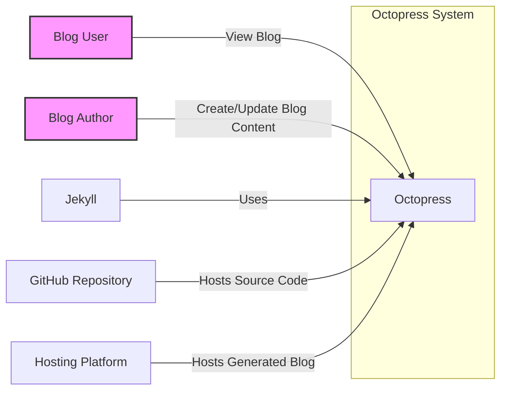
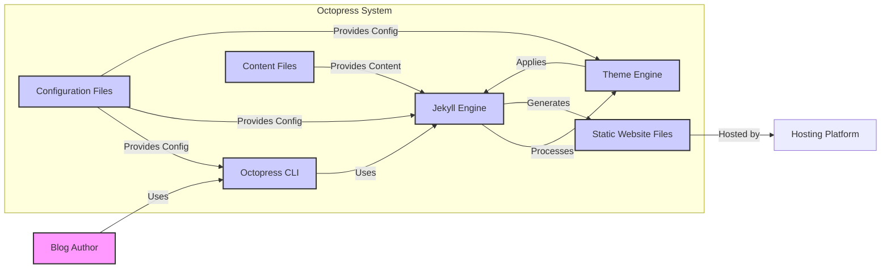
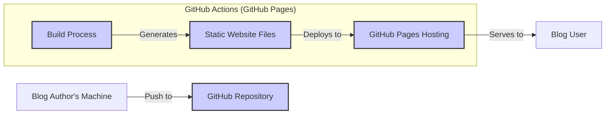
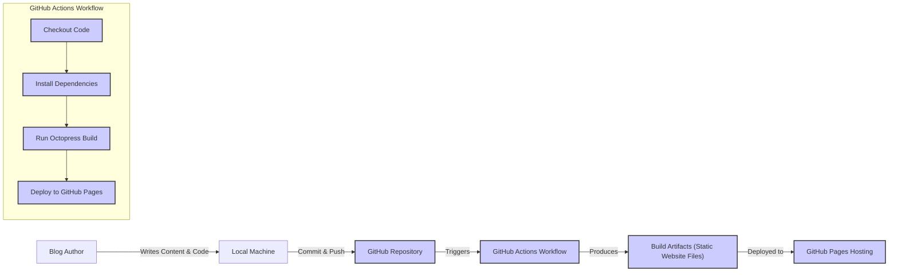

# BUSINESS POSTURE

- Business priorities:
  - Enable developers to create and manage personal or project blogs efficiently.
  - Provide a customizable and flexible static site generation tool for blogging.
  - Simplify the process of publishing technical content online.
- Business goals:
  - Offer a user-friendly blogging framework based on static site generation principles.
  - Empower developers to have full control over their blog's design and content.
  - Facilitate easy deployment of blogs to various hosting platforms.
- Business risks:
  - Loss of blog content due to system failures or accidental deletion.
  - Website defacement or unauthorized modification of blog content.
  - Exposure of sensitive configuration data if not properly managed.
  - Supply chain vulnerabilities in dependencies used by Octopress.

# SECURITY POSTURE

- Existing security controls:
  - security control: Reliance on Jekyll's security features as Octopress is built on top of it. (Implemented within Jekyll framework)
  - security control: Static site nature inherently reduces server-side vulnerabilities compared to dynamic websites. (Architectural design)
  - security control: Version control using Git for tracking changes and rollback capabilities. (Implemented via Git and GitHub)
- Accepted risks:
  - accepted risk: Potential vulnerabilities in third-party Jekyll plugins or themes used with Octopress.
  - accepted risk: Security of the hosting platform is assumed to be managed by the hosting provider.
- Recommended security controls:
  - security control: Implement dependency scanning to identify and manage vulnerabilities in Jekyll and Octopress dependencies.
  - security control: Perform static analysis security testing (SAST) on Octopress codebase and custom plugins/themes.
  - security control: Enforce secure deployment practices, including minimizing exposed files and using HTTPS.
  - security control: Regularly update Jekyll and Octopress dependencies to patch known vulnerabilities.
- Security requirements:
  - Authentication:
    - Requirement: Authentication is primarily relevant for blog content creation and management, which is typically done locally or via Git. Secure authentication mechanisms are needed if any web-based admin interface is introduced (though not standard in Octopress).
  - Authorization:
    - Requirement: Authorization is needed to control who can modify blog content and configuration. In a typical Octopress setup, this is managed through access to the Git repository.
  - Input validation:
    - Requirement: Input validation is crucial during blog post creation to prevent injection attacks (e.g., cross-site scripting) if dynamic elements are introduced or if user-generated content is allowed (comments, etc.). For static sites, this is less critical at runtime but important during content generation.
  - Cryptography:
    - Requirement: Cryptography is important for protecting sensitive configuration data (if any) and ensuring secure communication (HTTPS) for the blog website.

# DESIGN

## C4 CONTEXT

- Elements of Context Diagram:
  - - Name: Octopress
    - Type: System
    - Description: A blogging framework built on Jekyll that simplifies the creation and deployment of static websites, particularly blogs for developers.
    - Responsibilities:
      - Generate static blog websites from Markdown content and configuration.
      - Provide a command-line interface for blog creation, management, and deployment.
      - Integrate with Jekyll for core static site generation functionality.
    - Security controls:
      - Relies on underlying Jekyll security.
      - Static site generation minimizes runtime vulnerabilities.
  - - Name: Blog User
    - Type: Person
    - Description: Individuals who visit and read the blog website generated by Octopress.
    - Responsibilities:
      - Consume blog content.
    - Security controls:
      - None directly, interacts with the deployed blog which should be secured.
  - - Name: Blog Author
    - Type: Person
    - Description: Developers or individuals who create and manage blog content using Octopress.
    - Responsibilities:
      - Write blog posts in Markdown format.
      - Configure blog settings and appearance.
      - Manage blog content using Octopress CLI and Git.
    - Security controls:
      - Responsible for secure content creation practices.
      - Manages access to the Git repository containing blog source.
  - - Name: Jekyll
    - Type: External System
    - Description: The underlying static site generator framework that Octopress is built upon.
    - Responsibilities:
      - Core static site generation engine.
      - Theme and template processing.
    - Security controls:
      - Security controls are managed by the Jekyll project.
  - - Name: GitHub Repository
    - Type: External System
    - Description: A Git repository hosted on GitHub that stores the Octopress source code, blog content, and configuration.
    - Responsibilities:
      - Version control for blog content and code.
      - Source code hosting and collaboration.
      - Potentially used for deployment via GitHub Pages.
    - Security controls:
      - Access control and security features provided by GitHub.
  - - Name: Hosting Platform
    - Type: External System
    - Description: The platform where the generated static blog website is hosted, making it accessible to Blog Users. Examples include GitHub Pages, Netlify, or a traditional web server.
    - Responsibilities:
      - Hosting the static website files.
      - Serving the website to Blog Users.
    - Security controls:
      - Security controls are managed by the hosting platform provider. (e.g., HTTPS, infrastructure security)

## C4 CONTAINER

- Elements of Container Diagram:
  - - Name: Octopress CLI
    - Type: Container
    - Description: Command-line interface provided by Octopress for interacting with the system. It allows Blog Authors to create, manage, and generate blog websites.
    - Responsibilities:
      - Provide commands for blog creation, configuration, and generation.
      - Orchestrate the use of Jekyll Engine and Theme Engine.
      - Manage Configuration Files and Content Files.
    - Security controls:
      - Primarily relies on the security of the operating system and user permissions where it is executed.
  - - Name: Jekyll Engine
    - Type: Container
    - Description: The core static site generation engine inherited from Jekyll. It processes Content Files and Configuration Files, applies themes, and generates Static Website Files.
    - Responsibilities:
      - Parse Markdown content and templates.
      - Generate HTML, CSS, and JavaScript files for the website.
      - Manage plugins and extensions.
    - Security controls:
      - Input validation during content processing.
      - Theme and plugin security (needs careful selection and updates).
  - - Name: Theme Engine
    - Type: Container
    - Description: Responsible for applying themes and layouts to the generated blog website. It works in conjunction with the Jekyll Engine to style the content.
    - Responsibilities:
      - Apply CSS styles and layouts defined in themes.
      - Customize the visual appearance of the blog.
    - Security controls:
      - Theme security (avoiding malicious or vulnerable themes).
  - - Name: Configuration Files
    - Type: Container
    - Description: Files that store the configuration settings for the Octopress blog, including site metadata, theme settings, and plugin configurations.
    - Responsibilities:
      - Define blog behavior and appearance.
      - Store sensitive settings (if any, though typically minimal in static sites).
    - Security controls:
      - Access control to configuration files (file system permissions).
      - Avoid storing highly sensitive secrets in configuration files if possible.
  - - Name: Content Files
    - Type: Container
    - Description: Markdown files that contain the actual blog post content.
    - Responsibilities:
      - Store blog post content in a structured format.
    - Security controls:
      - Content integrity (version control via Git).
      - Input validation during content creation (by Blog Author).
  - - Name: Static Website Files
    - Type: Container
    - Description: The generated HTML, CSS, JavaScript, and asset files that constitute the final blog website, ready for deployment to a Hosting Platform.
    - Responsibilities:
      - Represent the complete static website.
      - Ready for deployment to a web server.
    - Security controls:
      - Static nature reduces runtime vulnerabilities.

## DEPLOYMENT

- Deployment Options:
  - Option 1: Local Development -> GitHub Repository -> GitHub Pages (Simplified, common for Octopress)
  - Option 2: Local Development -> GitHub Repository -> CI/CD Pipeline (e.g., GitHub Actions) -> Hosting Platform (More robust, for custom deployments)
  - Option 3: Local Development -> Local Web Server -> Public Web Server (Traditional, less common for static sites)

- Detailed Deployment (Option 1: GitHub Pages):

- Elements of Deployment Diagram (GitHub Pages):
  - - Name: Blog Author's Machine
    - Type: Environment
    - Description: The local computer used by the Blog Author to develop and manage the Octopress blog.
    - Responsibilities:
      - Running Octopress CLI for content creation and site generation.
      - Storing source code, content, and configuration.
      - Pushing changes to the GitHub Repository.
    - Security controls:
      - User account security on the local machine.
      - Security of development tools and environment.
  - - Name: GitHub Repository
    - Type: Environment
    - Description: The Git repository hosted on GitHub, containing the Octopress source code and blog content.
    - Responsibilities:
      - Storing and versioning blog source code and content.
      - Triggering GitHub Actions workflows for deployment.
    - Security controls:
      - GitHub's access control and security features.
      - Repository security settings (e.g., branch protection).
  - - Name: GitHub Actions (GitHub Pages) - Build Process
    - Type: Environment
    - Description: GitHub's CI/CD service, specifically the workflow configured to build the Octopress blog and deploy it to GitHub Pages.
    - Responsibilities:
      - Automating the build process upon code changes in the repository.
      - Generating static website files using Jekyll and Octopress.
      - Deploying the generated files to GitHub Pages Hosting.
    - Security controls:
      - GitHub Actions security best practices (secrets management, workflow permissions).
      - Secure build environment.
  - - Name: GitHub Pages Hosting
    - Type: Environment
    - Description: GitHub's static website hosting service, which serves the generated blog website to Blog Users.
    - Responsibilities:
      - Hosting and serving the static website files.
      - Providing HTTPS access to the blog.
    - Security controls:
      - Security controls managed by GitHub Pages (infrastructure security, HTTPS).
  - - Name: Blog User
    - Type: Environment
    - Description: The end-user accessing the deployed blog website.
    - Responsibilities:
      - Accessing and viewing the blog content.
    - Security controls:
      - None directly, relies on the security of GitHub Pages Hosting.

## BUILD

- Build Process Description:
  - Developer (Blog Author) writes blog content and code on their local machine.
  - Changes are committed and pushed to the GitHub Repository.
  - Pushing to the repository triggers a GitHub Actions Workflow.
  - The workflow performs the following steps:
    - Checkout Code: Retrieves the latest code from the repository.
    - Install Dependencies: Installs necessary dependencies (e.g., Jekyll, Ruby gems).
    - Run Octopress Build: Executes the Octopress build command to generate static website files.
    - Deploy to GitHub Pages: Deploys the generated static website files to GitHub Pages Hosting.
  - The workflow produces build artifacts (static website files).
  - These artifacts are deployed to GitHub Pages, making the blog live.

- Security Controls in Build Process:
  - security control: Supply chain security: Dependency scanning should be integrated into the GitHub Actions workflow to check for vulnerabilities in dependencies.
  - security control: Build automation: GitHub Actions ensures an automated and repeatable build process, reducing manual errors.
  - security control: Security checks during build: SAST tools can be integrated into the workflow to scan the codebase for potential security issues before deployment.
  - security control: Workflow permissions: Restrict permissions of the GitHub Actions workflow to minimize potential impact if compromised.
  - security control: Secrets management: Securely manage any secrets used in the build and deployment process (though typically minimal for static sites deployed to GitHub Pages).

# RISK ASSESSMENT

- Critical business process:
  - Publishing and maintaining blog content for communication, documentation, or personal branding.
- Data we are trying to protect:
  - Blog content (Markdown files, images, assets): Sensitivity is generally low as it is intended to be public. However, drafts or unpublished content might have higher sensitivity until ready for public release.
  - Configuration data: Sensitivity is low to medium. Configuration files might contain settings that, if exposed, could lead to minor information disclosure or website defacement.
  - Intellectual property in custom themes or plugins (if any): Sensitivity depends on the uniqueness and value of the custom components.

# QUESTIONS & ASSUMPTIONS

- BUSINESS POSTURE:
  - Assumption: The primary goal is to create a public-facing blog.
  - Assumption: The blog is intended for developers or technical audiences.
  - Question: Are there any specific compliance requirements (e.g., GDPR, accessibility standards) that the blog needs to adhere to?
  - Question: What is the expected uptime and availability requirement for the blog?

- SECURITY POSTURE:
  - Assumption: Security is important, but the risk appetite is moderate given the nature of a personal or project blog.
  - Assumption: The hosting platform (GitHub Pages) is considered reasonably secure.
  - Question: Are there any specific security policies or standards that need to be followed?
  - Question: Is there a need for more advanced security features beyond the standard static site security (e.g., web application firewall, intrusion detection)?

- DESIGN:
  - Assumption: Deployment is primarily targeted for GitHub Pages or similar static hosting platforms.
  - Assumption: Blog management is done locally or via Git, without a web-based administrative interface.
  - Question: Are there plans to introduce dynamic features or user-generated content (comments, forms) in the future?
  - Question: Are there any specific performance or scalability requirements for the blog?