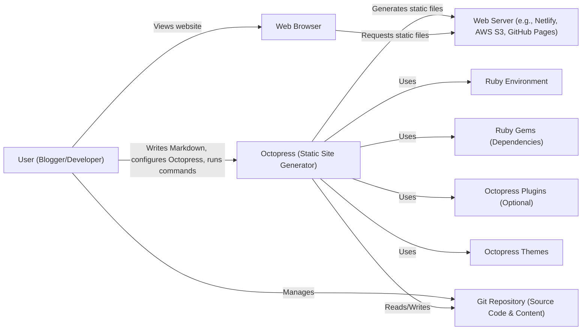
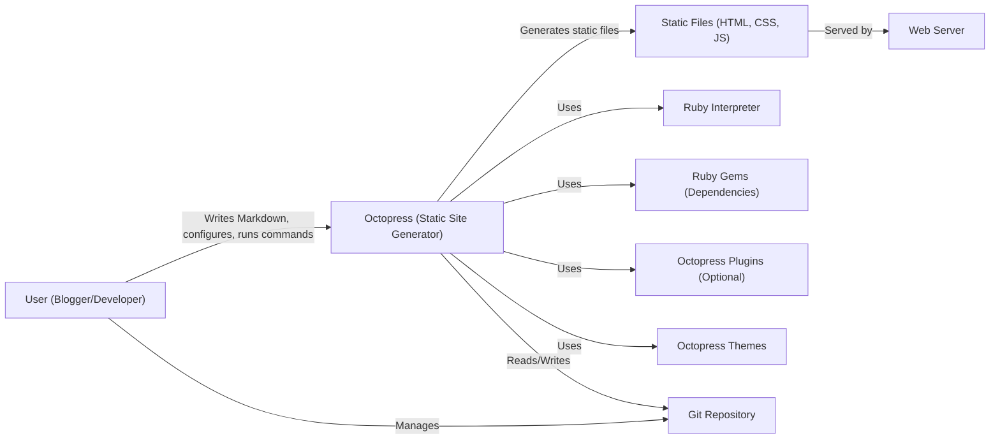
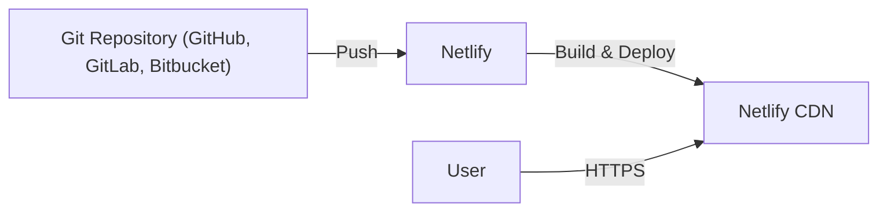
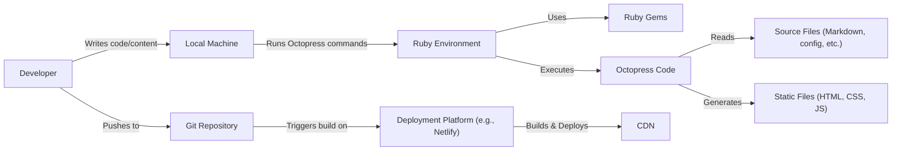

Okay, let's create a design document for the Octopress project, keeping in mind its purpose and potential security considerations.

# BUSINESS POSTURE

Octopress is a static site generator primarily used for blogging. It's designed to be simple, flexible, and appealing to developers comfortable with the command line and Git.

Priorities:

- Ease of use for developers familiar with Git and Markdown.
- Fast and efficient static site generation.
- Customizable themes and layouts.
- Extensible through plugins.
- Reliable content generation and deployment.

Goals:

- Provide a user-friendly blogging platform for technical users.
- Enable easy creation and management of static websites.
- Offer a customizable and extensible framework.

Business Risks:

- Data loss: Loss of blog content (posts, pages, configuration) due to user error, system failure, or malicious activity.
- Website defacement: Unauthorized modification of the website's appearance or content.
- Plugin vulnerabilities: Security flaws in third-party plugins could expose the website to attacks.
- Exposure of sensitive information: Accidental publication of draft content, API keys, or other sensitive data within the generated site or the repository.
- Supply chain attacks: Compromised dependencies or build tools could introduce malicious code.

# SECURITY POSTURE

Existing Security Controls:

- security control: Static Site Generation: Inherently more secure than dynamic sites as there's no server-side code execution (e.g., PHP, databases) directly exposed to the internet. (Described in project documentation and inherent to the design).
- security control: Version Control (Git): All content and configuration are typically stored in a Git repository, providing version history, backups, and collaboration features. (Described in project documentation and inherent to the workflow).
- security control: User-Managed Deployment: Deployment is typically handled by the user, allowing them to choose secure hosting providers and deployment methods (e.g., Netlify, Vercel, AWS S3 + CloudFront). (Described in project documentation).
- security control: Limited Attack Surface: The generated output is purely static HTML, CSS, and JavaScript, minimizing the attack surface.

Accepted Risks:

- accepted risk: User Responsibility for Security: The security of the generated website largely depends on the user's choices regarding hosting, deployment, and plugin usage.
- accepted risk: Third-Party Plugin Risks: Users are responsible for vetting and managing the security of any third-party plugins they install.
- accepted risk: Dependency Vulnerabilities: Octopress relies on external dependencies (Ruby gems), which could potentially contain vulnerabilities.

Recommended Security Controls:

- security control: Implement a Content Security Policy (CSP):  A CSP can help mitigate the impact of XSS vulnerabilities by controlling the resources the browser is allowed to load.
- security control: Regularly Update Dependencies:  Keep Ruby gems and other dependencies up to date to patch known vulnerabilities.  Automated dependency management tools can help with this.
- security control: Use a Static Analysis Tool: Integrate a static analysis tool (e.g., Brakeman for Ruby) into the development workflow to identify potential security issues in the Octopress codebase and custom plugins.
- security control: Sanitize User Input in Plugins: If developing custom plugins that handle user input, ensure proper sanitization and validation to prevent XSS and other injection vulnerabilities.
- security control: Secure Configuration Management:  Provide clear guidance to users on securely storing API keys and other sensitive configuration data (e.g., using environment variables, not committing secrets to the repository).

Security Requirements:

- Authentication: Not directly applicable to the static site generation process itself. Authentication may be relevant for deployment workflows (e.g., SSH keys for deploying to a server) or for accessing protected resources during development.
- Authorization: Not directly applicable to the static site generation process. Authorization might be relevant for collaborative workflows (e.g., controlling who can push changes to the Git repository).
- Input Validation: Crucial for any custom plugins that accept user input. Input should be validated and sanitized to prevent XSS, code injection, and other vulnerabilities.  This applies to theme development as well.
- Cryptography:
    -  Use HTTPS for the deployed website. This is a user responsibility but should be strongly emphasized in documentation.
    -  If handling sensitive data during the build process (e.g., API keys), use secure storage mechanisms (e.g., environment variables, encrypted configuration files).
    -  Consider using cryptographic signing for plugins or releases to verify their integrity.

# DESIGN

## C4 CONTEXT

Element Descriptions:

-   Name: User (Blogger/Developer)
    -   Type: Person
    -   Description: The person who writes content, configures Octopress, and manages the blog.
    -   Responsibilities: Writing content in Markdown, configuring Octopress settings, running Octopress commands, managing the Git repository, deploying the generated website.
    -   Security controls: Strong passwords, secure SSH keys (if used for deployment), awareness of phishing and social engineering attacks.

-   Name: Octopress (Static Site Generator)
    -   Type: Software System
    -   Description: The core Octopress application that processes Markdown files and generates static HTML, CSS, and JavaScript.
    -   Responsibilities: Parsing Markdown, applying themes, executing plugins, generating static files.
    -   Security controls: Input validation (within plugins and core code), secure handling of configuration data, regular updates to address vulnerabilities.

-   Name: Web Server (e.g., Netlify, AWS S3, GitHub Pages)
    -   Type: Software System
    -   Description: The server that hosts the generated static files and serves them to web browsers.
    -   Responsibilities: Serving static files, handling HTTP requests, potentially providing HTTPS.
    -   Security controls: HTTPS configuration, access controls, regular security updates, DDoS protection.

-   Name: Web Browser
    -   Type: Software System
    -   Description: The user's web browser used to view the generated website.
    -   Responsibilities: Rendering HTML, CSS, and JavaScript, making HTTP requests.
    -   Security controls: Browser security updates, safe browsing practices.

-   Name: Ruby Environment
    -   Type: Software System
    -   Description: The Ruby runtime environment required to run Octopress.
    -   Responsibilities: Executing Ruby code.
    -   Security controls: Use a supported and updated Ruby version.

-   Name: Gems (Ruby Gems)
    -   Type: Software System
    -   Description: External Ruby libraries used by Octopress.
    -   Responsibilities: Providing functionality to Octopress.
    -   Security controls: Regularly update gems, vet gem sources, use a dependency management tool (Bundler).

-   Name: Plugins (Octopress Plugins)
    -   Type: Software System
    -   Description: Optional extensions that add functionality to Octopress.
    -   Responsibilities: Extending Octopress features.
    -   Security controls: Thoroughly vet third-party plugins, write secure custom plugins with proper input validation.

-   Name: Themes (Octopress Themes)
    -   Type: Software System
    -   Description: Templates that define the visual appearance of the website.
    -   Responsibilities: Defining the website's layout and styling.
    -   Security controls: Sanitize any user-provided data used within themes, avoid using inline JavaScript if possible.

-   Name: Git Repository (Source Code & Content)
    -   Type: Software System
    -   Description: The Git repository storing the blog's source code, content, and configuration.
    -   Responsibilities: Version control, collaboration, backup.
    -   Security controls: Secure access controls (e.g., SSH keys, strong passwords), regular backups.

## C4 CONTAINER

In the case of Octopress, the container diagram is very similar to the context diagram, as Octopress itself is the primary "container."

Element Descriptions:

-   Name: User (Blogger/Developer)
    -   Type: Person
    -   Description: The person who writes content, configures Octopress, and manages the blog.
    -   Responsibilities: Writing content in Markdown, configuring Octopress settings, running Octopress commands, managing the Git repository, deploying the generated website.
    -   Security controls: Strong passwords, secure SSH keys (if used for deployment), awareness of phishing and social engineering attacks.

-   Name: Octopress (Static Site Generator)
    -   Type: Application
    -   Description: The core Octopress application.
    -   Responsibilities: Parsing Markdown, applying themes, executing plugins, generating static files.
    -   Security controls: Input validation (within plugins and core code), secure handling of configuration data, regular updates to address vulnerabilities.

-   Name: Static Files (HTML, CSS, JS)
    -   Type: Data
    -   Description: The generated output of Octopress.
    -   Responsibilities: Representing the website's content and structure.
    -   Security controls: None directly applicable, but the content should be generated securely by Octopress.

-   Name: Ruby Interpreter
    -   Type: Application
    -   Description: The Ruby runtime.
    -   Responsibilities: Executing Ruby code.
    -   Security controls: Use a supported and updated Ruby version.

-   Name: Gems (Ruby Gems)
    -   Type: Library
    -   Description: External Ruby libraries.
    -   Responsibilities: Providing functionality to Octopress.
    -   Security controls: Regularly update gems, vet gem sources, use a dependency management tool (Bundler).

-   Name: Plugins (Octopress Plugins)
    -   Type: Library
    -   Description: Optional Octopress extensions.
    -   Responsibilities: Extending Octopress features.
    -   Security controls: Thoroughly vet third-party plugins, write secure custom plugins with proper input validation.

-   Name: Themes (Octopress Themes)
    -   Type: Library
    -   Description: Templates for website appearance.
    -   Responsibilities: Defining the website's layout and styling.
    -   Security controls: Sanitize any user-provided data used within themes, avoid using inline JavaScript if possible.

- Name: Git Repository
    - Type: Data
    - Description: Stores source code, content, and configuration.
    - Responsibilities: Version control, collaboration, and backup.
    - Security controls: Secure access controls (SSH keys, strong passwords) and regular backups.

- Name: Web Server
    - Type: Application
    - Description: Hosts and serves the static files.
    - Responsibilities: Serving static files, handling HTTP requests, and potentially providing HTTPS.
    - Security controls: HTTPS configuration, access controls, regular security updates, and DDoS protection.

## DEPLOYMENT

Octopress generates static files, so deployment involves placing these files on a web server. Several options exist:

1.  **Hosting Providers (Netlify, Vercel, AWS Amplify):** These platforms offer continuous deployment, automatically building and deploying the site from a Git repository.
2.  **Cloud Storage (AWS S3, Google Cloud Storage):** Static files can be uploaded to cloud storage buckets and served directly or through a CDN (e.g., AWS CloudFront).
3.  **Traditional Web Servers (Apache, Nginx):** Files can be manually copied to a server via FTP, SCP, or other methods.
4.  **GitHub Pages:** A simple option for hosting directly from a GitHub repository.

Chosen Deployment Solution: **Netlify (Continuous Deployment)**

Element Descriptions:

-   Name: Git Repository (GitHub, GitLab, Bitbucket)
    -   Type: Infrastructure
    -   Description: The repository hosting the Octopress source code and content.
    -   Responsibilities: Version control, collaboration.
    -   Security controls: Secure access controls (SSH keys, strong passwords), branch protection rules.

-   Name: Netlify
    -   Type: Platform
    -   Description: The hosting platform that provides continuous deployment.
    -   Responsibilities: Building the site from the Git repository, deploying to the CDN, managing SSL certificates.
    -   Security controls: Netlify's built-in security features (HTTPS, DDoS protection), secure build environment.

-   Name: Netlify CDN
    -   Type: Infrastructure
    -   Description: Netlify's Content Delivery Network.
    -   Responsibilities: Serving static files globally, caching content for performance.
    -   Security controls: HTTPS, DDoS protection, WAF (optional).

-   Name: User
    -   Type: Person
    -   Description: The person accessing the website.
    -   Responsibilities: Browsing the website.
    -   Security controls: Using a secure browser, safe browsing practices.

## BUILD

The build process involves running Octopress commands to generate the static website.  While Octopress doesn't have a complex build system like some other frameworks, security considerations still apply.

Security Controls in Build Process:

-   Dependency Management: Use Bundler to manage Ruby gem dependencies and ensure consistent versions across environments.  Regularly run `bundle update` to get the latest security patches.
-   Static Analysis: Integrate a static analysis tool (e.g., Brakeman) into the local development workflow and/or the CI/CD pipeline (if using one) to identify potential security vulnerabilities in the Octopress codebase or custom plugins.
-   Secure Configuration: Advise users to avoid committing sensitive information (API keys, passwords) directly to the Git repository.  Recommend using environment variables or other secure configuration mechanisms.
-   Plugin Security: Emphasize the importance of vetting third-party plugins before installation.  Provide guidance on writing secure custom plugins, including input validation and sanitization.
-   Deployment Platform Security: If using a continuous deployment platform (Netlify, Vercel, etc.), leverage its built-in security features (e.g., HTTPS, access controls).
- Supply Chain Security: While Octopress itself is relatively small, it's still important to be aware of potential supply chain risks. Regularly review the dependencies and their security posture.

# RISK ASSESSMENT

Critical Business Processes:

-   Content Creation and Publication: The ability to create, edit, and publish blog posts and other content.
-   Website Availability: Ensuring the website is accessible to visitors.
-   Brand Reputation: Maintaining a positive brand image, which can be damaged by website defacement or security breaches.

Data to Protect:

-   Blog Content (Posts, Pages): Sensitivity: Low to Medium (depending on the content).  Loss of content can be disruptive, but most content is intended for public consumption.
-   Configuration Files: Sensitivity: Medium to High.  May contain API keys, deployment credentials, or other sensitive information.
-   Draft Posts: Sensitivity: Medium.  May contain unpublished or sensitive information.
-   User Data (if collected through plugins): Sensitivity: Varies depending on the data collected (e.g., comments, email addresses).  Compliance with privacy regulations (e.g., GDPR) is crucial.

# QUESTIONS & ASSUMPTIONS

Questions:

-   Are there any specific compliance requirements (e.g., GDPR, CCPA) that need to be considered? This is primarily relevant if the blog collects user data through plugins or forms.
-   What is the expected level of technical expertise of the typical Octopress user? This helps tailor security recommendations and documentation.
-   Are there any plans to introduce new features that might have security implications (e.g., user authentication, commenting systems)?

Assumptions:

-   BUSINESS POSTURE: The primary goal is to provide a simple, secure, and customizable blogging platform for technical users.
-   SECURITY POSTURE: Users are responsible for the security of their chosen hosting environment and any third-party plugins they install. Octopress itself aims to minimize inherent security risks through its static nature.
-   DESIGN: The deployment model will typically involve a Git-based workflow and a static hosting provider (e.g., Netlify, AWS S3). The build process relies on Ruby and Bundler for dependency management.