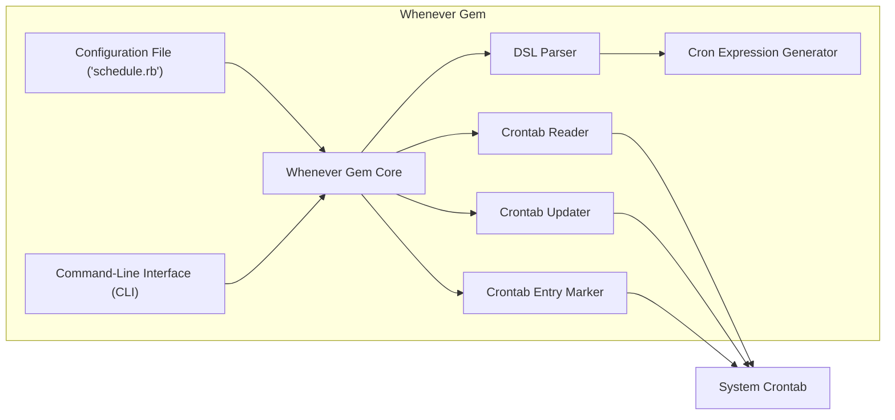
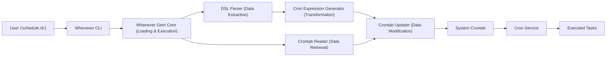

# Project Design Document: Whenever Gem

**Version:** 1.1
**Date:** October 26, 2023
**Author:** AI Software Architect

## 1. Introduction

This document provides an enhanced design overview of the `whenever` Ruby gem (as found at [https://github.com/javan/whenever](https://github.com/javan/whenever)). This revised document aims to provide a more detailed and nuanced articulation of the gem's architecture, components, and data flow, specifically tailored to facilitate comprehensive threat modeling activities. The information presented here is based on the publicly available source code and documentation of the `whenever` gem.

## 2. Goals

*   Provide a comprehensive and detailed architectural overview of the `whenever` gem, including internal component responsibilities.
*   Clearly identify key components and their interactions, emphasizing data exchange and dependencies.
*   Describe the data flow within the gem's operation with greater granularity, highlighting potential transformation points.
*   Serve as a robust foundation for identifying a wider range of potential security vulnerabilities during threat modeling, considering various attack vectors.

## 3. Overview

The `whenever` gem offers a user-friendly and expressive method for defining and managing cron jobs within Ruby applications. It enables developers to specify scheduled tasks using a human-readable Domain Specific Language (DSL) within a dedicated Ruby file (`schedule.rb`). The gem then translates these high-level definitions into the standard cron syntax understood by the operating system and manages the system's crontab file accordingly. This abstraction simplifies cron job management and integrates it seamlessly into the Ruby development workflow.

## 4. System Architecture

The `whenever` gem's architecture comprises the following interconnected components:

*   **Whenever Gem Core:** The central Ruby library, responsible for parsing the configuration file, interpreting the DSL, generating cron expressions, and orchestrating crontab management.
*   **Configuration File (`schedule.rb`):** A Ruby file, typically located in the application's `config` directory, where users define their scheduled tasks using the `whenever` DSL. This file is executed as Ruby code during parsing.
*   **DSL Parser:** A sub-component within the `Whenever Gem Core` responsible for interpreting the `whenever` DSL syntax within the `schedule.rb` file and extracting the scheduling information.
*   **Cron Expression Generator:** A component responsible for converting the parsed schedule definitions from the DSL into valid cron syntax strings.
*   **Crontab Reader:** A sub-component within `Crontab Management` that reads the current contents of the system's crontab file.
*   **Crontab Updater:** A sub-component within `Crontab Management` that modifies the system's crontab file by adding, removing, or updating entries managed by `whenever`.
*   **Crontab Entry Marker:** A mechanism used by `whenever` to identify and manage its own entries within the system crontab, typically using specific comments or markers.
*   **Command-Line Interface (CLI):** Executable commands (`whenever`) providing users with an interface to interact with the gem's functionalities, such as updating or clearing the crontab.

### 4.1. Component Descriptions

*   **Whenever Gem Core:** This is the central orchestrator of the gem. It loads and executes the `schedule.rb` file, delegating the parsing of the DSL to the `DSL Parser`. It then utilizes the `Cron Expression Generator` to translate the parsed schedule into cron syntax. Finally, it employs the `Crontab Management` components (`Crontab Reader`, `Crontab Updater`, `Crontab Entry Marker`) to interact with the system's crontab. Error handling and overall control flow reside within this component.
*   **Configuration File (`schedule.rb`):** This file serves as the primary input for the `whenever` gem. It contains Ruby code that utilizes the `whenever` DSL to define scheduled tasks. Crucially, because it's Ruby code, it can execute arbitrary Ruby commands during the parsing phase.
*   **DSL Parser:** This component is responsible for understanding the specific syntax of the `whenever` DSL. It analyzes the `schedule.rb` file, identifies the scheduled tasks and their parameters (frequency, time, command), and extracts this information into a structured format that can be used by the `Cron Expression Generator`.
*   **Cron Expression Generator:** This component takes the structured schedule information from the `DSL Parser` and converts it into the standard cron string format (e.g., `* * * * * command`). It handles the mapping between the human-readable DSL elements (like `every 1.day`) and the corresponding cron syntax.
*   **Crontab Reader:** This component is responsible for reading the current contents of the system's crontab file. This is typically done by executing a system command like `crontab -l`. The output is then parsed to understand the existing scheduled tasks.
*   **Crontab Updater:** This component modifies the system's crontab file. It adds new cron entries generated by `whenever`, removes old entries managed by `whenever`, and ensures the crontab reflects the current schedule defined in `schedule.rb`. This often involves writing to a temporary file and then using a system command like `crontab < temporary_file`.
*   **Crontab Entry Marker:** To manage its own entries within the crontab, `whenever` uses markers (typically comments) to identify the lines it has added. This allows it to update or remove only the entries it is responsible for, without affecting other cron jobs.
*   **Command-Line Interface (CLI):** The `whenever` executable provides a command-line interface for users to interact with the gem. Key commands include:
    *   `whenever`: Parses `schedule.rb`, generates cron entries, and updates the system crontab.
    *   `whenever --clear`: Removes all cron entries managed by `whenever` from the system crontab.
    *   `whenever --update`: An alias for the `whenever` command.
    *   `whenever --write`: Outputs the generated crontab entries to the console without modifying the system crontab.
    *   `whenever --crontab`: Displays the current contents of the system crontab.

## 5. Data Flow

The typical data flow when using `whenever` to manage cron jobs follows these steps:

1. **User Defines Schedule (Data Input):** The developer creates or modifies the `schedule.rb` file, defining scheduled tasks using the `whenever` DSL. This file contains Ruby code representing the desired schedule.
2. **CLI Invocation (Trigger):** The developer executes a `whenever` command (e.g., `whenever --update`) via the command line. This initiates the gem's processing.
3. **Configuration Parsing (Code Execution & Data Extraction):** The `whenever` CLI invokes the `Whenever Gem Core`. The core component loads and executes the `schedule.rb` file. The `DSL Parser` analyzes the executed code and extracts the scheduling information (frequency, time, command to execute). This step involves the execution of potentially arbitrary Ruby code within `schedule.rb`.
4. **Cron Expression Generation (Data Transformation):** The extracted scheduling information is passed to the `Cron Expression Generator`. This component transforms the high-level DSL representation into the standard cron string format.
5. **Crontab Reading (Data Retrieval):** The `Crontab Reader` retrieves the current contents of the system's crontab file.
6. **Crontab Update Logic (Data Processing & Comparison):** The `Whenever Gem Core` compares the newly generated cron entries with the existing entries in the crontab (identified by the `Crontab Entry Marker`).
7. **Crontab Updating (Data Modification):** The `Crontab Updater` modifies the system's crontab file. It removes old `whenever`-managed entries and adds the new entries. This typically involves writing to a temporary file and using the `crontab` command to update the system.
8. **Cron Service Execution (External System):** The operating system's cron service reads the updated crontab and executes the scheduled commands at the specified times.

## 6. Security Considerations (Detailed for Threat Modeling)

Based on the architecture and data flow, the following security considerations are crucial for threat modeling:

*   **Configuration File Injection (Spoofing, Tampering, Information Disclosure, Code Execution):** The `schedule.rb` file is executed as Ruby code.
    *   **Threat:** If an attacker can modify `schedule.rb` (e.g., through compromised file permissions, supply chain attacks on the application repository), they can inject arbitrary Ruby code that will be executed with the privileges of the user running the `whenever` command. This could lead to arbitrary command execution, data exfiltration, or denial of service.
    *   **Example:** Injecting code to send sensitive environment variables to an external server.
*   **Command Injection via DSL (Spoofing, Tampering, Code Execution):**  The `whenever` DSL, while designed to be safe, could potentially be misused if not carefully implemented.
    *   **Threat:** If the `Cron Expression Generator` or the logic that constructs the commands to be executed by cron does not properly sanitize inputs from the parsed `schedule.rb`, an attacker might be able to inject malicious commands.
    *   **Example:**  Using backticks or shell metacharacters within the command definition in `schedule.rb` that are not properly escaped.
*   **Privilege Escalation (Elevation of Privilege):**
    *   **Threat:** If the `whenever` command is executed with elevated privileges (e.g., by `root` or a user with `sudo` access), and a malicious `schedule.rb` is processed, the injected or scheduled commands will also run with those elevated privileges.
    *   **Example:** A compromised developer account could push a malicious `schedule.rb` that creates a new privileged user.
*   **Crontab Manipulation Vulnerabilities (Tampering, Denial of Service):**
    *   **Threat:** While `whenever` manages its own entries, vulnerabilities in the `Crontab Reader` or `Crontab Updater` could potentially allow an attacker to manipulate the entire crontab, including entries not managed by `whenever`. This could lead to the execution of unauthorized tasks or the removal of legitimate scheduled jobs.
    *   **Example:** Exploiting a bug in how `whenever` parses the crontab to inject arbitrary entries.
*   **Dependency Vulnerabilities (Spoofing, Tampering, Denial of Service, Information Disclosure, Code Execution):**
    *   **Threat:** The `whenever` gem depends on other Ruby gems. Vulnerabilities in these dependencies could be exploited if not properly managed and updated.
    *   **Example:** A vulnerable version of a dependency could allow for remote code execution when `whenever` is used.
*   **Insecure Defaults and Permissions (Information Disclosure, Tampering):**
    *   **Threat:** Default file permissions on `schedule.rb` or the way `whenever` interacts with the crontab might expose sensitive information or allow unauthorized modification.
    *   **Example:** If `schedule.rb` contains database credentials and has world-readable permissions.
*   **Denial of Service (DoS):**
    *   **Threat:** A maliciously crafted `schedule.rb` could define an excessive number of rapidly executing jobs, potentially overloading the system.
    *   **Example:** Scheduling a command to run every minute that consumes significant resources.
*   **Information Disclosure (Confidentiality Breach):**
    *   **Threat:** Sensitive information (like API keys or database credentials) might be inadvertently included in the `schedule.rb` file.

## 7. Assumptions and Constraints

*   It is assumed that the `whenever` gem is used within a standard Ruby environment with access to system commands like `crontab`.
*   This document focuses on the core functionality of the `whenever` gem as described in its public repository and common usage patterns.
*   The analysis assumes the underlying operating system and cron service function according to their specifications.
*   This document does not delve into specific deployment environments, containerization strategies, or integration with other scheduling systems.

## 8. Future Considerations

*   A detailed code review of the `Whenever Gem Core`, `DSL Parser`, `Cron Expression Generator`, and `Crontab Management` components is necessary to identify specific injection points, input validation, and sanitization practices.
*   A thorough Software Composition Analysis (SCA) of the gem's dependencies should be performed to identify and mitigate potential vulnerabilities.
*   Investigating how `whenever` handles different operating systems and variations in cron implementations is crucial for a comprehensive security assessment.
*   Exploring potential security enhancements, such as sandboxing the execution of `schedule.rb` or implementing more robust input validation, would be beneficial.

This enhanced design document provides a more granular and security-focused understanding of the `whenever` gem, enabling more effective threat modeling and vulnerability identification.