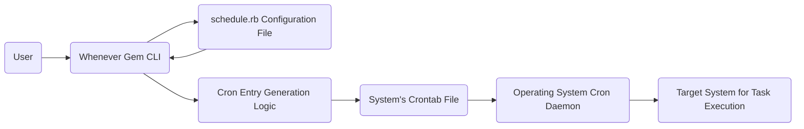

## Project Design Document: Whenever Gem (Improved)

**1. Introduction**

This document provides an enhanced design overview of the [Whenever](https://github.com/javan/whenever) Ruby gem. It aims to be a robust foundation for subsequent threat modeling by clearly detailing the gem's functionalities, architecture, and data flow. This improved version clarifies certain aspects and expands on key considerations.

**2. Goals**

*   Provide a clear and comprehensive description of the Whenever gem's architecture and functionality.
*   Precisely identify key components and their interactions within the system.
*   Thoroughly outline the data flow during the gem's operation.
*   Establish a well-defined understanding of the system's boundaries, external dependencies, and interactions.
*   Serve as a detailed and accurate basis for identifying potential security threats, vulnerabilities, and attack vectors.

**3. Scope**

This document focuses on the core operational aspects of the Whenever gem, specifically:

*   Parsing and interpreting the `schedule.rb` file.
*   The process of generating standard cron entries from the schedule defined in `schedule.rb`.
*   Mechanisms for updating the system's crontab file with Whenever-managed entries.
*   Methods for removing cron entries managed by Whenever.

This document explicitly excludes:

*   Details of specific deployment environments, infrastructure configurations, or orchestration tools.
*   Aspects related to user interface design or implementation, as the gem is primarily a command-line tool.
*   In-depth analysis of the internal Ruby code implementation or specific algorithms used within the gem.

**4. High-Level Architecture**

The Whenever gem acts as an intermediary, translating a user-friendly Ruby DSL (defined in `schedule.rb`) into commands understood by the system's cron daemon. The following diagram illustrates the system's high-level components and their relationships:

*   **User:** Interacts with the Whenever gem through its command-line interface (CLI) to manage scheduled tasks.
*   **Whenever Gem CLI:** The command-line interface provided by the Whenever gem, used to trigger actions like updating or clearing the crontab.
*   **schedule.rb Configuration File:** A Ruby file where users define their scheduled tasks using the Whenever gem's specific DSL.
*   **Cron Entry Generation Logic:** The internal component within the Whenever gem responsible for converting the `schedule.rb` definitions into valid cron syntax.
*   **System's Crontab File:** The standard operating system file where cron schedules are stored. The Whenever gem modifies this file.
*   **Operating System Cron Daemon:** The background process within the operating system that reads the crontab file and executes scheduled tasks at the specified times.
*   **Target System for Task Execution:** The operating system or environment where the commands specified in the cron entries are executed.

**5. Detailed Design**

The core functionality of the Whenever gem can be broken down into these key operational stages:

*   **Schedule Definition using `schedule.rb`:**
    *   Users define their scheduled tasks in a file named `schedule.rb`, typically located in the project's root directory, though its location can be configured.
    *   This file leverages a Ruby-based Domain Specific Language (DSL) provided by the Whenever gem to express recurring tasks in a readable format.
    *   The DSL includes methods like `every`, `at`, `runner`, `rake`, and `command` to specify the schedule and the task to be executed.
        *   Example: `every :day, at: '4:30 am', roles: [:app] do runner "MyModel.some_method" end`
        *   Example: `every :wednesday, at: '12pm' do command "/path/to/my/script.sh" end`
    *   The DSL allows for specifying frequency (e.g., `:day`, `:hour`, `:minute`, specific weekdays), precise time constraints (e.g., `at: '...'`), and the type of task to execute (`runner` for Rails code, `rake` for Rake tasks, `command` for shell commands).
    *   It also supports the concept of roles (e.g., `:app`, `:db`) to target specific servers in a multi-server environment.

*   **Cron Entry Generation Process:**
    *   When a Whenever command (like `whenever --update-crontab`) is executed, the gem first parses the `schedule.rb` file.
    *   The "Cron Entry Generation Logic" component interprets the DSL constructs within `schedule.rb`.
    *   This component translates the high-level DSL instructions into the specific syntax required by the cron daemon.
    *   This translation involves mapping DSL elements to the corresponding fields in a cron entry: minute, hour, day of month, month, and day of the week.
        *   For instance, `every :day, at: '4:30 am'` translates to the cron schedule `30 4 * * *`.
    *   The task to be executed is also formatted based on the specified type:
        *   `runner "MyModel.some_method"` becomes `cd /path/to/app && bundle exec rails runner -e production "MyModel.some_method"`.
        *   `rake "my:task"` becomes `cd /path/to/app && bundle exec rake my:task RAILS_ENV=production`.
        *   `command "/path/to/my/script.sh"` remains `/path/to/my/script.sh`.
    *   Whenever also adds comments to the crontab entries it manages, typically including a marker to identify the start and end of its managed block and the application name.

*   **Crontab Management Operations:**
    *   The Whenever gem provides several CLI commands to manage the system's crontab file:
        *   `wheneverize`:  Initializes the crontab for the application. This typically adds a comment block to delineate Whenever's managed section if it doesn't already exist.
        *   `whenever --update-crontab [application]`: This is the primary command for updating the crontab. It reads `schedule.rb`, generates the corresponding cron entries, and then updates the crontab file. It intelligently replaces any existing Whenever-managed entries for the specified application (or the current directory if no application is specified). This ensures that only the intended scheduled tasks are present.
        *   `whenever --write-crontab [application]`:  This command reads `schedule.rb`, generates cron entries, and overwrites the *entire* crontab file with *only* Whenever's entries. This is generally discouraged as it removes any manually added cron jobs.
        *   `whenever --clear-crontab [application]`: This command removes all cron entries managed by Whenever for the specified application from the crontab file.

*   **Task Execution by the Cron Daemon:**
    *   The operating system's cron daemon periodically reads and parses the system's crontab file.
    *   When the current system time matches the schedule defined in a cron entry, the cron daemon executes the associated command.
    *   The commands generated by Whenever are executed in the context of the application's environment (e.g., with the correct working directory and environment variables).

**6. Data Flow**

The following diagram illustrates the flow of data during the Whenever gem's operation when updating the crontab:

```mermaid
graph LR
    A("User Invokes CLI Command (e.g., `whenever --update-crontab`)") --> B("Whenever Gem Receives Command");
    B --> C("Read Content of `schedule.rb`");
    C --> D("Parse `schedule.rb` using DSL Parser");
    D --> E("Generate Cron Entry Strings");
    E --> F("Construct System `crontab` Command (with generated entries)");
    F --> G("Execute System `crontab` Command");
    G --> H("Operating System Updates Crontab File");
    H --> I("Cron Daemon Reads and Parses Updated Crontab");
    I --> J("Cron Daemon Executes Scheduled Tasks at Defined Times");
```

*   **User Invokes CLI Command:** The user initiates an action by running a Whenever command in the terminal.
*   **Whenever Gem Receives Command:** The Whenever gem's CLI processes the user's command.
*   **Read Content of `schedule.rb`:** The gem reads the contents of the `schedule.rb` file from the project.
*   **Parse `schedule.rb` using DSL Parser:** The gem's internal parser interprets the Ruby DSL defined in `schedule.rb`.
*   **Generate Cron Entry Strings:** The gem generates the corresponding cron syntax strings based on the parsed schedule.
*   **Construct System `crontab` Command:** The gem constructs the appropriate system command (typically using the `crontab` utility) to update the crontab file with the generated entries.
*   **Execute System `crontab` Command:** The gem executes the constructed system command, which interacts directly with the operating system.
*   **Operating System Updates Crontab File:** The operating system updates the system's crontab file with the new or modified entries.
*   **Cron Daemon Reads and Parses Updated Crontab:** The operating system's cron daemon periodically reads and parses the updated crontab file.
*   **Cron Daemon Executes Scheduled Tasks at Defined Times:** When a scheduled time is reached, the cron daemon executes the corresponding command from the crontab.

**7. Security Considerations**

This section expands on the initial security considerations, providing more detail:

*   **`schedule.rb` as a Potential Code Execution Vulnerability:**
    *   The `schedule.rb` file is executed as Ruby code. If an attacker can modify this file (e.g., through a compromised deployment process or insecure file permissions), they can inject arbitrary Ruby code that will be executed when Whenever parses the file.
    *   **Mitigation:** Secure file permissions on `schedule.rb`, rigorous code review of changes, and potentially using a more restricted DSL or configuration format if security is a primary concern.

*   **Command Injection Risks with the `command` Method:**
    *   The `command` method in the Whenever DSL allows users to specify arbitrary shell commands. If the input to these commands is not carefully sanitized or if the commands are constructed based on untrusted input, it can lead to command injection vulnerabilities.
    *   **Mitigation:** Avoid using the `command` method where possible. Prefer using `runner` or `rake` tasks, which execute within the application's environment. If `command` is necessary, ensure all inputs are properly sanitized and validated. Follow the principle of least privilege when defining the commands.

*   **Crontab Manipulation and Privilege Escalation:**
    *   The `whenever` command requires sufficient privileges to modify the system's crontab file. If a less privileged user can execute `whenever --update-crontab`, they could potentially escalate their privileges by scheduling tasks to be run as a more privileged user.
    *   **Mitigation:** Ensure that the execution of `whenever` commands is restricted to authorized users or processes. Use tools like `sudo` with careful configuration or dedicated deployment scripts to manage crontab updates.

*   **Exposure of Sensitive Information in Scheduled Commands:**
    *   Scheduled commands, especially those defined using the `command` method, might inadvertently expose sensitive information like API keys, database credentials, or internal paths within the command itself or its arguments.
    *   **Mitigation:** Avoid hardcoding sensitive information in `schedule.rb`. Utilize environment variables, secure credential management systems (like HashiCorp Vault or AWS Secrets Manager), or encrypted configuration files to store and access sensitive data.

*   **Denial of Service (DoS) through Resource-Intensive Scheduled Tasks:**
    *   Malicious or poorly designed scheduled tasks could consume excessive system resources (CPU, memory, I/O), leading to a denial of service.
    *   **Mitigation:** Implement monitoring and alerting for resource usage. Set appropriate resource limits for scheduled tasks if the operating system provides such mechanisms. Regularly review and optimize scheduled tasks for efficiency.

**8. Deployment Considerations**

*   The Whenever gem is typically added as a dependency to a Ruby project's `Gemfile`.
*   Deployment workflows often involve running the `whenever --update-crontab` command as a step in the deployment process to ensure the crontab on the target server reflects the latest schedule.
*   It's crucial to ensure that the user or process executing the `whenever --update-crontab` command has the necessary permissions to modify the crontab file (often requiring `sudo` or being the same user that owns the crontab).
*   Consider using deployment tools or scripts to automate the crontab update process and ensure consistency across environments.
*   For multi-server environments, the `--roles` option in `schedule.rb` can be used to target specific servers with different sets of scheduled tasks.

**9. Future Considerations**

*   Enhanced logging and monitoring capabilities within the gem to provide better insights into the execution of scheduled tasks and potential errors.
*   More granular control over task execution environments and resource limits.
*   Exploring alternative, more secure configuration formats or DSLs to mitigate code injection risks in `schedule.rb`.
*   Integration with centralized job scheduling systems or orchestration platforms.

**10. Glossary**

*   **DSL (Domain Specific Language):** A specialized programming language designed for a particular domain or task, in this case, defining cron schedules in a more readable and Ruby-like syntax.
*   **Cron:** A time-based job scheduler commonly found in Unix-like operating systems. It allows users to schedule commands or scripts to run automatically at specified intervals.
*   **Crontab:** The configuration file used by the cron daemon to store the schedule of cron jobs for a specific user.
*   **Cron Daemon:** A background process that runs continuously and checks the crontab files for scheduled tasks, executing them when their scheduled time arrives.