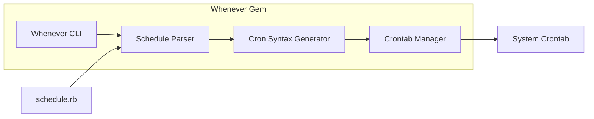
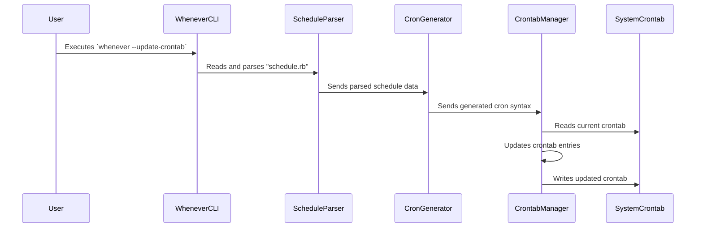

# Project Design Document: Whenever Gem

**Version:** 1.1
**Date:** October 26, 2023
**Author:** AI Software Architect

## 1. Introduction

This document provides an enhanced and detailed design overview of the `whenever` Ruby gem, accessible at [https://github.com/javan/whenever](https://github.com/javan/whenever). Building upon the initial design, this version offers greater clarity and depth, specifically focusing on aspects relevant to threat modeling. The information presented herein aims to provide a robust understanding of the gem's internal workings, facilitating the identification of potential security vulnerabilities and the design of effective mitigation strategies.

## 2. Goals

The primary goals of this enhanced design document are to:

*   Provide a comprehensive and in-depth understanding of the `whenever` gem's functionality, architecture, and internal processes.
*   Clearly define the responsibilities and interactions of each key component within the gem.
*   Thoroughly describe the data flow, including data transformations and interactions with the operating system.
*   Explicitly highlight potential areas of security concern, providing concrete examples for future threat modeling exercises.

## 3. Overview

The `whenever` gem offers a user-friendly and expressive Ruby Domain Specific Language (DSL) for defining and managing cron jobs. It abstracts away the complexities of traditional cron syntax, allowing developers to define scheduled tasks within a `schedule.rb` file using a more readable and maintainable Ruby syntax. `whenever` then parses this file, translates the definitions into standard cron syntax, and interacts with the operating system to update the system's crontab file. This simplifies cron job management within Ruby projects, promoting clarity and reducing the potential for errors in cron configuration.

## 4. System Architecture

The `whenever` gem's architecture comprises the following distinct components, each with specific responsibilities:

*   **Whenever CLI (Command Line Interface):**
    *   Serves as the primary entry point for user interaction with the gem.
    *   Accepts various commands to manage cron schedules, such as updating, writing, and clearing the crontab.
    *   Parses command-line arguments to determine the desired action.
    *   Orchestrates the interaction between other components to fulfill the user's request.
    *   Key commands include: `whenever`, `whenever --update-crontab`, `whenever --write-crontab`, `whenever --clear-crontab`.
*   **Schedule Parser:**
    *   Responsible for reading the `schedule.rb` file from the project directory.
    *   Interprets the Ruby DSL defined within `schedule.rb` to understand the scheduled tasks.
    *   Utilizes Ruby's evaluation capabilities to execute the code within `schedule.rb`.
    *   Extracts relevant information about each scheduled task, such as the execution time, command to be executed, and any associated options.
*   **Cron Syntax Generator:**
    *   Takes the parsed schedule information from the `Schedule Parser` as input.
    *   Translates the high-level Ruby DSL definitions into the specific syntax required by the cron daemon.
    *   Ensures the generated cron syntax adheres to the correct format and includes all necessary details (minute, hour, day of month, month, day of week, command).
    *   Handles the conversion of time specifications (e.g., `:every => :day, :at => '4:30 am'`) into cron-compatible time strings.
*   **Crontab Manager:**
    *   Manages the interaction with the underlying operating system's crontab.
    *   Reads the current contents of the system crontab file.
    *   Identifies and manages the cron entries specifically managed by `whenever` (typically marked with a comment indicating `whenever`'s ownership).
    *   Adds new cron entries generated by the `Cron Syntax Generator`.
    *   Updates existing `whenever`-managed cron entries if the `schedule.rb` has been modified.
    *   Removes `whenever`-managed cron entries when requested (e.g., via `whenever --clear-crontab`).
    *   Writes the modified crontab content back to the system crontab file, often requiring elevated privileges.
*   **schedule.rb:**
    *   The central configuration file where developers define their scheduled tasks.
    *   Utilizes the `whenever` gem's Ruby DSL to specify the timing and commands for cron jobs.
    *   Typically located in the project's root directory but can be configured.
    *   Its content is dynamically evaluated by the `Schedule Parser`.
*   **System Crontab:**
    *   The operating system's core configuration file for scheduling tasks.
    *   Contains a list of commands to be executed at specific times or intervals.
    *   Managed by the system's cron daemon (e.g., `cron` or `systemd-timesyncd`).
    *   `whenever` modifies this file to add, update, or remove its managed cron jobs.

## 5. Data Flow

The process of updating the system crontab using `whenever` involves the following sequence of data flow:

1. The **User** initiates the process by executing a `whenever` command, such as `whenever --update-crontab`, through the command line.
2. The **Whenever CLI** receives the command and parses the arguments to determine the intended action.
3. The **Whenever CLI** instructs the **Schedule Parser** to read and process the `schedule.rb` file.
4. The **Schedule Parser** reads the contents of `schedule.rb` and evaluates the Ruby code within it, extracting the definitions of the scheduled tasks.
5. The parsed schedule information, representing the desired cron jobs, is passed from the **Schedule Parser** to the **Cron Syntax Generator**.
6. The **Cron Syntax Generator** transforms the high-level schedule definitions into standard cron syntax strings.
7. The generated cron syntax strings are then passed to the **Crontab Manager**.
8. The **Crontab Manager** reads the current content of the **System Crontab**.
9. The **Crontab Manager** identifies the cron entries managed by `whenever` within the existing crontab.
10. The **Crontab Manager** compares the newly generated cron entries with the existing `whenever`-managed entries.
11. The **Crontab Manager** updates the crontab content by adding new entries, modifying existing ones, or removing outdated ones.
12. The **Crontab Manager** writes the updated crontab content back to the **System Crontab**, typically requiring elevated privileges to do so.

## 6. Security Considerations

The architecture and data flow of `whenever` present several potential security considerations that are crucial for threat modeling:

*   **Malicious Code Injection via `schedule.rb`:**
    *   If the `schedule.rb` file is generated or modified based on untrusted external input without proper sanitization, it could allow attackers to inject arbitrary Ruby code.
    *   Since `schedule.rb` is evaluated by the `Schedule Parser`, injected code would be executed with the permissions of the user running the `whenever` command, potentially leading to command execution, data breaches, or system compromise.
    *   Example: An attacker could inject code to execute system commands like `rm -rf /` or to exfiltrate sensitive data.
*   **Privilege Escalation Vulnerabilities:**
    *   `whenever` often requires elevated privileges (using `sudo`) to modify the system crontab.
    *   Vulnerabilities in the `Crontab Manager` or the way `whenever` interacts with system commands could be exploited to gain unauthorized root access.
    *   Example: A flaw in how `whenever` constructs the `crontab` command could allow an attacker to inject additional commands executed with root privileges.
*   **Command Injection through DSL Exploitation:**
    *   While the `whenever` DSL aims to be safe, vulnerabilities in the `Schedule Parser` or `Cron Syntax Generator` could potentially allow attackers to craft malicious `schedule.rb` entries that result in the generation of dangerous cron syntax.
    *   Example: An attacker might find a way to inject shell metacharacters into the command string, leading to the execution of unintended commands.
*   **Unauthorized Crontab Manipulation:**
    *   If an attacker gains unauthorized access to the system or exploits vulnerabilities in `whenever`, they could manipulate the system crontab to schedule malicious tasks.
    *   This could lead to persistent backdoors, data theft, or denial-of-service attacks.
    *   Example: An attacker could add a cron job that executes a reverse shell at regular intervals.
*   **Dependency Chain Vulnerabilities:**
    *   `whenever` relies on other Ruby gems as dependencies.
    *   Vulnerabilities in these dependencies could indirectly impact the security of `whenever`.
    *   Example: A vulnerable version of a parsing library used by `whenever` could be exploited to inject malicious data.
*   **File System Race Conditions:**
    *   If `whenever` doesn't handle file access to `schedule.rb` and the system crontab atomically, race conditions could potentially be exploited to inject malicious cron entries.
*   **Information Disclosure through Error Handling:**
    *   Verbose error messages or logging could inadvertently reveal sensitive information about the system or the structure of the `schedule.rb` file to potential attackers.

## 7. Assumptions and Constraints

*   This design document focuses on the core functionality of the `whenever` gem related to managing cron jobs via the system crontab.
*   It assumes a standard Linux-based operating system environment with a traditional cron daemon (or a compatible system like `systemd-timesyncd`).
*   It assumes that the user executing `whenever` commands has the necessary permissions to read `schedule.rb` and potentially modify the system crontab (often requiring `sudo`).
*   The document does not delve into the specifics of different cron implementations or variations across different operating systems.

## 8. Future Considerations

*   Detailed security audit of the `Schedule Parser` to identify potential code injection vulnerabilities.
*   Analysis of the `Crontab Manager`'s interaction with system commands to prevent privilege escalation.
*   Implementation of robust input validation and sanitization for any external data that influences the content of `schedule.rb`.
*   Regular security scanning of `whenever`'s dependencies to identify and address potential vulnerabilities.
*   Consideration of alternative methods for managing cron jobs that might offer enhanced security features.
*   Implementation of logging and auditing mechanisms to track changes made to the crontab by `whenever`.
*   Exploration of mechanisms to restrict the privileges required by `whenever` to the minimum necessary.

This enhanced design document provides a more detailed and security-focused understanding of the `whenever` gem. It serves as a valuable resource for conducting thorough threat modeling and developing appropriate security measures to mitigate potential risks associated with its use.