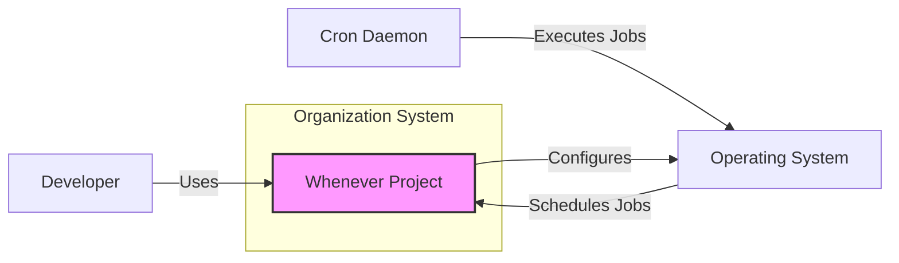
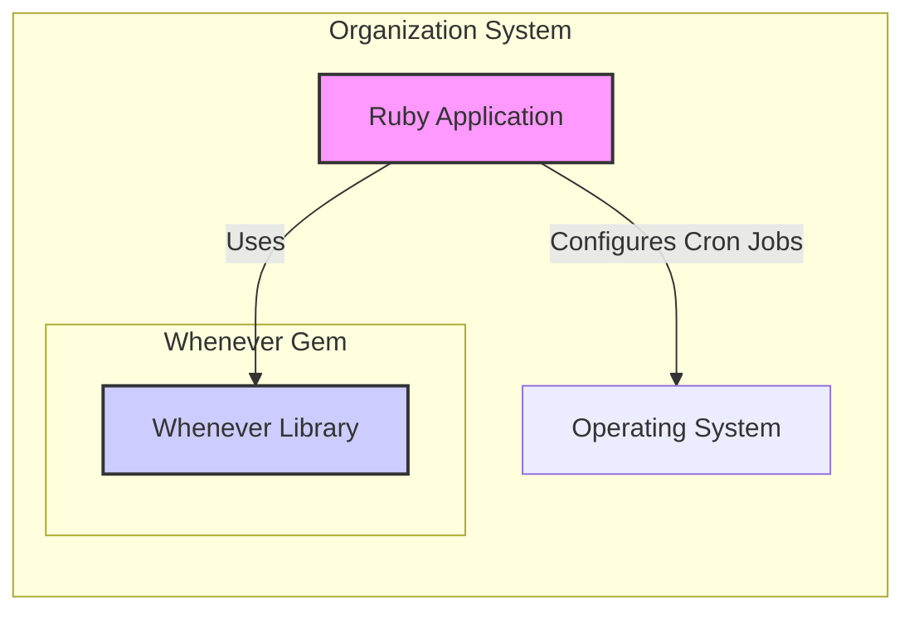
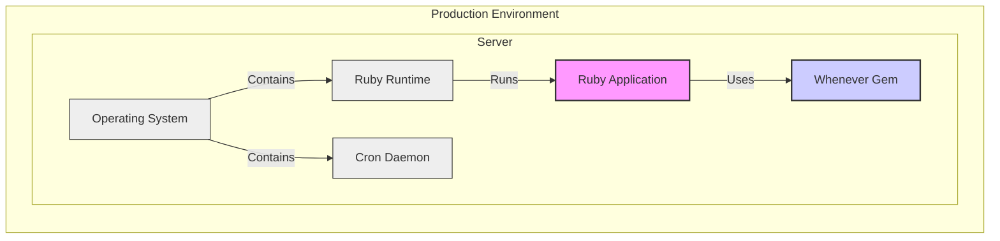
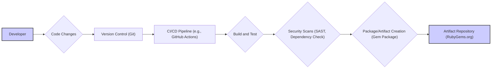

# BUSINESS POSTURE

- Business Priorities:
  - Automate the scheduling of recurring tasks and jobs.
  - Simplify the management and configuration of cron jobs.
  - Improve the readability and maintainability of scheduled task definitions.
- Business Goals:
  - Provide a developer-friendly way to define cron jobs using Ruby code.
  - Abstract away the complexities of manual crontab file editing.
  - Ensure reliable and consistent execution of scheduled tasks.
- Business Risks:
  - Incorrectly configured or scheduled jobs leading to missed deadlines or errors.
  - Job failures due to misconfiguration or dependencies, impacting business processes.
  - Security vulnerabilities arising from insecure job commands or handling of sensitive data within jobs.
  - Unauthorized modification or deletion of scheduled jobs, disrupting operations.

# SECURITY POSTURE

- Existing Security Controls:
  - security control: Operating System Level Security: Relies on the underlying operating system's security mechanisms for cron job execution and user permissions. Implemented by the OS.
  - security control: Gem Installation Security: Security of gem installation process, relying on RubyGems and network security during gem download. Implemented by RubyGems infrastructure and system package manager.
- Accepted Risks:
  - accepted risk: Reliance on OS Security: Inherits any vulnerabilities or misconfigurations present in the underlying operating system's cron implementation and user permission model.
  - accepted risk: Gem Supply Chain Risk: Potential risks associated with the RubyGems package repository and the gem supply chain.
- Recommended Security Controls:
  - security control: Job Monitoring and Logging: Implement comprehensive logging and monitoring of job execution to detect failures, errors, and potential security incidents.
  - security control: Secure Parameter Handling: Ensure sensitive parameters used in job commands (e.g., passwords, API keys) are securely stored and accessed, preferably using environment variables or dedicated secret management solutions, not hardcoded in job definitions.
  - security control: Input Validation for Job Commands: Validate and sanitize any external inputs or parameters used within job commands to prevent command injection vulnerabilities.
  - security control: Least Privilege for Job Execution: Run cron jobs with the minimum necessary privileges to reduce the impact of potential security breaches.
  - security control: Regular Security Audits: Periodically review cron job configurations and related scripts for security vulnerabilities and misconfigurations.
- Security Requirements:
  - Authentication:
    - Not directly applicable to 'whenever' gem itself, as it's a library for defining cron jobs.
    - Authentication is relevant in the context of the system where cron jobs are executed and managed, typically handled by OS-level user authentication.
  - Authorization:
    - Authorization is crucial at the OS level to control which users can define, modify, and execute cron jobs.
    - 'whenever' relies on the OS's cron daemon authorization mechanisms.
    - Ensure proper user permissions are configured to restrict access to cron job management.
  - Input Validation:
    - Input validation is essential for any parameters or external data used within the commands executed by cron jobs.
    - 'whenever' itself does not perform input validation on job commands; this must be implemented in the scripts or applications executed by the jobs.
    - Validate all inputs to prevent command injection and other input-related vulnerabilities.
  - Cryptography:
    - Cryptography may be required if cron jobs handle sensitive data or credentials.
    - 'whenever' does not directly provide cryptographic features.
    - Implement encryption for storing sensitive job parameters or data processed by jobs, using appropriate cryptographic libraries and techniques within the job scripts or applications.

# DESIGN

## C4 CONTEXT

- Context Diagram Elements:
  - - Name: Whenever Project
    - Type: Software System
    - Description: Ruby gem that provides a clean syntax for writing and deploying cron jobs. It simplifies cron job management by allowing developers to define schedules in Ruby code.
    - Responsibilities:
      - Provide a Ruby DSL for defining cron jobs.
      - Generate crontab configuration files based on Ruby definitions.
      - Simplify deployment of cron jobs to the operating system.
    - Security controls:
      - Relies on secure gem packaging and distribution via RubyGems.org.
      - No direct security controls within the gem itself, defers to OS and user implementation.
  - - Name: Developer
    - Type: Person
    - Description: Software developer who uses the 'whenever' gem to define and manage cron jobs for applications or systems.
    - Responsibilities:
      - Define cron jobs using the 'whenever' DSL in Ruby code.
      - Deploy cron job configurations to target environments.
      - Maintain and update cron job definitions as needed.
    - Security controls:
      - Responsible for writing secure job commands and handling sensitive data securely within job scripts.
      - Should follow secure coding practices when using 'whenever'.
  - - Name: Operating System
    - Type: Software System
    - Description: The underlying operating system (e.g., Linux, macOS) where cron jobs are scheduled and executed. Provides the cron daemon and related utilities.
    - Responsibilities:
      - Schedule cron jobs based on crontab configurations.
      - Execute scheduled jobs at specified times.
      - Manage user permissions and access control for cron jobs.
    - Security controls:
      - OS-level user authentication and authorization.
      - File system permissions to control access to crontab files and job scripts.
      - Security patches and updates for the OS and cron daemon.
  - - Name: Cron Daemon
    - Type: Software System
    - Description: System daemon responsible for reading crontab files and executing scheduled jobs at the specified times.
    - Responsibilities:
      - Parse crontab files and interpret job schedules.
      - Execute commands associated with scheduled jobs.
      - Log job execution and errors.
    - Security controls:
      - Process isolation and resource management provided by the OS.
      - Logging of job execution for auditing and monitoring.
      - Configuration options to control security-related aspects of cron job execution (e.g., user context).

## C4 CONTAINER

- Container Diagram Elements:
  - - Name: Ruby Application
    - Type: Application
    - Description: The Ruby application that utilizes the 'whenever' gem to define and manage its scheduled tasks. This application contains the business logic and uses 'whenever' to configure cron jobs for background tasks, maintenance, or other scheduled operations.
    - Responsibilities:
      - Define cron jobs using the 'whenever' library.
      - Integrate 'whenever' into the application's deployment process.
      - Execute business logic within the scheduled jobs.
    - Security controls:
      - Application-level security controls (authentication, authorization, input validation) for the business logic executed in cron jobs.
      - Secure handling of application secrets and credentials used in cron jobs.
  - - Name: Whenever Library
    - Type: Library
    - Description: The 'whenever' Ruby gem, acting as a library within the Ruby application. It provides the DSL and functionality to define cron jobs in Ruby code and generate crontab configurations.
    - Responsibilities:
      - Provide a Ruby DSL for defining cron job schedules.
      - Generate crontab configuration files.
      - Offer commands to deploy and update cron jobs on the operating system.
    - Security controls:
      - Secure coding practices in the gem's development.
      - Dependency management to ensure secure dependencies.
      - No direct runtime security controls, as it's a library.
  - - Name: Operating System
    - Type: Infrastructure
    - Description: The underlying operating system where the Ruby application and cron jobs are deployed. It provides the cron daemon and the environment for job execution.
    - Responsibilities:
      - Host the Ruby application and its dependencies.
      - Run the cron daemon to schedule and execute jobs.
      - Provide system-level security and resource management.
    - Security controls:
      - OS-level security hardening and patching.
      - User and permission management.
      - Network security controls.

## DEPLOYMENT

- Deployment Diagram Elements:
  - - Name: Server
    - Type: Infrastructure Node
    - Description: A physical or virtual server in the production environment where the Ruby application and cron jobs are deployed.
    - Responsibilities:
      - Host the operating system, Ruby runtime, and application.
      - Provide resources (CPU, memory, storage) for the application and cron jobs.
      - Ensure network connectivity and accessibility.
    - Security controls:
      - Server hardening and security configuration.
      - Network security controls (firewalls, intrusion detection).
      - Physical security of the server infrastructure.
  - - Name: Operating System
    - Type: Software
    - Description: The operating system installed on the server (e.g., Linux). Provides the foundation for running the Ruby runtime, application, and cron daemon.
    - Responsibilities:
      - Manage system resources and processes.
      - Provide core system services, including the cron daemon.
      - Enforce system-level security policies.
    - Security controls:
      - OS-level security features (SELinux, AppArmor).
      - Regular security patching and updates.
      - Access control and user management.
  - - Name: Ruby Runtime
    - Type: Software
    - Description: The Ruby interpreter and runtime environment required to execute the Ruby application.
    - Responsibilities:
      - Execute the Ruby application code.
      - Manage Ruby dependencies and libraries.
      - Provide a runtime environment for the application.
    - Security controls:
      - Security updates for the Ruby runtime.
      - Secure configuration of the runtime environment.
  - - Name: Ruby Application
    - Type: Software
    - Description: The deployed instance of the Ruby application that uses the 'whenever' gem.
    - Responsibilities:
      - Execute the application's business logic.
      - Utilize the 'whenever' library to manage cron jobs.
      - Interact with other systems and services as needed.
    - Security controls:
      - Application-level security controls (authentication, authorization, input validation).
      - Secure coding practices in application development.
      - Vulnerability scanning and security testing of the application.
  - - Name: Cron Daemon
    - Type: Software
    - Description: The cron daemon process running on the server, responsible for scheduling and executing cron jobs defined by 'whenever'.
    - Responsibilities:
      - Read and interpret crontab configurations generated by 'whenever'.
      - Execute scheduled jobs at the specified times.
      - Log job execution and errors.
    - Security controls:
      - Process isolation and resource limits enforced by the OS.
      - Logging and auditing of cron job activity.
      - Configuration options to enhance cron daemon security.
  - - Name: Whenever Gem
    - Type: Software
    - Description: The 'whenever' gem installed as a dependency of the Ruby application in the production environment.
    - Responsibilities:
      - Provide the 'whenever' library functionality to the application.
      - Generate crontab files during deployment.
    - Security controls:
      - Secure gem installation process.
      - No direct runtime security controls, as it's a library dependency.

## BUILD

- Build Process Elements:
  - - Name: Developer
    - Type: Person
    - Description: Software developer who writes and modifies the code for the 'whenever' gem.
    - Responsibilities:
      - Write and maintain the 'whenever' gem code.
      - Implement new features and fix bugs.
      - Ensure code quality and security.
    - Security controls:
      - Secure development practices.
      - Code reviews.
      - Local development environment security.
  - - Name: Code Changes
    - Type: Data
    - Description: Modifications to the source code of the 'whenever' gem.
    - Responsibilities:
      - Represent new features, bug fixes, or security improvements.
      - Tracked and managed in version control.
    - Security controls:
      - Code review process to identify potential vulnerabilities.
      - Version control history for auditing changes.
  - - Name: Version Control (Git)
    - Type: Software System
    - Description: Git repository (e.g., on GitHub) used to store and manage the source code of the 'whenever' gem.
    - Responsibilities:
      - Track code changes and versions.
      - Facilitate collaboration among developers.
      - Provide a history of code modifications.
    - Security controls:
      - Access control to the repository.
      - Branching and merging strategies for code integrity.
      - Audit logs of repository activities.
  - - Name: CI/CD Pipeline (e.g., GitHub Actions)
    - Type: Software System
    - Description: Automated CI/CD pipeline used to build, test, and publish the 'whenever' gem.
    - Responsibilities:
      - Automate the build process.
      - Run unit and integration tests.
      - Perform security scans.
      - Package and publish the gem.
    - Security controls:
      - Secure pipeline configuration.
      - Access control to the CI/CD system.
      - Secrets management for credentials used in the pipeline.
  - - Name: Build and Test
    - Type: Process
    - Description: Steps in the CI/CD pipeline that compile the code, run unit tests, and perform integration tests to ensure code quality and functionality.
    - Responsibilities:
      - Compile the gem code.
      - Execute automated tests.
      - Report test results.
    - Security controls:
      - Automated testing to catch bugs and regressions.
      - Test environment security.
  - - Name: Security Scans (SAST, Dependency Check)
    - Type: Process
    - Description: Automated security scans performed in the CI/CD pipeline, including Static Application Security Testing (SAST) and dependency vulnerability checks.
    - Responsibilities:
      - Identify potential security vulnerabilities in the code.
      - Detect vulnerable dependencies.
      - Generate security scan reports.
    - Security controls:
      - SAST tools to analyze code for vulnerabilities.
      - Dependency scanning tools to check for known vulnerabilities in dependencies.
      - Fail the build on critical security findings.
  - - Name: Package/Artifact Creation (Gem Package)
    - Type: Process
    - Description: Step in the CI/CD pipeline that packages the built code into a distributable gem package.
    - Responsibilities:
      - Create the gem package file.
      - Sign the gem package (optional but recommended).
    - Security controls:
      - Secure packaging process.
      - Code signing to ensure package integrity and authenticity.
  - - Name: Artifact Repository (RubyGems.org)
    - Type: Software System
    - Description: RubyGems.org, the public repository where the 'whenever' gem is published and distributed.
    - Responsibilities:
      - Host and distribute gem packages.
      - Provide gem installation services.
      - Manage gem versions and metadata.
    - Security controls:
      - Security measures implemented by RubyGems.org to protect the repository and gem packages.
      - Gem signing verification during installation.

# RISK ASSESSMENT

- Critical Business Processes Protected:
  - The 'whenever' gem itself doesn't directly protect a specific business process. Instead, it facilitates the reliable execution of scheduled tasks that are crucial for various business processes. The criticality depends on the jobs scheduled using 'whenever'. Examples of business processes that might rely on cron jobs scheduled by 'whenever' include:
    - Data backups
    - Report generation
    - System maintenance tasks
    - Batch processing
    - Scheduled data synchronization
- Data We Are Trying to Protect and Their Sensitivity:
  - 'whenever' itself primarily deals with cron job definitions, which are typically configuration data. The sensitivity of this data is generally low.
  - However, the commands executed by cron jobs scheduled by 'whenever' might handle sensitive data. The sensitivity of this data depends entirely on the nature of the scheduled tasks. Examples of sensitive data that might be processed by cron jobs include:
    - Database credentials
    - API keys
    - Personally Identifiable Information (PII)
    - Financial data
    - Intellectual property
  - The sensitivity level should be assessed based on the specific jobs being scheduled and the data they process. If jobs handle sensitive data, appropriate security measures must be implemented to protect that data throughout the job execution lifecycle.

# QUESTIONS & ASSUMPTIONS

- BUSINESS POSTURE:
  - Assumption: The primary business goal is to simplify cron job management and improve the reliability of scheduled tasks.
  - Question: What is the scale of cron job usage? Is it for a small application or a large enterprise system with numerous critical scheduled tasks?
  - Question: What are the business impact of failures in scheduled tasks? Are there strict SLAs or deadlines associated with these tasks?
- SECURITY POSTURE:
  - Assumption: Security is primarily managed at the OS level, and 'whenever' inherits the security posture of the underlying system.
  - Question: Are there specific security compliance requirements (e.g., SOC 2, PCI DSS, HIPAA) that apply to the systems using 'whenever'?
  - Question: What is the organization's risk appetite regarding security vulnerabilities in open-source dependencies and cron job configurations?
- DESIGN:
  - Assumption: 'whenever' is used within a standard Ruby on Rails or similar web application environment.
  - Question: What is the target deployment environment (cloud, on-premises, containerized)? Are there specific infrastructure security constraints?
  - Question: Are there any specific integrations with other systems or services that cron jobs need to interact with? What are the security implications of these integrations?