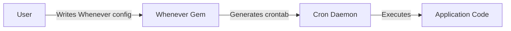
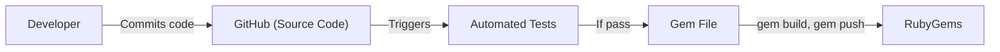

Okay, let's create a design document for the "Whenever" project, a Ruby gem for defining cron jobs in a clear and concise way.

# BUSINESS POSTURE

Whenever is a Ruby gem that simplifies the process of defining and deploying cron jobs. It's designed to make managing scheduled tasks easier for developers.

Priorities:

*   Ease of Use: Provide a simple and intuitive way to define cron jobs.
*   Reliability: Ensure that scheduled tasks are executed as expected.
*   Maintainability: Make it easy to update and manage cron jobs over time.
*   Portability: Allow the gem to be used across different environments.

Goals:

*   Reduce the complexity of managing cron jobs.
*   Improve the readability of cron job definitions.
*   Provide a consistent way to manage cron jobs across projects.

Business Risks:

*   Incorrectly configured schedules leading to missed or overly frequent task execution.
*   Security vulnerabilities if the gem is used to execute untrusted code.
*   Compatibility issues with different operating systems or Ruby versions.
*   Lack of support for advanced cron features.

# SECURITY POSTURE

Existing Security Controls:

*   security control: Code Review: The project is open-source and subject to community review on GitHub. (https://github.com/javan/whenever)
*   security control: Limited Scope: The gem primarily focuses on generating cron job definitions, reducing the attack surface. (https://github.com/javan/whenever)

Accepted Risks:

*   accepted risk: Reliance on System Cron: The gem relies on the underlying system's cron daemon, inheriting any vulnerabilities or limitations of that system.
*   accepted risk: User-Provided Code Execution: The gem executes user-provided code, which could potentially contain vulnerabilities.
*   accepted risk: No built-in input validation: The gem does not perform input validation on user-provided commands.

Recommended Security Controls:

*   security control: Input Sanitization: Implement input validation to prevent the execution of malicious commands.
*   security control: Documentation on Secure Usage: Provide clear documentation on how to use the gem securely, including best practices for avoiding command injection vulnerabilities.
*   security control: Dependency Management: Regularly update dependencies to address known vulnerabilities.
*   security control: Security Audits: Conduct periodic security audits to identify and address potential vulnerabilities.

Security Requirements:

*   Authentication: Not directly applicable, as the gem itself doesn't handle authentication. Authentication is handled by the underlying system's cron daemon.
*   Authorization: Not directly applicable. Authorization is handled by the underlying system's cron daemon and file permissions.
*   Input Validation: Crucial. The gem should validate user-provided commands to prevent command injection vulnerabilities. This is a HIGH priority requirement.
*   Cryptography: Not directly applicable, unless the user-provided commands involve cryptographic operations.

# DESIGN

## C4 CONTEXT



Element Descriptions:

*   User:
    *   Name: User
    *   Type: Person
    *   Description: The developer who uses the Whenever gem to define cron jobs.
    *   Responsibilities: Writing the Whenever configuration file (schedule.rb).
    *   Security controls: None directly. Relies on the user's own security practices.

*   Whenever:
    *   Name: Whenever Gem
    *   Type: Software System
    *   Description: The Ruby gem that translates a Ruby DSL into a crontab file.
    *   Responsibilities: Parsing the schedule.rb file, generating a valid crontab file.
    *   Security controls: Input validation (recommended).

*   Cron:
    *   Name: Cron Daemon
    *   Type: Software System
    *   Description: The system's cron daemon, responsible for executing scheduled tasks.
    *   Responsibilities: Reading the crontab file, executing commands at the specified times.
    *   Security controls: System-level security controls, file permissions.

*   App:
    *   Name: Application Code
    *   Type: Software System
    *   Description: The code that is executed by the cron jobs.
    *   Responsibilities: Performing the tasks defined by the user.
    *   Security controls: Dependent on the application's own security measures.

## C4 CONTAINER

In this case, the container diagram is very similar to the context diagram, as the gem itself is a single component.


Element Descriptions:

*   User:
    *   Name: User
    *   Type: Person
    *   Description: The developer who uses the Whenever gem to define cron jobs.
    *   Responsibilities: Writing the Whenever configuration file (schedule.rb).
    *   Security controls: None directly. Relies on the user's own security practices.

*   Whenever:
    *   Name: Whenever Gem
    *   Type: Software System
    *   Description: The Ruby gem that translates a Ruby DSL into a crontab file.
    *   Responsibilities: Parsing the schedule.rb file, generating a valid crontab file.
    *   Security controls: Input validation (recommended).

*   Cron:
    *   Name: Cron Daemon
    *   Type: Software System
    *   Description: The system's cron daemon, responsible for executing scheduled tasks.
    *   Responsibilities: Reading the crontab file, executing commands at the specified times.
    *   Security controls: System-level security controls, file permissions.

*   App:
    *   Name: Application Code
    *   Type: Software System
    *   Description: The code that is executed by the cron jobs.
    *   Responsibilities: Performing the tasks defined by the user.
    *   Security controls: Dependent on the application's own security measures.

## DEPLOYMENT

Whenever is a Ruby gem, and its "deployment" involves installing the gem and then using it to update the system's crontab.

Possible Deployment Solutions:

1.  Manual Installation and Crontab Update: The user installs the gem and runs `whenever --update-crontab`.
2.  Capistrano Integration: Whenever provides built-in Capistrano integration for automated deployment.
3.  Chef/Puppet/Ansible: Configuration management tools can be used to install the gem and manage the crontab file.

Chosen Solution (Capistrano Integration):

```mermaid
graph LR
    DevMachine["Developer Machine"]
    Server["Application Server"]
    Cron["Cron Daemon"]

    DevMachine -- cap deploy --> Server
    Server -- whenever --update-crontab --> Cron
```

Element Descriptions:

*   DevMachine:
    *   Name: Developer Machine
    *   Type: Infrastructure
    *   Description: The developer's local machine.
    *   Responsibilities: Running Capistrano deployment scripts.
    *   Security controls: Developer machine security.

*   Server:
    *   Name: Application Server
    *   Type: Infrastructure
    *   Description: The server where the application is deployed.
    *   Responsibilities: Running the application code, hosting the Whenever configuration.
    *   Security controls: Server-level security controls, firewall, etc.

*   Cron:
    *   Name: Cron Daemon
    *   Type: Software System
    *   Description: The system's cron daemon.
    *   Responsibilities: Executing scheduled tasks.
    *   Security controls: System-level security controls, file permissions.

## BUILD

Whenever is a Ruby gem. The build process involves packaging the gem and publishing it to RubyGems.



Element Descriptions:

*   Developer: The developer who writes and maintains the Whenever gem.
*   GitHub: The source code repository.
*   RubyGems: The Ruby gem repository.
*   Tests: Automated tests that are run before the gem is built.
*   Gem File: The packaged gem file.

Security Controls:

*   security control: Code Review: Pull requests on GitHub are subject to code review.
*   security control: Automated Tests: The gem has a test suite that is run automatically.
*   security control: (Recommended) Dependency Scanning: Use tools like Bundler-audit to scan for vulnerable dependencies.
*   security control: (Recommended) Static Analysis: Use tools like RuboCop to identify potential code quality and security issues.

# RISK ASSESSMENT

Critical Business Processes:

*   Scheduled task execution: The core functionality of the gem is to ensure that scheduled tasks are executed reliably.

Data:

*   Crontab file: Contains the schedule and commands to be executed. Sensitivity: Medium (contains potentially sensitive commands).
*   Application code: The code executed by the cron jobs. Sensitivity: Depends on the application.
*   Whenever configuration (schedule.rb): Contains the schedule definition. Sensitivity: Low to Medium.

# QUESTIONS & ASSUMPTIONS

Questions:

*   Are there any specific compliance requirements (e.g., PCI DSS, HIPAA) that need to be considered?
*   What is the expected scale of usage (number of servers, frequency of cron jobs)?
*   What are the existing security practices for managing the servers where the gem will be used?
*   What level of logging and auditing is required?

Assumptions:

*   BUSINESS POSTURE: The primary goal is to provide a convenient and reliable way to manage cron jobs.
*   SECURITY POSTURE: The underlying system's cron daemon is properly configured and secured. The user is responsible for the security of the code they execute via cron jobs.
*   DESIGN: The gem will be used primarily in a Ruby on Rails environment, but should be compatible with other Ruby applications. Capistrano integration is a common deployment method.