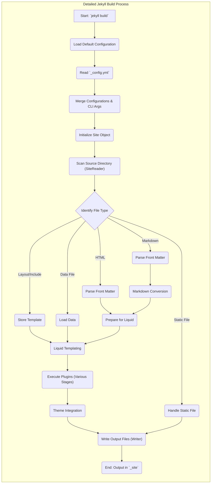
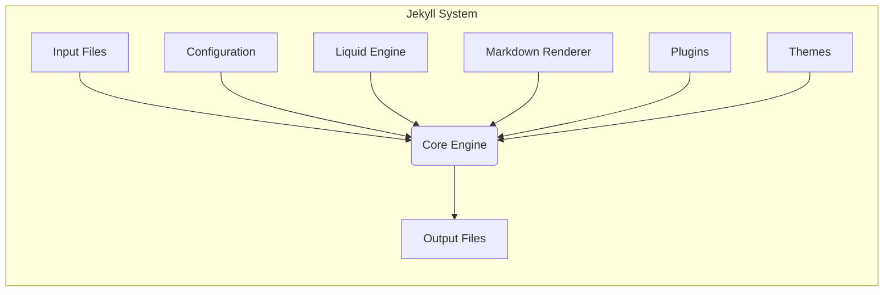

# Project Design Document: Jekyll Static Site Generator

**Version:** 1.1
**Date:** October 26, 2023
**Author:** Gemini (AI Language Model)

## 1. Introduction

This document provides an enhanced design overview of the Jekyll static site generator, building upon the previous version. It aims to offer a more granular understanding of the system's architecture, data flow, and architectural nuances crucial for effective threat modeling.

Jekyll transforms text files into static HTML websites by processing markup languages and applying layouts. This document delves deeper into Jekyll's internal mechanisms to facilitate a more comprehensive identification of potential security vulnerabilities during subsequent threat modeling exercises.

## 2. Goals

The primary goals of this revised design document are:

* To provide a more detailed and nuanced description of Jekyll's architecture and components.
* To offer a clearer and more granular illustration of the data flow within the Jekyll build process, highlighting potential transformation points.
* To explicitly identify key areas and interactions that are particularly relevant for security considerations and threat modeling, providing concrete examples.
* To serve as a robust and refined foundational document for future security analysis, penetration testing, and risk assessment.

## 3. System Overview

Jekyll's operation centers around transforming a source directory of text and asset files into a deployable static website within an output directory. The process involves a series of transformations orchestrated by the core engine, including parsing, rendering, and templating.

Jekyll's architecture can be further refined into these key areas for a more detailed analysis:

* **Initialization and Configuration Loading:** The startup phase where settings are loaded and the environment is prepared.
* **Content Ingestion and Parsing:**  The process of reading and interpreting various input file types.
* **Transformation and Rendering:** Applying logic, templates, and rendering engines to the ingested content.
* **Asset Handling and Generation:** Managing and generating static assets like CSS and JavaScript.
* **Extensibility and Customization:** The mechanisms through which users can extend and modify Jekyll's behavior.
* **Output Generation and Finalization:** The stage where the final static website is assembled and written to the output directory.

## 4. Components

This section provides a more detailed breakdown of Jekyll's key components:

* **Core Engine (`jekyll/lib/jekyll.rb` and related files):**
    * This is the heart of Jekyll, written in Ruby, responsible for managing the entire build lifecycle.
    * It orchestrates the loading of configurations, the discovery and processing of files, and the execution of plugins and rendering steps.
    * It handles error management and logging during the build process.
* **Configuration System (`jekyll/configuration.rb`):**
    * Manages the loading and merging of configuration settings from `_config.yml`, command-line arguments, and defaults.
    * Configuration options control various aspects of the build, including site metadata, permalinks, and plugin settings.
    * This component is crucial as it dictates how other components behave.
* **Input File Handlers (`jekyll/readers/site.rb`, `jekyll/readers/page.rb`, etc.):**
    * Responsible for reading and parsing different types of input files.
    * This includes handling Markdown files, HTML files, data files (`_data`), layout files (`_layouts`), and include files (`_includes`).
    * Each handler understands the specific format of its file type and extracts relevant information.
* **Front Matter Parser (`jekyll/frontmatter.rb`):**
    * Specifically designed to parse the YAML or TOML front matter at the beginning of certain files.
    * Extracts metadata like layout, title, date, and custom variables, which influence the rendering process.
    * This metadata is crucial for the Liquid templating engine.
* **Markdown Renderer (`jekyll/converters/markdown.rb` and underlying library like Kramdown):**
    * Converts Markdown syntax into HTML.
    * The specific renderer used (e.g., Kramdown, CommonMark) can be configured.
    * This component is a potential area for vulnerabilities if the renderer itself has parsing flaws.
* **Liquid Templating Engine (`liquid` gem):**
    * An embedded template language used to create dynamic content within static pages.
    * Processes Liquid tags, objects, and filters within layouts, includes, and page content.
    * This is a significant area for potential Server-Side Template Injection (SSTI) vulnerabilities if not handled carefully.
* **Plugin System (`jekyll/plugin.rb`, `jekyll/plugins/`):**
    * Provides a mechanism to extend Jekyll's functionality through custom Ruby code.
    * Plugins can hook into various stages of the build process, including:
        * **Generators:** Create new pages or content.
        * **Converters:** Transform file formats.
        * **Commands:** Add new CLI commands.
        * **Tags & Filters:** Extend the Liquid templating language.
    * The plugin system offers great flexibility but also introduces significant security risks if plugins are malicious or poorly written.
* **Theme Engine (`jekyll/theme.rb`):**
    * Manages the loading and application of themes, which provide pre-built layouts, styles, and assets.
    * Themes can be packaged as Ruby gems or exist within the project directory.
    * Using themes from untrusted sources can introduce security vulnerabilities.
* **Static File Handler (`jekyll/static_file.rb`):**
    * Responsible for copying static assets (CSS, JavaScript, images, etc.) directly to the output directory.
    * Ensures that these files are included in the final website.
* **Output Writer (`jekyll/writer.rb`):**
    * Writes the generated HTML files and other assets to the output directory (`_site` by default).
    * Manages the file system operations involved in creating the final website structure.
* **Command-Line Interface (`jekyll/commands/`):**
    * Provides the `jekyll` command and its subcommands (e.g., `build`, `serve`).
    * Handles user input and orchestrates the build process based on the provided commands and options.

## 5. Data Flow

The data flow within Jekyll can be broken down into more granular steps:

1. **Initialization and Configuration:**
    * The `jekyll` command is invoked with specific arguments.
    * The core engine loads default configurations.
    * Configuration files (`_config.yml`) are read and merged with defaults and command-line arguments.
    * The site object is initialized, holding the configuration and site data.
2. **Site Reading and Content Discovery:**
    * The `SiteReader` component scans the source directory for all files and directories.
    * Different readers are used to identify and categorize files (pages, posts, static files, etc.).
3. **Front Matter Extraction and Processing:**
    * For eligible files (Markdown, HTML), the `FrontMatter` parser extracts the YAML or TOML front matter.
    * This metadata is stored and associated with the corresponding file.
4. **Content Conversion (Markdown):**
    * Markdown files are passed to the configured `MarkdownConverter`.
    * The converter uses a Markdown rendering library (like Kramdown) to generate HTML from the Markdown syntax.
5. **Liquid Templating and Rendering:**
    * Layout files are processed by the `Liquid::Template` engine.
    * Page content (HTML or the output of the Markdown converter) is injected into the appropriate layout based on the `layout` front matter.
    * Liquid tags, objects, and filters within the content and layouts are evaluated, accessing site data, page metadata, and data files.
    * Include files are rendered and inserted where specified by Liquid tags.
6. **Collection Processing:**
    * Files within defined collections (e.g., blog posts) are processed.
    * Metadata from these files is extracted and made available for use in templates, often through the `site.collections` object in Liquid.
7. **Plugin Execution at Various Stages:**
    * **Before Read:** Plugins can modify the site configuration or perform actions before files are read.
    * **After Read:** Plugins can access and modify the site's content after files have been read and parsed.
    * **Pre-Render:** Plugins can manipulate content before it's rendered by Liquid.
    * **Post-Render:** Plugins can modify the rendered output.
    * **Post-Write:** Plugins can perform actions after the site has been written to the output directory.
8. **Theme Integration:**
    * Theme layouts, includes, and assets override or extend the base site's files.
    * The theme engine ensures that theme files are considered during the rendering process.
9. **Static File Handling:**
    * The `StaticFile` handler copies files from the source directory to the output directory without modification.
10. **Output Writing:**
    * The `Writer` component takes the processed content and assets and writes them to the output directory (`_site`).
    * This involves creating directories and writing files to the file system.

## 6. Security Considerations (Precursor to Threat Modeling)

This section expands on potential security concerns, providing more specific examples relevant for threat modeling:

* **Configuration Injection Attacks:**
    * **Scenario:** An attacker gains control over the `_config.yml` file (e.g., through a compromised editor or repository).
    * **Threats:** They could inject malicious values for `baseurl` to cause redirection attacks, modify plugin settings to load malicious plugins, or alter build settings to introduce vulnerabilities.
* **Input File Exploitation:**
    * **Cross-Site Scripting (XSS):**
        * **Scenario:** A user submits a blog post with malicious JavaScript in the Markdown content.
        * **Threat:** Without proper sanitization during Markdown rendering or Liquid templating, this script could be included in the generated HTML, leading to XSS attacks on website visitors.
    * **Server-Side Template Injection (SSTI):**
        * **Scenario:** A developer uses a custom Liquid filter that improperly handles user input.
        * **Threat:** An attacker could craft malicious input that, when processed by the filter, allows them to execute arbitrary Ruby code on the server during the build process.
    * **Local File Inclusion (LFI):**
        * **Scenario:** A poorly written Liquid template uses user-controlled data in an `include` tag without proper sanitization.
        * **Threat:** An attacker could potentially include arbitrary files from the server's file system into the generated output.
* **Liquid Template Vulnerabilities:**
    * **Denial of Service (DoS):**
        * **Scenario:** A complex or recursive Liquid template is used.
        * **Threat:** Processing this template could consume excessive server resources during the build process, leading to a denial of service.
    * **Information Disclosure:**
        * **Scenario:** Liquid code inadvertently exposes sensitive data or internal variables.
        * **Threat:** Attackers could gain access to confidential information through the generated HTML.
* **Plugin Security Risks:**
    * **Malicious Plugins:**
        * **Scenario:** A user installs a Jekyll plugin from an untrusted source.
        * **Threat:** The plugin could contain malicious code that steals data, modifies files, or compromises the server during the build process.
    * **Vulnerable Plugins:**
        * **Scenario:** A plugin has a security vulnerability (e.g., an XSS vulnerability in a plugin that generates dynamic content).
        * **Threat:** This vulnerability could be exploited to compromise the generated website or the build environment.
    * **Supply Chain Attacks:**
        * **Scenario:** A dependency of a Jekyll plugin is compromised.
        * **Threat:** The compromised dependency could introduce vulnerabilities into the plugin and, consequently, into the Jekyll build process.
* **Theme Security Risks:**
    * **Malicious Code in Themes:**
        * **Scenario:** A user uses a Jekyll theme from an untrusted source.
        * **Threat:** The theme could contain malicious JavaScript or other code that compromises website visitors.
    * **Vulnerabilities in Theme Assets:**
        * **Scenario:** A theme includes outdated or vulnerable JavaScript libraries.
        * **Threat:** These vulnerabilities could be exploited by attackers.
* **Output Directory Security:**
    * **Insecure Permissions:**
        * **Scenario:** The output directory has overly permissive permissions.
        * **Threat:** Attackers could potentially modify or replace the generated website files after the build process.
* **Dependency Vulnerabilities (Ruby Gems):**
    * **Scenario:** Jekyll or its plugins rely on Ruby gems with known security vulnerabilities.
    * **Threat:** These vulnerabilities could be exploited if not patched.
* **Command-Line Interface Attacks:**
    * **Command Injection:**
        * **Scenario:** A plugin or custom script uses user-provided input in a way that allows for command injection.
        * **Threat:** Attackers could execute arbitrary commands on the server running the Jekyll build.

## 7. Diagrams

### 7.1 High-Level Architecture

### 7.2 Data Flow Diagram (Detailed)

*(Provided in Section 5)*

## 8. Conclusion

This improved design document offers a more detailed and nuanced understanding of the Jekyll static site generator's architecture and data flow. By providing a deeper dive into the components and expanding on potential security considerations with concrete examples, this document serves as a more robust foundation for comprehensive threat modeling activities. This enhanced understanding will enable security professionals to more effectively identify, analyze, and mitigate potential vulnerabilities within Jekyll-powered websites and their build processes.