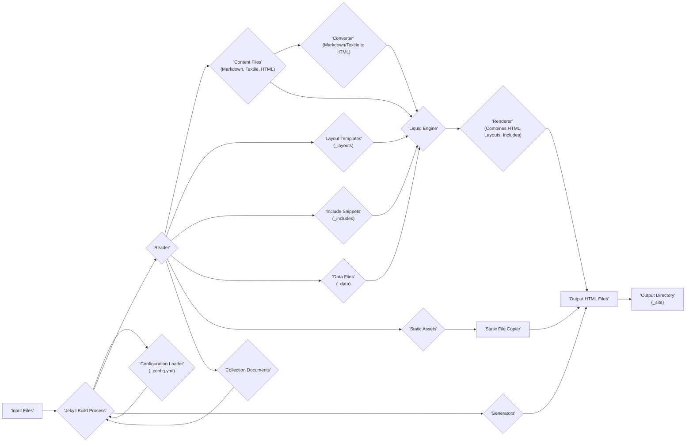

# Project Design Document: Jekyll (Improved)

**Version:** 1.1
**Date:** October 26, 2023
**Author:** AI Software Architect

## 1. Introduction

This document provides an enhanced design overview of the Jekyll project, a popular open-source static site generator. It builds upon the previous version to provide more detail and clarity, specifically for use in subsequent threat modeling activities. The document outlines the system's architecture, components, data flow, and key technologies, with a focus on elements relevant to security analysis.

## 2. Project Overview

Jekyll is a Ruby-based, open-source static site generator. It takes plain text files written in markup languages (like Markdown) and, using templates and configurations, transforms them into a complete, static HTML website. The generated website is designed for direct serving by web servers or through CDNs, offering simplicity, speed, and security. Jekyll is particularly well-suited for blogs, documentation sites, and personal websites.

## 3. System Architecture

Jekyll's architecture revolves around the transformation pipeline that converts source content into static output. The core components and their detailed interactions are described below:

### 3.1. Core Components (Detailed)

*   **Input Files:** The source materials for the website.
    *   **Content Files (Markdown, Textile, HTML):**  These files contain the actual content of the website pages, written in a chosen markup language or directly in HTML.
    *   **Layout Templates (`_layouts`):**  HTML files containing Liquid templating code that define the overall structure of pages. Content files are rendered within these layouts.
    *   **Include Snippets (`_includes`):** Reusable HTML or Liquid code snippets that can be embedded within layouts or content files to avoid repetition.
    *   **Data Files (`_data`):** YAML or JSON files storing structured data that can be accessed and used within Liquid templates to dynamically generate content.
    *   **Configuration File (`_config.yml`):** A YAML file containing global settings for the Jekyll site, including site metadata, build options, theme settings, and plugin configurations.
    *   **Static Assets:** Files like images, CSS stylesheets, JavaScript files, and fonts that are directly copied to the output directory without processing.
    *   **Collection Documents:** Content files organized into named collections (e.g., `_posts`, `_projects`) that Jekyll can process and generate listings or index pages for.
*   **Jekyll Build Process:** The core engine that orchestrates the transformation of input files into the final website.
    *   **Configuration Loader:** Reads and parses the `_config.yml` file to establish global settings for the build.
    *   **Reader:**  Responsible for reading all files from the project directory and organizing them based on their type and location.
    *   **Converter (Markdown, Textile):** Transforms content files written in Markdown or Textile into HTML. The specific converter used is configurable.
    *   **Liquid Engine:**  A template engine that processes Liquid tags and filters within layouts, includes, and content files, allowing for dynamic content generation based on data and logic.
    *   **Renderer:** Combines the output of the Converter with Layouts and Includes, using the Liquid Engine to produce the final HTML pages.
    *   **Generator:**  Plugins or built-in modules that create additional files or modify existing ones during the build process. Examples include generating sitemaps, RSS feeds, or pagination.
    *   **Static File Copier:**  Copies static assets directly from the source directory to the output directory.
*   **Output Directory (`_site`):** The destination directory where the fully generated static website files (HTML, CSS, JavaScript, assets) are placed after the build process is complete.

### 3.2. Data Flow (Detailed)

The following diagram illustrates the detailed data flow within the Jekyll build process:

**Detailed Data Flow Explanation:**

1. **Input Collection:** The 'Reader' component within the 'Jekyll Build Process' gathers all files from the project directory, categorizing them as 'Content Files', 'Layout Templates', 'Include Snippets', 'Data Files', 'Static Assets', and 'Collection Documents'.
2. **Configuration Loading:** The 'Configuration Loader' reads and parses the `_config.yml` file, making the settings available to other components.
3. **Content Conversion (if necessary):** If a 'Content File' is in Markdown or Textile, the 'Converter' transforms it into HTML. HTML content files bypass this step.
4. **Liquid Templating:** The 'Liquid Engine' processes 'Layout Templates', 'Include Snippets', and the converted HTML content. It uses data from 'Data Files' and 'Collection Documents' to dynamically generate content based on the Liquid tags and filters present.
5. **Rendering:** The 'Renderer' takes the processed HTML from the 'Converter' (or directly from HTML content files) and merges it with the appropriate 'Layout Templates' and 'Include Snippets', as instructed by the Liquid code. This produces the final HTML for each page.
6. **Static Asset Copying:** The 'Static File Copier' directly copies files identified as 'Static Assets' to the 'Output Directory'.
7. **Generator Execution:** 'Generators' (either built-in or provided by plugins) execute, potentially creating new files (like sitemap.xml or RSS feeds) or modifying existing output based on the project's content and configuration.
8. **Output Generation:** All generated HTML files and copied static assets are placed into the 'Output Directory' (`_site`).

## 4. Key Technologies

*   **Ruby:** The programming language in which Jekyll is written. Requires a Ruby environment (including RubyGems) to run.
*   **Liquid:**  The flexible and secure template language used for embedding dynamic content within static HTML.
*   **YAML:** A human-readable data-serialization language used for the primary configuration file (`_config.yml`) and data files within the `_data` directory.
*   **Markdown (or Textile):** Lightweight markup languages used for writing content that is then converted to HTML. Markdown is the more commonly used option.
*   **HTML:** The HyperText Markup Language, the standard markup language for creating web pages. This is the final output format.
*   **CSS:** Cascading Style Sheets, used for styling the presentation of the HTML content.
*   **JavaScript:** A scripting language that can be included in the static files for adding client-side interactivity.
*   **RubyGems:** A package manager for Ruby, used to install and manage Jekyll plugins and dependencies.

## 5. Deployment Considerations

Jekyll's output is a collection of static files, offering a wide range of deployment options:

*   **Direct Web Server Hosting:** Serving the contents of the `_site` directory directly from a traditional web server such as:
    *   **Apache HTTP Server**
    *   **Nginx**
    *   **Microsoft IIS**
*   **Static Site Hosting Platforms:** Utilizing platforms specifically designed for hosting static websites, often with built-in CI/CD and CDN integration:
    *   **Netlify**
    *   **Vercel**
    *   **GitHub Pages**
    *   **GitLab Pages**
    *   **Firebase Hosting**
    *   **AWS Amplify**
*   **Cloud Storage Services:** Hosting the static files directly from cloud storage buckets configured for web access:
    *   **Amazon S3**
    *   **Google Cloud Storage**
    *   **Azure Blob Storage**
*   **Content Delivery Networks (CDNs):** Distributing the static files across a network of servers for improved performance and availability, often used in conjunction with other hosting methods:
    *   **Cloudflare**
    *   **Fastly**
    *   **AWS CloudFront**
    *   **Google Cloud CDN**
*   **Containerization:** Packaging the Jekyll build environment (or just the output `_site` directory) into a container image for deployment using container orchestration platforms:
    *   **Docker**
    *   **Kubernetes**

## 6. Security Considerations (Enhanced)

This section expands on the initial security considerations, providing more detail and categorization for threat modeling purposes.

*   **Input Validation and Sanitization:**
    *   **Liquid Templating:**  Unsanitized user input or data from external sources rendered through Liquid templates can lead to Cross-Site Scripting (XSS) vulnerabilities. Care must be taken to escape or sanitize any potentially malicious content.
    *   **Data Files:** If data files (`_data`) are sourced from untrusted locations or are user-uploadable, they could contain malicious code or unexpected structures that could be exploited during the build process.
    *   **Configuration File:**  While less common, vulnerabilities in YAML parsing could be exploited if the `_config.yml` file is sourced from an untrusted location.
*   **Dependency Management:**
    *   **Gem Vulnerabilities:** Jekyll relies on RubyGems. Vulnerabilities in these gems (including transitive dependencies) can introduce security risks. Regularly auditing and updating gems using tools like `bundler-audit` is crucial.
    *   **Plugin Security:**  Plugins, being Ruby code, have the potential to introduce vulnerabilities if they are poorly written, unmaintained, or intentionally malicious. Carefully vet plugins before use and keep them updated.
*   **Build Process Security:**
    *   **Environment Security:** The environment where Jekyll builds the site needs to be secure to prevent the introduction of malicious code or the compromise of sensitive information.
    *   **Source Code Protection:** Protecting the source code repository from unauthorized access is essential.
    *   **Secret Management:** Avoid storing sensitive information (API keys, credentials) directly in the codebase or configuration files. Use environment variables or dedicated secret management solutions.
*   **Output Directory Security:**
    *   **Server Configuration:** The web server serving the static files needs to be properly configured to prevent unauthorized access, directory listing, and other security issues.
    *   **File Permissions:**  Appropriate file permissions on the `_site` directory are necessary to prevent unauthorized modification.
*   **Source Code Management Security:**
    *   **Repository Access Control:** Implement strong access controls and authentication for the Git repository hosting the Jekyll project.
    *   **Commit History Review:** Regularly review commit history for suspicious changes or accidental exposure of sensitive information.
*   **User-Generated Content (If Applicable):**
    *   **Comment Systems:** If a comment system is integrated (often third-party for static sites), ensure it has proper security measures to prevent spam, XSS, and other attacks.
    *   **Contributions:** If the site allows user contributions, implement thorough review and sanitization processes.
*   **Denial of Service (DoS):**
    *   **Resource Exhaustion during Build:**  Maliciously crafted input files (e.g., extremely large files or deeply nested structures) could potentially exhaust resources during the Jekyll build process.
*   **Supply Chain Security:**
    *   **Theme and Template Sources:** If using external themes or templates, ensure they are sourced from reputable locations and are regularly updated to address potential vulnerabilities.

## 7. Conclusion

This improved design document provides a more detailed and comprehensive overview of the Jekyll project, focusing on aspects relevant to security. The enhanced descriptions of components, the refined data flow diagram, and the expanded security considerations provide a solid foundation for conducting thorough threat modeling exercises. This document will aid in identifying potential vulnerabilities and developing appropriate mitigation strategies to ensure the security of Jekyll-powered websites.
