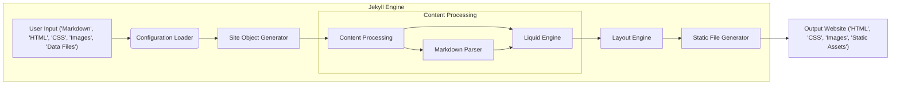
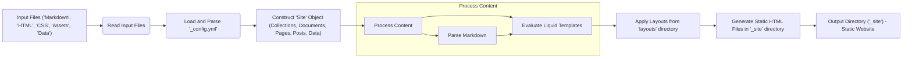

# Project Design Document: Jekyll Static Site Generator

**Version:** 1.1
**Date:** October 26, 2023
**Author:** Gemini (AI Language Model)

## 1. Introduction

This document provides an enhanced architectural design of the Jekyll static site generator, building upon the previous version. It offers a more detailed breakdown of the key components, data flow, and interactions within the system, specifically tailored for threat modeling purposes.

Jekyll remains a popular open-source static site generator written in Ruby, renowned for transforming text written in markup languages (like Markdown) and templates into complete, static HTML websites. Its common use cases include blogs, personal websites, and project documentation.

## 2. Goals and Objectives

Jekyll's core goal is the efficient and straightforward generation of static HTML websites from plain text sources. Key objectives include:

*   **Simplicity:**  Maintaining an easy-to-understand and use system for website generation, eliminating the need for databases or complex server-side scripting during runtime.
*   **Flexibility and Customization:** Empowering users to tailor the visual presentation and functionality of their websites through themes, layouts, and customizable configurations.
*   **Extensibility through Plugins:** Providing a mechanism for users to extend Jekyll's core capabilities by developing and integrating plugins.
*   **High Performance:** Ensuring fast website loading times by generating static HTML content.
*   **Version Control Integration:**  Designed to work seamlessly with version control systems like Git, facilitating collaboration and tracking changes.

## 3. System Architecture

Jekyll's architecture centers around the transformation of input files into static output. The following diagram provides a more granular view of the core components and their interactions:

### 3.1. Key Components (Detailed)

*   **User Input:** This encompasses all files provided by the user to define the website's content and structure:
    *   **Content Files:**
        *   `Markdown` files: Containing the primary content, formatted using Markdown syntax.
        *   `HTML` files: Used for layouts, includes (reusable snippets), and potentially standalone pages.
    *   **Styling and Assets:**
        *   `CSS` files: Defining the visual presentation of the website.
        *   `Image` files: Graphics and other visual assets.
        *   Other static assets: JavaScript files, fonts, etc.
    *   **Data Files:**
        *   `YAML` files (`_data` directory):  Structured data used to populate dynamic content.
        *   `JSON` files (`_data` directory):  Alternative format for structured data.
        *   `CSV` files (`_data` directory): Comma-separated values for tabular data.
    *   **Configuration File:**
        *   `_config.yml`:  A YAML file containing global site settings, theme configurations, and build options.
*   **Configuration Loader:** This component is responsible for reading and interpreting configuration settings:
    *   Parses the `_config.yml` file.
    *   Processes command-line arguments passed to the Jekyll build process.
    *   Determines site-wide settings such as site title, base URL, theme selection, and the destination directory for the generated website.
*   **Site Object Generator:** This component builds an in-memory representation of the entire website structure:
    *   **Collections:** Organizes content into logical groupings (e.g., `_posts`, `_pages`, custom collections).
    *   **Documents:** Represents individual content items within collections or standalone pages.
    *   **Pages:**  Specific documents intended to be rendered as HTML pages.
    *   **Posts:** Time-based content, typically blog entries, often with specific front matter for metadata.
    *   **Data:**  Loads and makes accessible the data from YAML, JSON, and CSV files in the `_data` directory.
    *   **Static Files:**  Identifies and prepares static assets for copying to the output directory.
*   **Content Processing:** This component handles the transformation of content into HTML:
    *   **Markdown Parser:** Converts Markdown syntax within content files into corresponding HTML elements. Jekyll supports various Markdown engines (e.g., Kramdown, CommonMark).
    *   **Liquid Engine:**  A template engine that allows embedding dynamic content and logic within Markdown and HTML files. It processes Liquid tags, objects, and filters to inject data, iterate through collections, and perform conditional rendering.
*   **Layout Engine:** This component applies HTML templates to the processed content:
    *   Layouts define the overall structure and common elements (header, footer, navigation) of pages.
    *   The Layout Engine wraps the rendered content within the appropriate layout based on front matter settings in the content files.
*   **Static File Generator:** This component writes the final output to the destination directory:
    *   Generates static HTML files for each page by combining the rendered content and layouts.
    *   Copies static assets (CSS, images, JavaScript, etc.) to the output directory.
    *   Organizes the output files according to the site's permalink structure and collection configurations.
*   **Output Website:** This is the final collection of static files that constitute the website:
    *   `HTML` files: The rendered web pages.
    *   `CSS` files: Stylesheets for visual presentation.
    *   `Image` files: Graphics and other visual elements.
    *   Other `Static Assets`: JavaScript files, fonts, and any other files that are directly copied.

### 3.2. Data Flow (Detailed)

The process of generating a Jekyll website involves a more nuanced flow of data:

*   **Read Input Files:** Jekyll begins by scanning the project directory and reading all relevant files.
*   **Load and Parse `_config.yml`:** The `_config.yml` file is loaded and parsed to establish global site settings.
*   **Construct 'Site' Object:** Jekyll builds a comprehensive in-memory representation of the website, including collections, individual content items (documents, pages, posts), and loaded data. This 'Site' object serves as the central data structure for the build process.
*   **Process Content:**
    *   **Parse Markdown:** Markdown files are processed by the designated Markdown parser to convert them into HTML.
    *   **Evaluate Liquid Templates:** The Liquid engine processes tags and filters within both Markdown and HTML files. This involves accessing data from the 'Site' object, iterating through collections, and executing any conditional logic defined in the templates.
*   **Apply Layouts from `_layouts` directory:** The processed content is then wrapped within the appropriate HTML layouts defined in the `_layouts` directory, based on front matter specifications in the content files.
*   **Generate Static HTML Files in `_site` directory:** The fully rendered HTML content, along with static assets, is written to the output directory (typically `_site`), organized according to the site's configuration.
*   **Output Directory (`_site`) - Static Website:** The `_site` directory contains the complete, ready-to-deploy static website.

## 4. Security Considerations (Expanded)

Given its architecture, Jekyll presents specific security considerations that are crucial for threat modeling:

*   **Input Validation and Sanitization:**
    *   **Malicious Markdown:**  If the Markdown parser has vulnerabilities, attackers could inject malicious code through crafted Markdown syntax. This could lead to cross-site scripting (XSS) if the generated HTML is not properly handled by the browser or, more severely, to code execution during the build process if the parser itself is compromised.
    *   **Unsafe Data Files:**  Data files (YAML, JSON, CSV) from untrusted sources could contain malicious payloads. For example, YAML deserialization vulnerabilities could allow arbitrary code execution during the build.
*   **Liquid Templating Engine Vulnerabilities:**
    *   **Server-Side Template Injection (SSTI):** If user-controlled input is directly embedded into Liquid templates without proper escaping or sanitization, attackers could inject malicious Liquid code. This could lead to arbitrary code execution on the server during the build process, allowing them to read sensitive files, modify the generated output, or compromise the build environment.
    *   **Information Disclosure:** Improperly secured Liquid templates might inadvertently expose sensitive data or internal system details.
*   **Plugin Security Risks:**
    *   **Malicious Plugins:** Third-party plugins, if not vetted, could contain malicious code designed to compromise the build process or inject harmful content into the generated website.
    *   **Plugin Vulnerabilities:** Even well-intentioned plugins might have security vulnerabilities that attackers could exploit if the plugin is used in a vulnerable context.
    *   **Excessive Permissions:** Plugins might request unnecessary permissions, increasing the potential impact if the plugin is compromised.
*   **Dependency Management and Supply Chain Security:**
    *   **Vulnerable Gems:** Jekyll relies on Ruby gems. Vulnerabilities in these dependencies could be exploited during the build process. Keeping dependencies updated is crucial.
    *   **Compromised Dependencies:**  Attackers could compromise the supply chain by injecting malicious code into Jekyll's dependencies. Using dependency scanning tools and verifying checksums can help mitigate this risk.
*   **Build Environment Security:**
    *   **Compromised Build Server:** If the server where Jekyll builds the website is compromised, attackers have full control over the build process and can inject malicious content or steal sensitive information. Securely configuring and maintaining the build environment is essential.
    *   **Exposure of Secrets:**  Storing sensitive information (API keys, credentials) directly in the Jekyll project or build scripts is a significant risk. Secure secrets management practices should be employed.
*   **Output Security Considerations (Post-Generation):**
    *   **Content Security Policy (CSP):** While Jekyll generates static content, implementing a strong CSP in the generated HTML headers is crucial to mitigate client-side attacks like XSS, especially if the website might later incorporate dynamic elements or user-generated content through other means.
    *   **Subresource Integrity (SRI):** Using SRI for external resources (CDNs) ensures that the browser loads untampered versions of these resources.
    *   **HTTP Security Headers:**  Implementing other security headers (e.g., `Strict-Transport-Security`, `X-Frame-Options`, `X-Content-Type-Options`) in the web server configuration that serves the generated static files is vital for overall security.

## 5. Deployment (Detailed Steps)

Deploying a Jekyll website involves transferring the generated static files to a web server or hosting platform. Typical steps include:

1. **Build the Website:** Execute the command `jekyll build` in the project's root directory. This will generate the static website files in the `_site` directory.
2. **Review the Output:** Inspect the contents of the `_site` directory to ensure the website has been generated correctly.
3. **Choose a Deployment Method:** Select a suitable hosting platform or web server. Common options include:
    *   **Static Hosting Services:** Platforms like GitHub Pages, Netlify, Vercel, Amazon S3, Cloudflare Pages offer easy deployment and hosting for static websites.
    *   **Traditional Web Servers:**  Servers like Apache or Nginx can be configured to serve the static files.
    *   **Content Delivery Networks (CDNs):** CDNs can be used to distribute the static files globally for improved performance.
4. **Transfer Files:** Copy the entire contents of the `_site` directory to the chosen hosting platform or web server's document root.
    *   For static hosting services, this often involves using Git to push the `_site` directory to a repository or using a platform-specific deployment tool.
    *   For traditional web servers, this might involve using FTP, SCP, or rsync to transfer the files.
5. **Configure Web Server (if applicable):** If using a traditional web server, configure it to serve the files correctly. This includes setting the document root to the location of the `_site` contents and potentially configuring virtual hosts and security headers.
6. **Configure DNS:** Point your domain name to the hosting platform or web server's IP address or provided hostname.
7. **Test the Deployed Website:** Access the website through its domain name to verify that it is functioning correctly.

## 6. Technologies Used

*   **Ruby:** The core programming language in which Jekyll is written. Specific Ruby versions might be required or recommended.
*   **Liquid:** The templating language used for embedding dynamic content. Understanding the specific version of Liquid used by Jekyll is important for security considerations.
*   **Markdown Parsers:**  Jekyll supports various Markdown parsing libraries. The default is often Kramdown, but others like CommonMark can be used. The specific parser in use can impact security.
*   **YAML (Psych):**  The Ruby library typically used for parsing the `_config.yml` file and YAML data files. Vulnerabilities in YAML parsing libraries are a concern.
*   **JSON:**  Support for JSON data files is usually provided by a standard Ruby library.
*   **CSV:**  Support for CSV data files is typically provided by a standard Ruby library.
*   **HTML:** The final output format for the website's content.
*   **CSS:** Used for styling the website's presentation.
*   **JavaScript (Optional):** Can be included for client-side interactivity within the input files.
*   **Gems (Ruby Packages):** Jekyll's functionality can be extended through various Ruby gems. Understanding the specific gems used and their versions is crucial for security analysis.

## 7. Future Considerations

While this document focuses on the current architecture for threat modeling, potential future developments in Jekyll could impact its security profile:

*   **Enhanced Plugin Security Model:** Implementing stricter controls and sandboxing for plugins to limit their access and potential for harm.
*   **Built-in Input Sanitization:** Providing more robust and configurable options for sanitizing user-provided content and data files.
*   **Improved Liquid Security Features:**  Introducing features to mitigate template injection risks, such as stricter context awareness or content security policies within the templating engine.
*   **Automated Security Audits:** Integrating tools or processes for automatically scanning Jekyll projects and plugins for known vulnerabilities.
*   **Standardized Security Headers:**  Potentially providing built-in mechanisms for easily configuring common security headers in the generated output or through configuration.

This enhanced design document provides a more detailed and nuanced understanding of Jekyll's architecture, which is essential for conducting a comprehensive threat model. By thoroughly examining the components, data flow, and potential security considerations outlined here, security professionals can effectively identify and mitigate potential risks associated with using Jekyll.