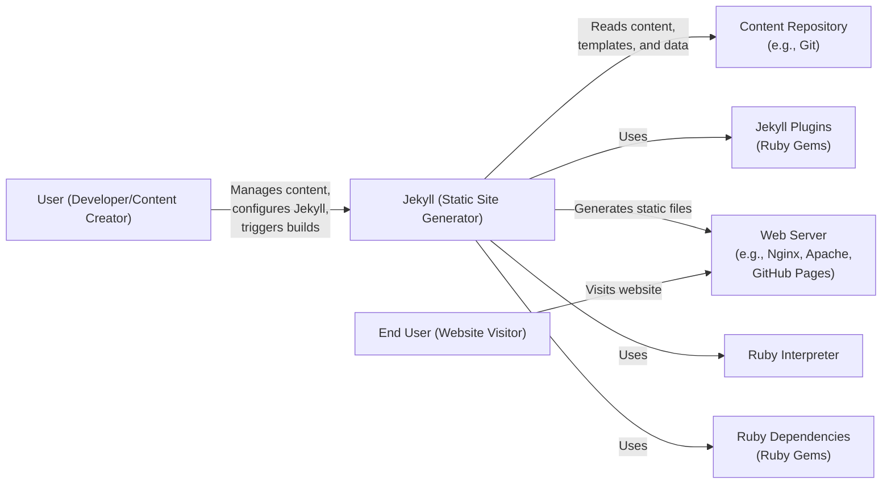
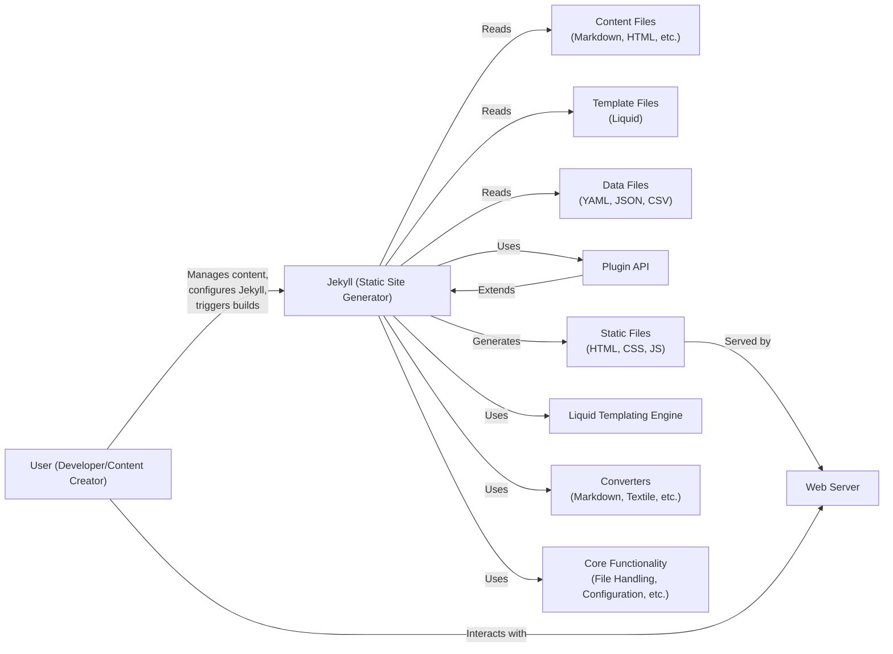
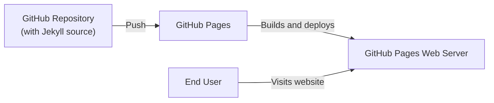
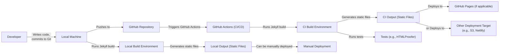

Okay, let's create a design document for the Jekyll project, focusing on aspects relevant for threat modeling.

# BUSINESS POSTURE

Jekyll is a static site generator. It takes text written in your favorite markup language and uses layouts to create a static website.  You can tweak the site's look and feel, URLs, the data displayed on the page, and more.  It's primarily used for blogs and project/documentation websites.  Because it generates static HTML, it's inherently less vulnerable to many dynamic web application attacks.  However, the build process and the content itself still present potential attack surfaces.

Business Priorities:

*   Reliability: Jekyll should consistently and reliably generate websites from provided content.  Unexpected build failures or incorrect rendering are major issues.
*   Usability: Jekyll should be easy to use for its target audience (developers and technical writers).  Complex configurations or unclear documentation reduce adoption.
*   Extensibility: Jekyll should allow users to customize its behavior through plugins and themes, enabling a wide variety of website designs and functionalities.
*   Maintainability: The Jekyll codebase should be maintainable and evolvable, allowing for bug fixes, new features, and security updates.
*   Community: A strong community is vital for support, contributions, and the overall health of the project.

Business Goals:

*   Provide a simple and reliable static site generation tool.
*   Enable users to create and manage blogs and documentation sites easily.
*   Foster a vibrant community of users and contributors.

Most Important Business Risks:

*   Malicious Code Injection: If an attacker can inject malicious code into the source content or templates, the generated website could be compromised, serving malware or defacing the site. This is the highest risk.
*   Plugin Vulnerabilities: Vulnerabilities in third-party plugins could be exploited to compromise the build process or the generated website.
*   Denial of Service (DoS): While the generated *output* is static and thus resistant to traditional web application DoS, the *build process* itself could be targeted, preventing users from updating their sites.
*   Data Exfiltration: Sensitive information (e.g., API keys, draft content) accidentally included in the source repository or build environment could be leaked.
*   Supply Chain Attacks: Compromise of the Jekyll gem itself or its dependencies could lead to widespread compromise of Jekyll-powered websites.

# SECURITY POSTURE

Existing Security Controls:

*   security control: Static Site Generation: By its nature, Jekyll generates static HTML files, eliminating many common web application vulnerabilities like SQL injection, cross-site scripting (XSS) in the *dynamic* sense, and server-side request forgery (SSRF) *on the generated site*. (Implemented in Jekyll's core functionality).
*   security control: Input Sanitization: Jekyll uses Liquid templating, which, when used correctly, can help prevent XSS. Safe mode is also available. (Described in Jekyll's documentation and implemented in the Liquid templating engine).
*   security control: Dependency Management: Jekyll uses RubyGems and Bundler for dependency management, allowing for version pinning and auditing of dependencies. (Described in Jekyll's documentation and implemented using standard Ruby tools).
*   security control: Community Vetting: Widely used plugins and themes are often reviewed by the community, increasing the likelihood of identifying vulnerabilities. (Implicit in the open-source nature of the project).
*   security control: Security Advisories: The Jekyll project publishes security advisories for known vulnerabilities. (Available on the Jekyll website and GitHub repository).
*   security control: CodeQL: GitHub's CodeQL is used to scan the codebase for potential vulnerabilities. (Visible in the GitHub repository's security tab).

Accepted Risks:

*   accepted risk: User-Controlled Content: Jekyll inherently trusts the content provided by the user.  It's the user's responsibility to ensure that their Markdown files, templates, and data files do not contain malicious code.
*   accepted risk: Third-Party Plugin Risk: While the core Jekyll gem is maintained, the security of third-party plugins is the responsibility of their respective authors. Users are responsible for vetting the plugins they use.
*   accepted risk: Limited Input Validation: Jekyll performs some input validation, but it primarily relies on the user to provide well-formed input.
*   accepted risk: Build Environment Security: The security of the environment where Jekyll is run (e.g., a developer's machine, a CI/CD server) is outside the direct control of the Jekyll project.

Recommended Security Controls:

*   security control: Content Security Policy (CSP): Encourage users to implement CSP headers in their generated websites to mitigate the impact of XSS vulnerabilities. This can be done via a plugin or by directly modifying the templates.
*   security control: Subresource Integrity (SRI): Encourage users to use SRI tags for externally loaded resources (CSS, JavaScript) to ensure that these resources haven't been tampered with.
*   security control: Automated Dependency Scanning: Integrate a tool like Dependabot or Snyk into the Jekyll project's CI/CD pipeline to automatically scan for vulnerable dependencies.
*   security control: Plugin Sandboxing: Explore options for sandboxing the execution of Jekyll plugins to limit their access to the system. This is a complex undertaking but would significantly improve security.

Security Requirements:

*   Authentication: Not directly applicable to Jekyll itself, as it's a static site generator. Authentication is handled by the web server or a third-party service if needed for protected areas of the generated site.
*   Authorization: Not directly applicable to Jekyll itself. Authorization, if needed, is handled at the web server level or by a third-party service.
*   Input Validation:
    *   Jekyll should validate user-provided configuration options (e.g., `_config.yml`) to prevent unexpected behavior.
    *   Jekyll should sanitize user-provided content to mitigate XSS vulnerabilities, particularly in templates.  Liquid's `escape` filter should be used consistently.
    *   Plugins should be carefully reviewed for proper input validation.
*   Cryptography:
    *   Jekyll should use secure cryptographic libraries for any cryptographic operations (e.g., generating hashes for SRI).
    *   If Jekyll is used to generate content that includes sensitive data (which is generally discouraged), users should be advised to encrypt this data before including it in the source.
*   Supply Chain Security:
    *   All dependencies should be pinned to specific versions.
    *   Dependencies should be regularly audited for vulnerabilities.
    *   The build process should be secured to prevent tampering with the Jekyll gem.

# DESIGN

## C4 CONTEXT

Element Descriptions:

*   Element:
    *   Name: User (Developer/Content Creator)
    *   Type: Person
    *   Description: The person who creates and manages the content, configures Jekyll, and triggers the build process.
    *   Responsibilities: Writing content, configuring Jekyll, managing the content repository, triggering builds, deploying the generated website.
    *   Security controls: Strong password for repository access, two-factor authentication for repository access, secure development environment.

*   Element:
    *   Name: Jekyll (Static Site Generator)
    *   Type: Software System
    *   Description: The core Jekyll application that processes content and generates the static website.
    *   Responsibilities: Reading content, templates, and data; processing Liquid templates; generating static HTML, CSS, and JavaScript files; managing plugins.
    *   Security controls: Input sanitization, safe mode for Liquid, dependency management, regular security updates.

*   Element:
    *   Name: Content Repository (e.g., Git)
    *   Type: Software System
    *   Description: The repository where the source content, templates, and data files are stored.
    *   Responsibilities: Version control of content, collaboration, access control.
    *   Security controls: Access control lists, branch protection rules, commit signing.

*   Element:
    *   Name: Jekyll Plugins (Ruby Gems)
    *   Type: Software System
    *   Description: Optional extensions that add functionality to Jekyll.
    *   Responsibilities: Extending Jekyll's core functionality, providing custom features.
    *   Security controls: User vetting of plugins, regular security updates of plugins.

*   Element:
    *   Name: Web Server (e.g., Nginx, Apache, GitHub Pages)
    *   Type: Software System
    *   Description: The web server that hosts the generated static website.
    *   Responsibilities: Serving static files, handling HTTP requests, potentially implementing HTTPS.
    *   Security controls: HTTPS configuration, proper file permissions, regular security updates, web application firewall (WAF) if applicable.

*   Element:
    *   Name: End User (Website Visitor)
    *   Type: Person
    *   Description: The person who visits the generated website.
    *   Responsibilities: Browsing the website.
    *   Security controls: None (relies on the security of the website and their own browser).

*   Element:
    *   Name: Ruby Interpreter
    *   Type: Software System
    *   Description: The Ruby interpreter required to run Jekyll.
    *   Responsibilities: Executing the Jekyll code.
    *   Security controls: Use a supported and up-to-date Ruby version.

*   Element:
    *   Name: Ruby Dependencies (Ruby Gems)
    *   Type: Software System
    *   Description: External Ruby libraries that Jekyll depends on.
    *   Responsibilities: Providing functionality used by Jekyll.
    *   Security controls: Dependency management, regular security updates, vulnerability scanning.

## C4 CONTAINER

Element Descriptions:

*   Element:
    *   Name: User (Developer/Content Creator)
    *   Type: Person
    *   Description: The person who creates and manages the content, configures Jekyll, and triggers the build process.
    *   Responsibilities: Writing content, configuring Jekyll, managing the content repository, triggering builds, deploying the generated website.
    *   Security controls: Strong password for repository access, two-factor authentication for repository access, secure development environment.

*   Element:
    *   Name: Jekyll (Static Site Generator)
    *   Type: Application
    *   Description: The core Jekyll application.
    *   Responsibilities: Orchestrates the entire site generation process.
    *   Security controls: Input sanitization, safe mode for Liquid, dependency management.

*   Element:
    *   Name: Content Files (Markdown, HTML, etc.)
    *   Type: Data
    *   Description: The source files containing the website's content.
    *   Responsibilities: Storing the website's content.
    *   Security controls: User-provided, so inherently trusted.

*   Element:
    *   Name: Template Files (Liquid)
    *   Type: Data
    *   Description: The template files that define the layout and structure of the website.
    *   Responsibilities: Defining the website's layout and structure.
    *   Security controls: User-provided, but Liquid templating offers some protection against XSS.

*   Element:
    *   Name: Data Files (YAML, JSON, CSV)
    *   Type: Data
    *   Description: Optional data files that can be used to populate the website.
    *   Responsibilities: Providing data for the website.
    *   Security controls: User-provided, so inherently trusted.

*   Element:
    *   Name: Plugin API
    *   Type: API
    *   Description: The API that allows plugins to extend Jekyll's functionality.
    *   Responsibilities: Providing hooks for plugins to interact with Jekyll.
    *   Security controls: Plugin sandboxing (recommended).

*   Element:
    *   Name: Static Files (HTML, CSS, JS)
    *   Type: Data
    *   Description: The generated static files that make up the website.
    *   Responsibilities: Representing the final website.
    *   Security controls: CSP, SRI (recommended).

*   Element:
    *   Name: Liquid Templating Engine
    *   Type: Library
    *   Description: The templating engine used by Jekyll.
    *   Responsibilities: Processing Liquid templates.
    *   Security controls: Safe mode, output escaping.

*   Element:
    *   Name: Converters (Markdown, Textile, etc.)
    *   Type: Library
    *   Description: Libraries that convert different markup languages (e.g., Markdown) to HTML.
    *   Responsibilities: Converting markup to HTML.
    *   Security controls: Regular updates to address vulnerabilities in the converters.

*   Element:
    *   Name: Core Functionality (File Handling, Configuration, etc.)
    *   Type: Library
    *   Description: Jekyll's core functionality, including file handling, configuration parsing, and more.
    *   Responsibilities: Providing the core building blocks of Jekyll.
    *   Security controls: Input validation, secure coding practices.

*   Element:
    *   Name: Web Server
    *   Type: Software System
    *   Description: The web server that hosts the generated static website.
    *   Responsibilities: Serving static files, handling HTTP requests, potentially implementing HTTPS.
    *   Security controls: HTTPS configuration, proper file permissions, regular security updates, web application firewall (WAF) if applicable.

## DEPLOYMENT

Possible Deployment Solutions:

1.  GitHub Pages: Directly deploy from a GitHub repository.
2.  Netlify/Vercel: Continuous deployment from a Git repository (GitHub, GitLab, Bitbucket).
3.  Amazon S3/Google Cloud Storage: Upload static files to a cloud storage bucket and configure it for website hosting.
4.  Traditional Web Server (Nginx/Apache): Manually upload files to a server and configure the webserver.

Chosen Solution (GitHub Pages):

Element Descriptions:

*   Element:
    *   Name: GitHub Repository (with Jekyll source)
    *   Type: Software System
    *   Description: The Git repository hosted on GitHub containing the Jekyll source files.
    *   Responsibilities: Version control of the Jekyll source, triggering builds on GitHub Pages.
    *   Security controls: Access control, branch protection rules, commit signing.

*   Element:
    *   Name: GitHub Pages
    *   Type: Platform
    *   Description: The GitHub Pages service that automatically builds and deploys Jekyll websites.
    *   Responsibilities: Building the Jekyll site, deploying the static files to a web server.
    *   Security controls: Managed by GitHub, including HTTPS, DDoS protection, etc.

*   Element:
    *   Name: GitHub Pages Web Server
    *   Type: Software System
    *   Description: The web server infrastructure provided by GitHub Pages.
    *   Responsibilities: Serving the static files to website visitors.
    *   Security controls: Managed by GitHub.

*   Element:
    *   Name: End User
    *   Type: Person
    *   Description: The person who visits the generated website.
    *   Responsibilities: Browsing the website.
    *   Security controls: None (relies on the security of the website and their own browser).

## BUILD

Security Controls in Build Process:

*   Dependency Management: Using Bundler to manage and pin RubyGem dependencies.
*   Automated Build: GitHub Actions (or similar CI/CD) provides a consistent and reproducible build environment.
*   Security Checks:
    *   SAST: CodeQL is used to scan the Jekyll codebase.  Consider adding a SAST tool to scan the *generated* output (e.g., for XSS).
    *   Linters:  Use linters for Markdown, HTML, CSS, and JavaScript to enforce coding standards and identify potential issues.
    *   Dependency Scanning: Integrate Dependabot or Snyk to automatically scan for vulnerable dependencies.
    *   HTMLProofer:  A tool to validate the generated HTML, checking for broken links, missing images, etc.  This can help identify some security issues (e.g., broken links that could be exploited).
*   Supply Chain Security:
    *   Pin dependencies to specific versions.
    *   Regularly audit dependencies.
    *   Consider using a private gem server for critical dependencies.

# RISK ASSESSMENT

Critical Business Processes:

*   Website Generation: The core process of converting source content into a static website.
*   Content Management: The process of creating, editing, and managing the website's content.
*   Plugin Management: The process of installing, updating, and managing Jekyll plugins.
*   Deployment: The process of deploying the generated website to a web server.

Data to Protect:

*   Source Content (Markdown, HTML, etc.):  Sensitivity depends on the content.  Could range from public information to confidential drafts.
*   Template Files (Liquid):  Generally not sensitive, but could contain vulnerabilities if not carefully crafted.
*   Data Files (YAML, JSON, CSV):  Sensitivity depends on the data.  Could contain personal information, API keys, etc.
*   Configuration Files (`_config.yml`):  Could contain sensitive information like API keys or deployment credentials.
*   Jekyll Gem and Dependencies:  Compromise of these could lead to widespread attacks.

Data Sensitivity:

*   Public: Most website content is intended to be public.
*   Confidential: Draft content, internal documentation, API keys, etc.
*   Private: Personally identifiable information (PII) should generally not be stored in a Jekyll site.

# QUESTIONS & ASSUMPTIONS

Questions:

*   What specific types of content are expected to be hosted on Jekyll-powered sites? (This helps determine the sensitivity of the data.)
*   What is the expected level of technical expertise of the users? (This informs the usability and security recommendations.)
*   What are the specific deployment targets? (GitHub Pages, Netlify, S3, etc.)
*   Are there any specific compliance requirements (e.g., GDPR, CCPA)?
*   What is the risk tolerance of the organization using Jekyll? (Are they willing to accept more risk for ease of use, or do they require maximum security?)
*   What level of support is provided for third-party plugins?

Assumptions:

*   BUSINESS POSTURE: The primary use case is for blogs, documentation sites, and project websites. Users are generally technically proficient.
*   SECURITY POSTURE: Users are responsible for the security of their content and the plugins they choose. The Jekyll project provides basic security features and guidance, but ultimate responsibility lies with the user.
*   DESIGN: The standard Jekyll workflow is used, involving a local development environment, a Git repository, and a deployment target like GitHub Pages. The build process is automated using GitHub Actions.