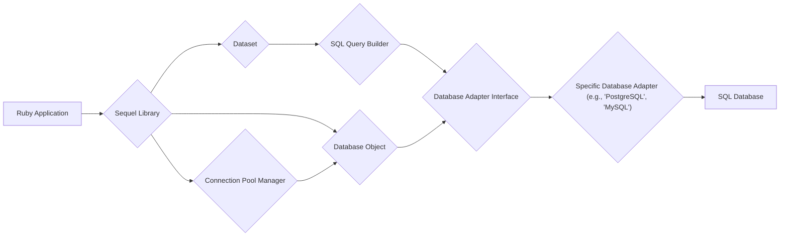
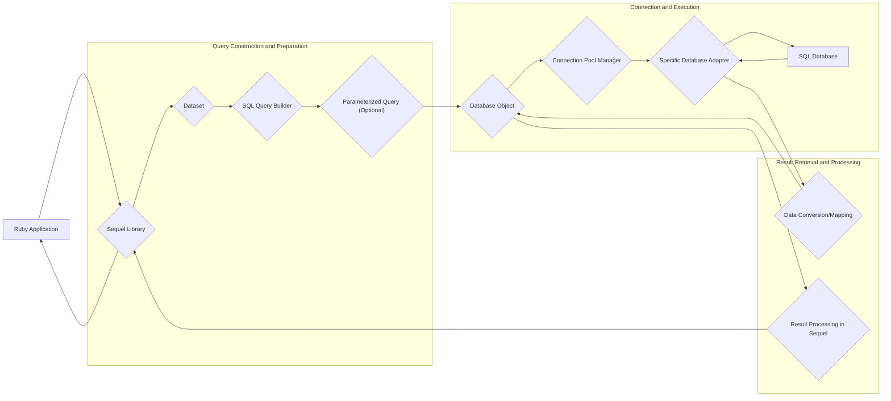

## Project Design Document: Sequel Ruby SQL Toolkit (Improved)

**1. Introduction**

This document provides an enhanced and detailed design overview of the Sequel Ruby SQL toolkit (as found on GitHub: https://github.com/jeremyevans/sequel). This iteration builds upon the previous version, aiming for greater clarity and depth in describing the architectural elements, components, and data flows within Sequel. This document is specifically designed to serve as a robust foundation for subsequent threat modeling activities.

**2. Goals of this Document**

*   Clearly and comprehensively articulate the architecture and key components of the Sequel library, providing a deeper understanding of their functionality.
*   Elaborate on the interactions between different parts of the system, highlighting potential security implications at each interaction point.
*   Identify a broader range of potential areas of interest for security analysis and threat modeling, going beyond basic considerations.
*   Provide a more detailed and insightful overview for stakeholders involved in security assessments, enabling more effective threat identification and mitigation strategies.

**3. Scope**

This document focuses on the core architectural design and operational aspects of the Sequel library itself. It provides a more granular view compared to the previous version. It covers:

*   The main components and their detailed responsibilities, including potential security implications.
*   The different ways Sequel can be utilized, with a focus on security variations (e.g., ORM, raw SQL, connection handling).
*   The interaction mechanisms with various database adapters, highlighting potential adapter-specific security concerns.
*   Key data flows within the library, with a focus on data transformation and potential vulnerabilities.
*   Configuration aspects that impact security.

This document still does *not* cover:

*   Specific, in-depth implementation details of individual database adapter code.
*   The low-level intricacies of the Ruby programming language's runtime environment.
*   Security best practices for the *application* using Sequel (this remains a primary focus of subsequent threat modeling, but this document lays the groundwork).
*   Detailed performance characteristics and optimization strategies.

**4. High-Level Architecture**

Sequel acts as a crucial intermediary layer, facilitating communication between Ruby applications and diverse SQL databases. It offers a unified and flexible API, abstracting away database-specific nuances. This diagram provides a more detailed view of the internal workings.

**5. Component Details**

*   **Ruby Application:** The application code written in Ruby that leverages the Sequel library to interact with a database. This is the entry point for any database operation.
    *   Potential Security Implications: Vulnerabilities in the application code (e.g., improper input validation) can directly lead to issues even if Sequel is used correctly.
*   **Sequel Library:** The central component providing the core API and functionalities. It orchestrates database interactions, manages connections, builds queries, and processes results.
    *   Responsibilities:
        *   Providing a consistent API for database interactions.
        *   Managing and coordinating different internal components.
        *   Implementing core security features like parameterized queries.
    *   Potential Security Implications: Bugs or vulnerabilities within the Sequel library itself could have widespread impact.
*   **Database Object:** Represents an active connection to a specific database instance. It's responsible for managing the lifecycle of a database connection and executing queries.
    *   Responsibilities:
        *   Establishing and managing the connection to the database server.
        *   Executing SQL queries received from the Dataset or directly.
        *   Managing database transactions (begin, commit, rollback).
        *   Handling database-specific syntax and features at a lower level.
    *   Potential Security Implications: Improper connection handling or lack of secure connection options (e.g., TLS) can expose sensitive data.
*   **Dataset:** Represents a queryable interface to a database table or the result of a query. It offers a high-level, expressive way to interact with data.
    *   Responsibilities:
        *   Providing a fluent interface for constructing SQL queries programmatically.
        *   Abstracting away the complexities of raw SQL for common operations.
        *   Fetching data from the database based on specified criteria.
        *   Mapping database rows to Ruby objects (in ORM scenarios) and vice versa.
        *   Providing methods for data manipulation (insert, update, delete).
    *   Potential Security Implications: Incorrectly constructed queries or lack of proper escaping within Dataset operations can lead to SQL injection.
*   **SQL Query Builder:** A crucial sub-component within the Dataset responsible for translating Dataset operations into concrete SQL queries.
    *   Responsibilities:
        *   Translating Dataset method calls into corresponding SQL statements (SELECT, INSERT, UPDATE, DELETE, etc.).
        *   Handling different SQL dialects and syntax variations to ensure compatibility.
        *   Implementing logic for escaping user-provided data to mitigate SQL injection risks.
    *   Potential Security Implications: Vulnerabilities in the query builder's logic or insufficient escaping mechanisms are direct SQL injection risks.
*   **Database Adapter Interface:** Defines a set of abstract methods that provide a consistent interface for interacting with different types of SQL databases.
    *   Responsibilities:
        *   Providing a standardized way for Sequel to communicate with various database systems.
        *   Abstracting away database-specific connection details and query execution methods.
        *   Ensuring that different adapters adhere to a common set of functionalities.
    *   Potential Security Implications: If the interface doesn't enforce secure practices or allows for insecure adapter implementations, vulnerabilities can arise.
*   **Specific Database Adapter:** Concrete implementations of the Database Adapter Interface tailored for specific database systems (e.g., `sequel-pg` for PostgreSQL, `sequel-mysql` for MySQL, `sequel-sqlite` for SQLite).
    *   Responsibilities:
        *   Handling the specific details of connecting to and interacting with a particular database system.
        *   Translating Sequel's generic commands into the database's native SQL dialect.
        *   Handling database-specific error codes, data types, and connection parameters.
    *   Potential Security Implications: Vulnerabilities within the specific adapter (e.g., improper handling of connection strings, insecure default configurations) can expose the application.
*   **Connection Pool Manager:** Manages a pool of database connections to improve performance and resource utilization.
    *   Responsibilities:
        *   Creating and maintaining a pool of active database connections.
        *   Distributing connections to requesting Database Objects.
        *   Releasing connections back to the pool after use.
        *   Potentially handling connection timeouts and reconnections.
    *   Potential Security Implications: Improper management of the connection pool could lead to connection leaks or the reuse of connections with stale or incorrect security contexts.
*   **SQL Database:** The actual relational database system (e.g., PostgreSQL, MySQL, SQLite) responsible for storing and managing the application's data. This is the target of the interactions.
    *   Potential Security Implications: The security of the database itself (access controls, encryption, etc.) is paramount, and Sequel's interactions must respect these security measures.

**6. Data Flow (Enhanced)**

This enhanced data flow diagram provides a more granular view of the steps involved in a typical database interaction, highlighting key transformation points.

**Detailed Data Flow Breakdown (Improved):**

1. **Application Request:** The Ruby application initiates a database operation (e.g., fetching product details, creating a user account).
2. **Sequel API Interaction:** The application interacts with Sequel's API, either through the expressive Dataset interface or by directly using the Database object for more control.
3. **Dataset and Query Building (if applicable):** If using the Dataset API, the application's intent is translated into a structured query representation. The SQL Query Builder then constructs the actual SQL query.
4. **Parameterized Query Generation (Optional but Recommended):** Sequel often utilizes parameterized queries to prevent SQL injection. User-provided data is treated as parameters rather than directly embedded in the SQL string.
5. **Database Object Acquisition:** The Database Object, representing an active connection, is retrieved. This might involve obtaining a connection from the Connection Pool Manager.
6. **Adapter Interaction:** The Database Object uses the appropriate Specific Database Adapter to communicate with the target SQL Database.
7. **SQL Database Execution:** The Specific Database Adapter sends the prepared SQL query to the SQL Database for execution.
8. **Database Response:** The SQL Database processes the query and returns the results to the Specific Database Adapter.
9. **Data Conversion/Mapping:** The Specific Database Adapter might perform initial data conversion or mapping to a more generic format understood by Sequel.
10. **Result Processing in Sequel:** Sequel processes the raw results, potentially mapping database rows to Ruby objects, handling data type conversions, and formatting the data.
11. **Application Response:** Sequel returns the processed data to the requesting Ruby application.

**7. Security Considerations (More Specific)**

This section provides more specific security considerations related to the components and data flows described above.

*   **SQL Injection Vulnerabilities:**
    *   **Within Dataset/Query Builder:**  Flaws in the SQL Query Builder's logic or inadequate escaping of user inputs passed through Dataset methods can lead to SQL injection.
    *   **Raw SQL Usage:** Directly executing raw SQL queries without proper parameterization is a significant SQL injection risk.
*   **Database Connection Security:**
    *   **Insecure Connection Strings:** Hardcoding database credentials or storing them insecurely in configuration files can lead to unauthorized access.
    *   **Lack of Encryption (TLS/SSL):** Communication between the application and the database should be encrypted to protect sensitive data in transit.
    *   **Connection Pool Misconfiguration:**  Improperly configured connection pools might reuse connections with incorrect security contexts.
*   **Data Sanitization and Validation (Application Responsibility, but relevant to Sequel's context):**
    *   Failure to sanitize user input before it reaches Sequel can bypass Sequel's built-in protections.
    *   Insufficient validation of data retrieved from the database before use in the application can lead to other vulnerabilities (e.g., cross-site scripting if data is rendered in a web application).
*   **Database-Specific Vulnerabilities:**
    *   Exploiting vulnerabilities in the underlying database system itself is possible if Sequel doesn't adequately handle database-specific error conditions or if the database is not properly patched and secured.
*   **Dependency Management:**
    *   Vulnerabilities in Sequel's dependencies (including the specific database adapters) can introduce security risks. Regularly updating dependencies is crucial.
*   **Authentication and Authorization:**
    *   Sequel relies on the underlying database's authentication and authorization mechanisms. Misconfigured database permissions can lead to unauthorized access.
*   **Error Handling and Information Disclosure:**
    *   Verbose error messages from Sequel or the database adapter might reveal sensitive information about the database structure or configuration.
*   **Mass Assignment Vulnerabilities (ORM Context):**
    *   If using Sequel's ORM features, improper handling of mass assignment can allow attackers to modify unintended attributes.

**8. Deployment Considerations (More Detail)**

The security implications of deploying applications using Sequel vary based on the deployment environment.

*   **Web Applications:**
    *   Exposure to the internet increases the risk of attacks like SQL injection.
    *   Secure configuration of the web server and application server is crucial.
    *   Proper handling of user sessions and authentication is essential.
*   **Internal Applications:**
    *   While the attack surface might be smaller, internal threats still exist.
    *   Network segmentation and access controls are important.
*   **Cloud Environments:**
    *   Leveraging cloud-provided database services (e.g., AWS RDS, Azure SQL Database) often provides enhanced security features, but proper configuration is still required.
    *   Securely managing cloud credentials is paramount.
*   **Containerized Environments (Docker, Kubernetes):**
    *   Securely managing container images and orchestrating deployments is important.
    *   Secrets management for database credentials within containers needs careful consideration.

**9. Assumptions**

*   Developers using Sequel possess a strong understanding of SQL, database security principles, and secure coding practices.
*   The underlying database system is configured with robust security measures, including appropriate authentication, authorization, and encryption settings.
*   The Ruby environment where Sequel is running is secured against common vulnerabilities.
*   Database credentials are managed securely and are not exposed in the application code or version control systems.

**10. Out of Scope (Reiterated and Expanded)**

*   In-depth code-level analysis of specific database adapter implementations for potential vulnerabilities within their internal logic.
*   Detailed exploration of the Ruby language's garbage collection or memory management behavior in relation to security.
*   Comprehensive performance benchmarking and optimization strategies for Sequel or the underlying database.
*   Specific security hardening configurations for various SQL database systems (e.g., detailed PostgreSQL configuration).
*   Security auditing of applications built *on top* of Sequel (the focus here is on Sequel itself).

**11. Future Considerations**

*   Conducting a thorough threat modeling exercise based on this detailed design document, specifically focusing on the identified security considerations.
*   Performing static and dynamic code analysis of Sequel's codebase to identify potential vulnerabilities.
*   Reviewing and auditing the implementation of specific database adapters for potential security flaws.
*   Developing and promoting security best practices and guidelines for developers using Sequel in their applications.
*   Investigating the integration of security scanning tools into the Sequel development and release pipeline.

This improved design document provides a more comprehensive and detailed understanding of the Sequel Ruby SQL toolkit's architecture and potential security considerations. It serves as a more robust foundation for effective threat modeling and security analysis.