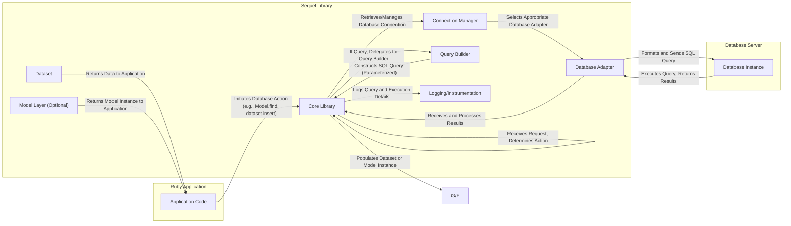

## Project Design Document: Sequel Ruby Database Toolkit (Improved)

**1. Introduction**

This document provides a detailed architectural design of the Sequel Ruby database toolkit (available at https://github.com/jeremyevans/sequel). Its primary purpose is to serve as a comprehensive resource for threat modeling activities. By outlining the system's components, data flow, and interactions, this document aims to facilitate the identification and analysis of potential security vulnerabilities within the Sequel library itself. This design focuses specifically on the internal workings and architectural elements of Sequel, rather than on the applications that utilize it.

**2. Project Overview**

Sequel is a versatile and robust Ruby library designed to simplify database interactions. It acts as an abstraction layer, providing a consistent interface for interacting with various SQL databases. Developers use Sequel to construct and execute SQL queries, manage database connections, and optionally leverage object-relational mapping (ORM) features. Its key strengths include its flexibility in supporting multiple database backends, its expressive query builder, and its focus on providing developers with both high-level abstractions and low-level control over database interactions. Sequel is commonly used in web applications, background processing systems, and other Ruby-based software that requires database connectivity.

**3. System Architecture**

Sequel's architecture is modular and designed for extensibility. The core components work together to manage database interactions:

*   **Core Library:** The central engine of Sequel. It provides the main API for developers, manages the lifecycle of database operations, and orchestrates the interaction between other components. It handles tasks like parsing connection parameters, initiating query execution, and managing transactions.
*   **Database Adapters:**  A set of interchangeable modules, each responsible for the specific communication and syntax requirements of a particular database system (e.g., PostgreSQL, MySQL, SQLite, Oracle, etc.). Adapters translate Sequel's generic commands into database-specific SQL and handle database-specific data types.
*   **Connection Management:** This component handles the establishment, maintenance, and pooling of database connections. It manages connection parameters, implements reconnection logic in case of connection loss, and provides mechanisms for transaction management (start, commit, rollback).
*   **Query Builder:** A fluent and composable interface that allows developers to construct SQL queries programmatically using Ruby methods. This promotes the use of parameterized queries, significantly reducing the risk of SQL injection vulnerabilities. It supports a wide range of SQL constructs and allows for complex query building.
*   **Model Layer (Optional):** An optional component providing object-relational mapping (ORM) capabilities. It allows developers to map database tables to Ruby objects (models), simplifying data access and manipulation using object-oriented principles. It includes features for data validation, associations between models, and lifecycle callbacks.
*   **Dataset:** A fundamental concept representing a collection of records retrieved from the database or the result of a query. It provides methods for filtering, sorting, limiting, and performing aggregate operations on the data. Datasets are the primary way developers interact with query results.
*   **Logging and Instrumentation:**  Mechanisms for logging SQL queries, connection attempts, and other relevant events. This is crucial for debugging, performance monitoring, and security auditing. Sequel allows configuration of the logging output and level of detail.

**4. Data Flow Diagram**

**5. Detailed Component Descriptions**

*   **Core Library:**
    *   **Responsibility:**  Manages the overall flow of database interactions, provides the primary API for developers, handles transaction management, and orchestrates communication between other components.
    *   **Security Implications:** Vulnerabilities here could have widespread impact. Improper handling of connection parameters or transaction boundaries could lead to data breaches or inconsistencies.
    *   **Example Functionality:** `Sequel.connect()`, `db[:users].insert(...)`, `db.transaction do ... end`.

*   **Database Adapter:**
    *   **Responsibility:**  Provides the low-level interface to specific database systems. Translates Sequel's commands into database-specific SQL dialects and handles database-specific data type conversions and error handling.
    *   **Security Implications:**  Bugs in adapters could lead to incorrect SQL being generated, potentially bypassing security measures or causing unexpected database behavior. Improper handling of database-specific escape mechanisms could also introduce vulnerabilities.
    *   **Example Functionality:** Sending a `SELECT` query to PostgreSQL using the `pg` gem, handling MySQL's specific error codes.

*   **Connection Manager:**
    *   **Responsibility:**  Manages the lifecycle of database connections, including establishing new connections, maintaining a pool of active connections for reuse, and handling connection failures and reconnections.
    *   **Security Implications:**  Improper connection management could lead to connection leaks, resource exhaustion, or the exposure of connection credentials if not handled securely by the application.
    *   **Example Functionality:**  Opening a new connection, retrieving a connection from the pool, closing idle connections.

*   **Query Builder:**
    *   **Responsibility:**  Provides a safe and expressive way to construct SQL queries programmatically. It encourages the use of parameterized queries to prevent SQL injection.
    *   **Security Implications:** While designed to prevent SQL injection, developers can still bypass the query builder and execute raw SQL, which requires careful handling to avoid vulnerabilities.
    *   **Example Functionality:** `db[:users].where(name: 'John').select(:id)`, `db[:items].insert(name: 'Product')`.

*   **Model Layer (Optional):**
    *   **Responsibility:**  Provides an object-oriented interface for interacting with database data. Handles mapping between database tables and Ruby objects, data validation, and associations between models.
    *   **Security Implications:**  Improperly implemented validation rules or insecure handling of model attributes could lead to data integrity issues or vulnerabilities. Mass assignment vulnerabilities can occur if not handled carefully.
    *   **Example Functionality:** Defining a `User` model, creating a new user object, validating user input.

*   **Dataset:**
    *   **Responsibility:** Represents a collection of records and provides methods for filtering, sorting, and manipulating data. It acts as an intermediary between the database and the application.
    *   **Security Implications:**  While Datasets themselves don't introduce direct vulnerabilities, how the application uses and processes data from Datasets is crucial for security. For example, displaying unfiltered data to users could expose sensitive information.
    *   **Example Functionality:**  Filtering users by email, ordering products by price, retrieving a specific record.

*   **Logging and Instrumentation:**
    *   **Responsibility:** Records database interactions, errors, and other relevant events for debugging, monitoring, and auditing purposes.
    *   **Security Implications:**  Logging sensitive data (e.g., user passwords in queries) can create security vulnerabilities. Insufficient logging can hinder security investigations.
    *   **Example Functionality:**  Logging executed SQL queries, recording connection errors, tracking transaction start and end times.

**6. Security Considerations (Detailed)**

*   **SQL Injection:**
    *   **Threat:** Malicious users injecting arbitrary SQL code through application inputs, potentially leading to unauthorized data access, modification, or deletion.
    *   **Sequel's Mitigation:**  The query builder strongly encourages parameterized queries, which prevent SQL injection by treating user inputs as data rather than executable code.
    *   **Developer Responsibility:** Developers must avoid constructing raw SQL queries with unsanitized user input. Care should be taken when using methods like `where(unsafe: '...')`.
    *   **Example:** Instead of `db[:users].where("name = '#{params[:name]}' ")`, use `db[:users].where(name: params[:name])`.

*   **Connection String Security:**
    *   **Threat:** Exposure of database credentials (username, password, hostname) in connection strings, potentially allowing unauthorized access to the database.
    *   **Sequel's Mitigation:** Sequel relies on the application to securely manage connection strings.
    *   **Developer Responsibility:** Store connection strings securely (e.g., using environment variables, secure configuration management tools, vault solutions). Avoid hardcoding credentials in the application code.

*   **Data Sanitization and Validation:**
    *   **Threat:**  Malicious or invalid data being inserted into the database, leading to data corruption, application errors, or potential security vulnerabilities.
    *   **Sequel's Mitigation:** Sequel provides mechanisms for data validation within the Model layer.
    *   **Developer Responsibility:** Implement robust input validation and sanitization at the application level before data reaches Sequel. Utilize Sequel's model validation features.

*   **Logging Sensitive Data:**
    *   **Threat:**  Sensitive information (e.g., passwords, API keys, personal data) being logged in plain text, making it vulnerable to unauthorized access.
    *   **Sequel's Mitigation:** Sequel allows configuration of logging levels and output.
    *   **Developer Responsibility:**  Carefully configure logging to avoid logging sensitive data. Consider redacting sensitive information before logging.

*   **Dependency Vulnerabilities:**
    *   **Threat:**  Security vulnerabilities in Sequel's dependencies (e.g., database adapter gems) being exploited.
    *   **Sequel's Mitigation:**  Regularly updating dependencies is crucial.
    *   **Developer Responsibility:**  Keep Sequel and its adapter dependencies up-to-date. Utilize dependency scanning tools to identify and address vulnerabilities.

*   **Database-Specific Vulnerabilities:**
    *   **Threat:** Exploiting vulnerabilities in the underlying database system through Sequel.
    *   **Sequel's Mitigation:** Sequel abstracts database interactions, but vulnerabilities in the database itself can still be a risk.
    *   **Developer Responsibility:** Keep the database server software up-to-date with the latest security patches. Follow database security best practices.

*   **Denial of Service (DoS):**
    *   **Threat:**  Maliciously crafted or excessively resource-intensive queries overloading the database server, leading to service disruption.
    *   **Sequel's Mitigation:** Sequel provides tools for query building and execution, but cannot prevent all forms of DoS.
    *   **Developer Responsibility:** Design efficient queries, implement pagination for large datasets, and consider database resource limits and query timeouts.

**7. Deployment Considerations**

*   **Environment Configuration:** Database connection details are typically configured through environment variables or configuration files. Securely managing these configurations is paramount.
*   **Database Server Location and Access:** The network location and access controls for the database server are critical security considerations. Restrict access to authorized applications and networks. Use firewalls and network segmentation.
*   **User Permissions:** The database user credentials used by Sequel should adhere to the principle of least privilege, granting only the necessary permissions for the application's functionality. Avoid using overly permissive database users.
*   **Connection Security (TLS/SSL):** Ensure that connections between the application and the database server are encrypted using TLS/SSL to protect data in transit. Configure Sequel to enforce secure connections.
*   **Secrets Management:** Utilize secure secrets management solutions (e.g., HashiCorp Vault, AWS Secrets Manager) to store and manage database credentials instead of embedding them directly in configuration files or environment variables.

**8. Dependencies**

Sequel has minimal core dependencies, which reduces the attack surface. However, the database adapter gems are essential and introduce their own dependencies.

*   **Ruby Standard Library:**  Sequel relies on core Ruby functionalities, which are generally considered stable and secure.
*   **Database Adapter Gems (e.g., `pg`, `mysql2`, `sqlite3`):** These gems provide the database-specific communication logic. Vulnerabilities in these gems can directly impact Sequel's security. Regularly audit and update these dependencies.

**9. Future Considerations (Security Focused)**

*   **Built-in Data Sanitization Options:** Explore adding optional, configurable data sanitization features directly within Sequel to provide an additional layer of defense.
*   **Enhanced Logging and Auditing:** Implement more granular control over logging, including the ability to selectively log specific types of events and data, while ensuring sensitive information is not exposed.
*   **Integration with Security Scanning Tools:** Provide better integration points or APIs for static and dynamic analysis security tools to facilitate automated vulnerability detection in applications using Sequel.
*   **Secure Credential Management Helpers:** Offer built-in utilities or recommendations for securely managing database credentials within applications using Sequel.
*   **Rate Limiting for Database Operations:** Consider mechanisms to limit the rate of database operations to mitigate potential DoS attacks at the application level.

This improved design document provides a more detailed and security-focused overview of the Sequel library's architecture. It highlights potential security considerations and emphasizes the shared responsibility between the library and the developers using it to build secure applications. This document serves as a valuable resource for conducting thorough threat modeling activities.