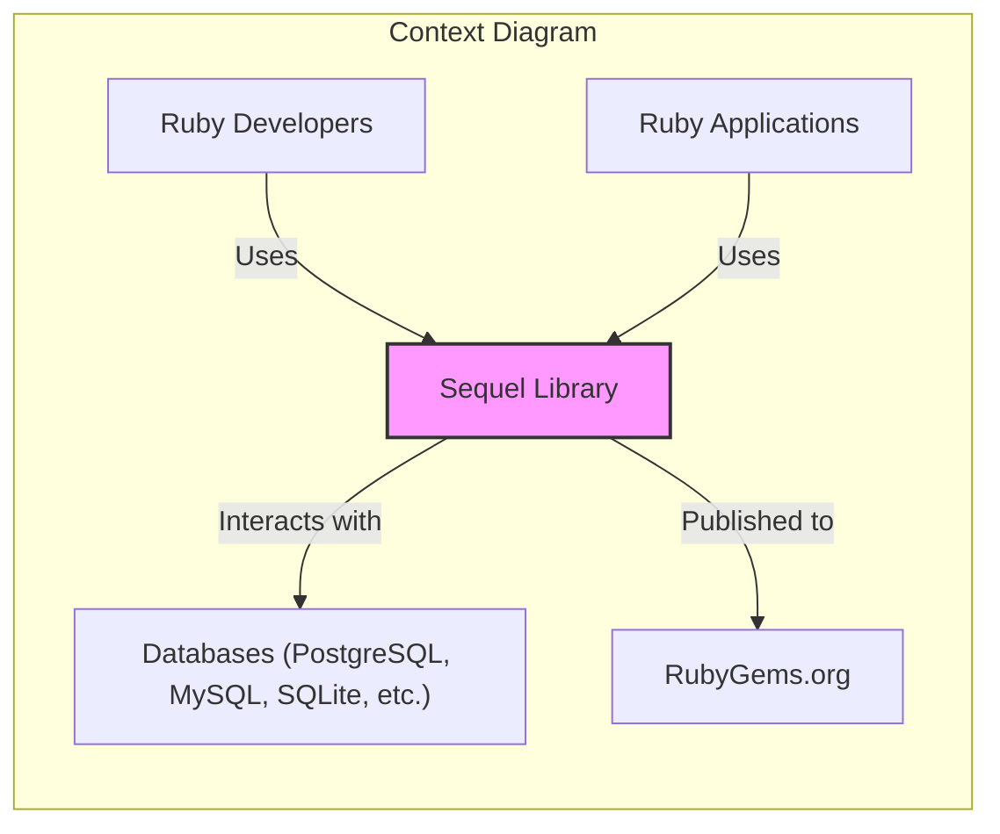
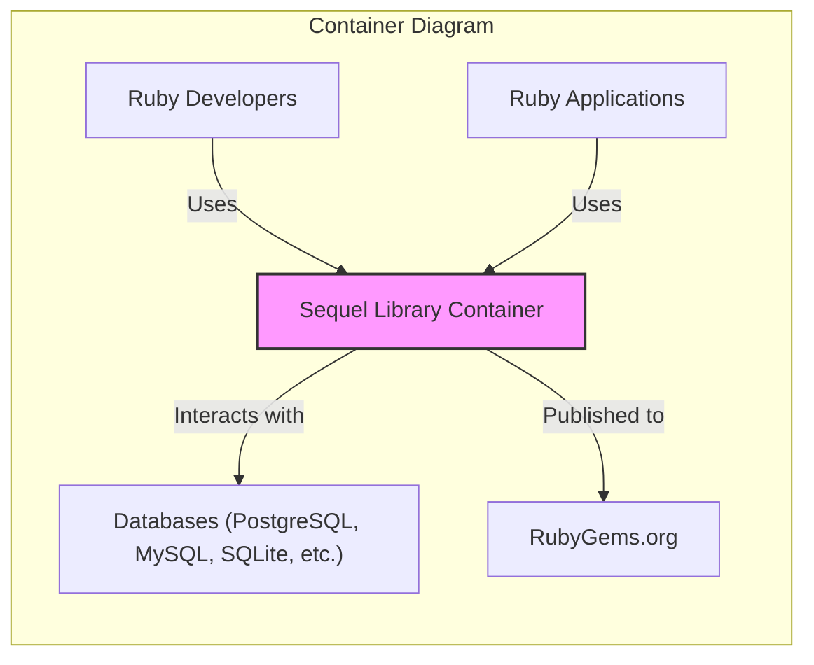
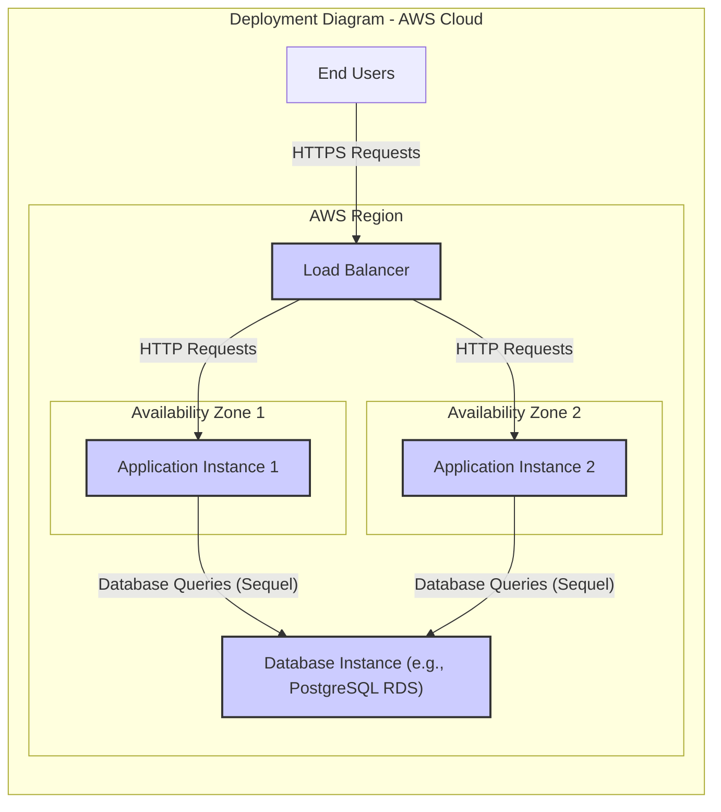
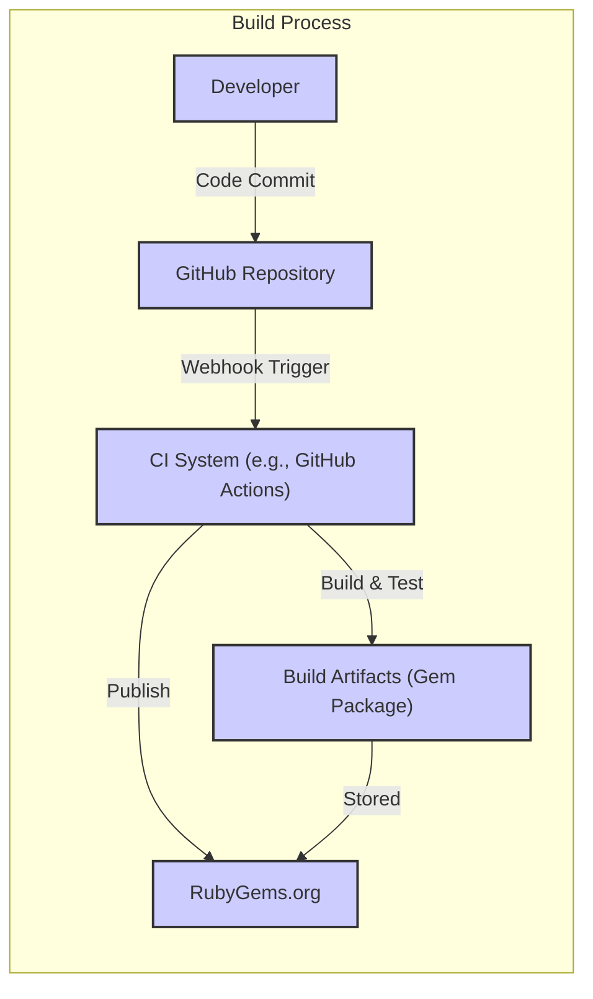

# BUSINESS POSTURE

- Business Priorities:
  - Provide a reliable and efficient Ruby SQL database access toolkit for developers.
  - Ensure compatibility with a wide range of SQL databases.
  - Maintain a high level of code quality and stability.
  - Foster an active and supportive community around the library.
- Business Goals:
  - Increase adoption of the Sequel library within the Ruby development community.
  - Provide a robust and feature-rich alternative to other Ruby ORMs and database libraries.
  - Continuously improve the library based on user feedback and evolving database technologies.
- Business Risks:
  - Security vulnerabilities in the library could lead to data breaches in applications using Sequel.
  - Performance bottlenecks in Sequel could negatively impact application performance.
  - Lack of support for new database features or versions could limit adoption.
  - Bugs or instability could damage the reputation of the library and reduce user trust.

# SECURITY POSTURE

- Existing Security Controls:
  - security control: Input validation is likely implemented to prevent SQL injection attacks. (Implemented within the library's query building and execution logic, details in code).
  - security control: Unit and integration tests are used to ensure code correctness and prevent regressions. (Part of the development process, see GitHub repository for tests).
  - security control: Code review process is likely in place for contributions to the library. (Standard practice for open-source projects, implied by contribution guidelines).
- Accepted Risks:
  - accepted risk: Potential vulnerabilities in third-party database drivers used by Sequel.
  - accepted risk: Misuse of the library by developers leading to insecure database interactions.
  - accepted risk: Vulnerabilities in Ruby runtime environment itself.
- Recommended Security Controls:
  - security control: Implement automated Static Application Security Testing (SAST) in the CI/CD pipeline to identify potential vulnerabilities in the code.
  - security control: Integrate Dependency Scanning to identify and manage known vulnerabilities in third-party dependencies.
  - security control: Conduct periodic security audits and penetration testing to proactively identify and address security weaknesses.
  - security control: Publish clear security guidelines and best practices for developers using Sequel, focusing on secure database interaction patterns.
  - security control: Establish a clear vulnerability reporting and response process to handle security issues promptly and transparently.
- Security Requirements:
  - Authentication:
    - The library should support various database authentication mechanisms (e.g., username/password, certificate-based authentication) provided by different database systems.
    - The library itself does not handle user authentication but relies on the underlying database system for authentication.
  - Authorization:
    - The library should respect database-level authorization and permission models.
    - Developers using Sequel are responsible for implementing application-level authorization logic.
  - Input Validation:
    - The library must rigorously validate all user inputs to prevent SQL injection vulnerabilities.
    - Input validation should be applied at the query building level to ensure that dynamically constructed queries are safe.
    - The library should provide mechanisms for developers to easily parameterize queries and avoid raw SQL string concatenation.
  - Cryptography:
    - The library should support encrypted connections to databases using protocols like SSL/TLS.
    - The library should allow configuration of encryption settings to ensure secure communication between the application and the database.
    - If the library handles sensitive data in memory (e.g., connection strings), consider secure storage and handling practices.

# DESIGN

## C4 CONTEXT

- Context Diagram Elements:
  - Element:
    - Name: Sequel Library
    - Type: Software System
    - Description: A Ruby SQL database access toolkit that simplifies database interactions for Ruby developers. It provides a flexible and powerful interface for querying and manipulating data in various SQL databases.
    - Responsibilities:
      - Provide an API for Ruby developers to interact with SQL databases.
      - Abstract away database-specific SQL dialects.
      - Offer features like connection management, query building, schema manipulation, and data mapping.
      - Ensure secure and efficient database communication.
    - Security controls:
      - Input validation to prevent SQL injection.
      - Support for encrypted database connections.
  - Element:
    - Name: Ruby Developers
    - Type: Person
    - Description: Software developers who use the Sequel library to build Ruby applications that interact with databases.
    - Responsibilities:
      - Utilize Sequel library to implement database access logic in their applications.
      - Follow security best practices when using Sequel to avoid vulnerabilities.
      - Configure and deploy applications using Sequel.
    - Security controls:
      - Secure coding practices when using the library.
      - Proper configuration of database connections and security settings.
  - Element:
    - Name: Databases (PostgreSQL, MySQL, SQLite, etc.)
    - Type: External System
    - Description: Various SQL database systems that Sequel supports, including PostgreSQL, MySQL, SQLite, and others. These databases store and manage application data.
    - Responsibilities:
      - Store and manage application data.
      - Process SQL queries from Sequel library.
      - Enforce database-level security controls (authentication, authorization).
      - Ensure data integrity and availability.
    - Security controls:
      - Database authentication and authorization mechanisms.
      - Encryption of data at rest and in transit.
      - Regular security patching and updates.
  - Element:
    - Name: RubyGems.org
    - Type: External System
    - Description: The public Ruby package repository where the Sequel library is published and distributed.
    - Responsibilities:
      - Host and distribute Ruby gems, including Sequel.
      - Provide a platform for developers to discover and install Ruby libraries.
      - Ensure the integrity and availability of gems.
    - Security controls:
      - Gem signing and verification.
      - Security scanning of published gems.
  - Element:
    - Name: Ruby Applications
    - Type: Software System
    - Description: Applications built by Ruby developers that utilize the Sequel library to interact with databases. These applications can range from web applications to command-line tools.
    - Responsibilities:
      - Implement application-specific business logic.
      - Utilize Sequel for database interactions.
      - Manage user authentication and authorization at the application level.
      - Handle user input and output.
    - Security controls:
      - Application-level authentication and authorization.
      - Input validation and output encoding.
      - Secure session management.

## C4 CONTAINER

- Container Diagram Elements:
  - Element:
    - Name: Sequel Library Container
    - Type: Library
    - Description: This represents the Sequel library as a single deployable unit.  As a library, it's not deployed as a standalone application but is included within Ruby applications. It encapsulates all the code and logic of the Sequel library.
    - Responsibilities:
      - All responsibilities of the "Sequel Library" system from the context diagram.
    - Security controls:
      - All security controls of the "Sequel Library" system from the context diagram.

## DEPLOYMENT

- Deployment Options:
  - Option 1: Ruby Application Deployment (Common): Sequel library is included as a dependency in a Ruby application. The application is then deployed to a server or cloud environment. The deployment architecture of the Ruby application dictates the deployment of Sequel.
  - Option 2: Development Environment: Developers use Sequel locally on their development machines for testing and development.

- Detailed Deployment (Option 1 - Ruby Application Deployment): We will focus on a common deployment scenario where a Ruby application using Sequel is deployed to a cloud environment like AWS.

- Deployment Diagram Elements:
  - Element:
    - Name: Application Instance 1 & 2
    - Type: Compute Instance (e.g., AWS EC2, ECS Container)
    - Description: Instances running the Ruby application that utilizes the Sequel library.  Multiple instances are deployed across availability zones for high availability and scalability.
    - Responsibilities:
      - Run the Ruby application code.
      - Handle user requests.
      - Execute application logic, including database interactions using Sequel.
    - Security controls:
      - Operating system and application security hardening.
      - Security groups and firewalls to restrict network access.
      - Regular security patching.
  - Element:
    - Name: Load Balancer (LB)
    - Type: Network Component (e.g., AWS ELB)
    - Description: Distributes incoming user traffic across multiple application instances to ensure high availability and load balancing.
    - Responsibilities:
      - Distribute traffic to application instances.
      - Health checks on application instances.
      - SSL/TLS termination.
    - Security controls:
      - DDoS protection.
      - Web Application Firewall (WAF) integration (optional).
      - Access logs and monitoring.
  - Element:
    - Name: Database Instance (e.g., PostgreSQL RDS)
    - Type: Data Store (e.g., AWS RDS)
    - Description: A managed database service (e.g., PostgreSQL on AWS RDS) that stores the application data. Sequel library connects to this database to perform data operations.
    - Responsibilities:
      - Store and manage application data.
      - Process database queries from application instances.
      - Ensure data durability and availability.
    - Security controls:
      - Database authentication and authorization.
      - Encryption at rest and in transit.
      - Database backups and disaster recovery.
      - Security patching and updates managed by the cloud provider.
  - Element:
    - Name: End Users
    - Type: Person
    - Description: Users who interact with the Ruby application through web browsers or other clients.
    - Responsibilities:
      - Access and use the application.
      - Provide input to the application.
    - Security controls:
      - User authentication (handled by the application).
      - Secure communication channels (HTTPS).

## BUILD

- Build Process Description:
  - Developer writes code and commits changes to the GitHub repository.
  - A CI system (e.g., GitHub Actions, Jenkins) is triggered by code commits (via webhook).
  - The CI system performs the following steps:
    - Fetches the code from the GitHub repository.
    - Runs automated tests (unit tests, integration tests).
    - Builds the Ruby gem package (build artifacts).
    - Optionally performs security checks (SAST, dependency scanning).
    - Publishes the gem package to RubyGems.org.
- Build Process Security Controls:
  - security control: Automated testing (unit and integration tests) to ensure code quality and prevent regressions. (Implemented in CI system configuration).
  - security control: Code review process before merging code changes to the main branch. (GitHub workflow, pull requests).
  - security control: Use of a CI/CD system to automate the build and release process, reducing manual errors and ensuring consistency. (CI system configuration).
  - security control: Gem signing to ensure the integrity and authenticity of the published gem package. (RubyGems.org and gem build process).
  - security control: Dependency scanning in the CI pipeline to identify and manage known vulnerabilities in dependencies. (CI system integration with dependency scanning tools).
  - security control: Static Application Security Testing (SAST) in the CI pipeline to identify potential security vulnerabilities in the code. (CI system integration with SAST tools).
  - security control: Access control to the CI/CD system and RubyGems.org to prevent unauthorized modifications and releases. (CI system and RubyGems.org access management).

# RISK ASSESSMENT

- Critical Business Processes:
  - Providing secure and reliable database access for Ruby applications.
  - Maintaining the integrity and availability of the Sequel library on RubyGems.org.
  - Ensuring the confidentiality, integrity, and availability of data in applications using Sequel.
- Data Sensitivity:
  - The Sequel library itself does not store or process sensitive data directly.
  - Data sensitivity depends on the applications that use Sequel and the databases they connect to.
  - Applications using Sequel may handle highly sensitive data (e.g., personal information, financial data, health records) depending on their purpose.
  - The security of Sequel is crucial to protect the data handled by applications that depend on it.

# QUESTIONS & ASSUMPTIONS

- Questions:
  - What specific SAST and dependency scanning tools are currently used or planned to be used in the Sequel project's CI/CD pipeline?
  - Are there documented security testing procedures and results available for review?
  - What is the process for handling and disclosing security vulnerabilities reported by the community or identified through security testing?
  - Are there any plans for formal security audits or penetration testing of the Sequel library?
- Assumptions:
  - The Sequel project aims to follow secure coding practices and is committed to addressing security vulnerabilities.
  - The development team has a good understanding of common web application and database security risks, including SQL injection.
  - The RubyGems.org platform provides a reasonably secure environment for distributing Ruby gems.
  - Users of the Sequel library are responsible for implementing application-level security controls and using the library securely.