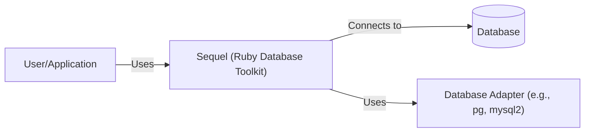
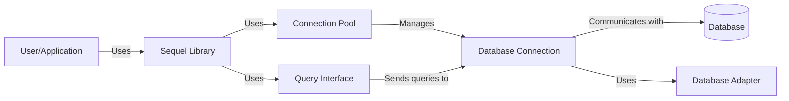
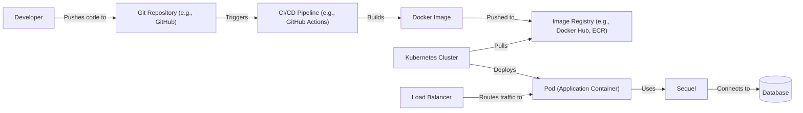
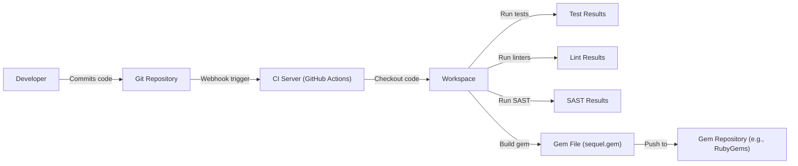

Okay, let's create a design document for the Sequel project, focusing on aspects relevant to threat modeling.

# BUSINESS POSTURE

Sequel is a lightweight and fast database toolkit for Ruby. It's designed to be flexible, thread-safe, and easy to use, providing a clean and efficient way to interact with various databases.

Priorities and Goals:

*   Provide a reliable and performant database access layer for Ruby applications.
*   Support a wide range of database systems.
*   Offer a user-friendly and flexible API for developers.
*   Maintain a high level of code quality and test coverage.
*   Ensure thread safety for concurrent database operations.

Business Risks:

*   Data breaches or unauthorized access to sensitive data stored in databases accessed via Sequel.
*   Data corruption or loss due to vulnerabilities or bugs in Sequel.
*   Performance bottlenecks or denial-of-service vulnerabilities affecting applications using Sequel.
*   Compatibility issues with specific database systems or versions.
*   Security vulnerabilities introduced through third-party dependencies.
*   Supply chain attacks.

# SECURITY POSTURE

Existing Security Controls:

*   security control: The project uses a continuous integration (CI) system (GitHub Actions) to automate testing and code quality checks. (Described in .github/workflows)
*   security control: The project has extensive test coverage to ensure code correctness and prevent regressions. (Described in spec/)
*   security control: The project follows secure coding practices, such as avoiding SQL injection vulnerabilities by using prepared statements and parameterized queries. (Implicit in the design and implementation of the library)
*   security control: The project uses GitHub's dependabot to automatically update dependencies and address known vulnerabilities. (Described in .github/dependabot.yml)

Accepted Risks:

*   accepted risk: The project relies on the security of the underlying database systems and their client libraries. Sequel itself does not implement database-level security features like encryption at rest or user authentication.
*   accepted risk: The project assumes that developers using Sequel will follow secure coding practices and properly configure their database systems.
*   accepted risk: The project does not provide built-in protection against all types of denial-of-service attacks.

Recommended Security Controls:

*   security control: Implement a security policy that includes guidelines for reporting vulnerabilities and a process for handling security issues.
*   security control: Conduct regular security audits and penetration testing to identify and address potential vulnerabilities.
*   security control: Consider using static analysis tools to automatically detect potential security flaws in the code.
*   security control: Provide documentation and guidance to developers on how to use Sequel securely, including best practices for preventing common vulnerabilities like SQL injection and cross-site scripting (XSS).

Security Requirements:

*   Authentication: Sequel itself does not handle authentication. Authentication is the responsibility of the underlying database system and the application using Sequel.
*   Authorization: Sequel does not implement authorization mechanisms. Authorization is typically handled by the database system and/or the application logic.
*   Input Validation: Sequel uses parameterized queries to prevent SQL injection, effectively validating input to database queries. However, applications using Sequel should still validate user input to prevent other types of vulnerabilities.
*   Cryptography: Sequel does not directly handle encryption. Encryption at rest and in transit should be configured at the database level. Sequel may support encrypted connections (e.g., SSL/TLS) if the underlying database client library supports it.

# DESIGN

## C4 CONTEXT

Context Diagram Element List:

*   Element:
    *   Name: User/Application
    *   Type: User/External System
    *   Description: A Ruby application or user that utilizes Sequel to interact with a database.
    *   Responsibilities: Initiates database operations, handles application logic, and presents data to the user.
    *   Security controls: Implements application-level security controls, such as input validation, authentication, and authorization.

*   Element:
    *   Name: Sequel (Ruby Database Toolkit)
    *   Type: System
    *   Description: The Sequel library itself, providing a Ruby interface for database interaction.
    *   Responsibilities: Provides a unified API for database access, handles connection pooling, executes queries, and maps results to Ruby objects.
    *   Security controls: Uses parameterized queries to prevent SQL injection, provides a thread-safe environment.

*   Element:
    *   Name: Database Adapter (e.g., pg, mysql2)
    *   Type: Library
    *   Description: Database-specific adapter libraries that Sequel uses to communicate with different database systems.
    *   Responsibilities: Translates Sequel's generic commands into database-specific protocols and handles low-level communication.
    *   Security controls: Relies on the security features of the underlying database client library (e.g., SSL/TLS for encrypted connections).

*   Element:
    *   Name: Database
    *   Type: External System
    *   Description: The database system (e.g., PostgreSQL, MySQL, SQLite) where data is stored.
    *   Responsibilities: Stores and manages data, enforces data integrity, and handles database-level security (authentication, authorization, encryption).
    *   Security controls: Implements database-level security controls, such as user authentication, access control lists, and encryption at rest.

## C4 CONTAINER

Container Diagram Element List:

*   Element:
    *   Name: User/Application
    *   Type: User/External System
    *   Description: A Ruby application or user that utilizes Sequel to interact with a database.
    *   Responsibilities: Initiates database operations, handles application logic, and presents data to the user.
    *   Security controls: Implements application-level security controls, such as input validation, authentication, and authorization.

*   Element:
    *   Name: Sequel Library
    *   Type: Container
    *   Description: The core Sequel library, providing the main API for database interaction.
    *   Responsibilities: Provides a unified API for database access, manages connection pooling, and handles query execution.
    *   Security controls: Uses parameterized queries to prevent SQL injection.

*   Element:
    *   Name: Connection Pool
    *   Type: Container
    *   Description: Manages a pool of database connections to improve performance and efficiency.
    *   Responsibilities: Creates, manages, and reuses database connections.
    *   Security controls: Enforces connection limits to prevent resource exhaustion.

*   Element:
    *   Name: Query Interface
    *   Type: Container
    *   Description: Provides the interface for building and executing database queries.
    *   Responsibilities: Translates Ruby code into SQL queries, handles query execution, and maps results to Ruby objects.
    *   Security controls: Uses parameterized queries to prevent SQL injection.

*   Element:
    *   Name: Database Connection
    *   Type: Container
    *   Description: Represents a single connection to the database.
    *   Responsibilities: Sends queries to the database and receives results.
    *   Security controls: Relies on the security features of the underlying database client library (e.g., SSL/TLS for encrypted connections).

*   Element:
    *   Name: Database Adapter
    *   Type: Library
    *   Description: Database-specific adapter libraries that Sequel uses to communicate with different database systems.
    *   Responsibilities: Translates Sequel's generic commands into database-specific protocols and handles low-level communication.
    *   Security controls: Relies on the security features of the underlying database client library (e.g., SSL/TLS for encrypted connections).

*   Element:
    *   Name: Database
    *   Type: External System
    *   Description: The database system (e.g., PostgreSQL, MySQL, SQLite) where data is stored.
    *   Responsibilities: Stores and manages data, enforces data integrity, and handles database-level security (authentication, authorization, encryption).
    *   Security controls: Implements database-level security controls, such as user authentication, access control lists, and encryption at rest.

## DEPLOYMENT

Sequel is a library, not a standalone application, so it doesn't have its own deployment process in the traditional sense. It's deployed as part of a Ruby application. However, we can describe the deployment of a typical Ruby application that uses Sequel.

Possible Deployment Solutions:

1.  Traditional Server Deployment (e.g., using Capistrano, Mina, or similar tools)
2.  Containerized Deployment (e.g., using Docker and Kubernetes)
3.  Platform-as-a-Service (PaaS) Deployment (e.g., using Heroku, AWS Elastic Beanstalk)

Chosen Solution: Containerized Deployment (Docker and Kubernetes)

Deployment Diagram Element List:

*   Element:
    *   Name: Developer
    *   Type: User
    *   Description: The developer writing and committing code.
    *   Responsibilities: Writes code, tests locally, and pushes changes to the Git repository.
    *   Security controls: Uses strong passwords and multi-factor authentication for Git repository access.

*   Element:
    *   Name: Git Repository (e.g., GitHub)
    *   Type: System
    *   Description: The source code repository.
    *   Responsibilities: Stores the application code and tracks changes.
    *   Security controls: Uses access controls and branch protection rules to manage code changes.

*   Element:
    *   Name: CI/CD Pipeline (e.g., GitHub Actions)
    *   Type: System
    *   Description: The automated build and deployment pipeline.
    *   Responsibilities: Builds the Docker image, runs tests, and deploys the application to Kubernetes.
    *   Security controls: Uses secrets management to store sensitive credentials, runs security scans (SAST, DAST) as part of the pipeline.

*   Element:
    *   Name: Docker Image
    *   Type: Artifact
    *   Description: The packaged application, including Sequel and its dependencies.
    *   Responsibilities: Provides a consistent and reproducible environment for the application.
    *   Security controls: Uses minimal base images, scans for vulnerabilities in dependencies.

*   Element:
    *   Name: Image Registry (e.g., Docker Hub, ECR)
    *   Type: System
    *   Description: Stores the Docker images.
    *   Responsibilities: Provides a central repository for Docker images.
    *   Security controls: Uses access controls and image signing to ensure image integrity.

*   Element:
    *   Name: Kubernetes Cluster
    *   Type: System
    *   Description: The container orchestration platform.
    *   Responsibilities: Manages the deployment, scaling, and networking of the application containers.
    *   Security controls: Uses network policies, role-based access control (RBAC), and pod security policies to secure the cluster.

*   Element:
    *   Name: Pod (Application Container)
    *   Type: Container
    *   Description: A running instance of the application container.
    *   Responsibilities: Executes the application code and interacts with the database.
    *   Security controls: Runs with limited privileges, uses resource limits to prevent denial-of-service.

*   Element:
    *   Name: Sequel
    *   Type: Library
    *   Description: The Sequel library, running within the application container.
    *   Responsibilities: Provides database access for the application.
    *   Security controls: Uses parameterized queries to prevent SQL injection.

*   Element:
    *   Name: Database
    *   Type: External System
    *   Description: The database system.
    *   Responsibilities: Stores and manages data.
    *   Security controls: Implements database-level security controls.

*   Element:
    *   Name: Load Balancer
    *   Type: System
    *   Description: Distributes incoming traffic across multiple application pods.
    *   Responsibilities: Improves availability and scalability.
    *   Security controls: Uses SSL/TLS termination, implements DDoS protection.

## BUILD

Build Process Description:

1.  Developer commits code to the Git repository (e.g., GitHub).
2.  A webhook triggers the CI server (GitHub Actions).
3.  The CI server checks out the code into a workspace.
4.  The CI server runs tests (using RSpec or similar).
5.  The CI server runs linters (e.g., RuboCop).
6.  The CI server runs static analysis security testing (SAST) tools (e.g., Brakeman).
7.  If all tests and checks pass, the CI server builds the Sequel gem file (sequel.gem).
8.  The gem file is pushed to a gem repository (e.g., RubyGems.org).

Security Controls in Build Process:

*   Automated Testing: Comprehensive test suite ensures code quality and helps prevent regressions.
*   Linting: Enforces coding standards and helps identify potential issues.
*   SAST: Static analysis security testing helps detect vulnerabilities in the code before deployment.
*   Dependency Management: Dependabot (or similar) keeps dependencies up-to-date and addresses known vulnerabilities.
*   Signed Commits: Developers should sign their commits to ensure code integrity.
*   Gem Signing: The released gem should be signed to prevent tampering.

# RISK ASSESSMENT

Critical Business Processes:

*   Database access for Ruby applications: Sequel is a critical component for any Ruby application that needs to interact with a database.
*   Data integrity and consistency: Sequel's role in ensuring data is stored and retrieved correctly is crucial for business operations.

Data Sensitivity:

*   Sequel itself does not handle or store data directly. However, it facilitates access to databases, which may contain data of varying sensitivity levels, including:
    *   Personally Identifiable Information (PII)
    *   Financial data
    *   Authentication credentials (if stored in the database)
    *   Proprietary business data
    *   Any other data stored in connected databases.

The sensitivity of the data depends entirely on the application using Sequel and the database it connects to.

# QUESTIONS & ASSUMPTIONS

Questions:

*   Are there any specific compliance requirements (e.g., GDPR, HIPAA, PCI DSS) that the applications using Sequel need to adhere to?
*   What are the specific database systems that Sequel will be used with?
*   What is the expected load and concurrency for applications using Sequel?
*   Are there any existing security tools or processes in place that should be integrated with Sequel's development or deployment?

Assumptions:

*   BUSINESS POSTURE: The primary goal is to provide a secure and reliable database access library for Ruby applications.
*   SECURITY POSTURE: Developers using Sequel are expected to follow secure coding practices. The underlying database systems are properly secured.
*   DESIGN: The design focuses on providing a clean and efficient API while leveraging the security features of the underlying database systems and client libraries. The deployment environment will be secured according to best practices.