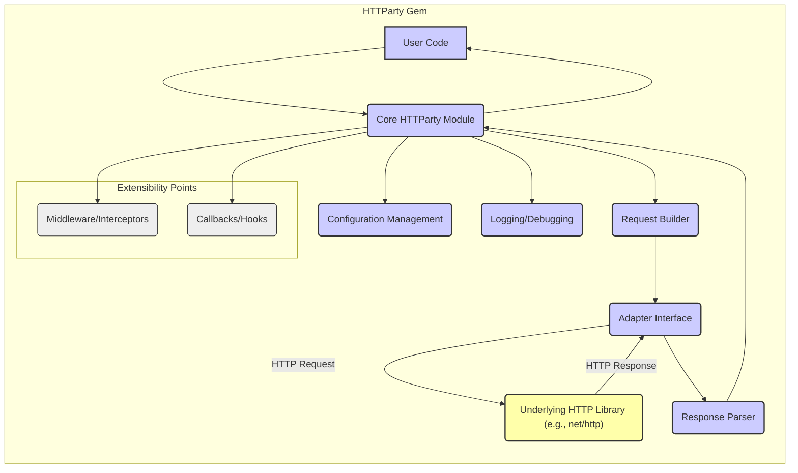
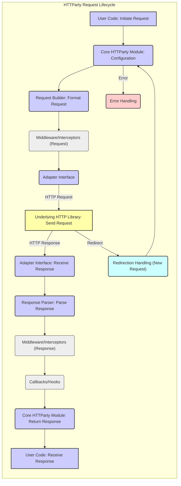

# Project Design Document: HTTParty (Improved)

**Project Name:** HTTParty

**Project Repository:** https://github.com/jnunemaker/httparty

**Document Version:** 1.1

**Date:** October 26, 2023

**Prepared By:** Gemini (AI Language Model)

## 1. Introduction

This document provides an enhanced design overview of the HTTParty Ruby gem, building upon the previous version. This document is intended to serve as a robust foundation for subsequent threat modeling activities. It offers a more detailed explanation of the key components, data flow, and architectural considerations of HTTParty to facilitate a more comprehensive identification of potential security vulnerabilities.

## 2. Project Overview

HTTParty is a widely used Ruby gem designed to simplify the process of making HTTP requests. It functions as an HTTP client, offering a higher-level and more intuitive interface compared to Ruby's built-in `net/http` library. Its primary goal is to streamline interactions with RESTful APIs and various other HTTP-based services, enhancing developer productivity and code readability.

## 3. Goals

* Provide a clear, concise, and more detailed overview of HTTParty's architecture.
* Identify and describe the key components and their interactions with greater specificity.
* Illustrate the typical data flow within the gem, including potential variations and error handling.
* Highlight potential areas of security concern with more concrete examples for future threat modeling.

## 4. Non-Goals

* This document does not aim to be an exhaustive code-level analysis covering every function and method.
* It does not include detailed performance benchmarks, optimization strategies, or scalability considerations.
* It does not cover the entirety of HTTParty's API surface, focusing on core functionalities relevant to security.
* It does not provide prescriptive security recommendations, specific mitigation strategies, or code fixes.

## 5. Target Audience

* Security engineers and architects responsible for conducting threat modeling and security assessments.
* Developers actively working with or integrating the HTTParty gem into their Ruby applications.
* Individuals seeking a deeper, more nuanced understanding of HTTParty's internal workings and potential security implications.

## 6. Architectural Design

HTTParty's architecture can be understood through the following key components and their interactions:

* **Core HTTParty Module:** This serves as the primary interface for users, exposing methods like `get`, `post`, `put`, `delete`, `patch`, and `head` for initiating HTTP requests. It manages global configuration options, orchestrates the request building process, and handles the subsequent response.
* **Request Builder:** This component is responsible for constructing the HTTP request object based on the user's provided input. It takes the URL, headers, body, query parameters, authentication details, and other options, translating them into a structured HTTP request format suitable for the underlying HTTP library.
* **Adapter Interface:** HTTParty employs an adapter pattern to abstract the underlying HTTP client implementation. By default, it utilizes Ruby's `net/http`, but it can be configured to use alternative libraries like `curb` or others. This abstraction provides flexibility, allows for potential performance optimizations by switching adapters, and isolates the core logic from specific HTTP library implementations.
* **Response Parser:** This component is responsible for processing the raw HTTP response received from the server. It analyzes the response headers, particularly the `Content-Type`, to determine the appropriate parsing strategy (e.g., JSON, XML, plain text, HTML). It then transforms the response body into a more usable Ruby data structure (e.g., a `Hash`, `Array`, or `String`).
* **Configuration Management:** HTTParty allows users to configure various aspects of the HTTP client's behavior. This includes setting default headers, timeouts (connection and read), authentication credentials (basic, digest, etc.), proxy settings, SSL/TLS options, and more. This configuration can be set globally or per request.
* **Logging and Debugging:** HTTParty provides mechanisms for logging HTTP requests and responses, which is crucial for debugging and monitoring network interactions. The level of logging and the destination can be configured.
* **Middleware/Interceptors (Implicit):** While not a formal "component," HTTParty's design allows for the inclusion of middleware or interceptors (often implemented through blocks or custom classes) that can modify requests before they are sent or process responses before they are returned. This provides extensibility for tasks like adding custom headers, handling authentication, or logging.
* **Callbacks/Hooks:** HTTParty offers callbacks or hooks that allow users to execute custom code at specific points in the request lifecycle, such as before a request is sent (`before_request`) or after a response is received (`on_complete`).

## 7. Data Flow

The typical data flow for an HTTP request initiated through HTTParty involves the following steps:

* **User initiates a request:** The user's application code invokes a method on the core HTTParty module, specifying the target URL, HTTP method, headers, body, and any other relevant options (e.g., `HTTParty.get('https://example.com/api/data', headers: { 'Authorization': 'Bearer ...' })`).
* **Configuration retrieval:** The core module retrieves relevant configuration settings, including global defaults and any request-specific overrides.
* **Request building:** The core module delegates the construction of the HTTP request object to the Request Builder. The Request Builder formats the request according to the specified method, URL, headers, and body.
* **Middleware processing (optional):** If any middleware or interceptors are configured, they are executed at this stage. Middleware can modify the request before it is sent (e.g., adding authentication headers, logging the request).
* **Adapter interaction:** The formatted request object is passed to the Adapter Interface. The Adapter Interface selects the configured underlying HTTP library (e.g., `net/http`) and invokes its methods to send the HTTP request to the remote server.
* **Network transmission:** The underlying HTTP library handles the actual network transmission of the request to the target server.
* **Response reception:** The underlying HTTP library receives the HTTP response from the server, including headers and the response body.
* **Adapter response handling:** The Adapter Interface receives the raw HTTP response from the underlying library.
* **Response parsing:** The Adapter Interface passes the raw response to the Response Parser. The Response Parser analyzes the `Content-Type` header to determine the appropriate parsing method and converts the response body into a usable Ruby data structure.
* **Middleware processing (optional):** If any response middleware or interceptors are configured, they are executed at this stage. Middleware can process the response before it's returned to the user.
* **Callback execution (optional):** If any callbacks are registered for the current request lifecycle stage (e.g., `on_complete`), they are executed.
* **Response delivery:** The core HTTParty module returns the parsed and processed response (typically a `HTTParty::Response` object) to the user's application code.
* **Error handling:** Throughout this process, HTTParty includes mechanisms for handling errors such as network issues, timeouts, and HTTP errors (e.g., 4xx or 5xx status codes). These errors may be raised as exceptions or handled through specific error handling configurations.
* **Redirection handling:** HTTParty typically follows HTTP redirects by default. This process involves receiving a redirect response (e.g., 301, 302), extracting the new URL from the `Location` header, and initiating a new request to that URL.

## 8. Security Considerations

Building upon the previous version, here are more detailed security considerations for threat modeling HTTParty:

* **Server-Side Request Forgery (SSRF):**
    * **Vulnerability:** If user-controlled input (e.g., URLs from a database, API parameters) is directly used in HTTParty requests without validation, an attacker could force the application to make requests to internal or unintended external resources.
    * **Example:** A user provides a URL in a form field, and the application uses `HTTParty.get(user_provided_url)` without verifying the URL's scheme or domain. An attacker could provide a URL like `http://localhost:6379/` to interact with an internal Redis server.
* **Injection Attacks:**
    * **Header Injection:** If user input is incorporated into request headers without proper sanitization, attackers could inject arbitrary headers.
        * **Example:** `HTTParty.get('...', headers: { 'X-Custom': params[:user_input] })`. If `params[:user_input]` contains newline characters, it could inject additional headers, potentially leading to HTTP response splitting or other vulnerabilities.
    * **Body Injection:** When constructing request bodies (especially for `POST` or `PUT` requests), unsanitized user input could lead to injection vulnerabilities depending on the content type.
        * **Example:** In a form submission, user input is directly used in an XML request body without proper encoding, potentially allowing for XML External Entity (XXE) attacks.
* **Man-in-the-Middle (MITM) Attacks:**
    * **Insufficient TLS Enforcement:** If HTTPS is not enforced for sensitive requests or if TLS/SSL verification is disabled or improperly configured, attackers could intercept communication.
        * **Example:** An application makes requests to an API using `http://` instead of `https://`, or the `ssl_verify` option is set to `false`.
    * **Weak Cipher Suites:** Using outdated or weak cipher suites can make the connection vulnerable to decryption.
* **Dependency Vulnerabilities:**
    * **Transitive Dependencies:** HTTParty relies on `net/http` or other adapter libraries, which in turn may have their own dependencies. Vulnerabilities in any of these dependencies could indirectly affect HTTParty.
    * **Outdated Libraries:** Using an outdated version of HTTParty or its adapters could expose the application to known vulnerabilities.
* **Data Exposure in Logs:**
    * **Sensitive Data Logging:** If request headers (e.g., `Authorization` tokens) or request/response bodies containing sensitive information are logged without proper redaction, this could lead to data breaches.
* **Insecure Default Configurations:**
    * **Permissive Redirect Handling:** Automatically following redirects to any domain could be exploited in certain scenarios.
    * **Insecure Cookie Handling:** Improper handling or storage of cookies could expose session information.
* **Callback/Hook Abuse:**
    * **Arbitrary Code Execution:** If callbacks or hooks allow the execution of arbitrary user-provided code, this could lead to severe security vulnerabilities. This is less likely in typical usage but possible if custom extensions are poorly designed.
* **Denial of Service (DoS):**
    * **Excessive Timeouts:** Improperly configured timeouts could lead to resource exhaustion if requests take a long time to complete.
    * **Retry Mechanisms:** While intended for resilience, poorly configured retry mechanisms could amplify denial-of-service attacks against the target server.
* **Authentication and Authorization Issues:**
    * **Insecure Credential Handling:** Storing or transmitting authentication credentials insecurely (e.g., hardcoding API keys) is a common vulnerability when using HTTP clients.
    * **Insufficient Authorization:**  Failing to properly authorize requests can lead to unauthorized access to resources.

## 9. Deployment Considerations

The security of HTTParty deployments is intertwined with the security of the environment in which it is used:

* **Web Applications (e.g., Ruby on Rails, Sinatra):**  Security best practices for web applications, such as input validation, output encoding, and protection against common web vulnerabilities, are crucial when using HTTParty to interact with external services. Securely managing API keys and other credentials is paramount.
* **Command-Line Tools and Scripts:** When using HTTParty in scripts, ensure that sensitive information like API keys or authentication tokens are not hardcoded directly in the script but are managed securely (e.g., environment variables, secure configuration files).
* **Background Jobs and Services (e.g., Sidekiq, Resque):**  Securely manage credentials used by background jobs. Avoid storing credentials in the job arguments or directly in the code. Utilize secure credential management systems.
* **Containerized Environments (e.g., Docker, Kubernetes):**  Follow security best practices for containerization, including secure image creation, vulnerability scanning, and secure secrets management.
* **Serverless Environments (e.g., AWS Lambda, Google Cloud Functions):**  Leverage the secrets management capabilities provided by the cloud provider to securely store and access API keys and other sensitive information.

## 10. Conclusion

This improved design document provides a more comprehensive understanding of HTTParty's architecture, data flow, and security considerations. By elaborating on potential vulnerabilities with concrete examples, this document aims to facilitate more effective threat modeling activities. A thorough security assessment should consider these points in the context of the specific application and its deployment environment to identify and mitigate potential risks.