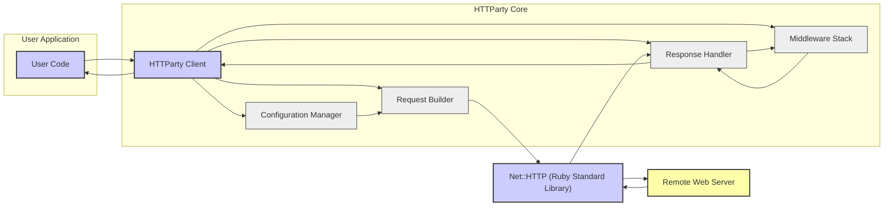
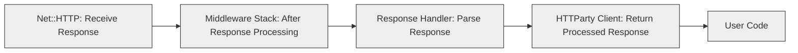

## Project Design Document: HTTParty Ruby Gem (Improved)

**Project Name:** HTTParty

**Project Repository:** https://github.com/jnunemaker/httparty

**Document Version:** 1.1

**Date:** October 26, 2023

**Prepared By:** Gemini (AI Language Model)

### 1. Introduction

This document provides an enhanced and more detailed design overview of the HTTParty Ruby gem. Building upon the previous version, it further elaborates on the architectural components, data flows, and dependencies of the library. This refined document will serve as a more robust foundation for subsequent threat modeling activities, enabling a deeper and more comprehensive assessment of potential security vulnerabilities.

### 2. Project Overview

HTTParty is a widely adopted Ruby gem designed to simplify the process of making HTTP requests. It offers a user-friendly and expressive interface for interacting with web services, supporting a full range of HTTP methods (GET, POST, PUT, DELETE, PATCH, HEAD, OPTIONS, etc.), and providing robust mechanisms for handling headers, parameters, authentication, and various response formats. By abstracting the complexities of the underlying `Net::HTTP` library, HTTParty significantly enhances developer productivity when consuming and interacting with APIs.

### 3. Architectural Design

The following diagram illustrates a more detailed high-level architecture of HTTParty, highlighting key internal components and their interactions:

#### 3.1. Component Descriptions

- **User Code:** Represents the Ruby application code that instantiates and utilizes the HTTParty gem to perform HTTP interactions. This is the entry point for initiating requests.
- **HTTParty Client:** The central component of the gem, providing the primary interface for users. It orchestrates the request lifecycle, delegating tasks to other components like the `Request Builder` and `Response Handler`. It also manages the `Middleware Stack`.
- **Configuration Manager:** Responsible for managing all configurable options for HTTParty. This includes base URIs, default headers, timeouts, authentication strategies, proxy settings, and more. It provides a centralized point for accessing and managing these settings.
- **Request Builder:** Takes the user's request specifications (URL, method, parameters, headers, body) and the configuration settings to construct a concrete `Net::HTTP` request object. This involves encoding parameters, setting headers, and formatting the request body.
- **Response Handler:** Processes the raw HTTP response received from `Net::HTTP`. This includes parsing the response body based on the `Content-Type` header (e.g., JSON, XML, plain text), handling HTTP status codes, and making the parsed response data available to the user. It also handles error conditions.
- **Middleware Stack:** A crucial component that allows for intercepting and modifying requests before they are sent and responses after they are received. Middleware can be used for various purposes, including logging, authentication, request retries, and custom error handling.
- **Net::HTTP (Ruby Standard Library):** The foundational Ruby library responsible for the low-level network communication. HTTParty relies on `Net::HTTP` to establish connections, send the formatted request over the network, and receive the raw HTTP response.
- **Remote Web Server:** The external web service or API endpoint that HTTParty is communicating with. This is the target of the HTTP requests.

#### 3.2. Data Flow

The data flow for a typical HTTP request using HTTParty can be broken down into request and response flows for better clarity:

**3.2.1. Request Flow:**

- The **User Code** initiates a request by calling a specific HTTP method (e.g., `get`, `post`) on the **HTTParty Client**.
- The **HTTParty Client** interacts with the **Configuration Manager** to retrieve relevant settings based on the request and global configurations.
- The **Request Builder** uses the provided information and configuration to construct a `Net::HTTP::Request` object, including setting headers, parameters, and the request body.
- The **Middleware Stack** processes the request object. Each middleware in the stack can inspect or modify the request before it's sent.
- **Net::HTTP** sends the constructed request over the network to the remote server.

**3.2.2. Response Flow:**

- **Net::HTTP** receives the raw HTTP response from the **Remote Web Server**.
- The **Middleware Stack** processes the response object. Each middleware can inspect or modify the response before it's handled by HTTParty.
- The **Response Handler** parses the response body based on the `Content-Type` header and handles HTTP status codes and potential errors.
- The **HTTParty Client** returns the processed response object to the **User Code**.

### 4. Key Functionality

- **Comprehensive HTTP Method Support:** Supports all standard HTTP methods (GET, POST, PUT, PATCH, DELETE, HEAD, OPTIONS, CONNECT, TRACE).
- **Flexible Parameter Handling:**  Allows passing parameters as part of the URL, in the request body (various encodings), or as multipart form data.
- **Extensive Header Management:** Enables setting custom headers at the request level or globally.
- **Automatic Response Parsing:**  Automatically parses responses in common formats like JSON, XML, and HTML, based on the `Content-Type` header.
- **Robust Authentication Mechanisms:** Supports various authentication schemes, including Basic, Digest, OAuth 1.0/2.0, and custom authentication strategies via middleware.
- **Configurable Timeouts:**  Allows setting connection timeouts, read timeouts, and total request timeouts.
- **Proxy Configuration:**  Supports the use of HTTP and SOCKS proxies, with options for authentication.
- **Detailed Logging:**  Provides flexible logging options for requests and responses, including headers and bodies.
- **Secure SSL/TLS Communication:** Leverages `Net::HTTP`'s capabilities for secure HTTPS connections, with options for certificate verification and client certificates.
- **Multipart Form Data Handling:** Simplifies sending files and other data using multipart/form-data encoding.
- **Customizable HTTP Agents:** Allows setting a custom User-Agent header for requests.
- **Middleware Support:**  Provides a powerful mechanism for extending and customizing HTTParty's behavior through a middleware stack.

### 5. Dependencies

HTTParty relies on the following core dependencies:

- **Ruby Standard Library:**
    - `net/http`: For fundamental HTTP communication.
    - `uri`: For parsing and manipulating Uniform Resource Identifiers.
    - `openssl`: For providing SSL/TLS encryption and certificate handling (via `net/http`).
    - `json`: For parsing and generating JSON data (often a direct dependency or transitive).
    - `logger`: For providing logging capabilities (optional, but commonly used).
- **External Gems (Often Optional, depending on features used):**
    - `nokogiri`: For parsing XML and HTML responses.
    - `mime-types`: For determining the MIME type of files for multipart requests.
    - Gems related to specific authentication strategies (e.g., `oauth`).

### 6. Security Considerations

The following security considerations are crucial when using and evaluating HTTParty:

- **SSL/TLS Configuration and Enforcement:** Ensuring that HTTPS is used and that SSL/TLS certificates are properly validated to prevent man-in-the-middle attacks. Applications should enforce TLS and potentially pin certificates for enhanced security.
- **Input Validation on Received Data:** While HTTParty facilitates receiving data, the consuming application *must* validate and sanitize all data received from remote servers to prevent vulnerabilities like Cross-Site Scripting (XSS) or injection attacks.
- **Output Encoding of Sent Data:**  Similarly, applications using HTTParty are responsible for properly encoding data sent in requests to prevent injection vulnerabilities on the server-side.
- **Dependency Management and Vulnerability Scanning:** Regularly updating HTTParty and its dependencies is critical to patch known security vulnerabilities in `Net::HTTP`, `nokogiri`, or other dependent libraries. Using tools for dependency scanning is recommended.
- **Secure Handling of Sensitive Data:**  Extreme care must be taken when handling sensitive information such as API keys, authentication tokens, and user credentials. Avoid logging these directly and consider using secure storage mechanisms.
- **Error Handling and Information Disclosure:** Implement robust error handling to prevent sensitive information from being leaked in error messages or stack traces. Avoid displaying detailed error information to end-users in production environments.
- **Cross-Site Request Forgery (CSRF) Prevention:** While HTTParty doesn't inherently prevent CSRF, developers must implement CSRF protection mechanisms in their applications when handling state-changing requests.
- **Server-Side Vulnerabilities and Responsible Use:** Be aware that HTTParty can be used to interact with vulnerable web servers. Ethical considerations and security assessments of target APIs are important.
- **Proxy Security:** When using proxies, ensure the proxy server itself is secure and trustworthy to avoid introducing new vulnerabilities.
- **Middleware Security:**  Carefully review and audit any custom middleware used with HTTParty, as vulnerabilities in middleware can compromise the security of the entire request/response cycle.
- **Rate Limiting and Abuse Prevention:**  Consider implementing rate limiting and other abuse prevention mechanisms when interacting with external APIs to avoid overwhelming the server or being flagged for malicious activity.

### 7. Threat Modeling Focus Areas

When performing threat modeling for applications using HTTParty, focus on the following key areas:

- **Client-Side Vulnerabilities:**
    - **Insecure Request Construction:**  Focus on how user input is incorporated into requests and the potential for injection vulnerabilities (e.g., header injection, URL manipulation).
    - **Insecure Configuration:** Analyze the security implications of various configuration options, such as insecure default timeouts or proxy settings.
    - **Middleware Vulnerabilities:**  Assess the security of any custom middleware used, looking for potential bypasses or vulnerabilities.
- **Network Communication Security:**
    - **Man-in-the-Middle Attacks:**  Thoroughly evaluate the SSL/TLS configuration and ensure proper certificate validation.
    - **Data Tampering:** Consider the risk of data being intercepted and modified during transit.
- **Server-Side Vulnerabilities (Indirectly Related):**
    - **Exploiting Vulnerable APIs:**  Consider how HTTParty could be used to interact with known vulnerabilities in target APIs.
- **Response Handling Vulnerabilities:**
    - **Insecure Deserialization:** Analyze the risks associated with parsing potentially malicious response data (e.g., XXE vulnerabilities when parsing XML).
    - **Information Disclosure:**  Assess the potential for sensitive information to be leaked in response headers or bodies.
- **Dependency Vulnerabilities:**
    - Regularly scan and assess the security of HTTParty's dependencies, including `Net::HTTP` and optional gems.
- **Authentication and Authorization:**
    - Evaluate the security of the authentication mechanisms used with HTTParty, ensuring credentials are handled securely.
    - Consider the risk of authorization bypasses or privilege escalation.
- **Logging and Monitoring:**
    - Analyze logging configurations to ensure sensitive information is not being logged inappropriately.
    - Consider implementing monitoring to detect suspicious activity.

### 8. Future Considerations

- Detailed analysis of specific authentication flows and their security implications.
- Exploration of advanced security features like certificate pinning and mutual TLS.
- Performance analysis with a focus on security implications (e.g., denial-of-service through resource exhaustion).
- Best practices for using HTTParty securely in different application contexts (e.g., web applications, background jobs).

This improved design document provides a more comprehensive and detailed understanding of the HTTParty gem's architecture and security considerations. It serves as a valuable resource for conducting thorough threat modeling and building more secure applications that leverage this powerful HTTP client library.